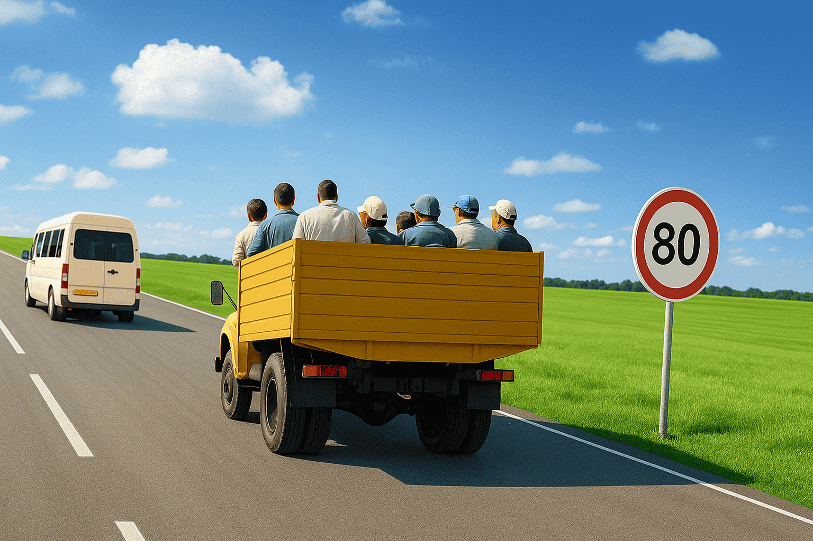

# Avtotest Savollari

## Savol 1

**Qaysi avtomobil uchun bu belgilarning ta'sir oralig'ida to'xtashga ruxsat etiladi?**

### Variantlar:

1. Qizilga ❌
2. Ikkala avtomobilga ❌
3. Hech qaysi biriga ❌
4. <<Nogiron>> taniqlik belgisi bo'lgan sariq avtomobilga ✅

### Media

### Izoh

YHQ 1-ilovasi 3-bo'limi 2-xatboshiga asosan, qoidalarning 174-bandiga ko'ra «Nogiron» taniqlik belgisi o'rnatilgan avtomobil va motokolyaskalarni boshqarayotgan nogiron haydovchilar 3.2, 3.3 va 3.28 belgilari talablaridan chetga chiqishlari mumkin. 7.18 qo'shimcha belgisi bo'lganda 3.27 belgisining ta'sir oralig'ida to'xtashga ruxsat etiladi.

---

## Savol 2

**Qaysi yo'naltirgichlar bo'ylab harakatlanishga ruxsat etiladi?**

### Variantlar:

1. Faqat A yo'nalish bo'ylab ❌
2. Faqat B yo'nalish bo'ylab ❌
3. Faqat V yo'nalish bo'ylab ❌
4. Faqat A va G yo'nalishlari bo'ylab ✅
5. Faqat G yo'nalish bo'ylab ❌

### Media

### Izoh

YHQ 1-ilovasi 4-bo'lim 4.1.6-bandining 4-xatboshiga asosan, «Harakatlanish to'g'riga» 4.1.1. belgisi yo'l qismining boshlanishiga o'rnatilsa, unga yaqin chorrahagacha amal qilinadi. Belgi o'ng tomonida joylashgan hovli va boshqa yondosh hududlarga burilishni taqiqlamaydi.

---

## Savol 3

**Tibbiyot qutichasi va o't o'chirgichi boʻlmagan qanday transport vositalaridan foydalanish taqiqlanadi?**

### Variantlar:

1. Faqat M1 toifali transport vositasi ❌
2. Faqat M2, M3; N1 toifali transport vositasi ❌
3. Faqat N2; N3 toifali transport vositasi ❌
4. Barcha yuqorida ko'rsatilgan toifalar ✅

### Media

Media mavjud emas

### Izoh

YHQ 3-ilova 7.10-bandiga muvofiq, M1, M2, M3, N1, N2, N3 toifasidagi transport vositalarida tibbiyot qutichasi (aptechka), o't o'chirgich, majburiy to'xtaganligini bildiruvchi belgi (falokat taniqlik belgisi) yoki miltillovchi qizil chiroq va nur qaytargichli kamzul (jilet) bo'lishi kerak.

---

## Savol 4

**Chorrahadan birinchi bo'lib o'tadi**

### Variantlar:

1. Qizil avtomobil ❌
2. Ko'k avtomobil ❌
3. Sariq avtomobil ❌
4. Yashil avtomobil ✅

### Media

### Izoh

YHQ 16-bobi 105-bandiga asosan, teng ahamiyatga ega bo'lgan yo'llar kesishgan chorrahada relssiz transport vositasining haydovchisi o'ng tomondan yaqinlashib kelayotgan transport vositalariga yo'l berishi shart.

---

## Savol 5

**Harakatlanish taqiqlangan:**

### Variantlar:

1. Qizil va oq avtomobillarga ❌
2. Ko'k, yashil va oq avtomobillarga ✅
3. Oq, ko'k va sariq avtomobillarga ❌

### Media

### Izoh

YHQ 7-bobi 38-bandiga asosan, tartibga soluvchining qo'llari yon tomonga uzatilganda yoki tushirilganda, chap va oʻng yon tomonidan tramvayga toʻgʻriga, relssiz transport vositalariga to'g'riga va o'ngga harakatlanishga, piyodalarga qatnov qismini kesib o'tishga ruxsat etiladi. Oldi va orqa tomonidan barcha transport vositalari va piyodalarning harakatlanishi taqiqlanadi.

---

## Savol 6

**Qaysi transport vositasining haydovchisi chorrahadan birinchi boʻlib oʻtadi?**

### Variantlar:

1. Avtomobil va avtobus haydovchisi ✅
2. Tramvay haydovchisi ❌

### Media

### Izoh

YHQ 15-bobi 100-bandiga asosan, svetoforning qizil yoki sariq ishorasi bilan bir vaqtda yongan qo'shimcha tarmoqning yashil ishorasidagi yo'naltirgich yo'nalishida harakatlanayotgan transport vositasining haydovchisi boshqa yo'nalishlardagi transport vositalariga yo'l berishi kerak

---

## Savol 7

**Shu joyda to'xtab turishga ruxsat etiladimi?**

### Variantlar:

1. Ruxsat etiladi ✅
2. Taqiqlanadi ❌

### Media

### Izoh

YHQ 13-bobi 91-bandiga asosan, quyidagi joylarda to'xtash taqiqlanadi: qatnov qismlari kesishmalarida va kesib o'tilayotgan qatnov qismi chetiga 5 metrdan kamroq masofa qolganda (uch tomonlama kesishmalarda (chorrahalarda) yondosh tutashgan yo'lning sidirg'a chiziq yoki ajratuvchi boʻlak bilan ajratilgan qarama-qarshi tomoni bundan mustasno).

---

## Savol 8

**Haydovchi harakatlanishni boshlashdan oldin qanday amallarni bajarishi kerak?**

### Variantlar:

1. Transport vositasining sozligini va toʻla jihozlanganligini tekshirishi ❌
2. Harakatlanish boshlanishi xavfsiz bo'lishiga va harakatning boshqa ishtirokchilariga xalaqit bermasligiga ishonch hosil qilishi ✅
3. Tegishli yo'nalishdagi burilishning yorug'lik ko'rsatkichi bilan ishora berishi ❌
4. Sanab o'tilgan barcha harakatlarni bajarishi ❌

### Media

Media mavjud emas

### Izoh

YHQ 9-bobi 53-bandiga asosan, harakatlanishni boshlash, qayta tizilish, burilish (qayrilib olish), yo'nalishini oʻzgartirish va to'xtashdan oldin o'z harakati bilan boshqa transport vositalariga xavf solmayotganligiga va to'sqinlik qilmayotganligiga ishonch hosil qilishi kerak.

---

## Savol 9

**Umurtqa pog'onasining ko'krak sohasi shikastlangan jabrlanuvchini transportda qanday tashish kerak?**

### Variantlar:

1. Qattiq taxtada orqasi bilan yotgan holda ✅
2. Yumshoq to'shamada orqasi bilan yotgan holda ❌
3. Qattiq taxtada yoni bilan yotgan holda ❌

### Media

Media mavjud emas

### Izoh

Umurtqa pog'onasi shikastlanganda orqa (umurtqa) miyani jarohatlanishidan saqlab qolish uchun umurtqa pog'onalarining bir-biriga nisbatan siljishini oldini olish muhimdir. Umurtqaning minimal qo'zg'alishini ta'minlash uchun jarohatlangan kishini qattiq tekislikka joylashtirib, uning harakatini imkon darajada cheklash lozim.

---

## Savol 10

**Bunday taniqlik belgisi bilan belgilanadigan transport vositasi:**

### Variantlar:

1. Og'ir vaznli va yirik oʻlchamli yuklarni tashuvchi ❌
2. Uzunligi yuk bilan yoki yuksiz 20 metrdan ortiq bo'lgan transport vositasi ✅
3. Furgon yukxonasida odamlarni tashuvchi ❌

### Media

### Izoh

YHQ 28-bobi 174-bandiga asosan, «Uzun o'lchamli transport vositasi» - yukli yoki yuksiz uzunligi 20 metrdan oshadigan transport vositasining, ikki yoki undan ko'proq tirkamali avtopoyezdlarning orqasiga kengligi 40 millimetr bo'lgan qizil hoshiyali, o'lchami 1200x200 millimetr bo'lgan, transport vositasi tarkibining tasviri tushirilgan sariq rangli to'rtburchak shaklidagi taniqlik belgisi.

---

## Savol 11

**Yoqilgan zarg'aldoq rangli yalt-yalt etuvchi chiroq-mayoqcha harakatlanish uchun imtiyoz beradimi?**

### Variantlar:

1. На ❌
2. Yo'q ✅

### Media

Media mavjud emas

### Izoh

YHQ 6-bobi 29-bandiga asosan, zarg'aldoq yoki sariq rangli chiroq-mayoqchasi yoqilganda, yo'ldan foydalanish xizmatiga tegishli moslama va transport vositalarining haydovchilari ish bajarish jarayonida harakat xavfsizligini ta'minlash sharti bilan ushbu qoidalarning yo'l belgilari, chiziqlari hamda 67-71 i 121-bandlari talablaridan chetga chiqishlari mumkin. Boshqa haydovchilar ularning ish bajarishlariga to'sqinlik tug'dirmasliklari shart. Zarg'aldoq va sariq rangli chiroq-mayoqcha harakatlanishda imtiyoz bermaydi va u faqat boshqa harakat qatnashchilarining e'tiborini jalb etish uchun xizmat qiladi.

---

## Savol 12

**Quyidagi belgilar qaysi yo'nalishda harakatlanishga ruxsat beradi?**

### Variantlar:

1. Faqat chapga ❌
2. Faqat toʻgʻriga ❌
3. Faqat o'ngga ❌
4. To'g'riga, o'ngga va qayrilishga ✅

### Media

### Izoh

YHQ 1-ilovasi 7-boʻlimidagi 7.3.1-7.3.3 qo'shimcha axborot belgilarining talabiga asosan, «Ta'sir yo'nalishlari» belgisi chorraha oldida oʻrnatilgan belgilarning ta'sir yo'nalishini ko'rsatadi.

---

## Savol 13

**Mazkur chiziq nima haqida ogohlantiradi?**

### Variantlar:

1. Transport vositalarining majburiy to'xtash joyiga yaqinlashayotganligini ❌
2. «To'xtamasdan harakatlanish taqiqlangan> belgisi bilan birga qo'llanilganda, haydovchini «To'xtash» chizig'iga yaqinlashayotganligini ✅
3. Transport vositasi piyodalarga yo'l berishi kerak bo'lgan joyni ko'rsatadi ❌

### Media

### Izoh

YHQ 2-ilovasidagi 1.21 chizig'i talabiga asosan, «to'xtash» yozuvi – 2.5 «To'xtamasdan harakatlanish taqiqlangan» belgisi bilan birga qo'llanilganda, haydovchini 1.12 chizig'iga yaqinlashayotganligi haqida ogohlantiradi.

---

## Savol 14

**Avtomagistralda quyidagilar taqiqlanadi:**

### Variantlar:

1. Qayrilib olish va ajratuvchi bo'lakning texnologik uzilish joylariga kirish ❌
2. Orqaga harakatlanish ❌
3. «To'xtab turish joyi» yoki «Dam olish joyi» belgilari bo'lgan maxsus maydonchalardan tashqari joyda to'xtash ❌
4. Yuqoridagi barcha holatlar ✅

### Media

Media mavjud emas

### Izoh

YHQ 19-bobi 121-bandi asosan, 5.15 yoki 6.11 belgili maxsus to'xtash joylaridan tashqarida to'xtash; ajratuvchi bo'lakning texnologik uzilish joylariga kirish va qayrilib olish; orqaga harakatlanish taqiqlanadi.

---

## Savol 15

**Qaysi transport vositasi haydovchisi to'g'riga harakatlanish huquqiga ega?**

### Variantlar:

1. Avtobus va mototsikl haydovchilari ❌
2. Yengil va yuk avtomobillari haydovchilari ❌
3. Yengil avtomobil haydovchisi ✅

### Media

### Izoh

YHQ 7-bobi 38-bandiga asosan, tartibga soluvchining OʻNG QOʻLI OLDINGA UZATILGANDA, chap yonidan tramvayga chapga, relssiz transport vositalariga barcha yo'nalishlarda, oldi tomonidan barcha transport vositalariga faqat o'ngga harakatlanishga ruxsat etiladi. Orqa tomonidan va o'ng yonidan barcha transport vositalarining harakatlanishi taqiqlanadi. Piyodalarga tartibga soluvchining orqa tomonidan qatnov qismini kesib o'tishga ruxsat etiladi.

---

## Savol 16

**Qaysi transport vositasining haydovchisi yo'l berish kerak?**

### Variantlar:

1. Avtomobil haydovchisi ❌
2. Tramvay haydovchisi ✅

### Media

### Izoh

YHQ 15-bobi 100-bandiga asosan, svetoforning qizil yoki sariq ishorasi bilan bir vaqtda yongan qoʻshimcha tarmoqning yashil ishorasidagi yo'naltirgich yo'nalishida harakatlanayotgan transport vositasining haydovchisi boshqa yo'nalishlardagi transport vositalariga yo'l berishi kerak.

---

## Savol 17

**Transport vositasini orqaga harakatlantirish paytida haydovchi qanday talablarni bajarishi kerak?**

### Variantlar:

1. Harakatning boshqa ishtirokchilariga xalaqit bermaslik. Harakat xavfsizligini ta'minlash uchun zarur bo'lsa, boshqa shaxslar yordamidan foydalanish ✅
2. Boshqa shaxslar yordamidan foydalanish ❌
3. Transport vositasida tumanga qarshi orqa chiroqlar bo'lsa, ularni yoqish ❌
4. Gabarit chiroqlarini yoqish ❌

### Media

Media mavjud emas

### Izoh

YHQ 9-bobi 63-bandiga asosan, transport vositasini orqaga harakatlantirishda haydovchi yo'l harakati xavfsizligini ta'minlashi va boshqa yo'l harakati qatnashchilariga xalaqit bermasligi shart. Zarurat tug'ilganda, haydovchi boshqa shaxslarning yordamidan foydalanishi mumkin.

---

## Savol 18

**Yo'lning qarama-qarshi harakat yo'nalishi tomoniga chiqish qachon taqiqlanadi?**

### Variantlar:

1. Ikki tomonlama harakatli, 4 ta yoki undan koʻp boʻlakli yoʻllarda ❌
2. Ikki tomonlama harakatli, qarama-qarshi yo'nalishdagi transport vositalari oqimlari ikkita uzluksiz chiziqlar bilan ajratilgan 4 ta bo'lakli yo'llarda ❌
3. Yuqoridagi barcha hollarda ✅

### Media

Media mavjud emas

### Izoh

YHQ 10-bobi 65-bandiga asosan, to'rt va undan ortiq bo'lakli, harakat ikki tomonlama bo'lgan yo'llarda qarama-qarshi yo'nalishda harakatlanish uchun mo'ljallangan bo'laklarga chiqish taqiqlanadi. YHQ 2-ilovasining 1.3 chizig'i talabiga asosan, 1.3 yotiq chizig'i to'rt va undan ortiq bo'lakli yoʻllarda qarama-qarshi transport oqimini ajratadi. 1.3 yotiq chizig'ni kesib oʻtish taqiqlanadi.

---

## Savol 19

**Qaysi holatda egri yoʻlda harakatlanayotgan avtomobil turg'unligi ta'minlanadi?**

### Variantlar:

1. Uzatma ulangan holatda ✅
2. Uzatma ajratilgan holatda ❌
3. Tezlik oshirilganda ❌

### Media

Media mavjud emas

### Izoh

Burilishda harakatlanayotgan avtomobilda markazdan qochirma kuch vujudga keladi. Burilish o'ng tomonga boʻlgan holda siz qarama-qarshi yo'nalishda harakatlanish bo'lagiga, chap tomonga bo'lsa, yo'l yoqasi yoki uning tashqarisiga chiqib ketishingiz ehtimoli mavjud. Uzatma ajratilgan holatda avtomobil oʻzi harakatlanib, uni boshqarish murakkablashadi. Shu bois burilishga yaqin masofa qolganda, uning tikligini va tezligingizni baholab, uzatma mexanizmini ajratmay harakatni davom ettiring.

---

## Savol 20

**Qaysi transport vositalaridan foydalanish taqiqlanadi?**

### Variantlar:

1. Gidravlik tormoz tizimidan suyuqlik oqayotgan bo'lsa ❌
2. Ishchi tormoz tizimi ishlamayotgan bo'lsa ❌
3. Kompressor pnevmatik tormoz tizimida o'rnatilgan bosimni ta'minlay olmagan holatda ❌
4. Ko'rsatilgan barcha holatlarda ✅

### Media

Media mavjud emas

### Izoh

YHQ 3-ilovasi 1-bo'lim 1.3, 1.4-bandlariga asosan, transport vositasidan foydalanishni taqiqlovchi holatlar: gidravlik tormoz uzatmasining zichligi (germetikligi) buzilgan bo'lsa. Pnevmatik tormoz uzatmasining zichligi buzilishi natijasida havo siquvchi moslama (kompressor) ishlamay turganda va boshqaruv qismlari ulanmaganda - 30 daqiqada, ulanganida - 15 daqiqada tizimdagi havo bosiminig 0,05 MP (0,5 kg/kv.sm)dan ko'p pasayishiga sabab bo'lsa. YHQ 2-bobi 12-bandi asosan, transport vositasining tormoz tizimi yoki boshqaruvi ishdan chiqsa, transport vositasini boshqarish taqiqlanadi.

---

## Savol 21

**Haydovchi o'z harakati yo'nalishidan qat'i nazar kimga transport vositasini taqdim etishi kerak?**

### Variantlar:

1. Yo'l xizmati xodimlariga ❌
2. Tibbiyot xodimlariga zudlik bilan tibbiy yordamga muxtoj boʻlgan fuqarolarni davolash-profilaktika muassasasiga olib borish uchun. ✅

### Media

Media mavjud emas

### Izoh

YHQ 2-bobi 11-bandi 8-xatboshiga asosan, Zudlik bilan tibbiy yordamga muhtoj boʻlgan fuqarolarni davolash-profilaktika muassasasiga olib borish uchun tibbiyot xodimlariga transport vositasidan foydalanishga imkon berishi zarur.

---

## Savol 22

**Qaysi yo'nalishlarda harakatlanishga ruxsat etilgan?**

### Variantlar:

1. Faqat B ❌
2. Faqat A ❌
3. A va B ✅
4. A, B, V va G ❌
5. A, B va v ❌

### Media

### Izoh

YHQ 1-ilovasining 4-boʻlimi 4.1.1. «Harakatlanish to'g'riga» belgisi yoʻl qismini boshlanishiga oʻrnatilsa, unga yaqin chorrahagacha amal qilinadi. Belgi o'ng tomonda joylashgan hovli va yo'lga tutash boshqa hududlarga burilishni taqiqlamaydi.

---

## Savol 23

**Qaysi belgi qarama-qarshi harakatlanishning ustunligini bildiradi?**

### Variantlar:

1. 1 ❌
2. 2 ✅
3. 3 ❌
4. 4 ❌
5. 5 ❌

### Media

### Izoh

YHQ 1-ilovasining 2-boʻlimi 2.6 belgisiga asosan, qarama-qarshi harakatlanishni qiyinlashtiradigan hollarda yo'lning tor qismiga kirish taqiqlanadi. Haydovchi yo'lning tor qismida bo'lgan yoki tor qismiga yaqinlashayotgan transport vositasiga yo'l berishi kerak.

---

## Savol 24

**Qaysi belgi qoidalarning aholi punktlarida harakatlanish tartibini belgilaydigan talablari bekor qilinishini ko'rsatadi?**

### Variantlar:

1. 1 ❌
2. 2 ❌
3. 3 ❌
4. 4 ✅
5. 5 ❌
6. 6 ❌

### Media

### Izoh

YHQ 1-ilovasi 5.23 belgisi talabiga asosan, «Aholi punktining oxiri» belgisi Qoidalarning aholi punktlarida harakatlanish tartibi talablari bekor qilingan joyni bildiradi.

---

## Savol 25

**O‘ngga burilganda shu belgi bilan belgilangan boʻlakka o'tishga ruxsat etiladimi?**

### Variantlar:

1. Ruxsat etiladi ❌
2. Taqiqlanadi ❌
3. Agar bo'lak qolgan harakat qismidan yotiq uzluksiz chiziq bilan ajratilmagan bo'lsa, ruxsat etiladi ✅

### Media

### Izoh

YHQ 22-bobi 132-bandiga asosan, agar boʻlak yoʻl qatnov qismining boshqa bo'laklaridan uzuq-uzuq chizig'i bilan ajratilgan bo'lsa, burilmoqchi bo'layotgan transport vositalari bu boʻlakka qayta tizilishlari kerak.

---

## Savol 26

**Transport vositalari chorrahadan quyidagi tartibda o'tadilar:**

### Variantlar:

1. Tramvay va avtobus, yengil avtomobil ❌
2. Tramvay, yengil avtomobil, avtobus ❌
3. Yengil avtomobil, tramvay va avtobus ✅

### Media

### Izoh

YHQ 15-bobi 100-bandiga asosan, svetoforning qizil yoki sariq ishorasi bilan bir vaqtda yongan qo'shimcha tarmoqning yashil ishorasidagi yo'naltirgich yo'nalishida harakatlanayotgan transport vositasining haydovchisi boshqa yo'nalishlardagi transport vositalariga yo'l berishi kerak.

---

## Savol 27

**Avtomobilning qaysi g'ildiraklari <<sirpanib>> tormozlanishga ko'proq moyil?**

### Variantlar:

1. Orqa g'ildiraklar ✅
2. Oldingi g'ildiraklar ❌

### Media

Media mavjud emas

### Izoh

Inersiya kuchi ta'siri ostida avtomobilni tormozlash vaqtida o'qlarga tushadigan og'irlik qayta taqsimlanishi ro'y beradi. Old o'qqa nisbatan og'irlik ko'payadi, orqa o'qqa esa nisbatan kamayadi. Tormozlash sur'ati qanchalik baland bo'lsa, o'qlarga tushadigan og'irlik qayta taqsimlanishi sezilarliroq bo'ladi. Orqa o'qda og'irlik kamayishi bilan g'ildirakni yoʻlga bosuvchi kuchi kamayadi; shunday ekan g'ildirakning sirg'anish (aylanmasdan siljish) va avtomobilning surilib ketishi ehtimoli yuzaga keladi. Old o'qda ogʻirlik ko'payishi g'ildirakni yo'lga bosish kuchini ko'paytiradi, shunday ekan, sirg'anish ehtimoli kamayadi.

---

## Savol 28

**Qaysi transport vositalarini qatnov qismining chetida ikki qator qo'yish mumkin?**

### Variantlar:

1. Kajavasiz mototsikllar, mopedlar va velosipedlar ✅
2. Kajavali mototsikllar ❌
3. «Nogiron» taniqlik belgisi bo'lgan yengil avtomobillar ❌
4. Ruxsat etilgan to'la vazni 3,5 tonnadan kam bo'lgan, bevosita trotuarlar bo'ylab joylashgan savdo va boshqa korxonalarga xizmat qiluvchi yuk avtomobillari ❌

### Media

Media mavjud emas

### Izoh

YHQ 8-bobi 89-bandi asosan, transport vositalarini qatnov qismining cheti bo'ylab bir qator qilib, kajavasiz ikki g'ildirakli transport vositalarini esa ikki qator qilib qo'yishga ruxsat etiladi.

---

## Savol 29

**Qo'l jarohatlanganda kiyim qanday tartibda kiydiriladi?**

### Variantlar:

1. Kiyim avval jarohatlangan qoʻlga, so'ngra sog'iga kiydiriladi ✅
2. Kiyim ikkala qo'lga baravar kiydiriladi ❌
3. Kiyim avval sog' qo'lga, so'ngra jarohatlangan qoʻlga kiydiriladi ❌

### Media

Media mavjud emas

### Izoh

Shikastlangan qo'l yoki oyoqni majburiy harakatga solmasdan kiyim kiydirish imkonini yaratish uchun avval kiyim shikastlangan, so'ngra shikastlanmagan qo'l yoki oyoqqa ehtiyotlik bilan kiydiriladi.

---

## Savol 30

**Yuk transport vositasiga shunday joylashtirilishi kerakki, u:**

### Variantlar:

1. Yukxona devorlaridan baland chiqmasligi kerak ❌
2. Shovqin hosil qilmasligi, chang ko'tarmasligi va atrof-muhitni ifloslantirmasligi kerak ✅
3. Transport vositasining orqa oʻlchamidan 0,8 metrdan ortiq chiqib turmasligi kerak ❌

### Media

Media mavjud emas

### Izoh

YHQ 27-bobi 162-bandiga asosan, yuk transport vositasiga shunday joylashtirilishi kerakki, u shovqin solmasligi, chang ko'tarmasligi, yo'lni va atrof-muhitni iflos qilmasligi kerak.

---

## Savol 31

**Mazkur yo'l belgisi nimani bildiradi?**

### Variantlar:

1. Yoʻlning trotuar yoki piyodalar yoʻlkasi boʻlgan qismini ❌
2. Yoʻlning piyodalar o'tish joyi bo'lgan qismini ✅

### Media

### Izoh

YHQ 1-ilovasining 1-boʻlimi 1.20-bandiga asosan, «Piyodalar o'tish joyi» 5.16.1, 5.16.2 belgilari (yoki) 1.14.1-1.14.3 chiziqlari bilan belgilangan piyodalar o'tish joyi.

---

## Savol 32

**Qaysi transport vositalariga to'xtab turishga ruxsat etilgan?**

### Variantlar:

1. Faqat mototsiklga ❌
2. Faqat yuk avtomobiliga ❌
3. Faqat yengil avtomobilga ❌
4. Yengil avtomobil va mototsiklga ✅
5. Barcha transport vositalariga ❌

### Media

### Izoh

YHQ 1-ilovasidagi 7.4.1 qo'shimcha axborot belgisi talabiga asosan, «Transport vositasining turi» belgisining ta'siri yuk tashuvchi, shu jumladan, tirkamali, to'la vazni 3,5 tonnadan ortiq boʻlgan transport vositalariga tatbiq etiladi.

---

## Savol 33

**Ushbu yo'l belgisi nima haqida ogohlantiradi?**

### Variantlar:

1. Bir izli temir yo'l kesishmasiga yaqinlashayotganligi haqida ❌
2. Shlagbaum bilan jihozlanmagan bir izli temir yo'l kesishmasi borligidan ✅
3. Shlagbaum bilan jihozlanmagan ikki izli temir yo'l kesishmasi borligidan ❌

### Media

### Izoh

YHQ 1-ilovasining 1-bo'limidagi 1.3.1 belgi «Bir izli temir yoʻl» – shlagbaum bilan jihozlanmagan bir izli temir yo'l kesishmasi xaqida ogohlantiradi.

---

## Savol 34

**Yashil avtomobil chorrahadan nechinchi boʻlib o'tadi?**

### Variantlar:

1. Ikkinchi ✅
2. Birinchi ❌

### Media

### Izoh

YHQ 15-bobi 99-bandiga asosan, svetoforning yashil ishorasida chapga burilayotgan yoki qayrilib olayotgan relssiz transport vositasining haydovchisi qarama-qarshi tomondan toʻgʻriga harakatlanayotgan va o'ngga burilayotgan transport vositalariga yo'l berishi shart.

---

## Savol 35

**Qaysi transport vositasiga harakatlanish ruxsat etiladi?**

### Variantlar:

1. Mototsiklga ❌
2. Yuk avtomobiliga ❌
3. Avtobusga ❌
4. Yengil avtomobilga ✅
5. Yengil va yuk avtomobillariga ❌

### Media

### Izoh

YHQ 7-bobi 38-bandiga asosan, tartibga soluvchining QOʻLLARI YON TOMONGA UZATILGANDA YOKI TUSHIRILGANDA, chap va o'ng yon tomonidan tramvayga to'g'riga, relssiz transport vositalariga to'g'riga va o'ngga harakatlanishga, piyodalarga qatnov qismini kesib o'tishga ruxsat etiladi. Old va orqa tomonidan barcha transport vositalari va piyodalarning harakatlanishi taqiqlanadi.

---

## Savol 36

**Qaysi transport vositasining haydovchisi yo'l berishi kerak?**

### Variantlar:

1. Mototsikl haydovchisi ❌
2. Avtomobil haydovchisi ✅

### Media

### Izoh

YHQ 15-bobi 100-bandiga asosan, svetoforning qizil yoki sariq ishorasi bilan bir vaqtda yongan qoʻshimcha tarmoqning yashil ishorasidagi yo'naltirgich yoʻnalishida harakatlanayotgan transport vositasining haydovchisi boshqa yo'nalishlardagi transport vositalariga yo'l berishi kerak.

---

## Savol 37

**Harakat ikki tomonlama bo'lgan, uch bo'lakli yo'lda Siz o'ngga burilishingiz zarur. Ushbu harakatni qaysi bo'lakdan amalga oshirasiz?**

### Variantlar:

1. O'ng bo'lakdan ✅
2. Oʻrta bo'lakdan ❌
3. O'ng yoki o'rta bo'lakdan ❌
4. O‘rta bo'lakdan, lekin faqat o'ng boʻlak band bo'lganda ❌

### Media

Media mavjud emas

### Izoh

YHQ 9-bobi 56-bandiga asosan, aylanma harakatlanish tashkil qilingan chorrahalarga kirish uchun burilishdan boshqa barcha hollarda haydovchi o'ngga, chapga burilish yoki qayrilib olishdan oldin shu yo'nalishda harakatlanish uchun mo'ljallangan qatnov qismining eng chetki holatini egallashi shart.

---

## Savol 38

**Qaysi joylarda transport vositalariga qatnov qismining chetiga burchak ostida to'xtab turishga ruxsat etiladi?**

### Variantlar:

1. Har bir yo'nalishda ikkitadan bo'lagi bo'lgan yo'llarda ❌
2. Har bir yo'nalishda uchta va undan ko'p bo'lagi bo'lgan yo'llarda ❌
3. Faqat bir tomonlama harakatli yoʻllarda ❌
4. Yoʻlning qatnov qismi kengaygan joylarda boshqa yo'l harakati qatnashchilariga xalaqit bermaslik sharti bilan ✅

### Media

Media mavjud emas

### Izoh

YHQ 13-bobi 89-bandiga asosan, yo'lning qatnov qismi kengaygan ayrim joylarida boshqa yo'l harakati qatnashchilariga xalaqit bermaslik sharti bilan transport vositalarini boshqacha tartibda ham qo'yishga ruxsat etiladi.

---

## Savol 39

**Suyak singanda qotirib bogʻlash uchun nimadan shina sifatida foydalanish eng qulay?**

### Variantlar:

1. Bint ❌
2. Gazmol ❌
3. Taxta bo'lagi ✅

### Media

Media mavjud emas

### Izoh

Suyaklar singanda shikastlangan qo'l yoki oyoqni har qanday qattiq vosita yordamida mustahkamlab, harakatsizlantirish (immobilizatsiya qilish) lozim.

---

## Savol 40

**Kunning qorong'i vaqtida sun'iy yoritilmagan yo'llarda yoki yetarli ko'rinmaslik sharoitida yonmaydigan orqa gabarit chiroqlari bilan to'xtab turish yoki ta'mirlash joyiga borishga ruxsat etiladimi?**

### Variantlar:

1. Alohida ehtiyotkorlik bilan borishga ruxsat etiladi ❌
2. Taqiqlanadi ✅

### Media

Media mavjud emas

### Izoh

YHQ 2-bobi 12-bandi 3-xatboshiga asosan, transport vositasining tormoz tizimi yoki boshqaruvi ishdan chiqsa, ulagich moslamasi (avtopoyezd tarkibida) nosoz bo'lsa, qorong'i vaqtda yoki yetarlicha ko'rinmaslik sharoitida - faralar va orqa gabarit chiroqlari yonmasa, yomg'ir, qor yog'ayotgan vaqtda esa haydovchi tomonidagi oyna tozalagich ishlamay qolsa, bunday transport vositalarida harakatlanish taqiqlanadi.

---

## Savol 41

**Sanab o'tilgan hollarning qaysi birida haydovchi oʻzining transport vositasini ichki ishlar xodimi ixtiyoriga berishi shart?**

### Variantlar:

1. Barcha hollarda ❌
2. Kechiktirib bo'lmaydigan xizmat vazifalarini bajarish uchun ✅
3. Ish joyiga borish uchun ❌

### Media

Media mavjud emas

### Izoh

YHQ 2-bobi 11-bandi 8-xatboshiga asosan, 110 xodimlariga qonunda belgilangan xollarda kechiktirib boʻlmaydigan xizmat vazifasini bajarish uchun, shuningdek, yo'l transport hodisalari tufayli shikastlangan yoki nosoz transport vositasini olib ketish (shatakka olish) uchun (faqat yuk avtomobilida)

---

## Savol 42

****

### Variantlar:

1. Yuk avtomobili haydovchisi ✅
2. Avtobus haydovchisi ❌

### Media

### Izoh

YHQ 1-ilovasi 2.6 belgisiga asosan, «Roʻpara harakatning ustunligi» qarama-qarshi harakatlanishni qiyinlashtiradigan hollarda yo'lning tor qismiga kirishga taqiqlaydi. Haydovchi yoʻlning tor qismida boʻlgan yoki ro'paradan unga yaqin boʻlgan transport vositasiga yo'l berishi kerak.

---

## Savol 43

**Qaysi belgi transport vositalarining belgida ko'rsatilgandan kam oraliq masofada harakatlanishini taqiqlaydi?**

### Variantlar:

1. 1 ❌
2. 2 ❌
3. 3 ✅
4. 4 ❌
5. 5 ❌

### Media

### Izoh

YHQ 1-ilovasining 3-boʻlimi 3.16 belgisiga asosan, «Eng kam oraliq» belgisida ko'rsatilganidan kam oraliq masofada harakatlanish taqiqlanadi.

---

## Savol 44

**Mazkur holatda avtobusning chorrahaga kirishiga ruxsat etiladimi?**

### Variantlar:

1. Ruxsat etiladi ❌
2. Taqiqlanadi ✅
3. Agar avtobus belgilangan yo'nalish bo'yicha harakatlanayotgan bo'lsa ruxsat etiladi ❌

### Media

### Izoh

YHQ 14-bobi 97-bandiga asosan, tirbandlik tufayli to'xtashga majbur boʻlgan haydovchi, agar u ko'ndalang yo'nalishdagi transport vositalarining harakatlanishiga to'sqinlik tug'diradigan boʻlsa, uning chorraha yoki qatnov qismlari kesishmasiga kirishi taqiqlanadi.

---

## Savol 45

**Ko'rsatilgan vaziyatda qaysi bo'lakdan o'ngga burilish lozim?**

### Variantlar:

1. Faqat ikkinchi bo'lakdan ❌
2. Faqat «A» chizig'i bilan belgilangan o'ng chekkadagi boʻlakdan ✅

### Media

### Izoh

YHQ 22-bobi 132-bandiga asosan, belgilangan yo'nalishdagi transport vositalarining harakatlanishi uchun 5.9,5.10.1-5.10.3 yo'l belgilari bilan ajratilgan bo'lakda boshqa transport vositalarining harakatlanishi va to'xtashi taqiqlanadi. Agar bu boʻlak 5.9 belgisi bilan belgilangan hamda yo'l qatnov qismining boshqa joyidan uzuq-uzuq chiziq bilan ajratilgan bo'lsa, burilmoqchi bo'layotgan transport vositalari bu bo'lakka qayta tizilishlari kerak.

---

## Savol 46

**Tartibga soluvchining mazkur ishorasi quyidagini bildiradi:**

### Variantlar:

1. Ko'k, yashil avtomobillarga harakatlanishga ruxsat etiladi. Qizil, sariq, oq avtomobillarga taqiqlanadi ❌
2. Ko'k, qizil, yashil avtomobillarga harakatlanishga ruxsat etiladi. Sariq, oq avtomobillarga taqiqlanadi ✅

### Media

### Izoh

YHQ 7-bobi 38-bandiga asosan, O'NG QOʻLI OLDINGA UZATILGANDA, chap yonidan tramvayga chapga, relssiz transport vositalariga barcha yo'nalishlarda, oldi tomonidan barcha transport vositalariga faqat o'ngga harakatlanishga ruxsat etiladi. Orqa tomonidan va o'ng yonidan barcha transport vositalarining harakatlanishi taqiqlanadi. Piyodalarga tartibga soluvchining orqa tomonidan qatnov qismini kesib o'tishga ruxsat etiladi.

---

## Savol 47

**Aholi punktlaridan tashqarida yengil avtomobillarning qanday eng katta tezlik bilan harakatlanishiga ruxsat etiladi?**

### Variantlar:

1. 110 km/s ❌
2. 100 km/s ✅
3. 90 km/s ❌
4. 80 km/s ❌
5. 70 km/s ❌

### Media

Media mavjud emas

### Izoh

YHQ 11-bobi 79-bandiga asosan, aholi punktlaridan tashqarida yengil avtomobillarga va ruxsat etilgan to'la vazni 3,5 tonnadan oshmaydigan yuk avtomobillariga tezlikni soatiga 100 kilometrdan oshirmasdan harakatlanishga ruxsat etiladi.

---

## Savol 48

**Chorrahada aylanma harakatlanish tashkil qilingan. Siz yaqinlashib kelayotgan yoʻlning qatnov qismi ikkita harakat bo'lagiga ega. Chorrahaga kirishda burilish uchun Siz qaysi boʻlakni egallashingiz lozim?**

### Variantlar:

1. O'ng bo'lakni ❌
2. Chap bo'lakni ❌
3. O'ng yoki chap bo'lakni ✅

### Media

Media mavjud emas

### Izoh

YHQ 9-bobi 56-bandiga asosan, aylanma harakatlanish tashkil qilingan chorrahalarga kirish uchun burilishdan boshqa barcha hollarda haydovchi o'ngga, chapga burilish yoki qayrilib olishdan oldin shu yo'nalishda harakatlanish uchun mo'ljallangan qatnov qismining eng chetki holatini egallashi shart.

---

## Savol 49

**Siz qiyalikda svetoforning ruxsat beruvchi ishorasini kutib to'xtadingiz. Bunda avtomobilni joyida tutib turishning eng yaxshi usuli:**

### Variantlar:

1. To'xtab turish tormozi bilan ✅
2. Birinchi uzatma ulangan holda ulovchini joydan jilmay aylantirish hisobiga ❌
3. Yurgizgich o'chirilib, past uzatma ulangan holda ❌
4. Ishchi tormoz bilan ❌

### Media

Media mavjud emas

### Izoh

Ishchi (asosiy) tormoz tizimi avtomobil harakatlanishi vaqtida doimiy foydalanishga mo'ljallangan va haydovchiga avtomobil harakatini har xil intensivlikda sekinlashtirish yoki uni to'xtatish uchun xizmat qiladi. To'xtab turish tormoz tizimi avtomobilni uzoq muddatli to'xtash yoki to'xtab turish vaqtida oʻz-oʻzidan harakatlanib ketishidan saqlab qolish uchun mo'ljallangan.

---

## Savol 50

**Qaysi hollarda velosipedchilarga qatnov qismining o'ng chekkasidan chiqishga yo'l qo'yiladi?**

### Variantlar:

1. Yuk ortib ketayotganda ❌
2. Ruxsat etilgan hollarda chapga burilish yoki orqaga qaytish uchun ✅
3. Ikkala sanab o'tilgan hollarda ❌

### Media

Media mavjud emas

### Izoh

YHQ 28-bobi 168-bandiga asosan, velosiped va moped haydovchilariga quyidagilar taqiqlanadi: tramvaylar harakatlanadigan yoʻllarda va tegishli yo'nalishda bo'lagi bittadan ko'p bo'lgan yo'llarda chapga burilish yoki qayrilib olish

---

## Savol 51

**Piyodalarga yo'lni piyodalar o'tish joyidan tashqarida kesib o'tishga ruxsat etiladimi?**

### Variantlar:

1. Ruxsat etiladi ❌
2. Yoʻlning qatnov qismi chetiga nisbatan to'g'ri burchak ostida, uning ikkala tomoni yaxshi ko'rinib turadigan, koʻrinish masofasida o'tish joyi yoki chorraha bo'lmasa, ajratuvchi bo'laksiz va to'siqsiz yo'llarda kesib o'tishga ruxsat etiladi ✅
3. Taqiqlanadi ❌

### Media

Media mavjud emas

### Izoh

YHQ 4-bobi 17-bandiga asosan, ko'rinadigan oraliqda o'tish joyi yoki chorraha bo'lmasa, ajratuvchi boʻlaksiz va to'siqsiz yoʻllarda piyodalarga yo'lning ikki tomoni yaxshi ko'rinadigan joyidan qatnov qismining chetiga nisbatan to'g'ri burchak ostida kesib o'tishlariga ruxsat etiladi.

---

## Savol 52

**Bu joyda hovliga burilishga ruxsat etiladimi?**

### Variantlar:

1. Ruxsat etiladi ✅
2. Taqiqlanadi ❌

### Media

### Izoh

YHQ 2-ilovasi 1-bo'limining 1.11 yotiq chizig'iga asosan, faqat biror bo'lakka qayta tizilishga ruxsat etadi, bir yo'nalishdagi yoki qarama-qarshi kelayotgan transport oqimlarini ajratadi; qayrilib olish, to'xtash maydonchalari va shunga o'xshashlarga kirish uchun mo'ljallangan joylarda manyovr faqat bir yo'nalishda ruxsat etilganligini ko'rsatadi.

---

## Savol 53

**Ushbu belgilar aholi punktlarida xavfli yoʻl qismi boshlanishidan qancha masofa oldin oʻrnatiladi?**

### Variantlar:

1. 15-25 m ❌
2. 25-50 m ❌
3. 50-100 m ✅
4. 100-130 m ❌
5. 150-300 m ❌

### Media

### Izoh

YHQ 1-ilovasining 1-boʻlimi izohining 1-xatboshiga asosan, 1.1, 1.2, 1.5-1.30 ogohlantiruvchi belgilar aholi punktlarida xavfli joydan 50-100 metr, aholi punktlaridan tashqarida esa 150-300 metr oldin o'rnatiladi. Zarurat bo'lganda bu belgilar 7.1.1 qoʻshimcha axborot belgida ko'rsatilgan boshqa masofada ham o'rnatilishi mumkin.

---

## Savol 54

**Avtomagistralda shatakka olishga ruxsat etiladimi?**

### Variantlar:

1. 50 km/s tezlik bilan ruxsat etiladi ❌
2. Taqiqlanadi ❌
3. Faqat qisman ortish usuli bilan yoki qattiq ulagich bilan ruxsat etiladi ❌
4. Egiluvchan tirkagich bilan ruxsat etiladi ❌
5. Istalgan usulda ruxsat etilgan ✅

### Media

Media mavjud emas

### Izoh

YHQ 24-bobi 145-bandiga asosan, shatakka olish quyidagi hollarda taqiqlanadi: rul boshqaruvi ishlamayotgan transport vositalarini (qisman ortish usuli bilan shatakka olish bundan mustasno); ikki va undan ko'proq transport vositalarini; shatakka olingan va shatakka olgan transport vositalarining ulagich bilan birga umumiy uzunligi 24 metrdan ortiq bo'lsa; to'xtatish tizimi ishlamayotgan transport vositasining haqiqiy vazni shatakka olgan transport vositasining haqiqiy vaznining yarmidan ortiq bo'lsa (haqiqiy vazni kam bo'lgan bunday transport vositasini faqat qattiq ulagich yordamida yoki qisman ortish usuli bilan shatakka olish bundan mustasno); kajavasiz mototsikllar bilan, shuningdek, bunday mototsikllarni; yo'l yaxmalak, sirpanchiq bo'lgan hollarda egiluvchan ulagichda. 12.4-bandning 2-xatboshiga asosan, har qanday yo'llarda: mexanik transport vositalarini shatakka olgan transport vositalariga tezlikni soatiga 50 kilometrdan oshirmasdan harakatlanishga ruxsat etiladi.

---

## Savol 55

**Belgilangan yo'nalish bo'ylab harakatlanayotgan avtobus haydovchisi ushbu sharoitda yo'l berishi kerakmi?**

### Variantlar:

1. Kerak ✅
2. Kerak emas ❌
3. Kerak emas, chunki u toʻgʻriga ketmoqda ❌

### Media

### Izoh

YHQ 17-bobi 105-bandiga asosan, teng ahamiyatga ega bo'lgan yo'llar kesishgan chorrahada relssiz transport vositasining haydovchisi o'ngdan kelayotgan transport vositalariga yo'l berishi shart. Bu qoidaga tramvay haydovchilari ham oʻzaro amal qilishlari kerak. Bunday chorrahalarda, keyingi harakat yo'nalishidan qat'i nazar, tramvay relssiz transport vositalariga nisbatan oldin o'tish huquqiga ega bo'ladi.

---

## Savol 56

**Qaysi transport vositalariga harakatlanishga ruxsat etiladi?**

### Variantlar:

1. Faqat qizil avtomobilga ❌
2. Barcha transport vositalariga ❌
3. Qizil, ko'k va yashil avtomobillarga ✅

### Media

### Izoh

YHQ 7-bobi 38-bandiga asosan, O'NG QOʻLI OLDINGA UZATILGANDA, chap yonidan tramvayga chapga, relssiz transport vositalariga barcha yo'nalishlarda, oldi tomonidan barcha transport vositalariga faqat o'ngga harakatlanishga ruxsat etiladi. Orqa tomonidan va o'ng yonidan barcha transport vositalarining harakatlanishi taqiqlanadi. Piyodalarga tartibga soluvchining orqa tomonidan qatnov qismini kesib o'tishga ruxsat etiladi.

---

## Savol 57

**Tirkamali yengil avtomobillarga yoʻlning shu yo'l belgisi o'rnatilgan qismida qanday eng katta tezlik bilan harakatlanishga ruxsat etiladi?**

### Variantlar:

1. 60 km/s ❌
2. 70 km/s ❌
3. 80 km/s ✅
4. 100 km/s ❌
5. 110 km/s ❌

### Media

### Izoh

YHQ 11-bobining 79-bandiga asosan, aholi punktlaridan tashqarida: tirkamali yengil avtomobillar, mototsikllar, ruxsat etilgan to'la vazni 3,5 tonnadan ortiq bo'lgan yuk avtomobillariga tezlikni soatiga 80 kilometrdan oshirmasdan harakatlanishga ruxsat etiladi.

---

## Savol 58

**Qaysi holda Qoidalar ogohlantirish ishorasini berishni talab qilmaydi?**

### Variantlar:

1. Qatnov qismining chekkasida to'xtash oldidan ❌
2. «Xavfli burilish» belgisi bilan belgilangan yo'lning egri burilish joyi oldidan ✅
3. Qo'shni harakat bo'lagiga o'tish oldidan ❌

### Media

Media mavjud emas

### Izoh

YHQ 1 ilova 1 boʻlim 1.11.1, 1.11.2 'Xavfli burilish' yo'l belgisi bilan belgilangan yo'llarning burilishi oldida. Chorraha va yo'l kesishmalari oldida.4.1.2. 'Harakatlanish o'ngga' va 4.1.3 'Harakatlanish chapga' belgilari o'rnatilgan tomondan chorrahaga kirib kelayotganda. Chorrahada aylanma harakat tashkil qilingan bo'lsa, chorrahaga kirishda Qoidalar ogohlantirish ishorasini berishni talab qilmaydi.

---

## Savol 59

**Ushbu yo'l belgisi nimani bildiradi?**

### Variantlar:

1. Belgida ko'rsatilgandan ortiq yuk ko'taruvchi yuk avtomobillari va transport vositalari tarkibi (tirkamali yuk avtomobillari)ning harakat qilishi taqiqlanadi ❌
2. Umumiy haqiqiy vazni (yo'lovchilar va yuk vaznini qo'shgan holda) belgida ko'rsatilgandan ortiq bo'lgan transport vositalari, shu jumladan, tirkamali transport vositalarining harakat qilishi taqiqlanadi ✅

### Media

### Izoh

YHQ 1-ilovasining 3-boʻlimi 3.11 «Vazn cheklangan belgisiga muvofiq, haqiqiy umumiy vazni belgida ko'rsatilgandan ortiq bo'lgan transport vositalarining, shuningdek, transport vositalari tizimlarining harakatlanishi taqiqlanadi.

---

## Savol 60

**M2; M3 toifali avtotransport vositalari shina protektorlari naqshlarining qoldiq balandligi kamida qancha bo'lishi kerak?**

### Variantlar:

1. 0,8 mm ❌
2. 1,2 mm ❌
3. 1,6 mm ❌
4. 2 mm ✅
5. 2,5 mm ❌

### Media

Media mavjud emas

### Izoh

YHQ 3 ilovaga koʻra, 5.1. Shina protektori naqshlarining qoldiq balandligi N2, N3, 03, 04 toifali avtotransport vositalari uchun-1 mm. dan kam emas, M1, N1, 01, 02 toifadagi avtotransport vositalari uchun 1,6 mm.dan kam emas, M2, M3 toifadagi avtotransport vositalari uchun-2 mm. dan kam emas, mototsikl va mopedlar (skutorlar, kvadrotsikllar) uchun 0,8 mm.dan kam emas bo'lishi kerak

---

## Savol 61

**Qaysi javobda yo'lovchilar uchun chiqish va tushish maydonchasi boʻlmagan sharoitdagi yo'lovchilar chiqish va tushish joylari toʻliq ko'rsatilgan?**

### Variantlar:

1. Qatnov qismi yoki trotuar tomonidan ❌
2. Trotuar tomonidan ❌
3. Yo'l yoqasida yoki qatnov qismi tomonidan ❌
4. Trotuar yoki yo'l yoqasi tomonidan ✅

### Media

Media mavjud emas

### Izoh

YHQ 5-bobi 23-bandi 1-xatboshiga asosan, yoʻlovchilar transport vositasiga faqat u toʻliq to'xtagandan so'ng trotuar yoki yo'l yoqasi tomonidan chiqishga va tushishga majburdirlar. Yo'lovchilarning transport vositalaridan trotuar yoki yo'l yoqasi tomonidan tushishi yoki ularga chiqishining iloji bo'lmagan hollarda u yo'lning qatnov qismi tomondan amalga oshirilishi mumkin, bunda boshqa yo'l harakati qatnashchilariga xalaqit berilmasligi va xavf tug'dirilmasligi kerak.

---

## Savol 62

**Qaysi javobda ruxsat etilgan harakatlanish yo'nalishlari to'g'ri koʻrsatilgan?**

### Variantlar:

1. A ❌
2. B ❌
3. V ❌
4. A va B ✅
5. A va V ❌

### Media

### Izoh

YHQ 1-ilovasining 3-boʻlimi 4-xatboshiga asosan, 3.18.1,3.18.2. belgilari qatnov qismlarining qaysi kesishmasi oldiga oʻrnatilsa, shu kesishmaga tatbiq etiladi.

---

## Savol 63

**Ushbu yo'l belgisi qo'shimcha axborot belgisi bilan nimani bildiradi?**

### Variantlar:

1. Ruxsat etilgan to'la vazni 3,5 tonnadan ortiq transport vositalarining to'xtab turish joyi ko'rsatkich qatnov qismining chetida baland toʻsiq, toshi borligini bildiradi ❌
2. Transport vositalarining to'xtab turish joyiga avtomobilni koʻrsatilgan usulda qo'yish taqiqlanadi ❌
3. Yengil avtomobillar va mototsikllarni to'xtab turishga qo'yish joyi va usuli ✅

### Media

### Izoh

YHQ 1-ilovasining 7-boʻlimidagi 7.6.2 qo'shimcha axborot belgisi asosan, piyodalar yoʻlkasi yonidagi to'xtab turish joyiga yengil avtomobillar va mototsikllarni qanday qo'yish usulini ko'rsatadi.

---

## Savol 64

**Belgilangan yo'nalish bo'yicha harakatlanayotgan yo'nalishli transport vositalarining haydovchilari piyodalar o'tish joyidan tashqarida oq hassa bilan ishora berayotgan ko'zi ojiz piyodalarni o'tkazib yuborishlari kerakmi?**

### Variantlar:

1. Barcha hollarda o'tkazib yuborishlari kerak ✅
2. O‘tkazib yuborishlari kerak emas ❌

### Media

Media mavjud emas

### Izoh

YHQ 17-bobi 113-bandiga asosan, barcha hollarda, shu jumladan, piyodalar o'tish joylaridan tashqarida ham haydovchi oq hassa bilan ishora berayotgan ko'zi ojiz piyodalarni o'tkazib yuborishi kerak.

---

## Savol 65

**Transport vositalari chorrahadan quyidagi tartibda o'tadilar:**

### Variantlar:

1. Mototsikl, tramvay va avtomobil ✅
2. Tramvay, mototsikl, avtomobil ❌
3. Tramvay va avtomobil, mototsikl ❌

### Media

### Izoh

YHQ 16-bobi 104-bandiga asosan, teng ahamiyatga ega bo'lmagan yo'llar kesishgan chorrahada, keyingi harakat yoʻnalishidan qat'i nazar, asosiy yo'ldan kelayotgan transport vositasiga ikkinchi darajali yo'ldan kelayotgan transport vositasining haydovchisi yo'l berishi kerak va bunday chorrahalarda tramvay harakatlanish yo'nalishidan qatiy nazar teng axamiyatga ega bo'lgan yo'lda bir yo'nalishda yoki qarama-qarshi yo'nalishda harakatlanayotgan relssiz transport vositalariga nisbatan imtiyozga ega.

---

## Savol 66

**Harakatlanish kimga ruxsat etilgan?**

### Variantlar:

1. Barcha transport vositalariga ❌
2. Mototsiklga ✅
3. Avtomobil va mototsiklga ❌

### Media

### Izoh

YHQ 7-bobi 38-bandiga asosan, QO'LLARI YON TOMONGA UZATILGANDA YOKI TUSHIRILGANDA, chap va o'ng yon tomonidan tramvayga to'g'riga, relssiz transport vositalariga toʻgʻriga va o'ngga harakatlanishga, piyodalarga qatnov qismini kesib o'tishga ruxsat etiladi. Old va orqa tomonidan barcha transport vositalari va piyodalarning harakatlanishi taqiqlanadi.

---

## Savol 67

**Qaysi yoʻnalishda harakatlanishga ruxsat etiladi?**

### Variantlar:

1. Faqat chapga ✅
2. To'g'riga va o'ngga ❌
3. Faqat o'ngga ❌
4. Faqat to'g'riga ❌

### Media

### Izoh

YHQ 3-ilovasi 3.1 belgi talabiga asosan, «Kirish taqiqlangan». Barcha transport vositalarining kirishi taqiqlanadi.

---

## Savol 68

**Agar transport vositasi oʻlchamlari kattaligidan yoki boshqa sabablarga ko'ra chetki holatda burilishni bajara olmagan bo'lsa, bu qoidadan chetga chiqqan holda burilishga yoʻl qoʻyiladimi?**

### Variantlar:

1. Yoʻl qo'yilmaydi ❌
2. Yoʻl qo'yiladi, agar bu boshqa transport vositalariga xalaqit bermasa, harakat xavfsizligini ta'minlab, talablardan chetga chiqishi mumkin ✅
3. Aholi punktidan tashqaridagi yoʻllarda yo'l qo'yiladi ❌
4. Yoʻl qoʻyiladi, lekin faqat chorrahada emas ❌

### Media

Media mavjud emas

### Izoh

YHQ 9-bobi 58-bandiga asosan, transport vositasi oʻzining gabarit o'lchamlariga yoki boshqa texnik sabablariga koʻra, YHQ talablariga asosan, burilishni bajara olmasa, yo'l harakati xavfsizligini ta'minlab va boshqa transport vositalariga xalaqit bermasdan undan chetga chiqishiga yo'l qo'yiladi.

---

## Savol 69

**Qattiq ulagich transport vositalari orasida qanchadan ortiq bo'lmagan masofani ta'minlashi kerak?**

### Variantlar:

1. 2 m ❌
2. 3 m ❌
3. 4 m ✅
4. 5 m ❌
5. 6 m ❌

### Media

Media mavjud emas

### Izoh

YHQ 24-bobi 144-bandiga asosan, egiluvchan ulagich bilan shatakka olishda shatakka olgan va shatakka olingan transport vositalari o'rtasidagi masofa 4-6 metr oralig'ida boʻlishi, qattiq ulagich yordamida esa 4 metrdan ko'p bo'lmasligi kerak.

---

## Savol 70

**Velosipedchilarga trotuarda harakatlanishga ruxsat etiladimi?**

### Variantlar:

1. Ruxsat etiladi ❌
2. Piyodalar bo'lmaganda ruxsat etiladi ❌
3. Taqiqlanadi ✅

### Media

Media mavjud emas

### Izoh

YHQ 28-bobi 166-bandiga asosan, velosipedlar, mopedlar, aravalarni boshqarish, hayvonlarni minib borish yoki haydab ketish paytida yo'lning chetki o'ng bo'lagida imkoni boricha o'ng tomonidan bir qator boʻlib harakatlanishga yo'l qo'yiladi. Agar piyodalarga xalaqit bermasa, yo'l yoqasida ham harakatlanishga ruxsat etiladi.

---

## Savol 71

**Shatakka olingan avtomobilda odamlarni tashishga ruxsat etiladimi?**

### Variantlar:

1. Avtobusda ruxsat etiladi ❌
2. Yengil avtomobilda ruxsat etiladi ✅
3. Qattiq ulagichda shatakka olingan yuk avtomobili yukxonasida ruxsat etiladi ❌

### Media

Media mavjud emas

### Izoh

YHQ 24-bobi 143-bandiga asosan, qattiq yoki egiluvchan ulagich yordamida shatakka olingan avtobusda, trolleybusda va yuk avtomobili yukxonasida odam tashish, qisman ortish yo'li bilan shatakka olishda esa shatakka olingan transport vositasining kabinasida va yukxonasida, shuningdek, shatakka olgan transport vositasining yukxonasida odamlar boʻlishi taqiqlanadi.

---

## Savol 72

**Bu joyda quvib o'tishga ruxsat etiladimi?**

### Variantlar:

1. Ruxsat etiladi ✅
2. Taqiqlanadi ❌
3. Agar quvib oʻtilayotgan transportning tezligi 40 km/soatdan kam bo'lsa ruxsat etiladi ❌

### Media

### Izoh

YHQ 1-ilova 3-boʻlim 3.22 'Yuk avtomobillarida quvib o'tish taqiqlangan' Yo'l belgsi talabiga muvofiq, to'la vazni 3,5 tonnadan ortiq bo'lgan yuk avtomobillarida barcha transport vositalarini quvib oʻtish taqiqlanadi (soatiga 40 km.dan kam tezlikda harakatlanayotgan transport vositasi, traktor, ot arava, velosiped bundan mustasno) 3.22 'Yuk avtomobillarida quvib o'tish taqiqlangan' belgisi ostidagi 7.1.1. 'Ob'ektgacha bo'lgan masofa' qo'shimcha axborot belgisi 3.22 belgisi ta'sir hududi boshlanadigan joygacha bo'lgan masofani ko'rsatadi.

---

## Savol 73

**Qaysi belgi 'T' simon chorrahada harakatlanish yo'nalishini ko'rsatadi?**

### Variantlar:

1. 1 ❌
2. 2 ✅
3. 3 ❌
4. 4 ❌
5. 5 ❌

### Media

### Izoh

YHQ 1-ilovasining 1-boʻlimi 1.31.3 belgisiga asosan, «Burilishning yo'nalishi» «T»simon chorrahada yoki yo'l tarmoqlarga boʻlinganda harakatlanish yo'nalishini bildiradi.

---

## Savol 74

**Oldida transport vositasi to'xtab turgan tartibga solinmaydigan piyodalar o'tish joyiga yaqinlashib kelmoqdasiz. Siz nima qilishingiz kerak?**

### Variantlar:

1. Piyodalar o'tish joyidan oʻtish ❌
2. Piyodalar o'tish joyidan toʻxtamasdan o'tish, lekin alohida ehtiyotkorlik bilan ❌
3. Harakatni davom ettirish, lekin to'xtab turgan transport vositasi oldida piyodalar yo'qligiga ishonch hosil qilgan holda ✅
4. Albatta to'xtash, piyodalar paydo bo'lsa, ularni o'tkazib yuborish ❌

### Media

Media mavjud emas

### Izoh

YHQ 17-bobi 110-bandiga asosan, agar tartibga solinmagan piyodalar o'tish joyi oldida transport vositasi harakatini sekinlashtirsa yoki to'xtatsa, qo'shni bo'laklarda harakatlanayotgan boshqa haydovchilar bu transport vositasi oldida piyodalar yo'qligiga ishonch hosil qilganlaridan so'nggina harakatlanishni davom ettirishlari mumkin.

---

## Savol 75

**Qaysi transport vositalariga harakatlanish ruxsat etiladi?**

### Variantlar:

1. Yashil, ko'k va qora avtomobillarga ❌
2. Qizil, sariq va yashil avtomobillarga ❌
3. Yashil, ko'k va qizil ✅

### Media

### Izoh

YHQ 7-bobi 38-bandiga asosan, O'NG QO'LI OLDINGA UZATILGANDA, chap yonidan tramvayga chapga, relssiz transport vositalariga barcha yo'nalishlarda, oldi tomonidan barcha transport vositalariga faqat o'ngga harakatlanishga ruxsat etiladi. Orqa tomonidan va o'ng yonidan barcha transport vositalarining harakatlanishi taqiqlanadi. Piyodalarga tartibga soluvchining orqa tomonidan qatnov qismini kesib o'tishga ruxsat etiladi.

---

## Savol 76

**Transport vositalari chorrahadan quyidagi tartibda o'tadilar:**

### Variantlar:

1. Tramvay, avtobus va yengil avtomobil ✅
2. Avtobus, yengil avtomobil, tramvay ❌
3. Yengil avtomobil, tramvay, avtobus ❌

### Media

### Izoh

YHQ 15-bobi 105-bandiga asosan, teng ahamiyatga ega boʻlgan yoʻllar kesishgan chorrahada relssiz transport vositasining haydovchisi o'ng tomondan yaqinlashib kelayotgan transport vositalariga yo'l berishi shart. Bu qoidaga tramvay haydovchilari ham o'zaro amal qilishlari kerak. Bunday chorrahalarda, keyingi harakat yo'nalishidan qat'i nazar, tramvay relssiz transport vositalariga nisbatan oldin o'tish huquqiga ega bo'ladi.

---

## Savol 77

**Qanday hollarda quvib oʻtish taqiqlanadi?**

### Variantlar:

1. Chorrahalarda, tartibga solingan chorrahalardagi «qarama-qarshi yo'nalishga chiqmasdan quvib o'tish hollarini hisobga olmaganda ❌
2. Chorrahalarda, velosipedlar va yon kajavasiz ikki g'ildirakli mototsikllarni quvib oʻtish hollarini hisobga olmaganda ❌
3. Chorrahalarda, kesib oʻtilayotgan yoʻlga nisbatan u asosiy bo'lgan yo'l bo'ylab quvib oʻtish hollaridan tashqari ❌
4. Sanab o'tilgan barcha hollarda ✅

### Media

Media mavjud emas

### Izoh

$ YHQ 12-bobi 86-bandi asosan, quvib oʻtish quyidagi holatlarda taqiqlanadi: tartibga solingan chorrahalarda qarama-qarshi harakatlanish bo'lagiga chiqib; tartibga solinmaydigan chorrahalarda asosiy hisoblanmaydigan yoʻllarda harakatlanishda (aylanma harakatlanishli chorrahalarda quvib o'tish, kajavasiz ikki g'ildirakli transport vositalarini quvib o'tish va ruxsat etilgan hollarda o'ng tomondan quvib o'tish bundan mustasno).

---

## Savol 78

**Kunduzgi vaqtda yaqinni yorituvchi fara chirog'ini yoqish ogohlantirish ishorasi bo'ladimi?**

### Variantlar:

1. Bo'ladi ✅
2. Bo'lmaydi ❌

### Media

Media mavjud emas

### Izoh

YHQ 8-bobi 44-bandiga asosan, quyidagilar ogohlantiruvchi ishoralar hisoblanadi: burilishni ko'rsatadigan miltillovchi chiroq yoki qo'l bilan beriladigan ishoralar; tovushli ishoralar; fara chiroqlarining yoqib-o'chirilishi; kunduz kuni yaqinni yorituvchi fara chirogʻining yoqilishi.

---

## Savol 79

**Agar g'ildiraklardagi tortish kuchi yo'l bilan tishlashish kuchidan ortiq boʻlsa:**

### Variantlar:

1. Yurgizgich o'chib qoladi ❌
2. Ulagich detallarining yemirilishi ortadi ❌
3. Yetakchi g'ildiraklar o'rnidan jilmay aylanadi ✅

### Media

Media mavjud emas

### Izoh

Joydan qoʻzgʻalayotgan vaqtda katta inersiya kuchi vujudga keladi va uni bartaraf qilish uchun yetaklovchi g'ildiraklarga katta tortish kuchini qo'shish lozim. Gorizontal yo'lda katta bo'lmagan tezlikda bir tekis harakat paytida qarshilik kuchi katta emas va uni bartaraf qilish uchun kamroq tortish kuchi yetarli. Ko'proq tortilganda boshqaruvchi g'ildiraklar o'rnidan jilmay aylanadi.

---

## Savol 80

**Qayd etilgan qaysi hollarda transport vositalarini ekspluatatsiya qilishga ruxsat etiladi?**

### Variantlar:

1. Qo'shaloq shinalar orasiga xavf-xatar tug'diruvchi begona jismlar tiqilib qolgan ❌
2. Shina o'lchamlari yoki cheklangan og'irlik transport vositasining turiga mos kelmaydi ❌
3. M1, M2; M3 toifali 1 klass avtotransport vositalarining oldingi o'qiga 1 klassda ta'mirlangan shinalar qo'yilgan ✅
4. Barcha sanab oʻtilgan hollarda ruxsat etiladi ❌

### Media

Media mavjud emas

### Izoh

YHQ 3-ilovasiga binoan, avtotransport vositalarini tasarruf etish taqiqlanadi: qo'shaloq shinalar orasiga xavf-xatar tug'diruvchi begona jismlar tiqilib qolgan bo'lsa, shina oʻlchamlari yoki cheklangan og'irlik transport vositasining turiga mos kelmasa, M1, M2,M3 toifali 1 klassdagi avtotransport vositalarini ikkinchi ta'mirlash klassi bo'yicha qayta tiklangan shinalar oʻrnatilgan boʻlsa.

---

## Savol 81

**Qaysi transport vositalariga koʻrsatilgan yo'nalishlar bo'yicha harakatlanishga ruxsat etiladi?**

### Variantlar:

1. Avtomobil haydovchisiga ❌
2. Avtomobil va mototsikl haydovchisi ❌
3. Tramvay va avtomobil haydovchisiga ✅

### Media

### Izoh

YHQ 7-bobi 32-bandiga asosan, yo'naltirgich koʻrinishidagi qizil, sariq va yashil rangli svetofor ishoralari ham doira shaklidagi svetofor ishoralari bilan bir xil ma'noga ega bo'ladi. Agar tegishli yo'l belgisi bilan qayrilib olish taqiqlanmagan bo'lsa, chapga burilishga ruxsat beruvchi yashil yo'naltirgich qayrilib olishga ham ruxsat beradi. Qo'shimcha tarmoqdagi yashil yo'naltirgich ham xuddi shunday ma'noni bildiradi.

---

## Savol 82

**Avtomobillarga qaysi yo'nalishda harakatlanishga ruxsat etiladi?**

### Variantlar:

1. Qizil avtomobilga - to'g'riga, ko'k avtomobilga - to'g'riga va chapga ❌
2. Qizil va ko'k avtomobilga - to'g'riga ❌
3. Qizil avtomobilga - to'g'riga, ko'kka - chapga ✅

### Media

### Izoh

YHQ 10-bobi 67-bandi asosan, bir yoʻnalishdagi uch va undan ortiq bo'lakli har qanday yo'lda harakat serqatnovligi sababli boshqa bo'laklar band bo'lgan hollarda, shuningdek, quvib o'tish, chapga burilish yoki qayrilib olish, ruxsat etilgan to'la vazni 3,5 tonnadan ortiq bo'lgan yuk avtomobillariga esa faqat chapga burilish yoki qayrilib olish uchun chetki chap bo'lakni egallashga ruxsat etiladi.

---

## Savol 83

**Ushbu holatda quvib o'tishga ruxsat etiladimi?**

### Variantlar:

1. Ruxsat etiladi ❌
2. Taqiqlanadi ✅
3. Agar quvib o'tilayotgan transport vositasi 40 km/soadan kam tezlik bilan harakatlanayotgan bo'lsa, ruxsat etiladi ❌

### Media

### Izoh

YHQ 2-ilovasining 1-boʻlimi 1-xatboshiga asosan, 1.1 chizig'i qarama-qarshi yo'nalishdagi transport oqimini ajratadi va yo'lning xavfli hududlarida boʻlaklar chegarasini bildiradi; kirish mumkin boʻlmagan joylarda qatnov qismining chegarasini bildiradi; transport vositalarining to'xtab turish joylari chegaralarini va avtomagistrallarga taalluqli bo'lmagan yo'lning qatnov qismi chegarasini bildiradi. 1.1 chizig'ini bosib o'tish taqiqlanadi, harakatlanish qismining chetini bildirish uchun qo'llanilgan 1.1 chizig'i bundan mustasno.

---

## Savol 84

**Ushbu svetofor qaysi harakatlanishni tartibga solish uchun qo'llanadi?**

### Variantlar:

1. Qatnov qismining butun kengligi bo'yicha ❌
2. Qatnov qismidagi harakatlanish yo'nalishi qarama-qarshi tomonga o'zgaradigan bo'laklar bo'yicha ✅
3. Faqat belgilangan yo'nalishdagi transport vositalari uchun mo'ljallangan bo'lak bo'yicha ❌

### Media

### Izoh

YHQ 7-bobi 35-bandiga asosan, qatnov qismidagi harakat yo'nalishi qarama-qarshi tomonga o'zgarishi mumkin bo'lgan bo'laklarida transport vositalarining harakatini tartibga solish uchun X-simon qizil ishorali va pastga yo'nalgan yo'naltirgich koʻrinishdagi yashil ishorali reversiv svetoforlar qo'llaniladi. Bu ishoralar qaysi bo'lak ustiga oʻrnatilgan bo'lsa, unda harakatlanishni taqiqlaydi yoki ruxsat beradi. Ikki tomoni 1.9 chizig'i bilan belgilangan bo'lak ustiga o'rnatilgan ishoralari o'chirilgan reversiv svetofor shu boʻlakka kirishni taqiqlaydi.

---

## Savol 85

**Transport vositalari chorrahadan quyidagi tartibda o'tadilar:**

### Variantlar:

1. Qizil avtomobil, tramvay, yashil, ko'k avtomobil ❌
2. Tramvay, qizil, ko'k, yashil avtomobil ❌
3. Tramvay, qizil, yashil, ko'k avtomobil ✅

### Media

### Izoh

YHQ 16-bobi 104-bandiga asosan, teng ahamiyatga ega boʻlmagan yo'llar kesishgan chorrahada, keyingi harakat yo'nalishidan qat'i nazar, asosiy yo'ldan kelayotgan transport vositasiga ikkinchi darajali yo'ldan kelayotgan transport vositasining haydovchisi yo'l berishi kerak.

---

## Savol 86

**Ko'rsatilgan avtotsisternalardan qaysi biri burilishda ag'darilib ketish xavfi kamroq, turg'unroq?**

### Variantlar:

1. Suyuqlik bilan 75 foizgacha to'ldirilgani ❌
2. Suyuqlik bilan toʻliq to'ldirilgani ✅

### Media

### Izoh

Yuk avtomobilining muvozanati yo'qolishiga mahkamlanmagan yuk sabab bo'ladi. Burilishdagi harakat vaqtida mahkamlanmagan yuk yuk platformasida ko'chib, bortlariga urilishi va avtomobilning ag'darilishiga sabab boʻlishi mumkin. O'xshash holat suyuq yuk ortgan avtomobil sisternalari harakatlanishida ham yuzaga keladi. Suyuq yuk ortgan avtomobillarning burilishlarda harakatlanishi jarayonida yukning bir bortdan ikkinchi bortga ko'chishi yuzaga keladi. Suyuq yuk tebranib bortlarga urilishi natijasida avtomobilning muvozanati yo'qolishiga olib keladi.

---

## Savol 87

**Shunday yo'l belgisi boʻlgan yoʻl qismlarida ruxsat etilgan to'la vazni 3,5 tonnadan oshmaydigan yuk avtomobillariga qanday eng katta tezlik bilan harakat qilishga ruxsat etiladi?**

### Variantlar:

1. 110 km/s ❌
2. 70 km/s ❌
3. 100 km/s ✅
4. 90 km/s ❌
5. 60 km/s ❌

### Media

### Izoh

YHQ 11-bobi 79-bandi 1-xatboshiga asosan, aholi punktlaridan tashqarida: yengil avtomobillarga va ruxsat etilgan to'la vazni 3,5 tonnadan oshmaydigan yuk avtomobillariga tezlikni soatiga 100 kilometrdan oshirmasdan harakatlanishga ruxsat etiladi.

---

## Savol 88

**To'xtagan transport vositasi bilan yotiq sidirg'a chiziq orasidagi masofa qancha bo'lganida toʻxtash taqiqlanadi?**

### Variantlar:

1. 6 m ❌
2. 5,5 m ❌
3. 4 m ❌
4. 3,5 m ❌
5. 2,5 m ✅

### Media

### Izoh

YHQ 13-bobi 91-bandiga asosan, quyidagi joylarda to'xtash taqiqlanadi: to'xtagan transport vositasi bilan sidirg'a chiziq (qatnov qismining chetini belgilagan chiziqdan tashqari) orasidagi masofa 3 metrdan kam bo'lgan joylarda.

---

## Savol 89

**Harakat tezligi ikki marta oshganda, tormozlanish yoʻli necha marta ortadi?**

### Variantlar:

1. Tormoz yo'li harakat tezligiga bogʻliq emas ❌
2. Uch marta ❌
3. To'rt marta ✅
4. Ikki marta ❌

### Media

Media mavjud emas

### Izoh

Tormoz yo'li kattaligini quyidagi formula orqali aniqlash mumkin: S=ke*va 2/2gp bunda S- tormoz yo'li; ke - avtomobilning ushbu yo'lda mumkin qadar haqiqiy sekinlashishi nazariy sekinlashishidan necha baravar kamligini ko'rsatuvchi tormozlanish samaradorligi koeffitsiyenti; va - avtomobil harakatining boshlang'ich tezligi; p - shinaning yo'l bilan tishlashish koeffitsiyenti. Ushbu formulada ko'rinadiki, tormoz yo'li kattaligi tormozlanishdan avval harakatlanayotgan avtomobil tezligi kvadratiga nisbatan mutanosibdir. Shu bois harakat tezligi ikki baravar ko'paysa, tormoz yoʻli to'rt baravar ko'payadi.

---

## Savol 90

**Bir tirkamali avtopoyezdning qanday eng katta uzunligida DYHXX ruxsatisiz harakatlanishga yo'l qo'yiladi?**

### Variantlar:

1. 16 m ❌
2. 18 m ❌
3. 20 m ✅
4. 22 m ❌
5. 24 m ❌

### Media

Media mavjud emas

### Izoh

YHQ 27-bobi 164-bandiga asosan, o'ta og'ir, katta oʻlchamli va xavfli yuklarni tashish, gabarit o'lchamlari yukli yoki yuksiz holda eni 2,55 metrdan va balandligi yo'l sathidan 4 metrdan, uzunligi bitta tirkama bilan 20 metrdan ortiq bo'lgan yoxud yuki transport vositasining orqa nuqtasidan 2 metrdan ortiq chiqib turgan transport vositalarining, ikki yoki undan ortiq tirkamali avtopoyezdlarning harakatlanishi uchun DYHXB organlarining ruxsatnomasi bo'lishi kerak.

---

## Savol 91

**Qizil avtomobilning haydovchisi yiltillovchi chiroq-mayoqchali va maxsus tovushli ishora yoqilgan transport vositasi yaqinlashib kelayotganda nima qilishi kerak?**

### Variantlar:

1. Harakat bo'lagini o'zgartirmasdan to'xtashi va majburiy to'xtash chiroqlarini yoqishi ❌
2. Tezlikni pasaytirishi va boshqa qatorga o'tish bilan bog'lik keskin manyovrlarga yo'l qo'ymasdan harakatni davom ettirishi ❌
3. Yo'l berishi ✅

### Media

### Izoh

YHQ 6-bobi 26-bandiga asosan, haydovchilar ko'k yoki ko'k va qizil rangli yalt-yalt etuvchi chiroq-mayoqcha va maxsus tovushli ishoralarni yoqqan holda yaqinlashib kelayotgan transport vositalariga, shuningdek, ularning kuzatuvidagi yaqinni yorituvchi chiroqlari yoqilgan transport vositalariga yo'l berishlari, zarur bo'lgan hollarda ularning to'siqsiz o'tib ketishlari uchun yo'l berishlari shart.

---

## Savol 92

**Mazkur belgi bilan belgilangan hududda qanday cheklovlar o'rnatilgan?**

### Variantlar:

1. Harakat tezligini 5 km/s dan oshmasligi kerakligini bildiradi ❌
2. Transport vositalarini boshqarishni o'rgatish ✅
3. Kirib, chiqib ketish harakati taqiqlanadi ❌
4. Yengil avtomobillarni tunda to'xtab turishini taqiqlaydi ❌

### Media

### Izoh

YHQ 20-bobi 134-bandi 1-xatboshiga asosan, turar-joy dahalarida mexanik transport vositasini boshqarishni o'rgatish taqiqlanadi.

---

## Savol 93

**Qaysi belgi teng ahamiyatli yo'llar kesishish chorrahasiga yaqinlashib kelayotganlik haqida ogohlantiradi?**

### Variantlar:

1. 1 ❌
2. 2 ❌
3. 3 ❌
4. 4 ❌
5. 5 ✅

### Media

### Izoh

YHQ 1-ilovasining 1-boʻlimidagi 1.6 belgiga asosan, «Teng ahamiyatli yoʻllar kesishuvi» haydovchilarni teng ahamiyatli yoʻllar chorrahasiga yaqinlashayotganligi haqida axborot beradi.

---

## Savol 94

**Svetaforning taqiqlovchi ishorasida va shlagbaum ochiq bo'lganda haydovchi nima qilish kerak?**

### Variantlar:

1. Yaqinlashib kelayotgan poyezd yo'qligiga shaxsan ishonch hosil qilishi va kesishmadan o'tishi kerak ❌
2. Shlagbaumning holatiga asoslangan holda kesishmadan o'tishi kerak ❌
3. Shlagbaumgacha 10 metrdan yaqin bo'lmagan masofada to'xtash ❌
4. To'xtash chizig'i oldida, «To'xtamasdan harakatlanish taqiqlangan» belgisi oldida, agar ular yo'q bo'lsa shlagbaumgacha 5 metrdan yaqin bo'lmagan masofada to'xtash ✅

### Media

Media mavjud emas

### Izoh

YHQ 18-bobi 118-bandiga asosan, temir yo'l kesishmasiga kirish quyidagi hollarda taqiqlanadi: YHQ 17.4-bandining 2-xatboshiga asosan, shlagbaumning bor-yo'qligidan, uning holatidan qat'i nazar, svetoforning taqiqlovchi ishorasida; kesishma orqali harakatlanish taqiqlangan hollarda haydovchi to'xtash chizig'i, 2.5 yo'l belgisi yoki svetofor oldida, ular boʻlmaganda shlagbaumgacha kamida 5 metr, shlagbaum boʻlmaganda esa birinchi temir yo'l iziga kamida 10 metrdan kam bo'lmagan masofada to'xtashi kerak.

---

## Savol 95

**Chorrahadan ikkinchi boʻlib kim o'tadi?**

### Variantlar:

1. Tramvay ✅
2. Qizil avtomobil ❌
3. Ko'k avtomobil ❌

### Media

### Izoh

YHQ 16-bobi 104-bandiga asosan, teng ahamiyatga ega boʻlmagan yoʻllar kesishgan chorrahada, keyingi harakat yo'nalishidan qat'i nazar, asosiy yo'ldan kelayotgan transport vositasiga ikkinchi darajali yo'ldan kelayotgan transport vositasining haydovchisi yo'l berishi kerak.

---

## Savol 96

**Qanday hollarda haydovchisi bo'lmagan transport vositalarini shatakka olish mumkin?**

### Variantlar:

1. Barcha hollarda ❌
2. Egiluvchan yoki qattiq ulagichda shatakka olishda ❌
3. Qattiq ulagichning tuzilishi shatakka olingan transport vositalarini shatakka olgan transport vositalarining izidan harakatlanishini ta'minlaganda ✅
4. Qattiq ulagichda shatakka olishda ❌

### Media

Media mavjud emas

### Izoh

YHQ 24-bobi 142-bandiga asosan, qattiq yoki egiluvchan ulagich yordamida shatakda olib yurish shatakka olingan transport vositasining rul boshqaruvida haydovchi bo'lgandagina amalga oshirilishi kerak. Qattiq ulagichning tuzilishi (konstruksiyasi) shatakka olingan transport vositasini shatakka olgan transport vositasining izidan borishini ta'minlagan hollar bundan mustasno.

---

## Savol 97

**Bu yerda quvib o'tishga ruxsat etiladimi?**

### Variantlar:

1. Ruxsat etiladi ❌
2. Taqiqlanadi ✅

### Media

### Izoh

YHQ 12-bobi 86-bandiga asosan, tepalikka ko'tarilishning oxirida va yo'lning ko'rinishi cheklangan boshqa joylarida qarama-qarshi harakatlanish boʻlagiga chiqib quvib o'tish taqiqlanadi.

---

## Savol 98

**Qaysi ishoralar ogohlantiruvchi hisoblanadi?**

### Variantlar:

1. Burilishni ko'rsatadigan miltillovchi chiroq yoki qo'l bilan beriladigan ishoralar ❌
2. Tovushli ishoralar ❌
3. Fara chiroqlarini yoqib-o'chirilishi va kunduzgi vaqtda yaqinni yorituvchi fara chirog'ining yoqilishi ❌
4. Sanab o'tilgan barcha ishoralar ✅

### Media

Media mavjud emas

### Izoh

YHQ 8-bobi 44-bandiga asosan, quyidagilar ogohlantiruvchi ishoralar hisoblanadi: burilishni koʻrsatadigan miltillovchi chiroq yoki qo'l bilan beriladigan ishoralar; tovushli ishoralar, fara chiroqlarining yoqib-o'chirilishi; kunduz kuni yaqinni yorituvchi fara chiroqlarini yoqilishi.

---

## Savol 99

**Boshqarishni o'rgatishdagi transport vositasi qanday jihozlangan bo'lishi kerak?**

### Variantlar:

1. Qoidalarning talablariga asosan, taniqlik belgilari bilan ❌
2. llashma va ishchi tormozining qo'shimcha tepkilari bilan ❌
3. O‘rgatuvchi uchun orqani ko'rsatuvchi koʻzgu bilan ❌
4. Sanab o'tilgan barcha jihozlar va belgilar bilan ✅

### Media

Media mavjud emas

### Izoh

YHQ 25-bobi 150-bandiga asosan, boshqarishni o'rgatish uchun mo'ljallangan mexanik transport vositalari «Boshqarishni o'rgatish transport vositasi» taniqlik belgisi va yo'riqchi uchun orqani ko'rsatuvchi ko'zgu bilan jihozlanishi kerak. Bundan tashqari boshqarishni o'rgatish uchun mo'ljallangan transport vositalarida yo'riqchi uchun qo'shimcha ulovchi (ssepleniye) va to'xtatish tepkilari ham bo'lishi kerak.

---

## Savol 100

**Sanab o'tilgan holatlarning qaysilarida transport vositasidan foydalanish taqiqlanadi?**

### Variantlar:

1. Pnevmatik tormoz yuritmasining manometri ishlamaydi ❌
2. Mototsiklning boshqaruv dempferi nosoz ❌
3. M1 toifasidagi transport vositasining rul boshqarmasi lyuft yig'indisi 10 gradusdan ortiq ❌
4. Sanab o'tilgan barcha hollarda ✅

### Media

Media mavjud emas

### Izoh

YHQ 3-ilovasiga asosan, transport vositalaridan foydalanishni taqiqlashga sabab bo'luvchi shartlar: tormoz uzatmasidagi havo bosimini oʻlchaydigan asbob (monometr) ishlamasa; 2.3-bandga asosan, boshqaruv qurilmasining tuzilishida ko'zda tutilgan kuchaytirgich yoki mototsikllarda tebranishni pasaytiruvchi (dempfer) nosoz boʻlsa yoki umuman boʻlmasa; 2.1-bandga asosan, M1 toifadagi avtotransport vositalari va ular asosida yaratilgan yuk avtomobillari hamda mikroavtobuslar uchun - erkin qismlar o'rtasidagi yoyilish yig'indisi, ko'pi bilan 10° hisobida.

---

## Savol 101

**Avtomobil qaysi yo'nalishlarda harakatlanishi mumkin?**

### Variantlar:

1. Faqat o'ngga ❌
2. To'xtash va svetoforning yashil chirog'ini kutish ❌
3. Faqat toʻgʻriga ❌
4. Barcha yo'nalishlar bo'yicha ✅

### Media

### Izoh

YHQ 7-bobi 38-bandiga asosan, tartibga soluvchining OʻNG QO'LI OLDINGA UZATILGANDA, chap yonidan tramvayga chapga, relssiz transport vositalariga barcha yo'nalishlarda, oldi tomonidan barcha transport vositalariga faqat o'ngga harakatlanishga ruxsat etiladi. YHQ 8-bobi 8.14-bandiga muvofiq, haydovchilar va piyodalar tartibga soluvchining ishorasi va koʻrsatmalariga ular svetofor ishoralari, yo'l belgilari va chiziqlariga zid kelgan taqdirda ham amal qilishlari kerak.

---

## Savol 102

**Bu belgi nimani bildiradi?**

### Variantlar:

1. Roʻparadan kelayotgan transport vositalariga nisbatan birinchi o'tish huquqini beradi ❌
2. Haydovchi ro'paradan harakatlanayotgan transport vositalariga yo'l berishi kerak ✅
3. Bir tomonlama harakatli yoʻl qatnov qismi tamom bo'lganligini bildiradi ❌

### Media

### Izoh

YHQ 1-ilovasining 2-bo'limidagi 2.6 belgiga asosan, «Ro'para harakatlanishning ustunligi» belgisida qarama-qarshi harakatlanishni qiyinlashtiradigan hollarda yo'lning tor qismiga kirish taqiqlanadi. Haydovchi yo'lning tor qismida bo'lgan yoki ro'paradan harakatlanayotgan transport vositasiga yo'l berishi kerak.

---

## Savol 103

**Haydovchiga belgilangan trayektoriya bo'yicha harakatlanib, manyovrlar bajarishga ruxsat berilganmi?**

### Variantlar:

1. A bo'yicha ruxsat etilgan ❌
2. B bo'yicha ruxsat etilgan ❌
3. Ikkovi bo'yicha ham ruxsat etilgan ✅

### Media

### Izoh

YHQ 2-ilovasining 1-boʻlimi 1.5, 1.6 yotiq chiziqlariga asosan, 1.5 - Ikki yoki uch bo'lakli qarama-qarshi yo'nalishlarda harakatlanayongan transport vositalari oqimlarini ajratadi; bir yo'nalishda harakatlanish uchun mo'ljallangan ikki yoki undan ortiq bo'lakli yo'llarda boʻlaklar chegaralarini bildiradi; (1.6 - Yaqinlashish chizig'i – shtrixlar uzunligi ular orasidagi masofadan uch marta katta boʻlgan uzuq chiziq). Qarama-qarshi yo'nalishdagi yoki bir yo'nalishdagi transport oqimini ajratuvchi 1.1. yoki 1.11 yotiq chizig'iga yaqinlashayotganligi haqida ogohlantiradi. 1.2, 1.5-1.8 chiziqlarini istalgan tomondan kesib o'tish mumkin.

---

## Savol 104

**Ushbu svetofor qaysi yo'nalishda harakatlanishni taqiqlaydi?**

### Variantlar:

1. Faqat chapga ✅
2. To'g'riga va chapga ❌
3. To'g'riga va o'ngga ❌
4. Faqat o'ngga ❌

### Media

### Izoh

YHQ 7-bobi 36-bandiga asosan, tramvaylarning, shuningdek, belgilangan yo'nalishli boshqa transport vositalarining harakatlanishini, ular uchun ajratilgan maxsus bo'lakda tartibga solish uchun T-harfi ko'rinishida joylashgan to'rtta doirasimon oq rangli ishorali svetoforlar qo'llanilishi mumkin. Yuqoridagi bir yoki bir nechta va pastki ishora bir vaqtning o'zida yonganda, harakatlanishga ruxsat etiladi. Ulardan chapdagisi chapga, o'ngdagisi o'ng tomonga burilishga, o'rtasidagi to'g'riga harakatlanishga ruxsat beradi. Agar yuqoridagi faqat uchta ishora bir vaqtda yonsa, harakatlanish taqiqlanadi.

---

## Savol 105

**Qizil avtomobil:**

### Variantlar:

1. Ko'k avtomobilga nisbatan ustunlikka ega, chunki asosiy yo'ldan ketmoqda ✅
2. Ko'k avtomobilga nisbatan ustunlikka ega, chunki aylanma harakatli yo'ldan ketmoqda ❌
3. Chorrahaga o'ng tomondan yaqinlashib kelgan ko'k avtomobilga yo'l berishi kerak ❌

### Media

### Izoh

YHQ 2-ilovasining 1-boʻlimi 15.9-bandiga asosan, teng ahamiyatga ega bo'lmagan yoʻllar kesishgan chorrahada, keyingi harakat yo'nalishidan qat'i nazar, asosiy yo'ldan kelayotgan transport vositasiga ikkinchi darajali yo'ldan kelayotgan transport vositasining haydovchisi yo'l berishi kerak.

---

## Savol 106

**Yetarli ko'rinmaslik sharoitida yo'lning yoritilmagan qismida to'xtagan yoki to'xtab turgan mexanik transport vositasining haydovchisi bajarishi kerak:**

### Variantlar:

1. Tumanga qarshi faralarni yoki yaqinni yoritish faralarini yoqishi ❌
2. Faralarning uzoqni yoritish chiroqlarini yoqishi ❌
3. Gabarit chiroqlarini yoqishi ✅

### Media

Media mavjud emas

### Izoh

YHQ 23-bobi 136-bandi 1-xatboshiga asosan, qorong'i vaqtda yo'lning yoritilmagan qismida, shuningdek, yetarlicha koʻrinmaydigan sharoitda to'xtagan yoki to'xtab turgan transport vositasida gabarit chiroqlari yoqilgan bo'lishi kerak.

---

## Savol 107

**Transport vositasi qachon faqat o'ng chetki boʻlakdan harakatlanishi kerak?**

### Variantlar:

1. Og'ir vaznli va yirik o'lchamli yuklarni tashishda ❌
2. Agar haydovchi o'zini betob his qilsa ❌
3. Agar harakatlanish vaqtida mahkamlangan yuk bo'shashib ketsa ❌
4. Transport vositasi texnikaviy sabablarga ko'ra 40 km/s.dan ortiq tezlikda yura olmasa ✅

### Media

Media mavjud emas

### Izoh

YHQ 10-bobi 68-bandiga asosan, tezligini soatiga 40 kilometrdan oshirishi mumkin boʻlmagan yoki texnik sabablarga ko'ra tezligini bundan oshira olmaydigan transport vositalari quvib o'tish, chapga burilish yoki qayrilib olish, aylanib o'tish uchun qayta tizilishdan boshqa hollarda faqat chetki o'ng bo'lakda harakatlanishlari kerak.

---

## Savol 108

**Ogohlantirish ishorasini berish haydovchiga birinchi harakatlanish huquqini beradimi?**

### Variantlar:

1. Bermaydi ✅
2. Manyovrni tugatish vaqtida beradi ❌
3. Manyovrni boshlash vaqtida beradi ❌
4. Hamma hollarda beradi ❌

### Media

Media mavjud emas

### Izoh

YHQ 8-bobi 46-bandi 3-xatboshiga asosan, ogohlantiruvchi ishora berish haydovchiga oldin o'tish huquqini bermaydi va uni zaruriy ehtiyot choralarini ko'rish mas'uliyatidan ozod qilmaydi.

---

## Savol 109

**Qoidalarga koʻra shatakka olish vaqtida bir-biriga ulangan transport vositalari tarkibining qanday umumiy uzunligiga yo'l qo'yiladi?**

### Variantlar:

1. 20 m ❌
2. 21 m ❌
3. 22 m ❌
4. 23 m ❌
5. 24 m ✅

### Media

Media mavjud emas

### Izoh

YHQ 24-bobi 145-bandi 3-xatboshiga asosan, shatakka olish taqiqlanadi: shatakka olingan va shatakka olgan transport vositalarining ulagich bilan birga umumiy uzunligi 24 metrdan ortiq bo'lsa.

---

## Savol 110

**Qoidalar bo'yicha necha yoshdan boshlab yengil avtomobilni boshqarishga ruxsat etiladi?**

### Variantlar:

1. 14 yoshdan ❌
2. 16 yoshdan ❌
3. 18 yoshdan ✅

### Media

Media mavjud emas

### Izoh

YHQ 25-bobi 149-bandiga asosan, haydovchilarni tayyorlash mashg'ulotlari o'quv yakunida avtomobil boshqarishni o'rganuvchi 18 yoshga, avtobus, tramvay va trolleybus boshqarishni o'rganuvchi 21 yoshga, mototsikl boshqarishni o'rganuvchi esa 16 yoshga to'ladigan shaxslar bilan olib boriladi.

---

## Savol 111

**Qaysi hollarda bir yo'nalishda harakatlanish uchun uchtadan kam bo'lagi boʻlgan yo'lda to'xtash va to'xtab turish taqiqlanadi?**

### Variantlar:

1. Ko'priklarda, estakadalarda va osma yo'llarda ❌
2. Ko'priklar, estakadalar va osma yo'llar ostida ❌
3. Sanab o'tilgan barcha hollarda ✅

### Media

Media mavjud emas

### Izoh

YHQ 13-bobi 91-bandi 2-xatboshiga asosan, quyidagi joylarda to'xtash va to'xtab turish taqiqlanadi: bir yo'nalishda harakatlanish uchun uchtadan kam boʻlagi boʻlgan ko'priklar, osma yo'l (estakada)lar, osma ko'priklar va ularning ostida.

---

## Savol 112

**Haydovchi tormozlanishda boshlangan avtomobilning sirpanib ketishini to'xtatish uchun bajarishi kerak**

### Variantlar:

1. Boshlangan tormozlashni tugatish ✅
2. Uzgichni ajratishi ❌
3. Tormoz tepkisini oxirigacha bosishi ❌
4. Uzgichni ajratishi va to'xtab turish tormozi bilan tormozlashi ❌

### Media

Media mavjud emas

### Izoh

Avtomobilning sirpanchiq yo'lda surilishi orqa g'ildiraklarining blokirovkasi sababli tormozlanishda vujudga keladi. Bu holda birinchi navbatda surilish sababini bartaraf etish, ya'ni boshlangan tormozlanishni to'xtatish lozim. Keyinchalik rul chambaragini surilish tomon burib, harakat yo'nalishini to'g'rilab olish mumkin.

---

## Savol 113

**Haydovchiga transport vositalarining to'xtab turish joylari chegarasini bildiradigan uzluksiz chiziqni kesib o'tishga ruxsat etiladimi?**

### Variantlar:

1. To'xtash uchun ruxsat etiladi ❌
2. Taqiqlanadi ✅
3. Kirish va chiqish uchun ruxsat etiladi ❌
4. Hamma hollarda ruxsat etiladi, agar to'xtab turish joyida boshqa transport vositalari yo'q bo'lsa ❌

### Media

### Izoh

YHQ 2-ilovasining 1-boʻlimi 1.1 chizig'iga asosan, qarama-qarshi yo'nalishlarda harakatlanayotgan transport oqimlarini ajratadi, yo'lning xavfli joylaridagi harakatlanish boʻlagi chegarasini bildiradi; yoʻlning kirish taqiqlangan qismini anglatadi; transport vositalarining to'xtab turish joyi chegarasini hamda avtomagistrallar qatoriga kiritilmagan yo'lning harakatlanish qismi chegarasini bildiradi. Izoh: 1.1 va 1.3 chiziqlarini kesib o'tish taqiqlanadi, yo'lning qatnov qismi chetini bildirish uchun qo'llanilgan 1.1 chizig'i bundan mustasno.

---

## Savol 114

**Yopiq shlagbaum oldida turgan transport vositalarini aylanib o'tishga ruxsat etiladimi?**

### Variantlar:

1. Ruxsat etiladi, agar ro'paradan kelayotgan transport vositalari yo'q bo'lsa ❌
2. Faqat yon kajavasiz mototsikllarga ruxsat etiladi ❌
3. Agar aylanib o'tayotgan transport vositasining tezligi 8 km/soatdan kam bo'lsa taqiqlanadi ❌
4. Taqiqlanadi ✅

### Media

Media mavjud emas

### Izoh

YHQ 18-bobi 118-bandi 6-xatboshiga asosan, temir yo'l kesishmasida taqiqlanadi: kesishma oldida turgan transport vositalarini qarama-qarshi harakatlanish bo'lagiga chiqib aylanib o'tish taqiqlanadi.

---

## Savol 115

**Chorrahadan uchinchi boʻlib qaysi avtomobil o'tadi?**

### Variantlar:

1. Yashil avtomobil ❌
2. Qizil avtomobil ❌
3. Ko'k avtomobil ✅
4. Sariq avtomobil ❌

### Media

### Izoh

YHQ 16-bobi 104, 106-bandlariga asosan, teng ahamiyatga ega bo'lmagan yo'llar kesishgan chorrahada, keyingi harakat yo'nalishidan qat'i nazar, asosiy yo'ldan kelayotgan transport vositasiga ikkinchi darajali yo'ldan kelayotgan transport vositasining haydovchisi yo'l berishi kerak. Asosiy yoʻlning yo'nalishi chorrahada oʻzgarganda, asosiy yo'lda harakatlanayotgan haydovchilar o'zaro teng ahamiyatli yo'llar chorrahasidan o'tish qoidasiga amal qilishlari kerak. Ikkinchi darajali yoʻllarda harakatlanayotgan haydovchilar ham oʻzaro shu qoidaga amal qilishlari lozim.

---

## Savol 116

**Haydovchi piyodalarga qachon yo'l berishi kerak?**

### Variantlar:

1. Hovlidan yo'lga chiqishda ❌
2. Yo'ldan hovliga kirishda ❌
3. Yonilg'i shoxobchasidan yo'lga chiqishda ❌
4. To'xtab turish joyidan yo'lga chiqishda ❌
5. Sanab o'tilgan barcha hollarda ✅

### Media

Media mavjud emas

### Izoh

YHQ 9-bobi 54-bandiga asosan, yondosh hududlardan yo'lga chiqayotgan haydovchi unda harakatlanayotgan transport vositalariga va piyodalarga, shuningdek, undan chiqishda o'zining harakat yo'nalishini kesib o'tayotgan piyodalar va velosipedchilarga yo'l berishi kerak.

---

## Savol 117

**Ko'rsatilgan holatda yengil avtomobilga to'xtab turishga ruxsat etiladimi?**

### Variantlar:

1. Ruxsat etiladi ❌
2. Taqiqlanadi ✅

### Media

### Izoh

YHQ 13-bobi 91-bandi 9-xatboshiga asosan, to'xtash taqiqlanadi: transport vositasi svetofor ishoralari, yo'l belgilarini boshqa haydovchilardan to'sib qo'yadigan yoki boshqa transport vositalarining harakatlanishiga (kirish va chiqishga) imkon qoldirmaydigan va piyodalarning harakatiga xalaqit beradigan joylarda.

---

## Savol 118

**Yuk tashish taqiqlanadi, agar:**

### Variantlar:

1. Yuk enining chekka nuqtasi oldingi yoki orqa gabarit chirogʻining tashqi chekkasidan 0,4 metrdan ortiq chiqib tursa ❌
2. Yuk transport vositasining gabaritlaridan 1 metrdan ortiq chiqib tursa ❌
3. Tashilayotgan yuk vazni shu transport vositasi uchun ishlab chiqargan korxona belgilagan kattalikdan ortiq bo'lsa ✅
4. Barcha aytilgan hollarda ❌

### Media

Media mavjud emas

### Izoh

YHQ 27-bobi 160-bandiga asosan, tashilayotgan yukning vazni va ularga tushadigan og'irlik miqdorining taqsimlanishi transport vositasini ishlab chiqargan korxona tomonidan belgilangan miqdordan oshmasligi kerak.

---

## Savol 119

**Avtomobilning yon tomonga sirpanib ketishi nima sababdan ro'y berishi mumkin?**

### Variantlar:

1. Faqat birdaniga keskin burilish sababli ❌
2. Faqat birdaniga keskin tormozlash sababli ❌
3. Birdaniga keskin tezlik olish va keskin tormozlash sababli ❌
4. Hamma sanab oʻtilgan hollarda ✅

### Media

Media mavjud emas

### Izoh

---

## Savol 120

**N2; N3 toifadagi avtotransport vositalarining boshqaruv qurilmasida qanday eng katta umumiy lyuft yig'indisiga yo'l qo'yiladi?**

### Variantlar:

1. 16° ❌
2. 20° ❌
3. 25° ✅
4. 26° ❌
5. 30° ❌

### Media

Media mavjud emas

### Izoh

YHQ 3-ilovasining 2-boʻlimi 2.1-bandiga asosan, N2, N3 toifadagi avtotransport vositalarini boshqaruv qurilmasida erkin harakatlanuvchi qismlar o'rtasidagi yoyilish yig'indisi - lyuft ko'pi bilan 25 gradus boʻlishi kerak.

---

## Savol 121

**Chorrahani ikkinchi boʻlib kesib o'tadi:**

### Variantlar:

1. Qizil avtomobil ❌
2. Ko'k avtomobil ✅
3. Yashil avtomobil ❌

### Media

### Izoh

YHQ 16-bobi 105-bandiga asosan, teng ahamiyatga ega bo'lgan yoʻllar kesishgan chorrahada relssiz transport vositasining haydovchisi o'ngdan kelayotgan transport vositalariga yo'l berishi shart.

---

## Savol 122

**Qaysi transport vositalarining haydovchilari qoidani buzib to'xtadi?**

### Variantlar:

1. Faqat A ❌
2. Faqat B ❌
3. Faqat v ❌
4. B va V ❌
5. A va B ✅

### Media

### Izoh

YHQ 13-bobi 88-bandi 2-xatboshiga asosan, transport vositalariga yo'lning o'ng tomon yoqasida, u bo'lmaganda esa qatnov qismi chetida to'xtash va to'xtab turishga ruxsat etiladi. Aholi punktlarida yo'llarning chap tomonida to'xtash va to'xtab turishga har yo'nalishda bittadan harakatlanish bo'lagi boʻlgan va oʻrtada tramvay izi boʻlmagan hamda harakat faqat bir tomonlama bo'lgan yo'llarda ruxsat etiladi. Ruxsat etilgan toʻla vazni 3,5 tonnadan koʻp boʻlgan yuk avtomobillari harakat bir tomonlama boʻlgan yo'llarning chap tomonida faqat yuk ortish va tushirish uchun to'xtashlari mumkin. YHQ 10-bobi 66-bandiga muvofiq, harakat ikki tomonlama bo'lgan uchta bo'lakli (1.9 chizig'i bilan belgilangandan tashqari) yo'llarda o'rta bo'lakka faqat quvib o'tish, chapga burilish, qayrilib olish va aylanib o'tish uchungina chiqishga ruxsat etiladi. Qarama-qarshi yo'nalishda harakatlanish uchun mo'ljallangan chetki chap boʻlakka chiqish taqiqlanadi.

---

## Savol 123

**Qaysi belgi kesib o'tgan yo'llarda harakatlanayotgan transport vositalariga yo'l berishni yuklaydi?**

### Variantlar:

1. 1 ❌
2. 2 ❌
3. 3 ✅
4. 4 ❌
5. 5 ❌

### Media

### Izoh

YHQ 1-ilovasi 2-boʻlim 2.4-bandiga asosan, «Yo'l bering» belgisi. Haydovchi kesib o'tgan yo'llarda harakatlanayotgan transport vositasiga yoʻl berishi kerak.

---

## Savol 124

**Temir yo'l kesishmasida umumiy xatar ishorasi sifatida quyidagi ishoralar turkumi xizmat qiladi:**

### Variantlar:

1. Ikkita uzun va ikkita qisqa tovush ishoralari ❌
2. Bitta uzun va uchta qisqa tovush ishoralari ✅
3. Uchta uzun va uchta qisqa tovush ishoralari ❌
4. Uchta uzun va bitta qisqa tovush ishorasi ❌

### Media

Media mavjud emas

### Izoh

YHQ 18-bobi 120-bandi 5-xatboshi izohiga asosan, umumiy xatar ishorasi bitta uzun va uchta qisqa tovush ishorasi orqali beriladi.

---

## Savol 125

**Qaysi javobda chorrahadan o'tish tartibi to'g'ri ko'rsatilgan?**

### Variantlar:

1. Avtobus, avtomobil, velosiped ❌
2. Avtomobil, avtobus, velosiped ❌
3. Velosiped, avtobus, avtomobil ✅

### Media

### Izoh

YHQ 16-bobi 105-bandiga asosan, teng ahamiyatga ega bo'lgan yo'llar kesishgan chorrahada relssiz transport vositasining haydovchisi o'ng tomondan kelayotgan transport vositalariga yo'l berishi shart.

---

## Savol 126

**Haydovchi orqa g'ildiraklari yetakchi boʻlgan avtomobilning orqa o'qi sirpanib ketishi boshlanganida to'xtatish uchun nima qilishi kerak?**

### Variantlar:

1. Boshqaruv rulini sirpanishga qarama-qarshi tomonga burish ❌
2. Boshqaruv rulini sirpanish boshlanayotgan tomonga burish ✅
3. Tormoz tepkisini bosish ❌

### Media

### Izoh

Orqa o'qi yetakchi bo'lgan avtomobillarda sirpanchiq yo'lda sirpanish holati rul chambaragini birdan (keskin) burish natijasida kelib chiqadi. Bu holda rul chambaragini tez, biroq ravonlik bilan surilish tomon burib, sirpanish tugashini kutmasdan, rul chambaragiga oldinroq ta'sir etgan holda avtomobil yo'nalishini to'g'rilab olish lozim.

---

## Savol 127

**Ko'rsatilgan holatda quvib o'tishga ruxsat etiladimi?**

### Variantlar:

1. Ruxsat etiladi ✅
2. Taqiqlanadi ❌
3. Agar quvib o'tilayotgan transport vositasining tezligi 40 km/soatdan kam bo'lsa ruxsat etiladi ❌

### Media

### Izoh

YHQ 12-bobi 86-bandi 4-xatboshiga asosan, quvib oʻtish quyidagi hollarda taqiqlanadi: temir yo'l kesishmalarida va ulargacha 100 metrdan kam masofa qolganda.

---

## Savol 128

**Haydovchi aholi punktlaridan tashqaridagi yo'lda quvib oʻtilayotgan haydovchining e'tiborini jalb etish uchun fara chiroqlarini o'chirib yoqish va tovush ishorasi berishni qoʻllab to'g'ri qildimi?**

### Variantlar:

1. Noto'g'ri ❌
2. To'g'ri ✅

### Media

Media mavjud emas

### Izoh

YHQ 8-bobi 48-bandiga asosan, aholi punktlaridan tashqarida boshqa haydovchilarni quvib o'tish haqida ogohlantirish uchun tovushli ishoralar qo'llanilishi mumkin. 49-bandi 1-xatboshi: quvib o'tish haqida tovushli ishora oʻrniga yoki u bilan birga fara chiroqlarini yoqib-o'chirib ogohlantirish ishorasini berish mumkin.

---

## Savol 129

**Shikastlangan kishining o'mrov suyagi singanda nima qilish kerak?**

### Variantlar:

1. Singan joyga sovuq kompress qo'yish, bint bilan tarangroq bogʻlash ❌
2. Qo'ltiq sohasiga taxtakach qoʻyish va to'gʻrilab qo'yilgan qo'lini gavdasiga qo'shib bint bilan bogʻlash ❌
3. Paxta yoki bint o'ramasini qo'ltiq sohasiga qo'yib tirsagidan bukilgan qoʻlini gavdasiga qoʻshib bint bilan bogʻlash ✅

### Media

Media mavjud emas

### Izoh

Qon tomirlari (o'mrov ostidagi arteriya (ko'ktomir) va nervlarning shikastlanishiga olib kelishi mumkin bo'lgan singan o'mrov suyagining siljishiga yo'l qo'ymaslik uchun to'g'ri burchak ostida tirsakda bukilgan qo'lni uchburchak ro'molga osib qo'yib, bint bilan gavdaga bogʻlab o'rash lozim.

---

## Savol 130

**Yengil avtomobilda tumanga qarshi faralarning nechtasini o'rnatishga ruxsat etiladi?**

### Variantlar:

1. Ikkita ✅
2. To'rtta ❌
3. Haydovchining hohishiga ko'ra ❌

### Media

Media mavjud emas

### Izoh

YHQ 3-ilovasining 3-boʻlimi 3.1-bandiga asosan, mototsikl, mopedlar bitta, boshqa transport vositalari esa ikkita tumanga qarshi faralar bilan jihozlangan bo'lishi mumkin.

---

## Savol 131

**Sonning yumshoq to'qimalari lat yeganda birinchi tibbiy yordam qanday koʻrsatiladi?**

### Variantlar:

1. Lat yegan joyni qattiq bogʻlash, 15-20 daqiqaga muz solingan xalta qo'yish, oyoqni yuqori koʻtarish, tinch qo'yish ✅
2. Lat yegan oyoqni tarang qilib (pastdan yuqoriga) bogʻlash, singandagi kabi shina qo'yish, bir stakan choyga yarim choy qoshig'ida ichimlik soda solib ichirish, kasalxonaga jo'natish ❌
3. Oyoqqa yumshoq predmet qo'yish ❌

### Media

Media mavjud emas

### Izoh

Shikastlangan qo'l yoki oyoqni baland holatda saqlamoq va ichki qon quyilishini oldini olish uchun mumkin qadar tarang bogʻich bogʻlash lozim. Shikastlangan joyga 15-20 daqiqa muz qo'yiladi (sovutish uchun sovuq kompress, muzli xalta, sovuq suv va boshqalar ishlatilishi mumkin). Og'riqni qoldirish uchun shikastlangan organga harakatsizlik sharoiti yaratiladi.

---

## Savol 132

**Agar yo'l boshlanishida ushbu belgi turgan bo'lsa, qatnov qismining chap chetidagi bo'lakka o'tish mumkinmi?**

### Variantlar:

1. Chapga burilish uchun mumkin ❌
2. Quvib o'tish uchun mumkin, agar ro'paradan harakatlanish boʻlmasa va bo'lak qatnov qismining qolgan bo'lagidan uzuq-uzuq chizig'i bilan ajratilgan bo'lsa ❌
3. Hech qanday holatda mumkin emas ✅

### Media

### Izoh

YHQ 22-bobi 132-bandi 1-xatboshiga asosan, belgilangan yo'nalishdagi transport vositalarining harakatlanishi uchun 5.9,5.10.1-5.10.3 belgilari bilan ajratilgan bo'lakda boshqa transport vositalarining harakatlanishi va to'xtashi taqiqlanadi.

---

## Savol 133

**Qarama-qarshi yo'nalishdagi transportlar oqimi ikkita sidirg'a chiziqlar bilan ajratilgan yo'l nechta harakatlanish bo'lagiga ega?**

### Variantlar:

1. Ikkita ❌
2. Ikkita yoki uchta ❌
3. Uchta ❌
4. Toʻrtta va undan ko'p bo'lakka ✅

### Media

### Izoh

YHQ 2-ilovasining 1-boʻlimi 1.3-bandiga asosan, sidirg'a chiziq to'rt va undan ortiq harakatlanish bo'lagi bo'lgan yoʻllarda qarama-qarshi yo'nalishdagi transport vositalari oqimini ajratadi.

---

## Savol 134

**Qaysi transport vositalariga harakatlanish uchun ruxsat berilgan?**

### Variantlar:

1. Yengil va yuk avtomobillariga ❌
2. Mototsiklga, yengil va yuk avtomobillariga ❌
3. Yengil avtomobilga va mototsiklga ✅

### Media

### Izoh

YHQ 7-bobi 38-bandiga asosan, tartibga soluvchining O'NG QO'LI OLDINGA UZATILGANDA, chap yonidan tramvayga chapga, relssiz transport vositalariga barcha yo'nalishlarda, oldi tomonidan barcha transport vositalariga faqat o'ngga harakatlanishga ruxsat etiladi. Orqa tomonidan va o'ng yonidan barcha transport vositalarining harakatlanishi taqiqlanadi. Piyodalarga tartibga soluvchining orqa tomonidan qatnov qismini kesib o'tishga ruxsat etiladi.

---

## Savol 135

**Avtomobillar chorrahadan quyidagi tartibda o'tadilar:**

### Variantlar:

1. Ko'k, yashil, qizil ❌
2. Ko'k, yashil bilan bir vaqtda qizil ❌
3. Yashil, qizil, ko'k bilan bir vaqtda ✅

### Media

### Izoh

YHQ 16-bobi 104, 106-bandlariga asosan, teng ahamiyatga ega bo'lmagan yo'llar kesishgan chorrahada, keyingi harakat yo'nalishidan qat'i nazar, asosiy yo'ldan kelayotgan transport vositasiga ikkinchi darajali yo'ldan kelayotgan transport vositasining haydovchisi yo'l berishi kerak. Asosiy yoʻlning yo'nalishi chorrahada oʻzgarganda, asosiy yo'lda harakatlanayotgan haydovchilar oʻzaro teng ahamiyatli yoʻllar chorrahasidan o'tish qoidasiga amal qilishlari kerak. Ikkinchi darajali yoʻllarda harakatlanayotgan haydovchilar ham o'zaro shu qoidaga amal qilishlari lozim.

---

## Savol 136

**Sirpanchiq yo'lda orqa yetakchi avtomobil uchun tormozlashning qaysi usuli xavfsiz to'xtashni ta'minlaydi?**

### Variantlar:

1. Ulagichni uzmasdan tormoz tepkisini keskin bosish ❌
2. Ulagichni uzmasdan tormoz tepkisini ko'plab marta uzuq-uzuq bosish va qo'yib yuborish ✅
3. Ulagichni uzgan holda tormozlash ❌

### Media

### Izoh

Sirpanchiq yoʻlda to'xtatish tepkisini uzuq-uzuq bosib, uzatma va ilashish mexanizmini ajratmay, dvigatel orqali tormozlanishni qoʻllab va g'ildiraklarning blokirovkasi (aylanmasdan sirpanishi)ga yo'l qo'ymagan holda to'xtash lozim.

---

## Savol 137

**Transport vositasining bitta o'qiga har xil naqshli shinalarni o'rnatishga ruxsat etiladimi?**

### Variantlar:

1. Faqat oldingi o'qiga ruxsat etiladi ❌
2. Oldingi yetakchi ko'prikli avtomobilning faqat orqa o'qiga ruxsat etiladi ❌
3. Taqiqlanadi ✅

### Media

Media mavjud emas

### Izoh

YHQ 3-ilovasining 5-boʻlimi 5.5-bandiga asosan, transport vositasining bitta oʻqiga diagonal va radial, shuningdek, har xil naqshli shinalar o'rnatilishi taqiqlanadi.

---

## Savol 138

**Quvib o'tishda faralarning uzoqni yorituvchi chiroqlaridan ogohlantiruvchi ishora sifatida foydalanish mumkinmi?**

### Variantlar:

1. Hamma holda mumkin ❌
2. Mumkin, agar bu boshqa haydovchilarning ko'zini qamashtirmasa, shu jumladan, orqani ko'rish ko'zgusi orqali ham ✅
3. Mumkin emas ❌
4. Aholi punktidan tashqaridagi yo'llarda mumkin ❌

### Media

Media mavjud emas

### Izoh

YHQ 8-bobi 44-bandiga asosan, quyidagilar ogohlantiruvchi ishoralar hisoblanadi: burilishni ko'rsatadigan miltillovchi chiroq yoki qo'l bilan beriladigan ishoralar; tovushli ishoralar; fara chiroqlarining yoqib-o'chirilishi; kunduz kuni yaqinni yorituvchi fara chirogʻining yoqilishi.

---

## Savol 139

**Shatakka olish taqiqlanadi:**

### Variantlar:

1. Yaxmalakda, qattiq ulagich bilan ❌
2. Yon kajavasi yo'q mototsikllarni ✅
3. Yon kajavasi bor mototsikllarni ❌
4. Ulagich bilan birga transport vositalarining umumiy uzunligi 20 metr bo'lganda ❌

### Media

Media mavjud emas

### Izoh

YHQ 24-bobi 145-bandi 5-xatboshiga asosan, shatakka olish quyidagi hollarda taqiqlanadi: kajavasiz mototsikllar bilan, shuningdek, bunday kavajasiz mototsikllarni.

---

## Savol 140

**Quyidagi qaysi belgilar ogohlantiruvchi belgilar jumlasiga kiradi?**

### Variantlar:

1. Ikkinchidan boshqa barchasi ❌
2. Uchinchidan boshqa barchasi ❌
3. Hammasi ✅

### Media

### Izoh

YHQ 1-ilovasining 1-boʻlimi 1.7 belgiga asosan, «Aylanma harakatlanish bilan kesishuv», 1.18.2-bandi «Yo'lning torayishi», 1.31.1-bandi «Burilishning yo'nalishi», 1.11.1-bandi «Xavfli burilish», 1.12.1-bandi «Xavfli burilishlar>> belgilar ogohlantiruvchi belgilar jumlasiga kiradi.

---

## Savol 141

**Chorraha oldida bu belgi oʻrnatilgan boʻlsa, haydovchi qanday yo'l tutishi kerak?**

### Variantlar:

1. Kesishadigan yo'lda transport vositalari bo'lmasa chorrahadan to'xtamay o'tishi ❌
2. Chorrahadan o'tishda, ayniqsa, xushyor bo'lishi ❌
3. Kesishadigan yo'l bo'ylab harakatlanayotgan transport vositalariga yo'l berish uchun to'xtash chizig'ida to'xtab, u yo'q bo'lsa kesib o'tiladigan qatnov qismi chetida to'xtashi ✅

### Media

### Izoh

YHQ 1-ilovasining 2-boʻlimi 2.5-bandiga asosan, «Toʻxtamasdan harakatlanish taqiqlangan» belgisi toʻxtash chizig'i oldida, agar u bo'lmasa, kesib o'tiladigan qatnov qismining chetida to'xtamasdan harakatlanish taqiqlanadi. Haydovchi kesib o'tilayotgan yo'ldan, 7.13 qo'shimcha-axborot belgisi bo'lganda esa asosiy yo'ldan harakatlanayotgan transport vositalariga yo'l berishi kerak.

---

## Savol 142

**Qaysi yo'nalishda harakatlanish taqiqlanadi?**

### Variantlar:

1. O'ngga birinchi yo'lga ❌
2. O‘ngga ikkinchi yo'lga ✅
3. O'ngga birinchi va ikkinchi yo'llarga ❌

### Media

### Izoh

YHQ 1-ilovasining 3-bo'limi 4-xatboshiga asosan, 3.18.1 belgisi qatnov qismlarining qaysi kesishmasi oldiga oʻrnatilsa, shu kesishmaga tatbiq etiladi.

---

## Savol 143

**Yotiq chiziqning uzluksiz sariq chizig'i nimani bildiradi?**

### Variantlar:

1. Transport vositalarining to'xtashi taqiqlangan joyni ✅
2. Belgilangan yo'nalishli transport vositalari uchun va taksi to'xtashiga ruxsat berilgan joyni ❌
3. Transport vositalarining toʻxtab turishi taqiqlangan joyni ❌

### Media

### Izoh

YHQ 2-ilovasining 1-boʻlimi 1.4-bandiga asosan, to'xtash taqiqlangan joyni bildiradi. Yakka holda yoki 3.27 «To'xtash taqiqlangan» yo'l belgisi bilan bilan birga yo'lning harakatlanish qismi chetiga yoki yo'l chetidagi bordyur ustidan chiziladi.

---

## Savol 144

**Qaysi yo'nalishga harakatlanish ruxsat berilgan?**

### Variantlar:

1. To'g'riga ❌
2. O‘ngga birinchi yo'lga ✅
3. O‘ngga ikkinchi yo'lga ❌
4. O‘ngga birinchi va ikkinchi yo'llarga ❌

### Media

### Izoh

YHQ 7-bobi 38-bandiga asosan, O'NG QOʻLI OLDINGA UZATILGANDA, chap yonidan tramvayga chapga, relssiz transport vositalariga barcha yo'nalishlarda, oldi tomonidan barcha transport vositalariga faqat o'ngga harakatlanishga ruxsat etiladi. Orqa tomonidan va o'ng yonidan barcha transport vositalarining harakatlanishi taqiqlanadi. Piyodalarga tartibga soluvchining orqa tomonidan qatnov qismini kesib o'tishga ruxsat etiladi.

---

## Savol 145

**Transport vositalari chorrahadan qanday tartibda o'tadilar?**

### Variantlar:

1. Qizil; ko'k sariq bilan bir vaqtda; yashil ✅
2. Sariq yashil bilan bir vaqtda; qizil; ko'k ❌
3. Qizil; yashil; ko'k sariq bilan bir vaqtda ❌

### Media

### Izoh

YHQ 16-bobi 104-bandiga asosan, teng ahamiyatga ega boʻlmagan yoʻllar kesishgan chorrahada, keyingi harakat yo'nalishidan qat'i nazar, asosiy yo'ldan kelayotgan transport vositasiga ikkinchi darajali yo'ldan kelayotgan transport vositasining haydovchisi yo'l berishi kerak. YHQ. 16-bobi 107-bandiga asosan, chapga burilishda yoki qayrilib olishda relssiz transport vositasining haydovchisi teng ahamiyatli yo'lda qarama-qarshi yo'nalishdan to'g'riga yoki o'ngga harakatlanayotgan, shuningdek, ruxsat etilgan hollarda quvib o'tayotgan transport vositalariga yo'l berishi shart. Bu qoidaga tramvay haydovchilari ham o'zaro amal qilishlari kerak.

---

## Savol 146

**Haydovchi manyovrni bajarishda burilish ko'rsatkichlari bilan yorug'lik ishorasini har doim ham berishi kerakmi?**

### Variantlar:

1. Har doim berishi kerak ❌
2. Kerak emas, agar harakatlanishning boshqa qatnashchilarini chalg'itishi mumkin bo'lsa ✅
3. Kerak, zaruriy ehtiyot choralarini ko'rgan holda ❌

### Media

Media mavjud emas

### Izoh

YHQ 8-bobi 46-bandi 2-xatboshiga asosan, ishoralar berish boshqa yo'l harakati qatnashchilarini chalg'itmasligi kerak.

---

## Savol 147

**Suratlarning qaysi birida quvib oʻtish koʻrsatilgan?**

### Variantlar:

1. A ❌
2. B ❌
3. A va B ✅

### Media

### Izoh

YHQ 1-bobi 6-bandi izohiga asosan, 'Quvib o'tish' - egallagan harakatlanish bo'lagidan chiqib oldinda harakatlanayotgan transport vositasidan o'zib ketishdir.

---

## Savol 148

**Haydovchi o'z joyidan ketishi yoki transport vositasini qoldirishi mumkin, agar:**

### Variantlar:

1. U yurgizgichni o'chirgan va avtomobilning to'xtab turish tormoz tizimini ulagan bo'lsa ❌
2. U yurgizgichni o'chirgan va orqaga siljib ketishga qarshi xavfsizlik buferini o'rnatgan boʻlsa ❌
3. U transport vositasining o'z-o'zidan harakatlanishi yoki undan haydovchi yo'q vaqtda foydalanishga yo'l qo'ymaydigan zaruriy choralarni ko'rgan boʻlsa ✅

### Media

Media mavjud emas

### Izoh

YHQ 14-bobi 95-bandiga asosan, haydovchi transport vositasini o'z-o'zidan harakatlanishini yoki o'z yo'qligida undan foydalanishni istisno qiladigan zarur ehtiyot choralarini ko'rgandan keyingina o'z joyini tashlab ketishi yoki transport vositasini qoldirishi mumkin.

---

## Savol 149

**Son suyagi uchdan birining pastki qismi singanda, jarohatlangan odamni transportda tashish uchun taxtakach qanday qoʻyiladi?**

### Variantlar:

1. Taxtakachni sonning butun uzunligicha tos-sondan tizza boʻgʻinigacha qo'yib, singan joy bint bilan qattiq bog'lab qoʻyiladi ❌
2. Ikkita taxtakach oyoqning ichki va tashqi tomonidan qo'yiladi: bittasini oyoq to'pig'idan qo'ltiqosti chuqurigacha, ikkinchisini to'piqdan chovgacha ✅
3. Ikkita taxtakach oyoqning ikki tomonidan to'piqdan sonning yuqorigi uchdan bir qismigacha (singan joydan 15-20 sm yuqorigacha) qo'yiladi ❌

### Media

Media mavjud emas

### Izoh

Son suyagi singan holda ikkita taxtakach: biri – tashqari tarafda oyoq kaftidan to qo'ltiqosti chuqurigacha, boshqasi - ichki tarafda oyoq kaftidan to chovgacha qoʻyiladi. Son suyagi singan holda immobilizatsiya vositasi bo'lmasa, shikastlangan oyoq sog' oyoqqa mahkamlanib qo'yiladi. Mahkamlovchi bog'ich singan suyakni siljitmasligi va jabrlanuvchiga qoʻshimcha og'riq yetkazmasligi lozim. Mahkamlovchi bog'ich oyoqning sog' qismiga bogʻlanadi.

---

## Savol 150

**Toʻxtab turish tormoz tizimi qanchadan kam boʻlgan qiyaliqda M toifadagi avtotransport vositalarini harakatsiz xolatda ushlab tura olmasa, bu transport vositalaridan foydalanish taqiqlanadi.**

### Variantlar:

1. 18% ❌
2. 20% ❌
3. 24% ❌
4. 25% ✅

### Media

Media mavjud emas

### Izoh

YHQ 3 ilovasiga binoan 1-bobi 1.6-bandiga asosan, to'xtab turish tormoz tizimi transport vositalarini harakatsiz holatini ta'minlay olmaydi:to'liq yuklanishli avtotransportlar uchun 16 foizdan kam bo'lmagan, M toifasi uchun 25 foizdan kam bo'lmagan, N toifasi uchun 31 foizdan kam bo'lmagan qiyalikda. Izoh: To'xtab turish tormoz tizimi sinovdan o'tkazilayotganda yurgizgich transmissiyadan ajratilgan boʻlishi kerak.

---

## Savol 151

**Qisman ortish usuli bilan avtomobilni shatakka olishda yoʻlovchilar qayerda boʻlishlari mumkin?**

### Variantlar:

1. Har ikki avtomobilning kabinasida ❌
2. Shatakka oluvchi avtomobilning kabinasida ✅
3. Shatakka olingan avtomobilning kabinasida ❌
4. Shatakka oluvchi avtomobilning kuzovida ❌

### Media

Media mavjud emas

### Izoh

YHQ 24-bobi 143-bandiga asosan, qattiq yoki egiluvchan ulagich yordamida shatakka olingan avtobusda, trolleybusda va yuk avtomobili yukxonasida odam tashish, qisman ortish yo'li bilan shatakka olishda esa shatakka olingan transport vositasining kabinasida va yukxonasida, shuningdek, shatakka olgan transport vositasining yukxonasida odamlar bo'lishi taqiqlanadi.

---

## Savol 152

**Qaysi javobda ruxsat berilgan harakat yoʻnalishi to'g'ri ko'rsatilgan?**

### Variantlar:

1. Faqat orqaga burilish ❌
2. Toʻgʻriga va orqaga burilish ❌
3. Faqat toʻgʻriga ✅

### Media

### Izoh

YHQ 1-ilovasining 7-boʻlimi 3-xatboshiga asosan, vaqtinchalik (ko'chma tirgakdagi) va doimiy belgilar ma'no jihatidan bir-biriga zid kelgan hollarda, haydovchilar vaqtincha oʻrnatilgan belgilarga amal qilishlari kerak.

---

## Savol 153

**«To'xtash taqiqlangan» belgisi bilan birga bordyurning usti bo'ylab uzluksiz sariq chiziq chizilgan joyda yo'lovchilarni tushirishga ruxsat etiladimi?**

### Variantlar:

1. Ruxsat etiladi ❌
2. Taqiqlanadi ❌
3. Belgilangan yo'nalishdagi transport vositalari yo'q bo'lganda ruxsat etiladi ❌
4. Faqat belgilangan yo'nalishdagi transport vositalariga ruxsat etiladi ✅

### Media

### Izoh

YHQ 2-ilovasining 1-boʻlimi 1.4 sariq uzluksiz chizig'i to'xtash taqiqlangan joyni bildiradi. Yakka holda yoki 3.27 «To'xtash taqiqlangan» (belgilangan yo'nalishli transport vositalari bundan mustasno) yo'l belgisi bilan birga yoʻlning harakatlanish qismi chetiga yoki yo'l chetidagi bordyur ustiga chiziladi.

---

## Savol 154

**Temir yo'l izlarini qayerda kesib o'tishga ruxsat etiladi?**

### Variantlar:

1. Ko'rinish ikkala yo'nalishda 1000 metrdan kam boʻlmagan joylarda ❌
2. Haydovchining nuqtai nazaricha eng qulay joylarda ❌
3. Kesib o'tish uchun belgilab qo'yilgan joylarda ✅
4. Temir yo'l bekatiga 1000 metrdan kam boʻlmagan masofada ❌

### Media

Media mavjud emas

### Izoh

YHQ 18-bobi 116-bandiga asosan, transport vositalarining haydovchilari temir yo'llarni faqat temir yo'l kesishmalari orqali poyezd (lokomotiv, drezina)larga yo'l berib kesib o'tishlari mumkin.

---

## Savol 155

**Chorrahadan ikkinchi bo'lib o'tadi:**

### Variantlar:

1. Yashil avtomobil sariq bilan bir vaqtda ❌
2. Qizil avtomobil ❌
3. Ko'k avtomobil sariq bilan bir vaqtda ✅

### Media

### Izoh

YHQ 16-bobi 104-bandiga asosan, teng ahamiyatga ega bo'lmagan yo'llar kesishgan chorrahada, keyingi harakat yo'nalishidan qat'i nazar, asosiy yo'ldan harakatlanayotgan transport vositasiga ikkinchi darajali yo'ldan kelayotgan transport vositasining haydovchisi yo'l berishi kerak. YHQ 16-bobi 107-bandiga asosan, chapga burilishda yoki qayrilib olishda relssiz transport vositasining haydovchisi teng ahamiyatli yo'lda qarama-qarshi yo'nalishdan to'g'riga yoki o'ngga harakatlanayotgan, shuningdek, ruxsat etilgan hollarda quvib o'tayotgan transport vositalariga yo'l berishi shart. Bu qoidaga tramvay haydovchilari ham o'zaro amal qilishlari kerak.

---

## Savol 156

**Qaysi holda avtomobilning ag'anab ketishiga qarshi turg'unligi ortadi?**

### Variantlar:

1. Og'irlik markazi o'ngga siljiganda ❌
2. Og'irlik markazi balandda joylashganda ❌
3. Ogʻirlik markazi pastda joylashganda ❌

### Media

### Izoh

Burilishlarda yoʻlovchisi va yuki boʻlmagan avtomobillar ko'proq muvozanat saqlab qoladi, chunki bunday avtomobilda ogʻirlik markazi eng pastda joylashgan bo'lib, eng kam ag'darilish jihatiga ega bo'ladi.

---

## Savol 157

**Hamma bo'laklar band bo'lgan serqatnov harakatlanish vaqtida qayrilib olishga ruxsat etiladimi?**

### Variantlar:

1. Istalgan paytda ruxsat etiladi ✅
2. Faqat harakatlanish uchun bo'laklari uchtadan kam boʻlmagan yo'llarda ruxsat etiladi ❌
3. Taqiqlanadi ❌
4. Faqat chorrahalarda ruxsat etiladi ❌

### Media

Media mavjud emas

### Izoh

YHQ 10-bobi 67-bandi 3-xatboshiga asosan, bir yo'nalishdagi uch va undan ortiq bo'lakli har qanday yo'ldan harakat serqatnovligi sababli boshqa bo'laklar band bo'lgan hollarda, shuningdek, quvib o'tish, chapga burilish yoki qayrilib olish, ruxsat etilgan to'la vazni 3,5 tonnadan ortiq bo'lgan yuk avtomobillariga esa faqat chapga burilish yoki qayrilib olish uchun chetki chap bo'lakni egallashga ruxsat etiladi.

---

## Savol 158

**Haydovchi qayta tizilishdan va harakatlanish yo'nalishini o'zgartirishdan oldin nima qilishi zarur?**

### Variantlar:

1. Ushbu manyovr xavfsiz bo'lishiga va harakatlanishning boshqa qatnashchilariga xalaqit bermasligiga ishonch hosil qilishi ✅
2. Chapga burilish haqida ogohlantirish ishorasi berishi va hech kimga xalaqit bermasligi haqida ishonch hosil qilishi ❌
3. Aholi punktidan tashqarida tovush ishora berishi ❌
4. Ko'rsatilgan barcha harakatlarni bajarishi ❌

### Media

Media mavjud emas

### Izoh

YHQ 9-bobi 53-bandiga asosan, haydovchi harakatlanishni boshlash, qayta tizilish, burilish (qayrilib olish), yo'nalishini oʻzgartirish va to'xtashdan oldin o'z harakati bilan boshqa transport vositalariga xavf solmayotganligiga va to'sqinlik qilmayotganligiga ishonch hosil qilishi kerak.

---

## Savol 159

**Tos suyaklari singanda birinchi yordam qanday ko'rsatiladi?**

### Variantlar:

1. Zararlangan joyni qattiq bog'lash, shikastlanganni yarim o'tirgan holatga keltirish ❌
2. Shikastlanganni qattiq yuzaga orqasi bilan yotqizish, zararlangan joylarga qaynoq isitgich qo'yish ❌
3. Shikastlanganni qattiq tekis yuzaga yotqizish, bukilgan va ikki tomonga kerilgan tizzalarining bo'g'inlari ostiga g'o'la shaklida o'ram qoʻyish ✅

### Media

Media mavjud emas

### Izoh

Tos suyagi singanda jabrlanuvchi tekislikka yotqiziladi, oyoqlarni tizzalarida bukib, tagiga valik qo'yiladi. Shu holatda jabrlanuvchi davolash muassasasiga olib boriladi.

---

## Savol 160

**Sanab o'tilgan shartlarning qaysi birida transport vositasidan foydalanish taqiqlanadi?**

### Variantlar:

1. Oyna tozalagichlar belgilangan tartibda ishlamaydi ❌
2. Ishlatilgan gazlarni chiqarish tizimi nosoz ❌
3. Ishlab chiqargan korxona tomonidan ko'zda tutilgan orqa himoya vositasi loyto'sgich va sachratmagichlar bo'lmasa ❌
4. Sanab o'tilgan hamma sharoitlarda ✅

### Media

Media mavjud emas

### Izoh

YHQ 3-ilovasining 3-boʻlimi 4.1-bandiga asosan, oyna tozalagich belgilangan tartibda ishlamayotgan bo'lsa, 6-boʻlim 6.4-bandiga asosan, ishlab chiqarilgan gazlarni chiqarish tizimi nosoz bo'lsa, YHQ 3-ilovasining 7-bo'limi 7.6-bandiga muvofiq, tarkibiy qurilmasida ko'zda tutilgan, oʻzi yurib ketganda xavfsizlikni ta'minlovchi orqa bufer, loy to'sgich va sachratmagichlar bo'lmasa.

---

## Savol 161

**Qaysi belgi yo'l qismida maxsus avtomatlashtirilgan foto va video qayd etish texnika vositalari o'rnatilganligi xaqida axborot beradi?**

### Variantlar:

1. 1 ❌
2. 2 ❌
3. 3 ✅
4. 4 ❌

### Media

### Izoh

YHQ 1-ilovasining 5-bo'limi 5.41-belgisi izohiga binoan, ushbu belgi yoʻl qismida maxsus avtomatlashtirilgan foto va video qayd etish texnika vositalari oʻrnatilganligi haqida axborot beradi.

---

## Savol 162

**Qaysi yo'nalishda harakatlanish taqiqlanadi?**

### Variantlar:

1. Chapga va o'nga ✅
2. Toʻgʻriga va orqa burilish yo'nalishida ❌
3. Faqat toʻgʻriga ❌
4. Hamma yo'nalishlarda ❌

### Media

### Izoh

YHQ 1-ilovasining 3-boʻlimi 3.2 belgi talabiga asosan, «Harakatlanish taqiqlangan» belgisi barcha transport vositalarining harakatlanishi taqiqlanishini bildiradi. YHQ 1-ilovasining 7-bo'limidagi 7.3.1-7.3.3 qo'shimcha axborot belgilariga muvofiq, «Ta'sir yo'nalishlari» chorraha oldida o'rnatilgan belgilarning ta'sir yo'nalishini ko'rsatadi

---

## Savol 163

**Qaysi belgi garbarit uzunligi belgisida ko'rsatilganidan uzunroq boʻlgan transport vositalarining harakatlanishini taqiqlaydi?**

### Variantlar:

1. 1 ❌
2. 2 ✅
3. 3 ❌
4. 4 ❌
5. 5 ❌

### Media

### Izoh

YHQ 1-ilovasining 3-boʻlimi 3.15 belgi talabiga asosan, «Cheklangan uzunlik». Gabarit uzunligi (yuk bilan yoki yuksiz) belgida ko'rsatilganidan ortiq bo'lgan transport vositalari (transport vositalari tarkiblari)ning harakatlanishi taqiqlanishini bildiradi.

---

## Savol 164

**Suratdagi tasvirlangan holatda haydovchi nima qilishi lozim?**

### Variantlar:

1. Bekatda (yoʻl o'rtasida) turgan bir xil yo'nalishdagi tramvayga borayotgan yoki undan kelayotgan piyodalarga yo'l berish ✅
2. Toʻxtash va tramvay eshiklari yopilgandan keyin harakatlanishni boshlash ❌
3. Tezlikni zarur bo'lganda darhol to'xtash imkonini beradigan darajagacha pasaytirib harakatni davom ettirish ❌

### Media

### Izoh

YHQ 17-bobi 114-bandiga asosan, agar yo'lovchilarni tushirish yoki chiqarish qatnov qismida yoki unda joylashgan maydonchada amalga oshirilayotgan bo'lsa, haydovchi bekatda to'xtagan belgilangan yo'nalishdagi transport vositasi eshiklari tomon borayotgan yoki undan kelayotgan piyodalarga yo'l berishi kerak.

---

## Savol 165

**Chorrahadan ikkinchi bo'lib qaysi avtomobil o'tadi?**

### Variantlar:

1. Oq avtomobil sariq bilan bir vaqtda ❌
2. Qizil avtomobil ✅
3. Yashil avtomobil ❌

### Media

### Izoh

YHQ 16-bobi 104-bandiga asosan, teng ahamiyatga ega bo'lmagan yo'llar kesishgan chorrahada, keyingi harakat yo'nalishidan qat'i nazar, asosiy yo'ldan kelayotgan transport vositasiga ikkinchi darajali yo'ldan kelayotgan transport vositasining haydovchisi yo'l berishi kerak. YHQ 16-bobi 107-bandiga asosan, chapga burilishda yoki qayrilib olishda relssiz transport vositasining haydovchisi teng ahamiyatli yo'ldan qarama-qarshi yo'nalishdan to'g'riga yoki o'ngga harakatlanayotgan, shuningdek, ruxsat etilgan hollarda quvib o'tayotgan transport vositalariga yo'l berishi shart. Bu qoidaga tramvay haydovchilari ham oʻzaro amal qilishlari kerak.

---

## Savol 166

**Kunning qorongʻi vaqtida yoʻlning yoritilgan qismida harakatlanayotgan mexanik transport vositasida qaysi chiroqlar yoqilgan bo'lishi kerak?**

### Variantlar:

1. Faralarning yaqinni yorituvchi chiroqlari ✅
2. Faralarning uzoqni yorituvchi chiroqlari yoki gabarit chiroqlar ❌
3. Faralarning yaqinni yorituvchi chiroqlari (tumanga qarshi faralar) yoki gabarit chiroqlar ❌

### Media

Media mavjud emas

### Izoh

YHQ 23-bobi 135-bandi 1-xatboshiga asosan, qorong'i vaqtda harakatlanayotgan barcha transport vositalari yoʻlning yoritilgan qismida yaqinni yorituvchi faralarini yoqishlari kerak.

---

## Savol 167

**Chorraha qismida kesib o'tgan yo'lga nisbatan asosiy boʻlgan yo'lda transport vositalarini quvib o'tishga ruxsat etiladimi?**

### Variantlar:

1. Ruxsat etiladi ✅
2. Taqiqlanadi ❌

### Media

Media mavjud emas

### Izoh

YHQ 12-bobi 86-bandi 2-xatboshiga asosan, quvib o'tish quyidagi hollarda taqiqlanadi: tartibga solinmaydigan chorrahalarda asosiy hisoblanmaydigan yo'llarda harakatlanishda

---

## Savol 168

**Qaysi javobda shatakka olingan transport vositasidagi yoritish asboblarini yoqishning to'gʻri holati ko'rsatilgan?**

### Variantlar:

1. Kunning qorongʻi vaqtida yoki tuman bo'lgan sharoitda faralarning yaqinni yoritish chiroqlari ❌
2. Avariya yorugʻlik ishoralari, u nosoz bo'lganda yoki bo'lmagan hollarda uning orqa tomoniga avariya sababli to'xtash belgisi o'rnatilishi kerak ✅
3. Aholi punktlarida gabarit chiroqlari ❌
4. Aholi punktlaridan tashqaridagi yoʻllarda istalgan yoritish chiroqlarini ❌

### Media

Media mavjud emas

### Izoh

YHQ 8-bobi 50-bandi 4-xatboshiga asosan, avariya yorugʻlik ishoralari quyidagi hollarda yoqilishi kerak: shatakka olishda (shatakka olingan transport vositasida). YHQ 8-bobi 52-bandiga muvofiq, shatakka olingan transport vositasida avariya yorugʻlik ishoralari nosoz boʻlganda yoki bo'lmagan hollarda uning orqa tomoniga avariya sababli to'xtash belgisi o'rnatilishi kerak.

---

## Savol 169

**Quyidagi 3.27 «To'xtash taqiqlangan» belgisining amal qilish chegarasi qayerda tugaydi?**

### Variantlar:

1. Birinchi chorrahada ❌
2. Aholi yashaydigan joyning oxirida ❌
3. Yo'lning yotiq sariq chizig'i oxirida ✅

### Media

### Izoh

YHQ 1-ilovasining 3-boʻlimi 11-xatboshiga asosan, 3.27 belgisi 1.4 yotiq chizig'i bilan birgalikda, 3.28 belgisi esa 1.10 yotiq chizig'i bilan birgalikda qo'llanishi mumkin, bunda belgilarga amal qilish chiziqlar uzunligi bilan aniqlanadi.

---

## Savol 170

**M1 toifadagi transport vositalari shinalari protektori naqshining qoldiq balandligi necha mm.dan kam bo'lmasligi kerak?**

### Variantlar:

1. 0,8 mm ❌
2. 1,0 mm ❌
3. 1,6 mm ✅
4. 2,0 mm ❌
5. 2,5 mm ❌

### Media

Media mavjud emas

### Izoh

YHQ 3-ilovasining 5-boʻlimi 5.1-bandiga asosan, transport vositalaridan foydalanishni taqiqlovchi shartlar – M1, N1, 01, 02 toifali transport vositalari shinalari protektori naqshlarining qoldiq balandligi 1,6 mm.dan kam bo'lsa.

---

## Savol 171

**Agar tuproq yo'lda bevosita chorraha oldida to'shamali (qoplamali) yo'l qismi bo'lsa, bu uni kesib o'tayotgan asosiy yo'l bilan teng huquqli qiladimi?**

### Variantlar:

1. Yo'q ✅
2. Ha ❌

### Media

Media mavjud emas

### Izoh

YHQ 1-bobi 6-bandiga asosan, asosiy yo'l – tuproqli yoʻlga nisbatan qattiq qoplamali (asfalt va sement betonli, tosh yotqizilgan va shunga o'xshashlar), kesishayotgan yoki tutashgan yo'lga nisbatan 2.1, 2.3.1-2.3.3 yoki 5.1 belgilari bilan belgilangan yo'l yoxud yondosh hududdan chiqadigan yo'lga nisbatan har qanday yo'l. Ikkinchi darajali yo'lning bevosita chorrahaga tutash qatnov qismi qoplamali bo'lishi uni asosiy yo'l bilan teng huquqli qilmaydi.

---

## Savol 172

**Taqiqlovchi belgi yoʻlning haydovchi to'xtagan qismiga ta'sir qiladimi?**

### Variantlar:

1. Ta'sir qiladi ✅
2. Ta'sir qilmaydi ❌

### Media

### Izoh

YHQ 1-ilovasining 3-boʻlimi 5-xatboshiga asosan, 3.16, 3.20, 3.22, 3.24, 3.26-3.30 belgilarining ta'siri belgi oʻrnatilgan joydan keyingi eng yaqin chorrahagacha, chorrahasi bo'lmagan aholi punktlarida aholi yashaydigan hududning oxirigacha, yo'lga yondosh hududlardan dala va oʻrmonlarning yo'l bilan tutashgan hamda ikkinchi darajali yo'llardan chiqish joylarigacha, ularning oldida tegishli belgilar oʻrnatilmagan bo'lsa, bu belgilarning ta'siri yo'qolmaydi.

---

## Savol 173

**Aholi punktlaridan tashqarida qaysi belgi takrorlanadi?**

### Variantlar:

1. 1 ❌
2. 2 ❌
3. 3 ✅
4. 4 ❌
5. 5 ❌

### Media

### Izoh

YHQ 1-ilovasining 1-boʻlimiga asosan, aholi punktlaridan tashqarida 1.1, 1.2, 1.9, 1.10, 1.21 va 1.23 belgilari takrorlanadi. Ikkinchi belgi yo'lning xavfli qismi boshlanishiga kamida 50 metr qolganda o'rnatiladi.

---

## Savol 174

**Yo'lning oʻrtasida joylashgan bekatda to'xtagan yo'lakay yo'nalishli tramvay yonidan o'tayotganda haydovchi nima qilishi kerak?**

### Variantlar:

1. To'xtashi kerak va tramvay eshiklarini yopganidan so'ng qo'zg'alishi kerak ❌
2. To'xtab turgan tramvayga ketayotgan yoki undan tushayotgan yoʻlovchilarga yo'l berishi kerak ✅

### Media

Media mavjud emas

### Izoh

YHQ 17-bobi 114-bandiga asosan, agar yoʻlovchilarni tushirish yoki chiqarish qatnov qismida yoki unda joylashgan maydonchada amalga oshirilayotgan bo'lsa, haydovchi bekatda toʻxtagan belgilangan yo'nalishdagi transport vositasi eshiklari tomon borayotgan yoki undan kelayotgan piyodalarga yo'l berishi kerak.

---

## Savol 175

**Chorrahadan oxirgi boʻlib qaysi avtomobil o'tadi?**

### Variantlar:

1. Ko'k avtomobil ❌
2. Sariq avtomobil ❌
3. Yashil avtomobil ✅
4. Qizil avtomobil ❌

### Media

### Izoh

YHQ 16-bobi 104-bandiga asosan, teng ahamiyatga ega bo'lmagan yo'llar kesishgan chorrahada, keyingi harakat yoʻnalishidan qat'i nazar, asosiy yo'ldan kelayotgan transport vositasiga ikkinchi darajali yo'ldan kelayotgan transport vositasining haydovchisi yo'l berishi kerak. YHQ 16-bobi 107-bandiga asosan, chapga burilishda yoki qayrilib olishda relssiz transport vositasining haydovchisi teng ahamiyatli yo'ldan qarama-qarshi yo'nalishdan to'g'riga yoki o'ngga harakatlanayotgan, shuningdek, ruxsat etilgan hollarda quvib o'tayotgan transport vositalariga yo'l berishi shart. Bu qoidaga tramvay haydovchilari ham oʻzaro amal qilishlari kerak.

---

## Savol 176

**Kunning qorong'u vaqtida yoʻlning yoritilmagan qismlarida harakatlanayotganda mexanik transport vositasining qaysi chiroqlari yoqilgan boʻlishi kerak?**

### Variantlar:

1. Yaqinni yoki uzoqni yorituvchi faralar ✅
2. Faqat yaqinni yorituvchi faralar ❌
3. Faqat uzoqni yorituvchi faralar ❌

### Media

Media mavjud emas

### Izoh

YHQ 23-bobi 134-bandi 2-xatboshiga asosan, qorong'i vaqtda va yetarlicha koʻrinmaslik sharoitlarida harakatlanayotgan barcha transport vositalari: yo'lning yoritilmagan qismida uzoqni yoki yaqinni yorituvchi fara chiroqlarini yoqishlari kerak.

---

## Savol 177

**Qayrilib olish taqiqlanadi:**

### Variantlar:

1. Piyodalar oʻtish joylarida ❌
2. Tonellarda ❌
3. Ko'priklarda, osma yo'llarda, estakadalarda va ularning ostida ❌
4. Temir yo'l kesishmalarida ❌
5. Hamma sanab o'tilgan hollarda ✅

### Media

Media mavjud emas

### Izoh

YHQ 9-bobi 62-bandiga asosan, quyidagi joylarda qayrilib olish taqiqlanadi: piyodalarning o'tish joylarida; tonnellarda; ko'priklar, osma yoʻl(estakada)lar, osma ko'priklar va ularning ostida, temir yo'l kesishmalarida.

---

## Savol 178

**Yashil avtomobil haydovchisi:**

### Variantlar:

1. Bir xil yo'nalishda to'g'riga harakatlanayotgan ko'k avtomobilga yo'l berishi kerak ✅
2. Ko'k avtomobilga nisbatan ustunlikka ega, chunki quvib o'tish uchun mo'ljallangan boʻlakdan ketmoqda ❌
3. Ustunlikka ega, chunki burilish ishorasini yoqdi ❌

### Media

### Izoh

YHQ 9-bobi 55-bandi 1-xatboshiga asosan, haydovchi qayta tizilishda yon bo'lakda yo'lakay harakat yo'nalishini o'zgartirmasdan ketayotgan transport vositalariga yo'l berishi kerak.

---

## Savol 179

**Qattiq yoki egiluvchan ulagich yordamida shatakka olinganda, yuk avtomobilining yukxonasida odamlarni tashishga ruxsat etiladimi?**

### Variantlar:

1. Shatakka olgan va shatakka olingan avtomobillarning yukxonasida ruxsat etiladi ❌
2. Faqat shatakka olingan avtomobil yukxonasida ruxsat etiladi ❌
3. Faqat shatakka olgan avtomobil yukxonasida ruxsat etiladi ✅

### Media

Media mavjud emas

### Izoh

YHQ 24-bobi 143-bandiga asosan, qattiq yoki egiluvchan ulagich yordamida shatakka olingan avtobusda, trolleybusda va yuk avtomobili yukxonasida odam tashish, qisman ortish yo'li bilan shatakka olishda esa shatakka olingan transport vositasining kabinasida va yukxonasida, shuningdek, shatakka olgan transport vositasining yukxonasida odamlar boʻlishi taqiqlanadi.

---

## Savol 180

**Transport vositalaridan qanday shartlarda foydalanishga ruxsat etiladi?**

### Variantlar:

1. Shinalarning ayrim joylarida kord koʻrinib qoladigan nuqsonlari bor ❌
2. M1 toifadagi avtotransport vositalarining oldingi o'qiga ikkinchi klassdagi ta'mirlangan shinalar o'rnatilgan ❌
3. N2, N3 toifadagi transport vositalari shinalari protektori naqshining qoldiq balandligi 1,6 mm.ni tashkil qiladi ✅

### Media

Media mavjud emas

### Izoh

YHQ 3-ilovasining 5-boʻlimiga 5.2-bandiga asosan, transport vositalaridan foydalanishni taqiqlovchi shartlar shinalarning ba'zi joylari shikastlangan yoki boshqa nuqsonlarga (kesilgan, yorilgan) ega bo'lsa; M1, M2, M3 toifalarni I klassdagi avtotransport vositalarini oldingi o'qiga M3 toifali II va III klassidagi avtotransport vositalarini o'rta va orqa o'qlari ikkinchi ta'mirlash klassi bo'yicha qayta tiklangan shinalar o'rnatilgan boʻlsa; 5.1 bandiga binoan N2, N3, 03,04 toifadagi avtotransport vositalari shina protektorlari naqshlarining qoldiq balandligi 1 mm.dan kam boʻlsa; M1, N1, 01, 02 toifadagi avtotransport vositalari shina protektori naqshlarining qoldiq balandligi 1,6 mm.dan va M2, M3 toifadagi avtotransport vositalari shina protektorlari naqshlarining qoldiq balandligi 2 mm.dan hamda mototsikl,mopedlarda 0,8mm.dan kam bo'lsa.

---

## Savol 181

**Yoʻl-transport hodisasiga daxldor bo'lgan haydovchilar birinchi navbatda bajarishlari shart:**

### Variantlar:

1. Hodisa sodir bo'lgan joyda toʻxtash, guvohlarning ismi-sharifi va manzilini yozib olish, hodisa haqida militsiyaga xabar berish, shikastlanganlarga shifokor kelguncha tibbiy yordam berish uchun choralar ko'rish ❌
2. Darhol to'xtash va hodisa sodir boʻlgan joyda qolish, falokat majburiy to'xtash yoritgichini yoqish va falokat sababli to'xtash belgisini o'rnatish ✅
3. To'xtash va hodisaga tegishli izlarni saqlash, ularning atrofini to'sib, hodisa sodir bo'lgan joyni aylanib o'tishni tashkil etish uchun hamma mumkin bo'lgan choralarni ko'rish, militsiyaga xabar berish, tibbiy yordam berish ❌

### Media

Media mavjud emas

### Izoh

YHQ 3-bobi 13-bandi 1-xatboshiga asosan, yo'l-transport hodisasi sodir bo'lganda unga daxldor haydovchilar quyidagilarni bajarishlari shart: transport vositasini darhol to'xtatishi, falokat yorugʻlik ishoralarini yoki falokat sababli to'xtash belgisi (miltillovchi qizil chiroq)ni o'rnatishi, transport vositasini va hodisaga daxldor buyumlarni joyidan qo'zg'atmasligi.

---

## Savol 182

**Belgi ostidagi qo'shimcha axborot belgisi nimani bildiradi?**

### Variantlar:

1. Belgidan birinchi burilishning boshlanishigacha bo'lgan masofani ❌
2. Birinchi burilishdan ikkinchi burilishning boshlanishigacha bo'lgan masofani ❌
3. Yoʻlning xavfli burilishlari boʻlgan qatnov uzunligini ✅

### Media

### Izoh

YHQ 1-ilovasining 7-boʻlimidagi 7.2.1 qo'shimcha belgiga asosan, «Ta'sir oralig'i» belgisi ogohlantiruvchi, taqiqlovchi, buyuruvchi, axborot-ishora belgilarining ta'sir oralig'ini ko'rsatadi. Ogohlantiruvchi, taqiqlovchi, buyuruvchi, axborot-ishora yo'l belgilarining tagida mazkur yo'l belgisining ta'sir orqalig'ini ko'rsatuvchi 7.2.1 qo'shimcha axborot belgisi o'rnatilgan bo'lsa, yo'l belgilarining ta'sir oralig'i oxirini koʻrsatuvchi yo'l belgisi o'rnatilishi shart emas.

---

## Savol 183

**Qaysi belgi «To'siqni chapdan chetlab o'tish» deb ataladi?**

### Variantlar:

1. 1 ❌
2. 2 ❌
3. 3 ✅
4. 4 ❌
5. 5 ❌

### Media

### Izoh

YHQ 1-ilovasining 4-boʻlimi 4.2.2 belgisi talabiga asosan, «To'siqni chapdan chetlab o'tish» belgisi to'siqni ko'rsatilgan yo'nalish bo'yicha chetlab o'tishga ruxsat beradi.

---

## Savol 184

**Qaysi transport vositasining haydovchisi yoʻl berishi kerak?**

### Variantlar:

1. Velosiped haydovchisi ❌
2. Avtomobil haydovchisi ✅

### Media

### Izoh

YHQ 16-bobi 107-bandiga asosan, chapga burilishda yoki qayrilib olishda relssiz transport vositasining haydovchisi teng ahamiyatli yo'ldan qarama-qarshi yo'nalishdan toʻgʻriga yoki oʻngga harakatlanayotgan, shuningdek ruxsat etilgan hollarda quvib o'tayotgan transport vositalariga yo'l berishi shart. Bu qoidaga tramvay haydovchilari ham o'zaro amal qilishlari kerak.

---

## Savol 185

**Chorrahadan birinchi bo'lib o'tadi:**

### Variantlar:

1. Yashil avtomobil ❌
2. Ko'k avtomobil ❌
3. Qizil avtomobil ✅
4. Sariq avtomobil ❌

### Media

### Izoh

YHQ 16-bobi 104-bandiga asosan, teng ahamiyatga ega bo'lmagan yo'llar kesishgan chorrahada, keyingi harakat yo'nalishidan qat'i nazar, asosiy yo'ldan kelayotgan transport vositasiga ikkinchi darajali yo'ldan kelayotgan transport vositasining haydovchisi yo'l berishi kerak. YHQ 16-bobi 107-bandiga asosan, chapga burilishda yoki qayrilib olishda relssiz transport vositasining haydovchisi teng ahamiyatli yo'ldan qarama-qarshi yo'nalishdan to'g'riga yoki o'ngga harakatlanayotgan, shuningdek, ruxsat etilgan hollarda quvib o'tayotgan transport vositalariga yoʻl berishi shart. Bu qoidaga tramvay haydovchilari ham oʻzaro amal qilishlari kerak. Bunday chorrahalarda tramvay harakatlanish yo'nalishidan qat'iy nazar, teng ahamiyatga ega bo'lgan yoʻllarda bir yo'nalishda yoki qarama qarshi yo'nalishda harakatlanayotgan relssiz transport vositalariga nisbatan imtiyozga ega.

---

## Savol 186

**Ishchi tormozi to'satdan ishlamay qolganda avtomobilni qanday to'xtatish kerak?**

### Variantlar:

1. Eng past uzatmaga o'tish, to'xtab turish tormozi bilan tormozlash. Zarur bo'lganda biron-bir to'siqdan foydalanish ✅
2. Ulagichni ajratish va to'xtab turish tormozi bilan keskin tormozlash ❌

### Media

### Izoh

Ishlayotgan tormozning birdan ishdan chiqishi holati alomatlari ko'p: avtomobil tezligi, to'xtab turish tormozining ishlash qobiliyati, harakat oqimining zichligi, yo'l kengligi, piyodalar, ko'kalamzorlashtirilgan joylar, qurilayotgan imoratlarning zichligi, qarama-qarshi yo'nalishda kelayotgan transport vositalarining zichligi va boshqalar. Shuningdek, ko'pgina toʻxtamlarga kelish mumkin. 'Tormoz ishlamay qolganda nima qilish kerak?' degan savolga barcha holatlarga to'g'ri keladigan javob berib bo'lmaydi. Shunday qilib, xavfli vaziyatda eng asosiy narsa bu: oʻziga ishonish va osoyishtalikni saqlash; kelib chiqqan holatni tezda baholash; inson hayotiga xavf-xatar solmaydigan va ziyon yetkazmaydigan qaror qabul qilish va qabul qilingan qarorni amalga oshirayotgan vaqtda vaziyatning o'zgarishi natijasida taktikani o'zgartirishga tayyor turish.

---

## Savol 187

**Qayrilish taqiqlanadi:**

### Variantlar:

1. Chorrahaga 15 metrdan yaqinroqda ❌
2. Tartibga solinmaydigan chorrahalarda, agar kesib o'tilayotgan yoʻlda bir tomonlama harakatlanish tashkil etilgan bo'lsa ❌
3. Piyodalar o'tish joylarida ✅
4. Hamma sanab o'tilgan hollarda ❌

### Media

Media mavjud emas

### Izoh

YHQ 9-bobi 69-bandi 1 -xatboshiga asosan, piyodalarning o'tish joylarida qayrilib olish taqiqlanadi.

---

## Savol 188

**Shatakka olingan mexanik transport vositasida qaysi tashqi yoritish chiroqlari yoqilgan bo'lishi kerak?**

### Variantlar:

1. Kunning qorong'i vaqtida, gabarit chiroqlarini ❌
2. Yaqinni yorituvchi fara chiroqlari ❌
3. Falokat yorug'lik ishoralari ✅

### Media

Media mavjud emas

### Izoh

YHQ 8-bobi 50-bandi 6-xatboshiga asosan, falokat yorugʻlik ishoralari quyidagi hollarda yoqilishi kerak: shatakka olishda (shatakka olingan transport vositasida).

---

## Savol 189

**Qon oqishini to'xtatuvchi jgut qo'l-oyoqlarni qayeridan bogʻlanadi?**

### Variantlar:

1. Yaradan 10-15 sm pastga ❌
2. Yaradan 10-15 sm yuqoriga ✅
3. Bevosita yaraning oʻziga ❌

### Media

Media mavjud emas

### Izoh

Ugut qo'yilishi deyarli barcha hollarda arterial qon ketishini to'xtatadi. Arterial qon ketishini to'xtatish uchun jgut avtomobilning tibbiy qutichasida ham mavjud. Jgut bo'lmagan hollarda kamar, belbog', podtyajkalar va boshqa shunga o'xshash vositalar qo'llanilishi mumkin. Jgut qo'l yoki oyoqqa qon ketish joyidan yuqoriroq joyga ikki-uch marta aylantirilib, faqat kiyim ustidan qo'yiladi yoki uning tagiga bir necha qatlamdan iborat (dast)ro'mol, sochiq yoxud boshqa gazlamadan astar qo'yiladi. Jgutni cho'zib mahkamlash qon ketishi to'xtagan vaqtda to'xtatiladi. Jgutga u qo'yilgan vaqtni ko'rsatuvchi kichik qaydnoma qistirib qo'yiladi.

---

## Savol 190

**Mototsikl shinalari naqshining qoldiq chuqurligi qanchadan kam bo'lmasligi kerak?**

### Variantlar:

1. 0,5 mm ❌
2. 0,8 mm ✅
3. 1,0 mm ❌
4. 1,6 mm ❌
5. 2,0 mm ❌

### Media

Media mavjud emas

### Izoh

YHQ 3-ilovasining 5-boʻlimi 5.1-bandiga asosan, transport vositalaridan foydalanishni taqiqlovchi shartlar: yengil avtomobillar shinasi naqshlari izlarining chuqurligi 1,6 mm.dan, yuk avtomobillarniki – 1,0 mm.dan, avtobuslarniki - 2,0 mm.dan, mototsikl va mopedlarniki (skuterlar, kvadrotsikllar)-0,8 mm.dan kam boʻlsa.

---

## Savol 191

**Qaysi transport vositasining haydovchisi birinchi navbatda harakatlanish ustunligiga ega?**

### Variantlar:

1. Yo'l xizmati mashinasining haydovchisi ❌
2. Yengil avtomobil haydovchisi ✅

### Media

### Izoh

YHQ 16-bobi 105-bandiga asosan, teng ahamiyatga ega bo'lgan yo'llar kesishgan chorrahada relssiz transport vositasining haydovchisi o'ng tomondan yaqinlashib kelayotgan transport vositalariga yo'l berishi shart. YHQ 6-bobi 29-bandiga asosan, zarg'aldoq yoki sariq rangli chiroq-mayoqchasi yoqilgan transport vositasi haydovchilari yo'l qurulishi ta'mirlanishi va tozalanishi jarayonida xamda texnik shikastlangan, nosoz bo'lgan, shuningdek qonunda ko'zda tutilgan hollarda boshqa transport vositalarini ortishda yo'l harakati xavfsizligini ta'minlash sharti bilan, Qoidalar Yo'l belgilari (2.2, 2.4.-2.6,3.11.-3.14,3.17.2,3.20 yo'l belgilaridan tashqari) yo'l chiziqlari hamda 67-71 va 121 bandlari talablaridan chetga chiqishlari mumkin.

---

## Savol 192

**Bu belgilarning qaysi biri «Bir tomonlama harakatlanish yoʻliga chiqish»ni bildiradi?**

### Variantlar:

1. Birinchi va beshinchi ✅
2. Uchinchi va beshinchi ❌
3. Ikkinchi va to'rtinchi ❌

### Media

### Izoh

YHQ 1-ilovasining 5-boʻlimidagi 5.7.1, 5.7.2 belgilariga asosan, «Bir tomonlama harakatlanish yoʻliga chiqish» belgisi harakatlanish bir tomonlama boʻlgan yo'lga yoki qatnov qismiga chiqishni bildiradi.

---

## Savol 193

**Qaysi yo'nalishlarda harakatlanishga ruxsat etiladi?**

### Variantlar:

1. A yo'nalishda ❌
2. B yo'nalishda ❌
3. V yo'nalishda ❌
4. A, B va V yo'nalishlarida ✅
5. B va V yo'nalishlarida ❌

### Media

### Izoh

YHQ 2-ilovasining 1-boʻlimi 1.11 chizig'iga asosan, ushbu chiziq faqat biror bo'lakka qayta tizilishga ruxsat etadi, bir yoʻnalishdagi yoki qarama-qarshi kelayotgan transport oqimlarini ajratadi; qayrilib olish, to'xtash maydonchalari va shunga o'xshashlarga kirish uchun mo'ljallangan joylarda manyour faqat bir yo'nalishda ruxsat etilganligini ko'rsatadi. 1.11 chizig'ini uzuq-uzuq tomondan, shuningdek, sidirg'a chiziq tomonidan esa faqat quvib yoki chetlab o'tishni tugatayotganda bosib o'tishga ruxsat etiladi

---

## Savol 194

**Quyidagi hollarning qaysi birida temir yo'l kesishmasiga kirish taqiqlanadi?**

### Variantlar:

1. Svetoforning taqiqlovchi ishorasi yonganda shlagbaum ochiq turgan holatda ✅
2. Qishloq xo'jaligi mashinasini mexanik transport vositasiga yuklab olib o'tish holatida ❌
3. Tezligi 8 km/soatdan ko'p bo'lgan transport vositalari ❌

### Media

Media mavjud emas

### Izoh

YHQ 18-bobi 118-bandiga asosan, temir yo'l kesishmasiga kirish quyidagi hollarda taqiqlanadi: shlagbaumning bor-yoʻqligidan, uning holatidan qat'i nazar, svetoforning taqiqlovchi ishorasida.

---

## Savol 195

**Avtomobillar chorrahadan quyidagi tartibda o'tadi:**

### Variantlar:

1. Qizil, yashil ko'k, ❌
2. Ko'k, qizil, yashil ❌
3. Uchchalasi bir vaqtda ✅

### Media

### Izoh

YHQ 16-bobi 105-bandiga asosan, teng ahamiyatga ega bo'lgan yo'llar kesishgan chorrahada relssiz transport vositasining haydovchisi o'ng tomondan yaqinlashib kelayotgan transport vositalariga yo'l berishi shart.

---

## Savol 196

**Yoʻlovchilarning va mahkamlanmagan yukning shiddat bilan oldinga surilib ketishiga nima sabab boʻlishi mumkin?**

### Variantlar:

1. Faqat tezlikni keskin oshirish ❌
2. Faqat keskin tormozlash ✅
3. Tezlikni keskin oshirish va keskin tormozlash ❌

### Media

### Izoh

Haydovchi, yo'lovchilar hamda mahkamlanmagan yuk birdan tormozlash, to'qnashuv yoki avtomobilning keskin to'xtashidan keyin avtomobil toʻxtashidan oldin mavjud harakat tezligini saqlagan holda harakatda davom etadilar. Aynan shu vaqtda jarohatlarning ko'pgina qismi boshning old peshoynaga, koʻkrak qismining rul chambaragi va rul kolonkasiga, tizzaning asboblar o'rnatilgan shchit qirrasiga urilishi natijasida yuzaga keladi. Yuk siljishi natijasida avtomobil muvozanatini yo'qotib, ag'darilishi mumkin. Shu bois, harakatdan oldin haydovchi va yo'lovilar xavfsizlik kamarini taqishi, yuk mahkamlanishi lozim.

---

## Savol 197

**Kunduzgi vaqtda transportning old yoki orqa tomoniga 1 metrdan ortiq chiqib turgan yuk qanday belgilanadi?**

### Variantlar:

1. Diagonali bo'yicha qizil va oq chiziqlari bo'lgan taxtacha yoki bayroqchalar bilan ✅
2. Qizil bayroqchalar bilan ❌
3. Oq bayroqchalar bilan ❌

### Media

Media mavjud emas

### Izoh

YHQ 27, 29-boblarining 163, 176-bandlariga asosan, transport vositasining gabaritlaridan old yoki orqa tomonga 1 metrdan, gabarit chiroqlarining chetki qismidan 0,4 metrdan ortiq chiqib turgan yuk 'Katta o'lchamli yuk' (eniga kengligi 50 millimetrli, diagonal bo'yicha galma-gal joylashgan qizil va oq rangli chiziqlar tushirilgan, nur qaytaradigan yuzali, o'lchami 400x400 millimetrli kvadrat shaklidagi bayroqcha yoki taxtacha) belgisi bilan belgilanishi kerak.

---

## Savol 198

**Bu yotiq chiziq quyidagi vazifani bajaradi:**

### Variantlar:

1. Maxsus piyodalar yoʻlkasini bildiradi ❌
2. Velosiped yoʻlkasini bildiradi, chiziq yo'naltirgichlari bo'laklar bo'yicha harakat yo'nalishini ko'rsatadi ❌
3. Piyodalar o'tish joyini bildiradi, chiziq yo'naltirgichlari piyodalar harakatlanish yo'nalishini ko'rsatadi ✅

### Media

### Izoh

YHQ 2-ilovasining 1-boʻlimi 1.14.2 chizig'i yoʻlning harakat tartibga solinmagan qismida piyodalarning o'tish joyini belgilaydi. Belgining ishorali yo'naltirgichlari piyodalarning harakatlanish yo'nalishini ko'rsatadi.

---

## Savol 199

**Sirpanchiq yoʻlda karbyuratorning drossel zaslonkasini keskin ochish qanday xavfli oqibatlarga olib kelishi mumkin?**

### Variantlar:

1. Karbyurator qismlari ishdan chiqishiga ❌
2. Yurgizgich ishlashdan to'xtab qolishiga ❌
3. Avtomobilning yonga sirpanib ketishiga ✅

### Media

Media mavjud emas

### Izoh

Sirpanchiq yo'lda surilish hollari avtomobil g'ildiraklarining shataksirashi (joyida aylanishi) natijasida harakatning birdan tezlashishidan kelib chiqadi. Bu holda surilish sabablarini bartaraf qilish, ya'ni yonilg'i o'tishini boshqaruvchi tepkisini (drossel zaslonkasini) bosishni kamaytirish lozim.

---

## Savol 200

**Yuk avtomobilining yukxonasida qancha miqdorda odamlarni tashishga ruxsat etiladi?**

### Variantlar:

1. 20 nafar kishidan ortiq emas ❌
2. Tashilayotgan odamlar soni, o'tirish uchun jihozlangan o'rindiqlar miqdoridan ortiq bo'lmasligi kerak ✅
3. Haydovchining xohishiga ko'ra ❌
4. Ma'muriyatning ko'rsatmasiga ko'ra ❌

### Media

Media mavjud emas

### Izoh

YHQ 26-bobi 154-bandiga asosan, yuk avtomobillarida tashiladigan odamlar soni jihozlangan o'rindiqlar sonidan oshmasligi kerak.

---

## Savol 201

**Yaltirovchi ko'k mayoqcha va unga qo'shimcha maxsus tovushli ishorasi yoqilgan transport vositasi sizga yaqinlashib kelmoqda. Siz shunday transport vositasiga qarshi harakatlanayotganboʻlsangiz, nima qilishingiz lozim?**

### Variantlar:

1. Yo'l yoqasida yoki qatnov kismining chetida to'xtash ❌
2. Mayoqcha ishorasi yoqilgan transport vositasiga halaqit bermasdan yo'l chetidan harakatlanish ✅

### Media

Media mavjud emas

### Izoh

YHQ 6-bobi 26-bandiga asosan, haydovchilar ko'k yoki ko'k va qizil rangli chiroq-mayoqcha va maxsus tovushli ishoralarni yoqqan holda yaqinlashib kelayotgan transport vositalariga, shuningdek, ularning kuzatuvidagi yaqinni yorituvchi chiroqlari yoqilgan transport vositalariga yo'l berishlari, zarur bo'lgan hollarda ularning to'siqsiz o'tib ketishlari uchun o'zlari boshqarib borayotgan transport vositalarini yoʻlning o'ng tomoniga olib to'xtatishlari shart.

---

## Savol 202

**Koʻrsatilgan belgi ostidagi qo'shimcha axborot belgisi qanday maqsadda o'rnatilgan?**

### Variantlar:

1. Belgining amal qilish hududida foto va video moslamalardan foydalanish ta'qiqlanadi. ❌
2. DYHXX tomonidan harakat jarayoni foto va video kuzatuviga olingan yo'l qismini bildiradi. ✅

### Media

### Izoh

YHQ 1-ilovasining 7-boʻlimi 7.19 belgisi yo'l harakati qatnashchilarining harakatlari maxsus avtomatlashtirilgan foto va video qayd etish texnika vositalari orqali qayd etilayotganligini bildiradi.

---

## Savol 203

**Yo'naltirgichlar bilan ko'rsatilgan yo'nalishlarning qaysi biridan harakat qilish mumkin?**

### Variantlar:

1. Faqat toʻgʻriga ✅
2. Chapga va orqaga ❌
3. To'g'riga, chapga va orqaga ❌

### Media

### Izoh

YHQ 2-ilovasining 1-boʻlimi 1.11 chizig'iga asosan, 1.11 chizig'ini uzuq-uzuq tomondan, shuningdek, sidirgʻa chiziq tomonidan esa faqat quvib yoki chetlab o'tishni tugatayotganda bosib o'tishga ruxsat etiladi.

---

## Savol 204

**Transport vositalari chorrahani quyidagi tartibda kesib oʻtadilar:**

### Variantlar:

1. Mototsikl, avtomobil, tramvay ✅
2. Tramvay, avtomobil, mototsikl ❌
3. Tramvay, mototsikl, avtomobil ❌

### Media

### Izoh

YHQ 16-bobi 104, 106-bandiga asosan, teng ahamiyatga ega boʻlmagan yo'llar kesishgan chorrahada, keyingi harakat yo'nalishidan qat'i nazar, asosiy yo'ldan kelayotgan transport vositasiga ikkinchi darajali yo'ldan kelayotgan transport vositasining haydovchisi yo'l berishi kerak. Asosiy yo'lning yo'nalishi chorrahada o'zgarganda, asosiy yo'lda harakatlanayotgan haydovchilar oʻzaro teng ahamiyatli yoʻllar chorrahasidan o'tish qoidasiga amal qilishlari kerak. Ikkinchi darajali yo'llarda harakatlanayotgan haydovchilar ham oʻzaro shu qoidaga amal qilishlari lozim.

---

## Savol 205

**Chorrahani ikkinchi bo'lib kesib o'tadi:**

### Variantlar:

1. Qizil avtomobil ❌
2. Ko'k avtomobil ✅
3. Yashil avtomobil ❌

### Media

### Izoh

YHQ 16-bobi 105-bandiga asosan, teng ahamiyatga ega bo'lgan yo'llar kesishgan chorrahada relssiz transport vositasining haydovchisi o'ng tomondan yaqinlashib kelayotgan transport vositalariga yo'l berishi shart.

---

## Savol 206

**Yo'lning yoritilmagan qismlarida qorong'i vaqtda to'xtaganda gabarit chiroqlari nosoz bo'lsa:**

### Variantlar:

1. Yaqinni yorituvchi faralarni yoqish ❌
2. O'ngroqqa olish va yaqinni yorituvchi farani yoqish zarur ❌
3. Transport vositasini yo'ldan tashqariga chiqarish, agar buning iloji bo'lmasa mazkur qoidalar talablariga binoan uni belgilash lozim ✅

### Media

Media mavjud emas

### Izoh

YHQ 23-bobi 136-bandiga asosan, qorong'i vaqtda yo'lning yoritilmagan qismida, shuningdek, yetarlicha ko'rinmaydigan sharoitda to'xtagan yoki to'xtab turgan transport vositasida gabarit chiroqlari yoqilgan bo'lishi kerak.

---

## Savol 207

**Bu joyda to'xtash mumkinmi?**

### Variantlar:

1. Mumkin ❌
2. Taqiqlangan ✅

### Media

### Izoh

YHQ 13-bobi 88-bandi 2-xatboshiga asosan, aholi punktlarida yo'llarning chap tomonida to'xtash va to'xtab turishga har yo'nalishda bittadan harakatlanish bo'lagi bo'lgan va o'rtada tramvay izi bo'lmagan hamda harakat faqat bir tomonlama bo'lgan yo'llarda ruxsat etiladi.

---

## Savol 208

**Harakatlanish mumkin bo'lgan yo'nalish qaysi rasmda ko'rsatilgan?**

### Variantlar:

1. Chapdagi rasmda ❌
2. Pastdagi rasmda ❌
3. O'ngdagi rasmda ✅
4. Oʻrtadagi va o'ngdagi rasmda ❌

### Media

### Izoh

YHQ 1-ilovasining 3-boʻlimi 3.19 belgi talabiga asosan, faqat qayrilish taqiqlanadi.

---

## Savol 209

**Orqa tomondagi tumanga qarshi chiroqlar quyidagi hollarda qo'llanishi mumkin:**

### Variantlar:

1. Kunning qorong'i vaqtida safda harakatlanishda ❌
2. Tonellarda harakatlanishda ❌
3. Faqat yetarli ko'rinmaydigan sharoitlarda ✅
4. Kunning qorong'i vaqtida yuk tushirishda ❌
5. Sanab o'tilgan barcha hollarda ❌

### Media

Media mavjud emas

### Izoh

YHQ 23-bobi 140-bandiga asosan, tumanga qarshi orqa chiroqlarni faqat yetarlicha koʻrinmaydigan sharoitda qo'llash mumkin. Orqadagi to'xtash chiroqlari (stop-signal)ga tumanga qarshi orqa chiroqlarni ulash taqiqlanadi.

---

## Savol 210

**Qo'shaloq shinalar orasiga begona jismlar tiqilib qolganda transport vositalaridan foydalanishga ruxsat etiladimi?**

### Variantlar:

1. Taqiqlanadi ✅
2. Mazkur yo'nalishda ikki va undan ortiq boʻlak bo'lganda yoʻlning faqat o'ng tarafdagi boʻlagi bo'ylab harakatlanishga ruxsat etiladi ❌
3. Ko'pi bilan 40 km/soat tezlikda harakat qilishga ruxsat etiladi ❌

### Media

Media mavjud emas

### Izoh

YHQ 3-ilovasining 5-boʻlimi 5.3-bandiga asosan, transport vositalaridan foydalanishni taqiqlovchi shartlar: qo'shaloq shinalar orasiga xavf-xatar tug'diruvchi begona jismlar tiqilib qolganda.

---

## Savol 211

**Sariq avtobusning haydovchisiga chorrahaga chiqishga ruxsat etiladimi?**

### Variantlar:

1. Ruxsat etiladi ❌
2. Taqiqlanadi ✅
3. Agar avtobus belgilangan yo'nalish bo'yicha yursa, ruxsat etiladi ❌

### Media

### Izoh

YHQ 14-bobi 97-bandiga asosan, tirbandlik tufayli to'xtashga majbur bo'lgan haydovchi, agar u ko'ndalang yo'nalishdagi transport vositalarining harakatlanishiga to'sqinlik tug'diradigan bo'lsa, uning chorraha yoki qatnov qismlari kesishmasiga kirishi taqiqlanadi.

---

## Savol 212

**Ruxsat etilgan harakatlanish yo'nalishini ko'rsating:**

### Variantlar:

1. Faqat A ❌
2. Faqat B ❌
3. Faqat v ❌
4. A va B ✅
5. B va v ❌

### Media

### Izoh

YHQ 1-ilovasining 4-boʻlimidagi 4.4.1 belgi talabiga asosan, 4.1.1 «Harakatlanish to'g'riga» belgisi yo'l qismi boshiga oʻrnatilsa, unga yaqin chorrahagacha amal qilinadi. Belgi o'ng tomonda joylashgan hovli va yoʻlga tutash boshqa hududlarga burilishni taqiqlamaydi. YHQ 1-ilovasining 3-bo'limidagi 3.31 belgisi 3.27 belgining amal qilish hududini oxirini ko'rsatadi.

---

## Savol 213

**Qaysi belgi oyning juft kunlarida to'xtab turishni taqiqlaydi?**

### Variantlar:

1. 1 ❌
2. 2 ❌
3. 3 ❌
4. 4 ❌
5. 5 ✅

### Media

### Izoh

YHQ 1-ilovasining 3-boʻlimidagi 3.30 belgiga asosan, «Oyning juft kunlarida toʻxtab turish taqiqlanadi».

---

## Savol 214

**Bu yo'l belgisi:**

### Variantlar:

1. Faqat belgida ko'rsatilgan yoki yuqori tezlikda harakatlanishga ruxsat beradi ✅
2. Belgida ko'rsatilgandan ortiq tezlikdagi harakatni taqiqlaydi ❌
3. Yoʻlning shu qismida tavsiya etilgan harakatlanish tezligini ko'rsatadi ❌

### Media

### Izoh

YHQ 1-ilovasining 4-boʻlimidagi 4.7 belgiga asosan, «Eng kam tezlik» belgisi faqat unda ko'rsatilgan yoki undan yuqori tezlikda (km/soat) harakatlanishga ruxsat etiladi.

---

## Savol 215

**Chorrahani oxirgi boʻlib kesib o'tadi:**

### Variantlar:

1. Yashil avtomobil ❌
2. Ko'k avtomobil ❌
3. Qizil avtomobil ✅

### Media

### Izoh

YHQ 16-bobi 105-bandiga asosan, teng ahamiyatga ega bo'lgan yo'llar kesishgan chorrahada relssiz transport vositasining haydovchisi o'ng tomondan yaqinlashib kelayotgan transport vositalariga yoʻl berishi shart.

---

## Savol 216

**Haydovchi koʻzi qamashgan taqdirda quyidagilarni bajarishi shart:**

### Variantlar:

1. Qatnov qismining iloji boricha o'ng tomoniga o'tib to'xtashi ❌
2. Falokat yorugʻlik ishoralarini yoqishi va harakat bo'lagini o'zgartirmagan holda tezlikni kamaytirishi va to'xtashi ✅
3. Agar oldinda transport vositalari paydo bo'lsa, bo'lakni o'zgartirmay tezlikni kamaytirishi yoki to'xtashi ❌
4. Uzoqni yorituvchi chiroqni yoqishi va to'xtashi ❌

### Media

Media mavjud emas

### Izoh

YHQ 23-bobi 135-bandi 4-xatboshiga asosan, ko'zi qamashgan haydovchi falokat yorug'lik ishoralarini yoqishi, harakatlanish bo'lagini o'zgartirmasdan tezlikni kamaytirishi va to'xtashi kerak.

---

## Savol 217

**Toʻxtash yoʻli deb nimaga aytiladi?**

### Variantlar:

1. Xavfning haydovchiga ma'lum bo'lgan paytidan tormozlash boshlanguncha avtomobilda o'tilgan masofa ❌
2. Avtomobilda xavfning haydovchiga ma'lum bo'lgan paytidan boshlab to'la to'xtashga qadar o'tilgan masofa ✅

### Media

Media mavjud emas

### Izoh

To'xtash yoʻliga haydovchining xavf-xatarni sezgan vaqtidan boshlab transport vositasining butunlay to'xtagunga qadar yurib oʻtgan masofasi tushuniladi. Toʻxtash yoʻli doim tormoz yo'lidan ko'proq bo'ladi, chunki tormozlanish boshlanishidan avval transport vositasi haydovchining reaksiya vaqti va tormoz uzatmasining ishlab ketish vaqtiga bog'liq bo'lgan masofadan o'tib oladi.

---

## Savol 218

**Transport vositalarida sun'iy yoritilgan tonnelda harakatlanayotganda qanday yoritish asboblari yoqilishi kerak?**

### Variantlar:

1. Faraning uzoqni yorituvchi chiroqlari ❌
2. Faraning yaqinni yorituvchi chiroqlari ✅
3. Majburiy to'xtash yoritgichi ❌
4. Yoritish asboblari yoqilmaydi ❌

### Media

Media mavjud emas

### Izoh

YHQ 23-bobi 134-bandi qorong'i vaqtda va yetarlicha ko'rinmaydigan sharoitda, shuningdek, tonnellarda harakatlanayotgan barcha transport vositalari: yoʻlning yoritilmagan qismida uzoqni yoki yaqinni yorituvchi faralarini; yo'lning yoritilgan qismida yaqinni yorituvchi faralarini; yoʻlning yoritilganligidan qat'i nazar, tirkamalarning gabarit chiroqlarini yoqishi kerak.

---

## Savol 219

**Avtomobilda tibbiyot qutichasini qayerda saqlash lozim?**

### Variantlar:

1. Yengil avtomobilning yukxonasida ❌
2. Tayyorlovchi korxona tomonidan belgilangan joylarda berk holatda ✅
3. Avtomobilning kuzovida koʻrinadigan joyda ❌

### Media

Media mavjud emas

### Izoh

YHQ 3-ilovasining 7-boʻlimi 7.10-bandiga asosan, tibbiyot qutichasi o't o'chirgich transport vositalarini ishlab chiqargan korxona tomonidan belgilangan joyga mustahkam oʻrnatiladi. Agar transport vositasining konstruksiyasida bunday joy ko'zda tutilmagan bo'lsa, tibbiyot qutichasi oson olinadigan joyga oʻrnatiladi.

---

## Savol 220

**Yuk tirkamasida odam tashishga ruxsat etiladimi?**

### Variantlar:

1. Taqiqlanadi ✅
2. Ruxsat etiladi ❌
3. Faqat yukni kuzatib boruvchi shaxsga ruxsat etiladi ❌

### Media

Media mavjud emas

### Izoh

YHQ 26-bobi 159-bandi 2-xatboshiga asosan, odamlarni tashish quyidagi hollarda taqiqlanadi: traktorlar va boshqa oʻzi yurar mashinalar, yuk tashiladigan tirkamalar, tirkama-uycha, yuk mototsikllari yukxonasida;

---

## Savol 221

**Kim «Yo'l harakati qatnashchisi» hisoblanadi?**

### Variantlar:

1. Yo'l harakati jarayonida transport haydovchisi, yo'lovchisi yoki piyoda tariqasida bevosita ishtirok etayotgan shaxs ✅
2. Yoʻlda bo'lgan va unda ish bajarmayotgan har qanday shaxs ❌
3. Biror bir transport vositasini boshqarayotgan shaxs ❌

### Media

Media mavjud emas

### Izoh

YHQ 1-bobining 6-bandi 22-izohiga asosan, yo'l harakati jarayonida transport vositasi haydovchisi, yo'lovchisi yoki piyoda tariqasida bevosita ishtirok etayotgan shaxs.

---

## Savol 222

**Avtomobil harakatining barcha ruxsat etilgan yo'nalishlari qaysi javobda to'g'ri ko'rsatilgan?**

### Variantlar:

1. Faqat chapga ❌
2. Faqat to'g'riga ❌
3. Faqat o'ngga ❌
4. Chap va o'ngga ❌
5. Barcha yo'nalishlarda ✅

### Media

Media mavjud emas

### Izoh

YHQ 1-ilovasining 3-boʻlimidagi 3.5 belgiga asosan, faqat mototsikllar harakatlanishi taqiqlangan.

---

## Savol 223

**Rasmda ko'rsatilgan holatda yo'lovchilarni tushirish uchun to'xtashga ruxsat etiladimi?**

### Variantlar:

1. Ruxsat etiladi ✅
2. Taqiqlanadi ❌

### Media

### Izoh

YHQ 22-bobi 132-bandiga asosan, agar bu boʻlak 5.9 belgisi bilan belgilangan va yoʻl qatnov qismi boshqa joyidan uzuq-uzuq chiziq bilan ajratilgan bo'lsa, burilmoqchi bo'layotgan transport vositalari bu bo'lakka qayta tizilishlari kerak. Shuningdek, bunday joylarda belgilangan yo'nalishdagi transport vositalarining harakatiga xalaqit bermaslik sharti bilan yo'lga chiqish, qatnov qismining chetki o'ng tomonida yo'lovchilarni chiqarish va tushirish uchun bu bo'lakka o'tishga ruxsat etiladi.

---

## Savol 224

**Haydovchilardan qaysi biri to'xtashga majbur?**

### Variantlar:

1. Yengil avtomobil haydovchisi ✅
2. Avtobus haydovchisi ❌
3. Har ikki haydovchi ❌

### Media

### Izoh

YHQ 17-bobi 109-bandiga asosan, transport vositasining haydovchisi tartibga solinmagan piyodalar o'tish joyida qatnov qismidan o'tayotgan piyodalarga yo'l berishi, tezlik kamaytirishi yoki to'xtashi shart.

---

## Savol 225

**Qaysi avtomobil chorrahadan oxirgi bo'lib o'tadi?**

### Variantlar:

1. Ko'k ❌
2. Qizil ✅
3. Yashil ❌

### Media

### Izoh

YHQ 16-bobi 104,106-bandlariga asosan, teng ahamiyatga ega bo'lmagan yo'llar kesishgan chorrahada, keyingi harakat yo'nalishidan qat'i nazar, asosiy yo'ldan kelayotgan transport vositasiga ikkinchi darajali yo'ldan kelayotgan transport vositasining haydovchisi yo'l berishi kerak. Asosiy yo'lning yo'nalishi chorrahada oʻzgarganda, asosiy yo'lda harakatlanayotgan haydovchilar oʻzaro teng ahamiyatli yo'llar chorrahasidan o'tish qoidasiga amal qilishlari kerak. Ikkinchi darajali yoʻllarda harakatlanayotgan haydovchilar ham o'zaro shu qoidaga amal qilishlari lozim.

---

## Savol 226

**Koʻrsatilgan avtomobillarning qaysi biri ag'darilishga qarshi turgʻunroq?**

### Variantlar:

1. Ichida tik turgan yo'lovchilar bo'lgan avtobus ❌
2. Avtokran ❌
3. Bo'sh yuk avtomobili ✅

### Media

### Izoh

Burilishlarda yoʻlovchisi va yuki bo'lmagan avtomobillar ko'proq muvozanat saqlab qoladi, chunki bunday avtomobilda ogʻirlik markazi eng past joylashgan boʻlib, eng kam ag'darilish ehtimoliga ega bo'ladi.

---

## Savol 227

**Haydovchi quyidagi holatda o'ng tomondan quvib o'tishi mumkinmi?**

### Variantlar:

1. Ha ✅
2. Yo'q ❌

### Media

### Izoh

YHQ 12-bobi 83-bandiga asosan, relssiz transport vositalarini faqat chap tomondan quvib o'tishga ruxsat etiladi. Biroq chapga burilish ishorasini berib, burilishga kirishgan transport vositasini quvib o'tish o'ng tomondan amalga oshiriladi.

---

## Savol 228

**Qaysi transport vositasining haydovchisi yoʻl berishi lozim?**

### Variantlar:

1. Yengil avtomobil haydovchisi ✅
2. Yuk avtomobil haydovchisi ❌

### Media

### Izoh

YHQ 9-bobi 55-bandiga asosan, haydovchi qayta tizilishda yon bo'lakda yo'lakay harakat yo'nalishini o'zgartirmasdan harakatlanayotgan transport vositalariga yo'l berishi kerak.

---

## Savol 229

**Boshqaruv qurilmasi nosoz mexanik transport vositasi shatakka olinishi kerak:**

### Variantlar:

1. Qisman ortish usuli bilan ✅
2. Qattiq ulagich bilan ❌
3. Uni qisman ortish yoki qattiq ulagichda ulash usuli bilan ❌
4. Agar shatakka oluvchining haqiqiy vazni shatakka olinayotganning haqiqiy vaznidan ikki marta ko'p bo'lsa qattiq ulagichda ❌

### Media

Media mavjud emas

### Izoh

YHQ 24-bobi 145-bandi 1-xatboshiga asosan, shatakka olish quyidagi hollarda taqiqlanadi: rul boshqaruvi ishlamayotgan transport vositalarini (qisman ortish usuli bilan shatakka olish bundan mustasno).

---

## Savol 230

**12 yoshga yetmagan bolalarni yuk avtomobili kabinasida tashishga ruxsat etiladimi?**

### Variantlar:

1. Ruxsat etiladi ✅
2. Faqat katta yoshdagi yo'lovchi hamrohligida ruxsat etiladi ❌
3. Taqiqlanadi ❌

### Media

Media mavjud emas

### Izoh

YHQ 26-bobi 159-bandi 4-xatboshiga asosan, odamlarni tashish quyidagi hollarda taqiqlanadi: 12 yoshga to'lmagan bolalarni mototsiklning orqa oʻrindig'ida, shuningdek, yengil avtomobilga bolalarni ushlab turuvchi maxsus qurilma o'rnatilmagan bo'lsa, uning oldingi o'rindig'ida.

---

## Savol 231

**Qaysi rasmda piyodalar qoidani buzmay harakatlanmoqda?**

### Variantlar:

1. Chapdagi rasmda ❌
2. O'ngdagi rasmda ❌
3. Ikkala rasmda ✅

### Media

### Izoh

YHQ 4-bobi 15-bandi 3-xatboshiga asosan, piyodalar trotuardan yoki piyodalar yoʻlkasidan, ular boʻlmaganda esa yo'l yoqasi yoki qatnov qismining chetida transport vositalari harakatiga qarama-qarshi yo'nalishda yurishlari kerak.

---

## Savol 232

**Bu belgi nimani bildiradi?**

### Variantlar:

1. Toʻsiqlarni aylanib o'tishning dastlabki ko'rsatkichi ❌
2. Boshqa qatnov qismiga qayta tizilishning dastlabki ko'rsatkichi ✅
3. Qarama-qarshi yo'nalish bo'lagiga chiqishning boshlang'ich ko'rsatkichi ❌

### Media

### Izoh

YHQ 1-ilovasining 5-boʻlimidagi 5.34.1 belgiga asosan, «Boshqa qatnov qismiga qayta tizilishning boshlang'ich ko'rsatkichi». Ajratuvchi boʻlagi bo'lgan yoʻlning harakatlanish uchun yopiq hududini aylanib o'tish yoki o'ng tomondagi qatnov qismiga qaytish uchun harakatlanish yo'nalishini bildiradi.

---

## Savol 233

**Qatnov qismidagi bunday yo'naltirgichlar nimani bildiradi?**

### Variantlar:

1. Haydovchini yoʻlning xavfli qismiga yaqinlashayotganligi haqida ogohlantiradi ❌
2. Qatnov qismi torayishiga yaqinlashayotganligi haqida ogohlantiradi ✅
3. Yoʻlning xavfli burilishi yo'nalishini ko'rsatadi ❌

### Media

### Izoh

YHQ 2-ilovasining 1-boʻlimidagi 1.19 chizig'iga asosan, harakatlanish qismining toraygan (shu yo'nalishdagi harakatlanish bo'laklarining soni kamaygan) joyiga yoki qarama-qarshi yo'nalishdan kelayotgan transport vositalari oqimlarini ajratuvchi 1.1 yoki 1.11 chizig'iga yaqinlashganlik haqida ogohlantiruvchi chizig'i. Birinchi holda 1.18.1-1.18.3 yo'l belgilari bilan qo'llanilishi mumkin.

---

## Savol 234

**Quyidagilar poyezdni to'xtatish ishorasi bo'lib xizmat qiladi:**

### Variantlar:

1. Qo'lni (kunduzi – bir parcha yorqin mato yoki aniq ko'rinadigan bir narsa bilan, tunda - mash'ala yoki chiroq bilan) gir aylantirish ✅
2. Qoʻldagi tayoqchani yoki qizil bayroqni boshidan yuqori ko'tarib turish ❌
3. Qo'llarini oldinga uzatib turish ❌
4. Oldinga uzatilgan qoʻllarni yuqoriga va pastga tebratish ❌

### Media

Media mavjud emas

### Izoh

YHQ 18-bobi 120-bandi 5-xatboshiga asosan, to'xtash ishorasi qo'lni (kunduzi yorqin mato parchasi yoki aniq ko'rinadigan biror narsa bilan, tunda esa mash'ala yoki chiroq bilan) gir aylantirish orqali beriladi.

---

## Savol 235

**Transport vositalari chorrahani quyidagi tartibda kesib o'tadilar:**

### Variantlar:

1. Ko'k, yashil, qizil avtomobillar ✅
2. Ko'k, qizil avtomobilni o'tkazib yuboradi, so'ng burilishni tugallaydi; yashil avtomobil ❌
3. Qizil, ko'k, yashil avtomobillar ❌
4. Yashil, qizil, ko'k avtomobillar ❌

### Media

### Izoh

YHQ 16-bobi 104, 106-bandlariga asosan, teng ahamiyatga ega bo'lmagan yo'llar kesishgan chorrahada, keyingi harakat yoʻnalishidan qat'i nazar, asosiy yo'ldan kelayotgan transport vositasiga ikkinchi darajali yo'ldan kelayotgan transport vositasining haydovchisi yo'l berishi kerak. Asosiy yo'lning yo'nalishi chorrahada o'zgarganda, asosiy yo'lda harakatlanayotgan haydovchilar oʻzaro teng ahamiyatli yoʻllar chorrahasidan o'tish qoidasiga amal qilishlari kerak. Ikkinchi darajali yoʻllarda harakatlanayotgan haydovchilar ham oʻzaro shu qoidaga amal qilishlari lozim.

---

## Savol 236

**Harakatda imtiyozga ega bo'ladi:**

### Variantlar:

1. Ko'k avtomobil, chunki qizil harakatlanish bo'lagini chapga o'zgartiradi ❌
2. Qizil avtomobil, chunki o'zaro qayta tizilishda u o'ng tomonda bo'lgani uchun ✅
3. Ko'k avtomobil, chunki oʻzaro qayta tizilishda u chap tomonda bo'ladi ❌

### Media

### Izoh

YHQ 9-bobi 55-bandiga asosan, yo'lakay yo'nalishda harakatlanayotgan transport vositalari bir vaqtda qayta tizilayotganda, haydovchi o'ng tomondagi transport vositasiga yo'l berishi kerak.

---

## Savol 237

**Birinchi boʻlib chorrahani kesib o'tadi:**

### Variantlar:

1. Qizil avtomobil ❌
2. Yashil avtomobil ❌
3. Ko'k avtomobil ✅

### Media

### Izoh

YHQ 16-bobi 105-bandiga asosan, teng ahamiyatga ega bo'lgan yoʻllar kesishgan chorrahada relssiz transport vositasining haydovchisi o'ng tomondan yaqinlashib kelayotgan transport vositalariga yo'l berishi shart.

---

## Savol 238

**Belgilangan yo'nalishdagi transport vositalari yoki taksilarning to'xtab turish maydonchalaridan, ular boʻlmagan hollarda, to'xtash ko'rsatkichlaridan qanday masofada to'xtash va to'xtab turish taqiqlanadi?**

### Variantlar:

1. 5 m ❌
2. 10 m ❌
3. 15 m ✅
4. 20 m ❌
5. 25 m ❌

### Media

Media mavjud emas

### Izoh

YHQ 13-bobi 91-bandi 8-xatboshiga asosan, to'xtash taqiqlanadi: bekat maydonchalarida, belgilargan yo'nalishli transport vositalari to'xtash joylarida, jumladan, 1.17 chizig'i bilan belgilangan, ular bo'lmaganda esa belgilangan yo'nalishli transport vositalari to'xtash joyi belgilari va bekatdan harakatlanish yo'nalishi bo'ylab (yetmasdan va o'tib ketib) 15 metrdan kam masofada. (Belgilangan yoʻnalishli transport vositalari harakatiga xalaqit bermasa yo'lovchilarni chiqarish yoki tushirish uchun to'xtash bundan mustasno).

---

## Savol 239

**Toliqish haydovchining diqqati va e'tiboriga qanday ta'sir qiladi?**

### Variantlar:

1. Haydovchining diqqat va e'tiboriga ta'sir qilmaydi ❌
2. Haydovchining diqqat va e'tibori pasayadi ✅
3. Haydovchining diqqat va e'tibori oshadi ❌

### Media

Media mavjud emas

### Izoh

Toliqishning fiziologik mohiyati organizmning ish intensivligini kamaytirish yoki to'xtatish zarurligi haqida xabar berishidan iborat bo'lib, u charchash hissiyoti tarzida seziladi. Toliqish natijasida haydovchi favqulodda harakatlarga tayyorligini yo'qotadi, ya'ni yo'l transport hodisasi ehtimolini ko'payishiga olib keluvi hushyorlik kamayishi yuzaga keladi. Psixologik nuqtai nazardan hushyorlik – bu markaziy nerv tizimining doimiy oʻzgaruvchan yo'l-transport holatlariga nisbatan zarur, oʻz vaqtida hamda to'g'ri harakatlarni kechiktirmay amalga oshirish uchun tayyorlik darajasidir.

---

## Savol 240

**Velosiped yoʻlkasi yo'l bilan kesishgan joylarda velosiped va moped haydovchilari qanday hollarda transport vositalariga yo'l berishlari kerak?**

### Variantlar:

1. Chorrahadan tashqarida tartibga solinmagan kesishmada barcha hollarda ✅
2. Transport vositasi o'ngdan yaqinlashib kelganda ❌
3. Ko'rsatilgan joyda velosiped va moped haydovchilari imtiyozga egadirlar ❌

### Media

Media mavjud emas

### Izoh

YHQ 28-bobi 169-bandiga asosan, chorrahadan tashqaridagi harakat tartibga solinmaydigan joyda velosiped yo'lkasida borayotgan velosiped va moped haydovchilari bu yo'lka bilan kesishgan yo'llarda harakatlanayotgan transport vositalariga yo'l berishlari kerak.

---

## Savol 241

**Jihozlangan bekatlari boʻlmagan tramvay to'xtash joylarida unga chiqish uchun qachon qatnov qismiga chiqishga ruxsat etiladi?**

### Variantlar:

1. Tramvay yaqinlashib kelganda ❌
2. Tramvay to'la to'xtagandan so'ng ✅
3. Har qanday holda ❌
4. Agar qatnov qismida transport vositalari yo'q bo'lsa, tramvay yaqinlashib kelganda ❌

### Media

Media mavjud emas

### Izoh

YHQ 4-bobi 22-bandiga asosan, maxsus jihozlangan bekatlari bo'lmagan to'xtash joylarida belgilangan yo'nalishli transport vositasi to'la to'xtagandan so'ng unga chiqish uchun yo'lning qatnov qismiga chiqishga ruxsat etiladi. Undan tushgandan keyin ushlanib qolmasdan yoʻlning qatnov qismini bo'shatishlari shart.

---

## Savol 242

**Bu belgi avtomobilning harakatlanishiga ruxsat etadi:**

### Variantlar:

1. Barcha yo'nalishlarga ❌
2. B va V ❌
3. A va V ✅

### Media

### Izoh

YHQ 1-ilovasining 5-boʻlimi 5.11.1 belgisiga asosan, «Qayrilib olish joyi». Chapga burilish taqiqlanadi

---

## Savol 243

**Bu yotiq chiziqlardan qaysi biri belgilangan yo'nalishdagi transport vositalarining toʻxtash joyini bildiradi?**

### Variantlar:

1. A ❌
2. B ✅
3. V ❌
4. A va B ❌
5. B va v ❌

### Media

### Izoh

YHQ 2-ilovasining 1-boʻlimi 1.17 chizig'i belgilangan yoʻnalishli transport vositalari toʻxtash joylari hamda taksilarning to'xtab turish joylarini bildiradi.

---

## Savol 244

**Qaysi transport vositasining haydovchisi yo'l berishi kerak?**

### Variantlar:

1. Avtobus haydovchisi ✅
2. Mototsikl haydovchisi ❌

### Media

### Izoh

YHQ 16-bobi 105-bandiga asosan, teng ahamiyatga ega bo'lgan yo'llar kesishgan chorrahada relssiz transport vositasining haydovchisi o'ng tomondan yaqinlashib kelayotgan transport vositalariga yo'l berishi shart.

---

## Savol 245

**Chorrahani ikkinchi boʻlib kesib o'tadi:**

### Variantlar:

1. Qizil avtomobil ❌
2. Yashil avtomobil ✅
3. Ko'k avtomobil ❌

### Media

### Izoh

YHQ 16-bobi 104, 106-bandlariga asosan, teng ahamiyatga ega bo'lmagan yo'llar kesishgan chorrahada, keyingi harakat yo'nalishidan qat'i nazar, asosiy yo'ldan kelayotgan transport vositasiga ikkinchi darajali yo'ldan kelayotgan transport vositasining haydovchisi yo'l berishi kerak. Asosiy yoʻlning yoʻnalishi chorrahada oʻzgarganda, asosiy yo'lda harakatlanayotgan haydovchilar o'zaro teng ahamiyatli yo'llar chorrahasidan o'tish qoidasiga amal qilishlari kerak. Ikkinchi darajali yo'llarda harakatlanayotgan haydovchilar ham oʻzaro shu qoidaga amal qilishlari lozim.

---

## Savol 246

**Tumanga qarshi faralardan qaysi hollarda foydalanish mumkin?**

### Variantlar:

1. Yetarli ko'rinmaydigan sharoitlarda ❌
2. Mexanik transport vositasini shatakka olganda ❌
3. Sanab o'tilgan barcha hollarda ✅

### Media

Media mavjud emas

### Izoh

YHQ 23-bobi 137-bandiga asosan, quyidagi hollarda tumanga qarshi faralarni qo'llash mumkin: yetarlicha ko'rinmaydigan sharoitda alohida, shuningdek, uzoqni yorituvchi yoki yaqinni yorituvchi faralar bilan hamda mexanik transport vositalarini shatakka olishda (shatakka olib ketayotgan transport vositasida) yaqinni yorituvchi fara chiroqlar o'rnida, Qoidalarning 138 bandida ko'zda tutilgan xollarda.

---

## Savol 247

**Yuk avtomobil haydovchisiga bu joyda to'xtashga ruxsat etiladimi?**

### Variantlar:

1. Ruxsat etiladi ❌
2. Taqiqlanadi ✅

### Media

### Izoh

YHQ 13-bobi 91-bandi 9-xatboshiga asosan, quyidagi joylarda to'xtash taqiqlanadi: transport vositasi svetofor ishoralari, yo'l belgilarini boshqa haydovchilardan to'sib qo'yadigan yoki boshqa transport vositalarining harakatlanishiga (kirish va chiqishga) imkon qoldirmaydigan va piyodalarning harakatiga xalaqit beradigan joylarda

---

## Savol 248

**Ko'rsatilgan vaziyatda yengil avtomobil haydovchisiga quvib o'tish ruxsat etiladimi?**

### Variantlar:

1. Ruxsat etilgan ❌
2. Ruxsat etilgan, agar mototsiklning tezligi 40 km/soatdan kam bo'lsa ❌
3. Taqiqlangan ✅

### Media

### Izoh

YHQ 10-bobi 66-bandiga asosan, harakat ikki tomonlama bo'lgan uchta bo'lakli (1.9 chizig'i bilan belgilangandan tashqari) yo'llarda oʻrta bo'lakka faqat quvib o'tish, chapga burilish, qayrilib olish va aylanib o'tish uchungina chiqishga ruxsat etiladi. Qarama-qarshi yo'nalishda harakatlanish uchun mo'ljallangan chetki chap bo'lakka chiqish taqiqlanadi.

---

## Savol 249

**Yo'l quruq bo'lganda g'ildirak aylanmay, sirpanib tormozlanish tormoz yoʻliga qanday ta'sir etadi?**

### Variantlar:

1. Tormoz yo'li qisqaradi ❌
2. Tormoz yo'li o'zgarmaydi ❌
3. Tormoz yo'li ortadi ✅

### Media

Media mavjud emas

### Izoh

Tormoz yoʻlining kamayishi blokirovka chegarasida erishiladi, chunki blokirovka qilingan g'ildiraklar aylanmay (sirg'anib to'xtash) yoʻlda sirg'anadi va tormoz yoʻlini uzaytiradi.

---

## Savol 250

**Yonilg'i tizimi zich (germetik) emasligi ma'lum boʻlganda, haydovchi nimalarni bajarishi shart?**

### Variantlar:

1. Bundan keyingi harakatni to'xtatish ❌
2. Nosozlikni bartaraf etish tadbirlarini ko'rishi, agar buning imkoni bo'lmasa, zarur ehtiyot choralariga rioya qilgan holda to'xtab turish yoki ta'mirlash joyiga olib borish ✅
3. Belgilangan safarni davom ettirish ❌

### Media

Media mavjud emas

### Izoh

YHQ 3-ilovasining 6-boʻlimi 6.2-bandiga asosan, transport vositalaridan foydalanishni taqiqlovchi shartlar: yonilg'i uzatish tizimi zich (germetik) bo'lmasa.

---

## Savol 251

**Yaxmalak bo'lganda shatakka olishga ruxsat etiladimi?**

### Variantlar:

1. Taqiqlanadi ❌
2. Sirpanishga qarshi vositalarni qo'llab egiluvchan ulagichda faqat bitta transportni shatakka olish ruxsat etiladi ❌
3. Faqat qattiq ulagichda ruxsat etiladi ✅

### Media

Media mavjud emas

### Izoh

YHQ 24-bobi 145-bandi 6-xatboshiga asosan, shatakka olish quyidagi hollarda taqiqlanadi: yoʻl yaxmalak, sirpanchiq bo'lgan hollarda egiluvchan ulagichda.

---

## Savol 252

**Ushbu belgi amal qilgan hududda avtobus haydovchisi quvib oʻtishi mumkinmi?**

### Variantlar:

1. Quvib o'tish qoidalariga rioya qilib barcha hollarda mumkin ✅
2. Mumkin emas ❌
3. Agar quvib o'tilayotgan transport vositalari soatiga 40 km.dan kam tezlikda harakat qilayotgan bo'lsagina mumkin ❌

### Media

### Izoh

avtomobillarida quvib o'tish taqiqlangan». To'la vazni 3,5 tonnadan ortiq boʻlgan yuk avtomobillarida barcha transport vositalarini quvib o'tish taqiqlanadi (soatiga 40 km.dan kam tezlikda harakatlanayotgan transport vositasi, traktor, ot-arava, velosiped bundan mustasno).

---

## Savol 253

**Reversiv harakatlanish amalga oshiriladigan harakat boʻlaklari chegaralarini belgilash uchun bu yotiq chiziqlarning qay biridan foydalaniladi?**

### Variantlar:

1. 1-chiziq ❌
2. 2-chiziq ✅
3. 3-chiziq ❌
4. 2- va 3-chiziq ❌
5. 3- va 4-chiziq ❌

### Media

### Izoh

YHQ 2-ilovasi 1-boʻlim 1.9-bandiga asosan chiziq, reversiv harakat tashkil etilgan bo'laklarning chegarasini belgilaydi. Reversiv harakatlanish amalga oshirilgan yoʻllarda (reversiv svetofori o'chirilgan holatda) qarama-qarshi yo'nalishdagi transport oqimini ajratadi.

---

## Savol 254

**Xizmat vazifasini bajarayotganda shlagbaumni oʻzboshimchalik bilan ochishga yoki uni aylanib oʻtishga ruxsat etiladimi?**

### Variantlar:

1. Taqiqlanadi ✅
2. Ruxsat etiladi ❌
3. Agar yaqinlashib kelayotgan poyezd yo'q bo'lsa, haydovchining ixtiyoriga qarab ruxsat etiladi ❌
4. Temir yo'l kesishmasi navbatchisi boʻlmagan holdagina ruxsat etiladi ❌

### Media

Media mavjud emas

### Izoh

YHQ 18-bobi 118-bandi 6-xatboshiga asosan, shlagbaumni o'zboshimchalik bilan ochish, kesishma oldida turgan transport vositalarini qarama qarshi harakatlanish bo'lagiga chiqib aylanib o'tish taqiqlanadi.

---

## Savol 255

**Chorrahani ikkinchi boʻlib kesib o'tadi:**

### Variantlar:

1. Ko'k avtomobil ✅
2. Yashil avtomobil ❌
3. Qizil avtomobil ❌

### Media

### Izoh

YHQ 16-bobi 105-bandiga asosan, teng ahamiyatga ega bo'lgan yo'llar kesishgan chorrahada relssiz transport vositasining haydovchisi o'ng tomondan yaqinlashib kelayotgan transport vositalariga yo'l berishi shart.

---

## Savol 256

**Oraliq masofa, deb nimaga aytiladi?**

### Variantlar:

1. A masofa ✅
2. B masofa ❌
3. A va B masofa ❌

### Media

### Izoh

YHQ 10-bobi 73-bandiga asosan, haydovchi o'zidan oldinda harakatlanayotgan transport vositasi keskin to'xtaganda u bilan to'qnashib ketmaslik kafolatini beradigan oraliq masofani, shuningdek, yo'l harakati xavfsizligini ta'minlaydigan yonlama oraliq masofani saqlashi kerak. Oldinda harakatlanayotan trasport vositasiga qadar bo'lgan distansiya harakat tezligi va ishlayotgan ishchi tormoz tizimining samaradorligini hisobga olgan holda tanlanadi. Yo'l qoplamasining holati, shina naqshlarining yeyilishi, turumlangan shinalar, ABS tizimi va boshqalar oraliq masofani tanlashda muhim mezonlar hisoblanadi.

---

## Savol 257

**Quvib o'tishni boshlashdan oldin haydovchi shunga ishonch hosil qilishi kerakki:**

### Variantlar:

1. To'sqinlik tug'dirishi mumkin bo'lgan, o'zidan keyin kelayotgan biron-bir haydovchi quvib oʻtishni boshlamagan bo'lsa ❌
2. Shu bo'lakda oldinda harakatlanayotgan transport vositasining haydovchisi burilishga (chapga qayta tizilishga) ishora bermaganligiga ❌
3. Quvib o'tishni tugallaganda, quvib o'tilayotgan transport vositasiga to'sqinlik tug'dirmasdan, ilgarigi egallagan bo'lagiga qayta olishiga ❌
4. Barcha ko'rsatilgan harakatlarni bajara olishiga ✅

### Media

Media mavjud emas

### Izoh

YHQ 12-bobi 82-bandi, haydovchi quvib o'tishni boshlashdan oldin: shu bo'lakda orqada kelayotgan transport vositasi quvib o'tishni boshlamaganligiga; oldinda harakatlanayotgan transport vositasi esa quvib o'tish, chapga burilish(qayta tizilish) haqida ishora bermaganligiga; quvib o'tishni tugallayotganda quvib oʻtilayotgan transport vositasiga halaqit bermasdan ilgari egallagan bo'lakka qaytib o'ta olishiga ishonch hosil qilishi shart.

---

## Savol 258

**Majburiy to'xtagan haydovchi qanday choralar ko'rishi kerak?**

### Variantlar:

1. Yaqinni yorituvchi faralar yoki tumanga qarshi faralarni yoqishi kerak ❌
2. Yurgizgich kapotini ko'tarib qo'yishi kerak ❌
3. Falokat yorugʻlik ishoralarini yoqishi, agar u yo'q yoki nosoz bo'lsa, falokat sababli to'xtash belgisini aholi punktlarida transport vositasidan 15 metrdan, ulardan tashqarida esa, 30 metrdan kam boʻlmagan masofada oʻrnatishi kerak ✅

### Media

Media mavjud emas

### Izoh

YHQ 8-bobi 50-bandi 4-xatboshiga asosan, falokat yorugʻlik ishoralari quyidagi hollarda yoqilishi kerak: toʻxtash taqiqlangan joylarda majburiy to'xtalganda; 10-bobi 51-bandiga asosan, quyidagi hollarda falokat yorug'lik ishoralari yoqilgandan keyin, shuningdek, u boʻlmaganda yoki nosoz bo'lganda, falokat sababli to'xtash belgisi (miltillovchi qizil chiroq) darhol oʻrnatilishi kerak: Bunday belgi (chiroq) muayyan vaziyatda xavf haqida haydovchilarni o'z vaqtida ogohlantirishni ta'minlaydigan masofada o'rnatilishi kerak. Biroq bu masofa aholi punktlarida transport vositasidan 15 metrdan, aholi punktlaridan tashqarida esa 30 metrdan kam boʻlmasligi kerak.

---

## Savol 259

**Avtomobilning qaysi g'ildiraklari «sirpanib» tormozlanishga ko'proq moyil bo'ladi?**

### Variantlar:

1. Orqa g'ildiraklar ✅
2. Oldingi g'ildiraklar ❌

### Media

Media mavjud emas

### Izoh

Inersiya kuchi ta'siri ostida avtomobilni tormozlash vaqtida o'qlarga tushadigan inersiya kuchi miqdorining taqsimlanishi oʻzgaradi. Natijada old o'qqa ogʻirlik ko'payadi, orqa o'qqa nisbatan kamayadi. Tormozlash intensivligi qanchalik baland boʻlsa, o'qlarga tushadigan og'irlik miqdorining taqsimlanishi sezilarliroq boʻladi. Orqa oʻqda og'irlik kamayishi bilan g'ildirakni yo'lga bosish kuchi kamayadi, shunday ekan g'ildirakning sirg'anish (aylanmasdan siljish) va avtomobilning surilib ketishi ehtimoli yuzaga keladi. Old o'qda og'irlik ko'payishi g'ildirakni yo'lga bosish kuchini ko'paytiradi, shunda sirg'anish ehtimoli kamayadi.

---

## Savol 260

**Sanab o'tilgan qaysi xollarda transport vositasidan foydalanish mumkin?**

### Variantlar:

1. Faralar nurining yo'nalishi buzilgan ❌
2. Ishlab chiqarilishi toʻxtatilgan yengil avtomobillarga boshqa turdagi va rusmdagi transport vositalarining tashqi yoritgichlari o'rnatilgan ✅
3. Tashqi yoritgichlar va nur qaytargichlar belgilangan tartibda ishlamaydi yoki ifloslangan ❌

### Media

Media mavjud emas

### Izoh

YHQning 3-ilovasi 3.1 bandida tashqi yoritgichlar soni, turi, joylashuvi va ishlash tartibi transport vositasining tuzilishi talabiga mos kelmasa, ishlab chiqarilishi to'xtatilgan yengil avtomobillarga boshqa turdagi va rusumdagi transport vositalarining tashqi yoritgichlarini o'rnatishga ruxsat etiladi.

---

## Savol 261

**Transport vositalari ixtiyoriga berilgan vakolatnomasi boʻlgan shaxs oʻzining ishtirokida transport vositasini boshqa shaxsga boshqarishni topshirishi mumkinmi?**

### Variantlar:

1. Mumkin ❌
2. Mumkin emas ❌
3. Bu shaxsda mazkur toifali transport vositasini boshqarishga ruxsat beruvchi haydovchilik guvohnomasi bo'lgan taqdirda transport vositalari egalarining fuqarolik javobgarligini majburiy sug'urta qilish bo'yicha sug'urta polisida ismi sharifi ko'rsatilgan bo'lsa yoki majburiy sug'urta qilish bo'yicha shartnoma ushbu transport vositasidan cheklanmagan shaxslarning foydalanishini hisobga olgan holda tuzilgan bo'lsa ✅

### Media

Media mavjud emas

### Izoh

YHQ 2-bobi 8-bandiga asosan, tegishli toifadagi transport vositasini boshqarish huquqini beruvchi haydovchilik guvohnomasiga, uning taloniga, vaqtinchalik ruxsatnomasiga ega bo'lgan shaxs, oʻziga tegishli bo'lmagan transport vositasini, uni egasi yonida bo'lganda yoxud tasarruf etish huquqini beruvchi yoki egalik qilishga, foydalanishga berilganligini tasdiqlovchi xujjatlari bo'lgan shaxs ishtirokidagina (ular roziligi bilan) boshqarish mumkin, agar transport vositalari egalarining fuqarolik javobgarligini majburiy sug'urta qilish bo'yicha shartnoma ushbu transport vositasidan cheklanmagan shaxslarning foydalanishini hisobga olgan holda tuzilgan yoki transport vositasini boshqarayotgan shaxs sug'urta polisida ko'rsatilgan bo'lsa.

---

## Savol 262

**Agar yo'lda bu belgi o'rnatilgan boʻlsa, avtomobilni shatakka olishga ruxsat etiladimi?**

### Variantlar:

1. Faqat yengil avtomobillarga ruxsat etiladi ❌
2. Qattiq ulagichda ruxsat etiladi ❌
3. Taqiqlanadi ✅
4. Har qanday ulagichda ruxsat etiladi ❌

### Media

### Izoh

YHQ 1-ilovasining 3-boʻlimidagi 3.7 belgi talabiga asosan, «Tirkama bilan harakatlanish taqiqlangan». Yuk tashuvchi transport vositalari, traktorlarning barcha turdagi tirkamalar bilan harakatlanishi, shuningdek, mexanik transport vositalarini har qanday usulda shatakka olish taqiqlanadi.

---

## Savol 263

**Bu «Toʻxtash» yotiq chizig'i qaysi yoʻl belgisi bilan qoʻllaniladi?**

### Variantlar:

1. «Yo'l bering» belgisi bilan ❌
2. «To'xtamasdan harakatlanish taqiqlangan» belgisi bilan ✅
3. «Yo'l bering>> belgisi va «To'xtamasdan harakatlanish taqiqlangan» belgisi bilan ❌

### Media

### Izoh

YHQ 2-ilovasining 1-boʻlimidagi 1.12 chizig'iga asosan, to'xtash - 2.5«To'xtamasdan harakatlanish taqiqlangan» belgisi yoki svetoforning (tartibga soluvchining) taqiqlovchi ishorasida haydovchi to'xtash kerak bo'lgan joyni ko'rsatadi.

---

## Savol 264

**Avtomobil haydovchisi harakatining tartibi qaysi javobda to'g'ri ko'rsatilgan?**

### Variantlar:

1. Mototsiklni o'tkazib yubordi va chorrahada qayrilib oldi ❌
2. Tramvayni o'tkazib yubordi va chorrahada qayrilib oldi ❌
3. Tramvay va mototsiklni o'tkazib chorrahadan qayrilib oldi ✅

### Media

### Izoh

YHQ 16-bobi 105-bandiga asosan, teng ahamiyatga ega boʻlgan yoʻllar chorrahalarda, keyingi harakat yo'nalishidan qat'i nazar, tramvay relssiz transport vositalariga nisbatan oldin o'tish huquqiga ega bo'ladi. YHQ 16-bobi 107-bandiga asosan, chapga burilishda yoki qayrilib olishda relssiz transport vositasining haydovchisi teng ahamiyatli yo'ldan qarama-qarshi yo'nalishdan toʻgʻriga yoki o'ngga harakatlanayotgan, shuningdek, ruxsat etilgan hollarda quvib o'tayotgan transport vositalariga yo'l berishi shart. Bu qoidaga tramvay haydovchilari ham o'zaro amal qilishlari kerak.

---

## Savol 265

**Avtomobillar chorrahani quyidagi tartibda kesib o'tadilar:**

### Variantlar:

1. Sariq avtomobil chorrahaga kirib keladi va ko'kni o'tkazib yuborish uchun to'xtaydi; yashil; ko'k qizil bilan bir vaqtda; sariq ✅
2. Ko'k ayni vaqtda qizil bilan; yashil; sariq ❌
3. Yashil; ko'k ayni vaqtda qizil bilan; ❌

### Media

### Izoh

YHQ 16-bobi 105-bandiga asosan, teng ahamiyatga ega bo'lgan yo'llar kesishgan chorrahada relssiz transport vositasining haydovchisi o'ng tomondan yaqinlashib kelayotgan transport vositalariga yo'l berishi shart. YHQ 16-bobi 107-bandiga asosan, chapga burilishda yoki qayrilib olishda relssiz transport vositasining haydovchisi teng ahamiyatli yo'ldan qarama-qarshi yo'nalishdan toʻgʻriga yoki o'ngga harakatlanayotgan, shuningdek, ruxsat etilgan hollarda quvib o'tayotgan transport vositalariga yo'l berishi shart. Bu qoidaga tramvay haydovchilari ham oʻzaro amal qilishlari kerak.

---

## Savol 266

**Haydovchi boshqa haydovchilarning koʻzini qamashtirishi mumkin bo'lgan uzoqni yorituvchi chiroqni yaqinni yorituvchiga qachon almashtirishi kerak?**

### Variantlar:

1. Ro'paradagi transport vositasiga 100 m. qolganda ❌
2. Ro'paradagi transport vositasiga 150 m. qolganda, shuningdek, ko'proq masofada ham, agar ro'paradagi transport vositasining haydovchisi faralar chirog'ini o'chirib yoqib shuni zarur deb ko'rsatsa ✅
3. Ro'paradagi transport vositasiga 250 m. qolganda ❌
4. Ro'paradagi transport vositasiga 300 m. qolganda ❌

### Media

Media mavjud emas

### Izoh

YHQ 23-bobi 135-bandi 2-xatboshiga asosan, quyidagi hollarda uzoqni yorituvchi fara yaqinni yorituvchi fara bilan almashtirilishi kerak – qarama-qarshi yo'nalishdagi transport vositasiga 150 metrdan kamroq masofa qolganda, shuningdek, undan ham ko'p masofada haydovchi transport vositasining chiroqlarini vaqti-vaqti bilan o'chirib bunga zarurat borligini bildirganda.

---

## Savol 267

**Aholi punktidan tashqarida tirkamali yengil avtomobil haydovchisiga eng katta tezlikni soatiga necha kilometrdan oshirmasdan harakatlanishga ruxsat etiladi?**

### Variantlar:

1. 50 km/s ❌
2. 70 km/s ❌
3. 80 km/s ✅
4. 90 km/s ❌
5. 100 km/s ❌

### Media

Media mavjud emas

### Izoh

YHQ 12-bobi 86-bandi 6-xatboshiga asosan, aholi punktlaridan tashqarida boshqa avtobuslar, tirkamali yengil avtomobillar, mototsikllar, ruxsat etilgan to'la vazni 3,5 tonnadan ortiq bo'lgan yuk avtomobillariga tezlikni soatiga 80 kilometrdan oshirmasdan harakatlanishga ruxsat etiladi.

---

## Savol 268

**Bu joyda avtomobilning to'xtab turishiga ruxsat etiladimi?**

### Variantlar:

1. Ruxsat etiladi ✅
2. Taqiqlanadi ❌

### Media

### Izoh

YHQ 13-bobi 88-bandi 2-xatboshiga asosan, aholi punktlarida yo'lning chap tomonida to'xtash va to'xtab turishga har yo'nalishda bittadan harakatlanish bo'lagi boʻlgan va o'rtada tramvay izi boʻlmagan hamda harakat faqat bir tomonlama bo'lgan yo'llarda ruxsat etiladi

---

## Savol 269

**5 foizli yod eritmasi (yod nastoykasi) nima uchun qo'llaniladi?**

### Variantlar:

1. Yara atrofidagi terini ishlash uchun ✅
2. Yara o'ta darajada ifloslanganda yaraning butun yuzasiga surtish uchun ❌
3. Kuchli ishqor keltirib chiqaruvchi birinchi darajali kimyoviy kuyishda teriga surtish uchun ❌

### Media

Media mavjud emas

### Izoh

Yod nastoykasi jarohat ichida to'qimaning kimyoviy shikastlanishiga olib keladi. Ushbu qorishma surtilganda terining tashqi qatlami shikastlanmaydi, balki foydali ravishda dezinfeksiya qilinadi va bu jarayonni bogʻlashdan avval amalga oshirish kerak.

---

## Savol 270

**Bolalarni tashkiliy tashishda qanday talablar qoʻyiladi?**

### Variantlar:

1. Bolalar guruhini tashkiliy tashishda transport vositasida katta yoshli kuzatib boruvchi bo'lishi shart ❌
2. Bolalar guruhini tashkiliy tashish uchun mo'ljallangan transport vositasining oldi va orqa tomoniga 'Bolalar guruhini tashish' taniqlik belgisi o'rnatilishi kerak ❌
3. Barcha sanab oʻtilgan talablar ✅

### Media

Media mavjud emas

### Izoh

YHQ 16-boʻlim 157-bandiga muvofiq, bolalar guruhini tashkiliy tashishda transport vositasi salonida katta yoshli kuzatib boruvchi shaxs (kuzatib boruvchilar) bo'lishi shart. Bunday transport vositalarining oldi va orqa tomoniga 'Bolalar guruhini tashish' taniqlik belgisi o'rnatilishi kerak.

---

## Savol 271

**Ko'k avtomobil chorrahani kesib o'tadi**

### Variantlar:

1. Birinchi bo'lib ❌
2. Ikkinchi bo'lib ❌
3. Uchinchi bo'lib ✅
4. Oxirgi bo'lib ❌

### Media

### Izoh

YHQ 6-bobi 25-bandiga asosan, koʻk yoki ko'k va qizil rangli yalt-yalt etuvchi chiroq-mayoqchasi va (yoki) maxsustovushli ishorasi yoqilgan tezkor va maxsus xizmat transport vositalarining haydovchilari kechiktirib bo'lmaydigan xizmat vazifalarini bajarayotib, yo'l harakati xavfsizligini ta'minlash sharti bilan Qoidalarning 7-bob (38-bandidan tashqari), 9-16, 19-20 boblari, Qoidalarning 1 va 2-ilovalari talablaridan chetga chiqishlari mumkin. YHQ 16-bobi 104, 106-bandiga asosan, teng ahamiyatga ega bo'lmagan yo'llar kesishgan chorrahada, keyingi harakat yo'nalishidan qat'i nazar, asosiy yoʻldan kelayotgan transport vositasiga ikkinchi darajali yo'ldan kelayotgan transport vositasining haydovchisi yoʻl berishi kerak. Asosiy yo'lning yo'nalishi chorrahada o'zgarganda, asosiy yo'lda harakatlanayotgan haydovchilar oʻzaro teng ahamiyatli yoʻllar kesishgan chorrahasidan o'tish qoidasiga amal qilishlari kerak. Ikkinchi darajali yo'llarda harakatlanayotgan haydovchilar ham oʻzaro shu qoidaga amal qilishlari lozim.

---

## Savol 272

**Qaysi belgi «Velosiped yoʻlkasi bilan kesishuv»ni nbildiradi?**

### Variantlar:

1. 1 ❌
2. 2 ✅
3. 3 ❌
4. 4 ❌
5. 5 ❌

### Media

### Izoh

YHQ 1-ilovasining 1-boʻlimidagi 1.22 belgi «Velosiped yoʻlkasi bilan kesishuv»ni bildiradi.

---

## Savol 273

**Bu chiziq qaysi yo'l belgisi bilan qoʻllaniladi?**

### Variantlar:

1. «Yo'l bering» belgisi bilan ✅
2. «To'xtamasdan harakatlanish taqiqlangan» belgisi bilan ❌
3. Ogohlantiruvchi «Teng ahamiyatli yoʻllar kesishuvi» belgisi bilan ❌
4. Barcha sanab oʻtilgan belgilar bilan ❌

### Media

### Izoh

YHQ 1-bobi 1.13-bandiga asosan, kesishgan yo'lda harakatlanayotgan transport vositasiga yo'l berish zarur bo'lganda haydovchi transport vositasini to'xtatishi lozim bo'lgan joyni ko'rsatadi.

---

## Savol 274

**Avtomobillar chorrahani quyidagi tartibda kesib o'tadilar:**

### Variantlar:

1. Ko'k, sariq yashil bilan ❌
2. Sariq, yashil, ko'k ❌
3. Ko'k yashil bilan, sariq ✅

### Media

### Izoh

YHQ 16-bobi 105-bandiga asosan, teng ahamiyatga ega bo'lgan yoʻllar kesishgan chorrahada relssiz transport vositasining haydovchisi o'ng tomondan yaqinlashib kelayotgan transport vositalariga yo'l berishi shart. Bu qoidaga tramvay haydovchilari ham o'zaro amal qilishlari kerak. Bunday chorrahalarda, keyingi harakat yo'nalishidan qat'i nazar, tramvay relssiz transport vositalariga nisbatan oldin o'tish huquqiga ega bo'ladi.

---

## Savol 275

**Avtomobillar chorrahani quyidagi tartibda kesib o'tadilar:**

### Variantlar:

1. Sariq chorrahaga kiradi va yashilni o'tkazib yuborish uchun to'xtaydi; ko'k qizil bilan bir vaqtda ❌
2. Ko'k ayni vaqtda qizil bilan; yashil, sariq ❌
3. Yashil, koʻk ayni vaqtda qizil bilan, sariq ✅

### Media

### Izoh

YHQ 16-bobi 105-bandiga asosan, teng ahamiyatga ega boʻlgan yo'llar kesishgan chorrahada relssiz transport vositasining haydovchisi o'ng tomondan yaqinlashib kelayotgan transport vositalariga yo'l berishi shart. Bu qoidaga tramvay haydovchilari ham o'zaro amal qilishlari kerak. Bunday chorrahalarda, keyingi harakat yo'nalishidan qat'i nazar, tramvay relssiz transport vositalariga nisbatan oldin o'tish huquqiga ega bo'ladi.

---

## Savol 276

**Haydovchi yaqinlashib kelayotgan poyezdni oʻtkazib yuborishi uchun «To'xtash» yotiq chizig'i yoki «Toʻxtamasdan harakatlanish taqiqlangan» belgisidan qanday masofada to'xtashi kerak?**

### Variantlar:

1. 1,5 m ❌
2. 2,5 m ❌
3. 5 m ❌
4. 10 m ❌
5. Bevosita «To'xtash» yotiq chizig'i yoki belgi oldida ✅

### Media

Media mavjud emas

### Izoh

YHQ 18-bobi 119-bandiga asosan, kesishma orqali harakatlanish taqiqlangan hollarda haydovchi to'xtash chizig'i, 2.5 yo'l belgisi yoki svetofor oldida, ular boʻlmaganda shlagbaumgacha kamida 5 metr, shlagbaum boʻlmaganda esa birinchi temir yoʻl iziga kamida 10 metr qolganda to'xtashi kerak.

---

## Savol 277

**Mototsikl haydovchisi Qoidalarni buzyaptimi?**

### Variantlar:

1. На ✅
2. Yo'q ❌

### Media

### Izoh

YHQ 12-bobi 86-bandi 6-xatboshiga asosan, tepalikka ko'tarilishning oxirida va yo'lning koʻrinishi cheklangan boshqa joylarida qarama-qarshi harakatlanish yo'nalishiga chiqib quvib o'tish taqiqlanadi.

---

## Savol 278

**Qanday hollarda aholi punktidan tashqarida yengil avtomobil haydovchisiga soatiga 90 km.dan yuqori tezlikda harakatlanish taqiqlanadi?**

### Variantlar:

1. Faqat yo'lda tezlik cheklangan belgilar o'rnatilgan bo'lsa ❌
2. Faqat harakatlanayotgan tirkamali yengil avtomobillarga ❌
3. Agar u boshqa transport vositasini shatakka olgan bo'lsa ❌
4. Sanab o'tilgan barcha hollarda ✅

### Media

Media mavjud emas

### Izoh

YHQ 1-ilovasining 3-boʻlimidagi 3.24 belgi «Yuqori tezlik cheklangan» belgisidir. 11-bobi 79-bandi 3-xatboshi: Aholi punktidan tashqari hududlarda - boshqa avtobuslar, tirkamali yengil avtomobillar, mototsikllar, ruxsat etilgan to'la vazni 3,5 tonnadan ortiq boʻlgan yuk avtomobillariga tezlikni soatiga 80 kilometrdan oshirmasdan, 11-bob 80-bandi 3-xatboshiga asosan, har qanday yo'llarda - 2-xatboshi – mexanik transport vositalarini shatakka olgan transport vositalariga tezlikni soatiga 50 kilometrdan oshirmasdan harakatlanish ruxsat etiladi

---

## Savol 279

**Egiluvchan yoki qattiq ulagichda shatakka olingan mexanik transport vositasida odamlar tashishga ruxsat etiladimi?**

### Variantlar:

1. Avtobus va trolleybusda ruxsat etiladi ❌
2. Taqiqlanadi ❌
3. Yuk va yengil avtomobillarda ruxsat etiladi ❌
4. Yuk avtomobili kabinasida va yengil avtomobilda ruxsat etiladi ✅

### Media

Media mavjud emas

### Izoh

YHQ 24-bobi 143-bandiga asosan, qattiq yoki egiluvchan ulagich yordamida shatakka olingan avtobusda, trolleybusda va yuk avtomobili yukxonasida odam tashish, qisman ortish yo'li bilan shatakka olishda esa shatakka olingan transport vositasining kabinasida va yukxonasida, shuningdek, shatakka olgan transport vositasining yukxonasida odamlar boʻlishi taqiqlanadi.

---

## Savol 280

**Agar transport vositasining tuzilishida koʻzda tutilgan orqani ko'rsatadigan ko'zgular bo'lmasa, avtomobildan foydalanishga ruxsat etiladimi?**

### Variantlar:

1. Agar orqa oyna pardalar bilan berkitilmagan boʻlsa ruxsat etiladi ❌
2. Taqiqlanadi ✅
3. Loaqal bitta koʻzgu bo'lsa ruxsat etiladi ❌

### Media

Media mavjud emas

### Izoh

YHQ 3-ilovasining 7-boʻlimi 7.1-bandiga asosan, transport vositasidan foydalanishni taqiqlovchi shartlar: transport vositasining tuzilishida ko'zda tutilgan orqa tomonni ko'rsatuvchi ko'zgu bo'lmasa.

---

## Savol 281

**Piyodalar oʻtish joyi boʻlmaganda piyodalarga yoʻl qatnov qismining qaysi joyidan kesib o'tishga ruxsat etiladi?**

### Variantlar:

1. Chorrahalarda trotuarlar yoki yo'l yoqasi chiziqlari bo'ylab ❌
2. Qatnov qismining chekkasidan to'g'ri burchak bo'ylab, har ikki tomon yaxshi ko'rinadigan joylardan ❌
3. Barcha sanab oʻtilgan joylardan ✅

### Media

Media mavjud emas

### Izoh

YHQ 4-bobi 17-bandi 2-xatboshiga asosan, piyodalar yo'lning qatnov qismini piyodalar o'tish joylaridan, shuningdek, yer osti va yer usti o'tish joylaridan, ular boʻlmaganda esa chorrahalarda trotuar chiziqlari yoki yo'l yoqasi bo'ylab kesib o'tishlari kerak. Ko'rinadigan oraliqda o'tish joyi yoki chorraha bo'lmasa, ajratuvchi bo'laksiz va to'siqsiz yo'llarda piyodalarga yo'lning ikki tomoni yaxshi ko'rinadigan joyidan qatnov qismining chetiga nisbatan to'g'ri burchak ostida kesib o'tishlariga ruxsat etiladi.

---

## Savol 282

**Qaysi belgi 50 km/soatdan kam tezlikda harakatlanishni taqiqlaydi?**

### Variantlar:

1. 1 ❌
2. 2 ❌
3. 3 ✅
4. 4 ❌
5. 6 ❌

### Media

### Izoh

YHQ 1-ilovasining 4-boʻlimidagi 4.7 belgi talabiga asosan, «Eng kam tezlik» faqat belgida ko'rsatilgan yoki undan yuqori tezlikda (km/soat) harakatlanishga ruxsat etiladi.

---

## Savol 283

**To'xtashni taqiqlovchi joylarni bildiruvchi sidirg'a sariq chiziq qayerda chiziladi?**

### Variantlar:

1. Harakatlanish qismida ❌
2. Harakatlanish qatnov qismi chetida ❌
3. Harakatlanish qatnov qismi chetida yoki bordyur ustidan chiziladi ✅
4. Faqat to'siq (bordyur) ustida ❌

### Media

### Izoh

YHQ 2-ilovasining 1-boʻlimidagi 1.4 belgi to'xtash taqiqlangan joyni bildiradi. Yakka holda yoki 3.27 «To'xtash taqiqlangan» yo'l belgisi bilan qo'llaniladi hamda yo'lning harakatlanish qismi chetiga yoki yo'l chetidagi bordyur ustidan chiziladi.

---

## Savol 284

**Avtomagistrallarda to'xtashga ruxsat etiladimi?**

### Variantlar:

1. Taqiqlanadi ❌
2. Avtomagistral yaxshi ko'rinadigan joylarda ruxsat etiladi ❌
3. Agar bir yo'nalishda harakatlanish uchun uchta bo'lak boʻlsa, ruxsat etilad ❌
4. To'xtash «To'xtash joyi» yoki «Dam olish joyi» belgisi qo'yilgan maxsus maydonchalarda ruxsat etiladi ✅

### Media

Media mavjud emas

### Izoh

YHQ 18-bobi 121-bandi 3-xatboshiga asosan, avtomagistrallarda quyidagilar taqiqlanadi: 5.15 yoki 6.11 belgilar bilan belgilangan maxsus to'xtab turish maydonchalaridan boshqa joylarda to'xtash.

---

## Savol 285

**Transport vositalari chorrahani qanday tartibda kesib o'tadilar?**

### Variantlar:

1. 2-tramvay ayni vaqtda 1- tramvay bilan; ko'k avtomobil ayni vaqtda qizil bilan ❌
2. 2-tramvay, ko'k avtomobil; 1- tramvay, qizil avtomobil ✅

### Media

### Izoh

YHQ 16-bobi 104, 106-bandlariga asosan, teng ahamiyatga ega bo'lmagan yo'llar kesishgan chorrahada, keyingi harakat yo'nalishidan qat'i nazar, asosiy yo'ldan kelayotgan transport vositasiga ikkinchi darajali yo'ldan kelayotgan transport vositasining haydovchisi yo'l berishi kerak. Asosiy yo'lning yo'nalishi chorrahada o'zgarganda, asosiy yo'lda harakatlanayotgan haydovchilar oʻzaro teng ahamiyatli yo'llar chorrahasidan o'tish qoidasiga amal qilishlari kerak. Ikkinchi darajali yo'llarda harakatlanayotgan haydovchilar ham oʻzaro shu qoidaga amal qilishlari lozim.

---

## Savol 286

**Projektor-faradan foydalanishga ruxsat etiladi:**

### Variantlar:

1. Faqat aholi punktlaridan tashqarida ro'paradan kelayotgan transport vositalari bo'lmaganda ✅
2. Faqat yetarli ko'rinmaydigan sharoitda ❌
3. Agar bunga zaruriyat tug'ilsa, barcha joylarda ❌
4. Kunning qorong'i vaqtida yo'lning barcha qismlarida ❌

### Media

Media mavjud emas

### Izoh

YHQ 23-bobi 139-bandi 1-xatboshiga asosan, fara-projektor va izlovchi faralardan faqat aholi punktlaridan tashqarida qarama-qarshi yo'nalishdan kelayotgan transport vositalari bo'lmaganda foydalanish mumkin.

---

## Savol 287

**Agar siz oldinda harakatlanayotgan avtomobilni quvib o'tishga chiqsangiz, ko'rsatilgan hollarning qaysi birida tovush ishorasi berish maqsadga muvofiq?**

### Variantlar:

1. Quvib o'tish qorong'i vaqtda bajarilganda ❌
2. Quvib o'tilayotgan avtomobil haydovchisi tormoz berishni boshlaganda ❌
3. Quvib o'tilayotgan avtomobil haydovchisi chapga burilish ko'rsatkichini yoqqanda ✅
4. Quvib o'tilayotgan avtomobil haydovchisi o'ngga burilish ko'rsatkichini yoqqanda ❌

### Media

Media mavjud emas

### Izoh

YHQ 8-bobi 48-bandiga asosan, tovushli ishoralar faqat quyidagi hollarda qoʻllanilishi mumkin: - aholi punktlaridan tashqarida boshqa haydovchilarni quvib o'tish haqida ogohlantirish uchun.

---

## Savol 288

**Koʻrsatilgan joyda to'xtashga ruxsat etiladimi?**

### Variantlar:

1. Ruxsat etiladi ✅
2. Taqiqlanadi ❌

### Media

### Izoh

YHQ 13-bobi 88-bandi 2-xatboshiga asosan, aholi punktlarida yo'llarning chap tomonida to'xtash va to'xtab turishga har yo'nalishda bittadan harakatlanish bo'lagi bo'lgan va o'rtada tramvay izi bo'lmagan hamda harakat faqat bir tomonlama bo'lgan yoʻllarda ruxsat etiladi.

---

## Savol 289

**Yengil avtomobil haydovchisi yo'l berishi kerakmi?**

### Variantlar:

1. На ✅
2. Yo'q ❌

### Media

### Izoh

YHQ 20-bobi 126-bandiga asosan, turar-joy dahalaridan chiqishda haydovchilar boshqa harakat qatnashchilariga yo'l berishlari kerak.

---

## Savol 290

**Odamlarni tashishga moslashtirilmagan yuk avtomobili yukxonasida odam tashishga ruxsat etiladimi?**

### Variantlar:

1. Taqiqlanadi ❌
2. Avtomagistrallarga tegishli bo'lmagan yo'llarda ruxsat etiladi ❌
3. Faqat yukni olish uchun borayotgan yoki kuzatib boruvchi shaxslarga shu shart bilanki, ular bortlaridan pastda joylashgan o'tiradigan joy bilan ta'minlangan bo'lsalar ruxsat etiladi ✅

### Media

Media mavjud emas

### Izoh

YHQ 26-bobi 156-bandiga asosan, odam tashishga moslashtirilmagan yuk avtomobillarining yukxonasida faqat yukni olish uchun borayotgan yoki uni kuzatib borayotgan shaxslarning bo'lishiga yo'l qo'yiladi, bunda ular bortlardan pastda joylashgan o'rindiqlar bilan ta'minlanishlari kerak.

---

## Savol 291

**Qaysi transport vositasining haydovchisi yoʻl berishi kerak?**

### Variantlar:

1. Tez yordam avtomobilining haydovchisi ❌
2. Yengil avtomobilning haydovchisi ✅

### Media

### Izoh

YHQ 6-bob 25-bandiga asosan, ko'k yoki ko'k va qizil rangli yalt-yalt etuvchi chiroq-mayoqchasi va (yoki) maxsus tovushli ishorasi yoqilgan tezkor va maxsus xizmat transport vositalarining haydovchilari kechiktirib bo'lmaydigan xizmat vazifalarini bajarayotib, yo'l harakati xavfsizligini ta'minlash sharti bilan Qoidalarning 9-16, 19-20 boblaridagi 7-boʻlimlar (38-banddan tashqari), Qoidalarning 1 va 2- ilovalari talablaridan chetga chiqishlari mumkin.

---

## Savol 292

**Ushbu belgi qaysi transport vositalarini quvib oʻtishni taqiqlaydi?**

### Variantlar:

1. Hammasini ❌
2. Hammasini, 40 km/soatdan kam tezlikda yakka harakat qilayotganlardan tashqari ✅
3. Yengil avtomobillar, mototsikllar va to'la vazni 3,5 tonnadan kam bo'lgan yuk avtomobillarni ❌
4. To'la vazni 3,5 tonnadan ko'p bo'lgan yuk avtomobillarni ❌

### Media

### Izoh

YHQ 1-ilovasining 3-boʻlimidagi 3.20 belgi talabiga asosan, «Quvib o'tish taqiqlanadi» belgisi bo'lganda, soatiga 40 km.dan kam tezlikda harakatlanayotgan yakka transport vositasidan boshqa transport vositalarini quvib oʻtish taqiqlanadi.

---

## Savol 293

**Bu yo'l chizig'i nimani bildiradi?**

### Variantlar:

1. Yakka 40 km/soatdan kam tezlik bilan harakat qiluvchi ikki g'ildirakli mototsikllar, velosipedchilardan tashqari barcha transport vositalarini quvib o'tishni taqiqlovchi hududni ❌
2. Qatnov qismining torayishiga yoki qarama-qarshi yo'nalishdan kelayotgan transport oqimini ajratuvchi 1.1 yoki 1.11 chizig'iga yaqinlashayotganini ✅
3. Faqat belgilangan yo'nalishdagi transport vositalari harakati uchun mo'ljallangan qatnov qismining bo'lagini ❌

### Media

### Izoh

YHQ 2-ilovasining 1-boʻlimidagi 1.19 chizig'iga asosan, harakatlanish qismining toraygan, (shu yo'nalishdagi harakatlanish bo'laklarining soni kamaygan) joyiga yoki qarama-qarshi yo'nalishdan kelayotgan transport vositalari oqimlarini ajratuvchi 1.1 yoki 1.11 chizig'iga yaqinlashganlik haqida ogohlantiruvchi chiziq. Birinchi holda 1.18.1-1.18.3 yo'l belgilari bilan qo'llanilishi mumkin.

---

## Savol 294

**Chorrahani uchinchi bo'lib kesib o'tadi:**

### Variantlar:

1. Ko'k avtomobil ❌
2. Sariq avtomobil ❌
3. Yashil avtomobil ✅

### Media

### Izoh

YHQ 16-bobi 104-bandiga asosan, teng ahamiyatga ega bo'lmagan yo'llar kesishgan chorrahada, keyingi harakat yo'nalishidan qat'i nazar, asosiy yo'ldan kelayotgan transport vositasiga ikkinchi darajali yo'ldan kelayotgan transport vositasining haydovchisi yo'l berishi kerak. YHQ 16-bobi 107-bandiga asosan, chapga burilishda yoki qayrilib olishda relssiz transport vositasining haydovchisi teng ahamiyatli yo'ldan qarama-qarshi yo'nalishdan to'g'riga yoki o'ngga harakatlanayotgan, shuningdek, ruxsat etilgan hollarda quvib o'tayotgan transport vositalariga yo'l berishi shart. Bu qoidaga tramvay haydovchilari ham o'zaro amal qilishlari kerak.

---

## Savol 295

**Ko'rsatilgan yo'nalishlar bo'yicha qaysi transport vositalariga harakatlanishga ruxsat etiladi?**

### Variantlar:

1. Avtomobil haydovchisiga ❌
2. Avtomobil va mototsikl haydovchisiga ❌
3. Tramvay va avtomobil haydovchisiga ✅

### Media

### Izoh

YHQ 7-bobi 32-bandiga asosan, yo'naltirgich koʻrinishidagi qizil, sariq va yashil rangli svetofor ishoralari ham doira shaklidagi svetofor ishoralari bilan bir xil ma'noga ega bo'ladi. Ular faqat ko'rsatilgan yo'nalishga ta'sir etadi. Agar tegishli yo'l belgisi bilan taqiqlanmagan bo'lsa, chapga burilishga ruxsat beruvchi yo'naltirgich qayrilib olishga ham ruxsat beradi. Qo'shimcha tarmoqdagi yashil yo'naltirgich ham xuddi shu ma'noni bildiradi.

---

## Savol 296

**Qanday holda markazdan qochirma kuch burilishda kamayadi?**

### Variantlar:

1. Boshqaruv rulini burilish tomonga keskin burganda ❌
2. Harakat tezligi pasayganda ✅
3. Burilish radiusi kamayganda ❌

### Media

### Izoh

Burilishda o'tayotgan vaqtda haydovchi shuni inobatga olishi lozimki, avtomobil harakati tezligi kattalashganida markazdan qochirma kuch ortadi va trasport vositasini ag'darilishiga olib kelishi mumkin.

---

## Savol 297

**Kim yo'l berishi kerak?**

### Variantlar:

1. Yuk avtomobil haydovchisi ✅
2. Yengil avtomobil haydovchisi ❌

### Media

### Izoh

YHQ 21-bobi 128-bandiga asosan, Yo'lning 1.13 va 1.14 yo'l belgilari bilan belgilangan qiyaliklarida, qarama-qarshi yo'nalishlarda harakatlanishni qiyinlashtiradigan biron-bir to'siq bo'lsa, nishablikka harakatlanayotgan transport vositasining haydovchisi yuqoriga harakatlanayotgan transport vositalariga yo'l berishi kerak.

---

## Savol 298

**Bu joyda yengil avtomobilning to'xtab turishiga ruxsat berilganmi?**

### Variantlar:

1. Berilgan ❌
2. Taqiqlangan ✅

### Media

### Izoh

YHQ 1-ilovasining 3-boʻlimidagi 3.28 belgi talabiga asosan, «To'xtab turish taqiqlangan» transport vositalarining to'xtab turishi taqiqlanadi. 3.16, 3.20, 3.22, 3.24, 3.26-3.30 belgilarining ta'siri belgi o'rnatilgan joydan keyingi eng yaqin chorrahagacha, chorrahasi bo'lmagan aholi punktlarida aholi punktlarining oxirigacha, yo'lga yondosh hududlardan dala va oʻrmonlarning yo'l bilan tutashgan hamda ikkinchi darajali yo'llardan chiqish joylarida, ularning oldida tegishli belgilar o'rnatilmagan bo'lsa, bu belgilarning ta'siri yo'qolmaydi.

---

## Savol 299

**Burilishda harakat qilganda avtopoyezdning tirkamasi siljiydimi?**

### Variantlar:

1. Burilish markazidan boshqa tomonga siljiydi ❌
2. Siljimaydi ❌
3. Burilish markaziga siljiydi ✅

### Media

Media mavjud emas

### Izoh

Avtopoyezd bilan bir vaqtda burilishni o'tayotganda ushbu trasport vositasigacha bo'lgan yon oraliq masofasini ko'paytirishingiz lozim, chunki avtopoyezd (tirkama)ning orqa g'ildiraklari burilish markazi tomon siljiydi va avtopoyezd harakat bo'lagi kattalashadi.

---

## Savol 300

**Ta'qiqlovchi belgi tagiga o'rnatilgan qo'shimcha axborot belgisi nima maqsadda qo'yilgan?**

### Variantlar:

1. Belgidan uning amal qilish hududigacha bo'lgan orqaliqni aniqlash uchun ✅
2. Taqiqlovchi belgi amal qilish hududini aniqlash uchun ❌

### Media

### Izoh

YHQ 1-ilovasining 7-bo'limidagi 7.1.1 qo'shimcha belgisi «Manzilgacha bo'lgan masofa» belgidan yo'lning xavfli joyigacha bo'lgan masofani, yo'l harakatiga tegishli cheklovlar kiritilgan joyigacha yoki harakat yo'nalishi boʻyicha oldindagi muayyan obekt joyigacha boʻlgan masofani ko'rsatadi.

---

## Savol 301

**Ushbu belgilar amal qiladigan hududda 'Nogiron' taniqlik belgisi bilan belgilangan avtomobilga to'xtashga ruxsat etiladimi?**

### Variantlar:

1. Ruxsat etiladi ✅
2. Taqiqlanadi ❌

### Media

### Izoh

YHQ 1-ilovasining 7-boʻlimidagi 7.18 qoʻshimcha belgiga asosan, «Nogironlar mustasno». Belgilarning ta'siri ushbu qoidalarning 176-bandiga muvofiq «Nogiron» taniqlik belgisi oʻrnatilgan, transport vositalariga va motokajavalarga joriy etilmaydi.

---

## Savol 302

**Qaysi belgi yo'lning xavfli burilishiga yaqinlashayotganlik haqida ogohlantiradi?**

### Variantlar:

1. 1 ❌
2. 2 ✅
3. 3 ❌
4. 4 ❌
5. 5 ❌

### Media

### Izoh

YHQ 1-ilovasining 1-boʻlimidagi 1.11.2 «Xavfli burilish» belgisi yo'lning kichik radiusli yoki ko'rinish cheklangan burilish joyi haqida ogohlantiradi (1.11.1 - o'ngga, 1.11.2-chapga).

---

## Savol 303

**Qaysi yo'ldan harakatlanishga ruxsat etilgan?**

### Variantlar:

1. А ❌
2. V ❌
3. A va V ✅

### Media

### Izoh

YHQ 1-ilovasining 1-boʻlimidagi 1.31.1, 1.31.2 belgilarga asosan, «Burilishning yo'nalishi» kichik radiusda qurilgan, ko'rinishi cheklangan yo'lda harakanlanish yo'nalishi. Yo'lning ta'mirlanayotgan qismini aylanib o'tish yo'nalishi.

---

## Savol 304

**Avtomagistralda boshqarishni o'rganish:**

### Variantlar:

1. 70 km/soatdan oshmagan tezlik bilan ruxsat berilgan ❌
2. Boshqarishni o'rgatuvchi yo'riqchi bilan o'rganuvchida yetarli boshqarish malakasi bo'lganda 60 km/soatdan ortiq bo'lmagan tezlikda ruxsat etilgan ❌
3. Taqiqlangan ✅
4. Agar o'rganilayotgan mexanik transport vositasida taniqlik belgilari qayd etilgan bo'lsa, ruxsat etilgan ❌

### Media

Media mavjud emas

### Izoh

YHQ 19-boʻlimi 121-bandi 6-xatboshiga asosan, avtomagistrallarda quyidagilar taqiqlanadi: transport vositasini o'rganish uchun boshqarish taqiqlanadi.

---

## Savol 305

**Avtomobillar chorrahani quyidagi tartibda kesib o'tadilar:**

### Variantlar:

1. Yashil; ko'k; qizil ❌
2. Ko'k, qizil, yashil ✅
3. Ko'k bilan yashil bir vaqtda, qizil ❌

### Media

### Izoh

YHQ 16-bo'limi 105-bandiga asosan, teng ahamiyatga ega boʻlgan yo'llar kesishgan chorrahada relssiz transport vositasining haydovchisi o'ng tomondan yaqinlashib kelayotgan transport vositalariga yo'l berishi shart. Bu qoidaga tramvay haydovchilari ham o'zaro amal qilishlari kerak. Bunday chorrahalarda, keyingi harakat yo'nalishidan qat'i nazar, tramvay relssiz transport vositalariga nisbatan oldin o'tish huquqiga ega bo'ladi.

---

## Savol 306

**Mazkur shartda shatakka olishni amalga oshirishning yo'l qo'yilgan eng yuqori tezligi qanday?**

### Variantlar:

1. 30 km/s ❌
2. 50 km/s ✅
3. 70 km/s ❌
4. 80 km/s ❌

### Media

### Izoh

YHQ 11-bobi 80-bandi 3-xatboshiga asosan, har qanday yo'llarda mexanik transport vositalarini shatakka olgan transport vositalariga tezlikni soatiga 50 kilometrdan oshirmasdan harakatlanishga ruxsat etiladi.

---

## Savol 307

**Yo'l yoqasi mavjud bo'lganda haydovchi transport vositasini qayerda to'xtatishi kerak?**

### Variantlar:

1. Yo'l yoqasi ustida ❌
2. Yo'l chekkasida, yo'l yoqasidan 0,5 metr masofada ❌
3. Mumkin qadar o'ngroqda, yo'l yoqasi ustida ✅

### Media

Media mavjud emas

### Izoh

YHQ 13-bobi 88-bandiga asosan, transport vositalariga yo'lning o'ng tomonidagi yoqasida, u boʻlmaganda esa qatnov qismining chetida to'xtash va to'xtab turishga ruxsat beriladi.

---

## Savol 308

**Yengil avtomobil haydovchisi qanday qoidalarni buzdi?**

### Variantlar:

1. Faqat to'xtash qoidalarini ❌
2. To'xtash va to'xtab turish qoidalarini ✅

### Media

### Izoh

YHQ 13-bobi 90-bandi 5,7-xatboshlariga asosan, quyidagi joylarda to'xtash taqiqlanadi – qatnov qismining xavfli burilishlarida va ko'rinish 100 metrdan kam bo'lgan yo'l do'ngliklari yaqinida.

---

## Savol 309

**N2; N3; 03; 04 toifadagi avtotransport vositalari shina protektori naqshlarining qoldiq balandligi eng kamida qancha boʻlishi kerak?**

### Variantlar:

1. 0,5 mm ❌
2. 1 mm ✅
3. 1,6 mm ❌
4. 2 mm ❌
5. 3 mm ❌

### Media

Media mavjud emas

### Izoh

YHQ 3-ilovasining 5-boʻlimi 5.1-bandiga asosan, M1, N2, 01, 02 toifali transport vositalari shina protektori naqshlari izlarining qoldiq balandligi 1,6 mm, N2, N3, 03, 04 toifali transport vositalari 1,0 mm, M2, M3 toifali transport vositalari 2,0 mm, mototsikl va mopedlarniki 0,8 mm.dan kam boʻlsa, ulardan foydalanish taqiqlanadi.

---

## Savol 310

**Mexanik transport vositalari va uning tirkamalarining egalari texnik holatidan qat'i nazar, xarid qilgan (olgan) paytdan boshlab qancha muddat mobaynida DYHX xizmatida ro'yxatdan o'tkazishlari kerak?**

### Variantlar:

1. 2 kun ❌
2. 10 kun ✅
3. 5 kun ❌
4. 15 kun ❌
5. 30 kun ❌

### Media

Media mavjud emas

### Izoh

YHQ 29-boʻlimi 174-bandiga asosan, mexanik transport vositalari va tirkamalari, texnik holatidan qat'i nazar, xarid qilingan va bojxonada rasmiylashtirilgan vaqtdan boshlab 10 kun mobaynida DYHXXdan ro'yxatdan o'tkazilishi kerak. Transport vositalari egalarining fuqarolik javobgarligini majburiy sug'urta qilish O'zbekiston Respublikasining Qonun xujjatlarida belgilangan muddatlarda amalga oshirishi kerak.

---

## Savol 311

**Quruq yo'lda darhol to'xtash uchun nima qilish lozim?**

### Variantlar:

1. Ulagichni ajratish, shundan keyin darhol tormoz pedalini bosish ❌
2. Uzatmani ajratish (tezlikni almashtirish) va tormoz pedalini keskin bosish ❌
3. Tormoz pedalini ulagichni ajratmasdan bosish ✅

### Media

Media mavjud emas

### Izoh

Keskin tormoz berish – bu birdan paydo boʻlgan yoki kech ko'rib qolingan to'siqqa kelib urilishning oldini olish uchun katta intensivlik (jadallik) bilan tormoz berish tushuniladi. Shu bois, masalan yosh bolaning yoʻlda birdan paydo bo'lish ehtimolini inobatga olgan holda haydovchi keskin tormoz berish vaqtida o'zini qanday tuta olishini bilishi lozim. Bunda quyidagi usullar mavjud: rul chambaragini ikki qo'lingiz bilan mahkam ushlang; avtomobil g'ildiraklarini blokirovka qilmang, chunki g'ildiraklarning uzunasiga sirgʻalishi tormoz yo'lini qisqartirmaydi; harakatda to'xtab turish tormozini qo'llamang, chunki bu hol orqa g'ildiraklarning sirg'alishini kuchaytirishi mumkin. Tormoz tepkisini qattiq (shiddat bilan emas) va ravon, shinaning yo'lga nisbatan ilashishiga qarab, kuchaytirib bosish darkor. Keskin tormoz berish vaqtida ham avtomobil ustidan nazoratni yo'qotmang.

---

## Savol 312

**Bu belgi nimani bildiradi?**

### Variantlar:

1. To'la vazni 3,5 tonnadan ortiq bo'lgan yuk avtomobilining majburiy harakat yo'nalishini ❌
2. Faqat yuk avtomobillari uchun harakat yo'nalishini ❌
3. Yuk avtomobillari, traktorlar, oʻziyurar mashinalar uchun, agar chorrahada yo'nalishlardan birida harakatlanish taqiqlangan bo'lsa, tavsiya etiladigan harakat yo'nalishini ✅
4. Shaharlararo yuk tashuvchi yuk avtomobillarining harakat yo'nalishini ❌

### Media

### Izoh

YHQ 1-ilovasining 5-bo'limidagi 5.30.2 «Yuk avtomobillari uchun harakatlanish yo'nalishi» belgisiga asosan, yuk avtomobillari haydovchilariga eng qulay yo'lni koʻrsatadi va shu yo'l bo'yicha harakatlanishni tavsiya etadi.

---

## Savol 313

**Bu yo'l belgisi oldinda nima borligidan ogohlantiradi:**

### Variantlar:

1. Ko'prik yoki solda kechimi bo'lmagan suv to'siqli yoʻl qismi borligidan ❌
2. Suv to'siqli yo'l qismida koʻtarma ko'prik borligidan ❌
3. Yo'l anhor yoqasiga yoki biror-bir suv havzasining qirg'og'iga chiqiladigan joyi borligidan ✅

### Media

### Izoh

YHQ 1-ilovasining 1-boʻlimidagi 1.10 belgi «Sohilga chiqish» - daryo yoki suv havzasi qirgʻoqlariga chiqish haqida ogohlantiradi.

---

## Savol 314

**Avtomobillar chorrahani quyidagi tartibda kesib o'tadilar:**

### Variantlar:

1. Qizil chorrahaga kiradi va ko'k avtomobilni o'tkazib yuborish uchun to'xtaydi va ayni vaqtda yashil avtomobil chorrahani kesib o'tadi, ko'k, qizil burilishni tugallaydi ✅
2. Qizil, ko'k, yashil ❌
3. Ko'k, yashil, qizil ❌

### Media

### Izoh

YHQ 16-bo'limi 105-bandiga asosan, teng ahamiyatga ega bo'lgan yo'llar kesishgan chorrahada relssiz transport vositasining haydovchisi o'ng tomondan yaqinlashib kelayotgan transport vositalariga yo'l berishi shart. Bu qoidaga tramvay haydovchilari ham o'zaro amal qilishlari kerak. Bunday chorrahalarda, keyingi harakat yo'nalishidan qat'i nazar, tramvay relssiz transport vositalariga nisbatan oldin o'tish huquqiga ega bo'ladi.

---

## Savol 315

**Chorrahadan uchinchi boʻlib kim o'tadi?**

### Variantlar:

1. Yashil avtomobil ❌
2. Ko'k avtomobil ✅
3. Qizil avtomobil ❌

### Media

### Izoh

YHQ 16-bo'limi 105-bandiga asosan, teng ahamiyatga ega boʻlgan yo'llar kesishgan chorrahada relssiz transport vositasining haydovchisi o'ng tomondan yaqinlashib kelayotgan transport vositalariga yo'l berishi shart. Bu qoidaga tramvay haydovchilari ham o'zaro amal qilishlari kerak. Bunday chorrahalarda, keyingi harakat yo'nalishidan qat'i nazar, tramvay relssiz transport vositalariga nisbatan oldin o'tish huquqiga ega bo'ladi.

---

## Savol 316

**Yengil avtomobil haydovchilarining qaysi biri aholi punktlarida harakatlanish qoidalarini buzmoqda?**

### Variantlar:

1. Faqat «B» avtomobil haydovchisi ❌
2. Ikkalasi ham buzmoqda ❌
3. Ikkalasi ham buzmayapti ✅

### Media

### Izoh

YHQ 10-bobi 67-bandi 2-xatboshiga asosan, aholi punktlarida Qoidalarning 69, 123, 161 bandlaridagi talablarni hisobga olgan holda haydovchilar o'zlariga qulay bo'lgan harakatlanish bo'lagidan foydalanishlari mumkin. Biroq bir yo'nalishdagi uch va undan ortiq bo'lakli har qanday yo'lda chetki chap bo'lakni harakat serqatnovligi sababli boshqa bo'laklar band bo'lgan hollarda, shuningdek quvib oʻtish, chapga burilish yoki qayrilib olish, ruxsat etilgan to'la vazni 3,5 tonnadan ortiq bo'lgan yuk avtomobillariga esa faqat chapga burilish yoki qayrilib olish uchun egallashga ruxsat etiladi.

---

## Savol 317

**Haydovchi harakat tezligini tanlashda nimani hisobga olishi kerak?**

### Variantlar:

1. Harakatning serqatnovligini, transport vositasi va yukning xususiyati va holatini ❌
2. Yo'l va ob-havo sharoitini ❌
3. Barcha sanab o'tilgan omillarni ✅

### Media

Media mavjud emas

### Izoh

YHQ 11-bobi 77-bandiga asosan, haydovchi harakatning serqatnovligini, transport vositasi va yukning xususiyati hamda holatini, yo'l va ob-havo sharoitini, shuningdek, harakatlanish yo'nalishdagi koʻrinishni hisobga olgan holda transport vositasini belgilangan tezlikdan oshirmasdan boshqarishi kerak.

---

## Savol 318

**Avtomobil haydovchisi quvib oʻtishni qaysi yo'nalish bo'yicha to'g'ri bajaradi?**

### Variantlar:

1. «A» yo'nalishi bo'yicha ❌
2. «B» yo'nalishi bo'yicha ✅
3. «A» va «B» yo'nalishi bo'yicha ❌

### Media

### Izoh

YHQ 12-bobi 86-bandi 2-xatboshiga asosan, quvib o'tish quyidagi hollarda taqiqlanadi: tartibga solinmaydigan chorrahalarda asosiy hisoblanmaydigan yoʻllarda harakatlanishda (aylanma harakatlanishli chorrahalarda quvib o'tish, kajavasiz ikki g'ildirakli transport vositalarini quvib o'tish va ruxsat etilgan hollarda o'ng tomondan quvib o'tish bundan mustasno).

---

## Savol 319

**Haydovchi avtopoyezd harakatining eng keng bo'lagini aniqlashda nimani hisobga olishi kerak?**

### Variantlar:

1. Faqat kengligi bo'yicha avtopoyezdning o'lchamlarini ❌
2. Kengligi bo'yicha transport vositasining oʻlchamlarini, shuningdek, tirkamaning chayqalishini hamda uning burilish markaziga siljishini ✅

### Media

Media mavjud emas

### Izoh

Yakka avtomobil boshqarishning barcha uslublari avtopoyezd uchun qo'llanilishi mumkin, biroq uning katta vazni va gabaritlari (tashqi o'lchami) bois bir qator xossalar bor. Avtopoyezd - bu bitta yarim tirkama yohud bir yoki bir necha tirkamali shatakchi transport vositasidir. Harakat vaqtida tirkama doim shatakchi avtomobilning harakat yo'lidan chetga siljib turadi va quvib o'tish hamda qarama-qarshi yo'nalishdagi harakat uchun xavf-xatar tug'diradi. Avtopoyezdning manyovr qilishi yakka avtomobilga nisbatan yomonroq. Burilish vaqtida avtopoyezd burilish markazi tomon siljiydi va avtopoyezd harakat bo'lagi kengayishini haydovchi inobatga olish lozim.

---

## Savol 320

**Yengil avtomobillarning oldingi oʻrindig'ida bolalarni tashishga ruxsat etiladimi?**

### Variantlar:

1. 7 yoshdan kichiq boʻlmagan bolalarni tashishga ruxsat etiladi ❌
2. 12 yosh va undan katta bo'lgan bolalarni tashishga ruxsat etiladi ✅
3. Katta yoshli yo'lovchi bo'lganda yoshidan qat'i nazar ruxsat etiladi ❌

### Media

Media mavjud emas

### Izoh

YHQ 26-bobi 159-bandi 4-xatboshiga asosan, odamlarni tashish quyidagi hollarda taqiqlanadi: 12 yoshga to'lmagan bolalarni mototsiklning orqa o'rindig'ida, shuningdek, yengil avtomobilga bolalarni ushlab turuvchi maxsus qurilma o'rnatilmagan bo'lsa, uning oldingi o'rindig'ida olib yurish taqiqlanadi.

---

## Savol 321

**Yo'lovchilarga haydovchi transport vositasini boshqarayotganda, uni chalg'itishga ruxsat etiladimi?**

### Variantlar:

1. Ruxsat etiladi ❌
2. Belgilangan yo'nalishdagi transport vositalarida faqat bir martalik chiptalar sotib olish uchun ruxsat etiladi ❌
3. Taqiqlanadi ✅

### Media

Media mavjud emas

### Izoh

YHQ 5-bobi 24-bandi 1-xatboshiga asosan, yo'lovchilarga transport vositasi harakatlanayotgan vaqtda haydovchini boshqarishdan chalg'itish va unga halaqit berish taqiqlanadi

---

## Savol 322

**Qaysi transport vositalariga ushbu belgining amal qilishi tatbiq etilmaydi?**

### Variantlar:

1. Yo'nalishli taksilarga ❌
2. Taksometri ishlab turgan taksilarga ❌
3. «Nogiron» taniqlik belgisi o'rnatilgan nogiron boshqarayotgan avtomobilga ❌
4. Belgilangan yo'nalishdagi transport vositalariga ❌
5. Ikkinchi va uchinchi javoblarda ko'rsatilgan transport vositalariga ✅

### Media

### Izoh

YHQ 1-ilovasining 3-boʻlimi 3.28 belgi talabiga asosan, «To'xtab turish taqiqlangan barcha transport vositalarining to'xtab turishlarini taqiqlaydi (taksometri ishlab turgan taksi, nogiron haydovchilar boshqarayotgan avtomobil va motokolyaska bundan mustasno).

---

## Savol 323

**Haydovchilardan qay biri yo'lovchilarni tushirish uchun to'g'ri to'xtadi?**

### Variantlar:

1. Ko'k va qizil avtomobillarning haydovchilari ❌
2. Mototsikl va ko'k avtomobil haydovchilari ✅
3. Faqat koʻk avtomobil haydovchisi ❌
4. Barcha haydovchilar ❌

### Media

### Izoh

YHQ 2-ilovasining 1-boʻlimidagi 1.4 chizig'i yoʻlning harakatlanish qismi chetiga yoki yo'l chetidagi to'siqqa (bordyurga) chizilgan sariq chiziq transport vositalrining to'xtashini taqiqlaydi. 1.10 chizig'i: Yo'lning harakatlanish qismi chetiga yoki yo'l chetidagi to'siq (bordyur) ustidan chizilgan sariq chiziq to'xtab turishni taqiqlaydi. 1.17 chizig'i: Sariq rangdagi, arrasimon chiziq belgilangan yo'nalishli transport vositalari hamda taksilarning to'xtab turish joyini bildiradi. 13-bob 91-bandiga asosan, quyidagi joylarda to'xtash taqiqlanadi: bekat maydonchalariga, ular bo'lmaganda esa harakatga halaqit beradigan bo'lsa, belgilangan yo'nalishdagi transport vositalari yoki taksining to'xtash joyi ko'rsatkichlariga 15 metr qolganda.

---

## Savol 324

**Enli uzuq-uzuq chiziq ko'rinishidagi yotiq chiziq nimani bildiradi?**

### Variantlar:

1. Qatnov qismi bilan yo'l yoqasi o'rtasidagi chegarani ❌
2. Tezlanish yoki sekinlanish bo'lagi bilan qatnov qismi asosiy bo'lagi o'rtasidagi chegarani ✅
3. Transport vositalarining to'xtashi va to'xtab turishi uchun belgilangan maydonchalarni ❌

### Media

### Izoh

YHQ 2-ilovasining 1-boʻlimi 1.8 chizig'i enli uzuq-uzuq chiziq tezlanish yoki sekinlanish bo'lagi bilan yo'l qatnov qismining asosiy bo'lagi o'rtasidagi chegarani bildiradi.

---

## Savol 325

**Qaysi transport vositasining haydovchisi birinchi navbatda harakatlanish huquqiga ega?**

### Variantlar:

1. Avtomobil haydovchisi ❌
2. Mototsikl haydovchisi ✅

### Media

### Izoh

YHQ 16-bobi 105-bandiga asosan, teng ahamiyatga ega bo'lgan yoʻllar kesishgan chorrahada relssiz transport vositasining haydovchisi o'ngdan kelayotgan transport vositalariga yo'l berishi shart. Bu qoidaga tramvay haydovchilari ham oʻzaro amal qilishlari kerak. Bunday chorrahalarda, keyingi harakat yo'nalishidan qat'i nazar, tramvay relssiz transport vositalariga nisbatan oldin o'tish huquqiga ega bo'ladi

---

## Savol 326

**Bunday vaziyatda qizil avtomobilning haydovchisiga quvib o'tish ruxsat etiladimi?**

### Variantlar:

1. Ruxsat etiladi ❌
2. Taqiqlandi ✅
3. Faqat ro'paradan kelayotgan transport vositalari yo'qligida ruxsat etiladi ❌

### Media

### Izoh

YHQ 10-bobi 66-bandiga asosan, harakat ikki tomonlama bo'lgan uchta bo'lakli (1.9 chizig'i bilan belgilangandan tashqari) yo'llarda o'rta bo'lakka faqat quvib oʻtish, chapga burilish, qayrilib olish va aylanib o'tish uchungina chiqishga ruxsat etiladi. Qarama-qarshi yo'nalishdagi harakatlanish uchun mo'ljallangan chetki chap bo'lakka chiqish taqiqlanadi.

---

## Savol 327

**Siz reversiv harakatli yo'lga burilmoqchisiz. Burilishdan keyin Siz qaysi boʻlak bo'ylab harakatlanish huquqiga egasiz?**

### Variantlar:

1. Aholi punktlarida istalgan bo'lak bo'ylab harakatlanishga ruxsat etiladi ❌
2. Chetki o'ng bo'lak bo'ylab faqat reversiv svetofor yoki boshqa bo'laklar bo'yicha ham harakatlanishga ruxsat etadigan «Bo'laklar bo'yicha harakatlanish yo'nalishi» belgisidan o'tgandan so'ng qayta tizilishga ruxsat etiladi ✅
3. Aholi punktidan tashqarida qatnov qismining iloji boricha o'ng chetiga yaqinroqda ❌

### Media

Media mavjud emas

### Izoh

YHQ 10-bobi 72-bandiga asosan, reversiv harakatlanishli yo'lga burilishda transport vositalari qatnov qismlari kesishmasidan chiqishda chetki o'ng bo'lakni egallashi kerak. Haydovchiga shu yo'nalishdagi boshqa bo'laklarda ham harakatlanishga ruxsat berilganligiga ishonch hosil qilgandan keyingina qayta tizilishga ruxsat etiladi.

---

## Savol 328

**Qanday hollarda to'xtab turish taqiqlanadi?**

### Variantlar:

1. Qatnov qismi kesishmasining chekkasidan 10 metrdan kam qolganda ❌
2. Piyodalarning o'tish joyi oldidan 10 metrdan kam qolganda ❌
3. Piyodalar o'tish joyidan keyin bir metr masofa uzoqlikda ❌
4. Transport vositalarining harakatlanishiga imkon qoldirmaydigan kirishga yoki chiqishga va piyodalarning harakatiga xalaqit beradigan joylarda ✅
5. Sanab o'tilgan barcha hollarda ❌

### Media

Media mavjud emas

### Izoh

YHQ 13-bobi 91-bandi 10-xatboshiga asosan, quyidagi joylarda to'xtash taqiqlanadi: transport vositasi svetofor ishoralari, yo'l belgilarini boshqa haydovchilardan to'sib qo'yadigan yoki boshqa transport vositalarining harakatlanishiga (kirish va chiqishga) imkon qoldirmaydigan va piyodalarning harakatiga xalaqit beradigan joylarda

---

## Savol 329

**Haydovchi avtopoyezdni tormozlashning qaysi qoidalariga rioya qilishi kerak?**

### Variantlar:

1. Tormoz tepksini keskin kuchli bosish – ulagichni ajratgan holda ❌
2. Oldindan tezlikni kamaytirib, ulagichni ajratmay, bir tekis tormozlash ✅

### Media

Media mavjud emas

### Izoh

Oʻzining tormoz tizimi mavjud bo'lmagan tirkamani ulash vaqtida ulangan transport vositalarining umumiy vazni kattalashgani bois avtomobilning tormoz yo'li ortadi. Avtopoyezdni faqat yo'lning to'g'ri uchastkalarda to'xtatish mumkin, bunda uning toʻliq vazni bir chiziqda bo'lishi kerak. Aylana yo'lda shatakchi avtomobilning ag'darilishi, yo'l chetidagi ariqqa chiqib ketishi yoki shatakchi moslamaning ishdan chiqishiga olib keluvchi tirkamaning surilib ketishi yoki avtopoyezdning buklanishi yuzaga kelishi mumkin.

---

## Savol 330

**Yon kajavasi boʻlmagan mototsiklda bolalarni tashishga ruxsat etiladimi?**

### Variantlar:

1. Ruxsat etiladi ❌
2. 12 yoshdan katta bolalarga ruxsat etiladi ✅
3. Katta yoshdagi yo'lovchi bo'lganda ruxsat etiladi ❌
4. Taqiqlanadi ❌

### Media

Media mavjud emas

### Izoh

YHQ 26-bobi 159-bandi 4-xatboshiga asosan, odamlarni tashish quyidagi hollarda taqiqlanadi: 12 yoshga toʻlmagan bolalarni mototsiklning orqa o'rindig'ida, shuningdek, yengil avtomobilga bolalarni ushlab turuvchi maxsus qurilma o'rnatilmagan bo'lsa, uning oldingi o'rindig'ida.

---

## Savol 331

**Bu yotiq chiziq nimani anglatadi?**

### Variantlar:

1. Transport vositalari oqimi qo'shiladigan joylardagi yo'naltiruvchi orolchani ❌
2. Qatnov qismidagi xavfli joylarda piyodalar uchun orolchani ❌
3. Transport vositalari to'xtab turish qatnov chegarasini ❌
4. Transport vositalari oqimi ajraladigan joydagi yo'naltiruvchi orolchani ✅

### Media

### Izoh

YHQ 2-ilovasining 1-bo'limidagi 16.3 chizig'i transport oqimlarini qo'shiladigan joylarida yo'naltiruvchi orolchalarni bildiradi.

---

## Savol 332

**Chorrahada qaysi yo'nalishlarda harakat qilish ruxsat etiladi?**

### Variantlar:

1. Faqat «G» va «Ye>> ✅
2. A, B, G, D ❌
3. B, V, G, D ❌

### Media

### Izoh

YHQ 1-ilovasining 5-boʻlimidagi 5.8.1 «Bo'laklar bo'yicha harakatlanish yo'nalishi» belgisi bo'laklar soni va har biri bo'lak bo'yicha ruxsat etilgan harakatlanish yo'nalishini ko'rsatadi. Yo'lning chetki chap bo'lagidan burilishga ruxsat beruvchi 5.8.1 belgisi shu bo'lakdan qayrilishga ham ruxsat beradi. Chorrahadan oldin o'rnatilgan 5.8.1 belgisining ta'siri, agar shu turkumdagi boshqa belgilar oʻrnatilmagan bo'lsa, butun chorrahaga tatbiq etiladi.

---

## Savol 333

**Qatnov qismi o'ng bo'lagi bo'ylab harakatlanishga qaysi transport vositasiga ruxsat etilgan?**

### Variantlar:

1. Barcha mexanik transport vositalariga ❌
2. Belgilangan yo'nalishdagi transport vositalariga va taksilarga ❌
3. Faqat velosipedlarga ❌
4. Faqat belgilangan yoʻnalishdagi transport vositalariga ✅

### Media

### Izoh

YHQ 2-ilovasining 1-bo'limidagi 1.23 chizig'i belgilangan yo'nalishdagi transport vositalarining harakati uchun mo'ljallangan boʻlakni bildiradi.

---

## Savol 334

**Transport vositalari chorrahani quyidagi tartibda kesib oʻtadilar:**

### Variantlar:

1. Tramvay, sariq, yashil avtomobillar ❌
2. Tramvay va yashil avtomobil, sariq avtomobil ✅
3. Yashil, sariq avtomobillar, tramvay ❌

### Media

### Izoh

YHQ 16-bobi 105-bandiga asosan, teng ahamiyatga ega bo'lgan yo'llar kesishgan chorrahada relssiz transport vositasining haydovchisi o'ngdan yaqinlashib kelayotgan transport vositalariga yo'l berishi shart. Bu qoidaga tramvay haydovchilari ham oʻzaro amal qilishlari kerak. Bunday chorrahalarda, keyingi harakat yo'nalishidan qat'i nazar, tramvay relssiz transport vositalariga nisbatan oldin o'tish huquqiga ega bo'ladi.

---

## Savol 335

**Qaysi transport vositasining haydovchisiga belgida ko'rsatilgan tezlik bilan harakatlanishga ruxsat berilgan?**

### Variantlar:

1. Har ikki haydovchiga ❌
2. Faqat mikroavtobus haydovchisiga ✅
3. Har ikkisiga taqiqlangan ❌

### Media

### Izoh

YHQ 11-bobi 80-bandi 1-xatboshiga asosan, har qanday yoʻllarda yukxonasida odam tashiyotgan yuk avtomobillariga tezlikni soatiga 60 kilometrdan oshirmasdan harakatlanishga ruxsat etiladi.

---

## Savol 336

**Rulda o'rganuvchi boʻlsa, ushbu transport vositasiga qaysi tomonga harakatlanishga ruxsat beriladi?**

### Variantlar:

1. Hamma tomonga ❌
2. Faqat o'ngga ❌
3. O‘ngga, chapga va qayrilish ✅

### Media

### Izoh

YHQ 20-bobi 124-bandi 1-xatboshiga asosan, turar joy dahalarida mexanik transport vositasini boshqarishni o'rgatish taqiqlanadi.

---

## Savol 337

**Chorrahani kesib o'tishda tramvay yo'li bo'ylab harakatlanishga ruxsat etiladimi?**

### Variantlar:

1. Taqiqlanadi ❌
2. Agar tramvayga to'sqinlik qilmasa, ruxsat etiladi ❌
3. Yoʻl-yo'lakay yoʻnalishdagi tramvay yo'llari bo'ylab ruxsat etiladi ❌
4. Boshqa boʻlaklarda harakat serqatnov bo'lganda, aylanib o'tishda, ilgarilab ketishda, yo'l-yo'lakay yo'nalishdagi tramvay yoʻllari bo'ylab quvib o'tishga ruxsat etiladi. Bunda tramvayga halal bermaslik kerak ✅

### Media

Media mavjud emas

### Izoh

YHQ 10-bobi 69-bandiga asosan, bir yoʻnalishdagi qatnov qismining chap tomonida u bilan bir sathda joylashgan tramvay izidan, shu yo'nalishda boshqa bo'laklar band boʻlganda harakatlanishga, shuningdek aylanib va quvib o'tishga, chapga burilish va qayrilib olishga, Qoidalarning 56-bandini hisobga olgan holda ruxsat etiladi. Biroq bu tramvayga xalaqit bermasligi kerak. Qarama-qarshi yo'nalishdagi tramvay izidan harakatlanish ta'qiqlanadi.

---

## Savol 338

**Yuk avtomobillarining avtomagistrallarda ikkinchi bo'lakdan nariroqda harakatlanishga ruxsat etiladimi?**

### Variantlar:

1. Ruxsat etiladi, ruxsat etilgan to'la vazni 3,5 tonnadan oshib ketmasa ✅
2. Ruxsat etiladi, ruxsat etilgan to'la vazni 3,5 tonnadan ortiq bo'lsa ❌
3. Taqiqlanadi ❌

### Media

Media mavjud emas

### Izoh

YHQ 19-boʻlimi 121-bandi 2-xatboshiga asosan, avtomagistrallarda quyidagilar taqiqlanadi: ruxsat etilgan to'la vazni 3,5 tonnadan ortiq bo'lgan yuk avtomobillarning birinchi va ikkinchi boʻlaklardan boshqa boʻlaklarda harakatlanishi

---

## Savol 339

**Qattiq charchoq boshlanishining asosiy tashqi alomatlari qanday?**

### Variantlar:

1. Ko'z sanchib og'riydi, yuz terisi oqaradi, uyqu bosadi ✅
2. Yuz qizil tusga kiradi, qo'l-oyoqlar soviydi, ongi xiralashadi ❌
3. Mushaklarda horg'inlik seziladi, quloqlarda shovqin, bosh aylanadi, muzdek yopishqoq ter chiqadi ❌

### Media

Media mavjud emas

### Izoh

Haydovchi toliqishining o'ziga xos alomatlariga uyqu kelishi, lanjlik va diqqatning pasayishi kiradi. Bu holatda transport vositasini boshqarish xavfli bo'lganligi bois, taqiqlangan.

---

## Savol 340

**Tashilayotgan yuk DYHX xizmatining ruxsatisiz transport vositasi oʻlchamlarining orqa nuqtasidan eng katta miqdorda qanday chiqib turishi mumkin?**

### Variantlar:

1. 1,0 m ❌
2. 1,5 m ❌
3. 2,0 m ✅
4. 2,5 m ❌
5. 4,0 m ❌

### Media

Media mavjud emas

### Izoh

YHQ 27-bobi 164-bandiga asosan, o'ta og'ir, katta o'lchamli va xavfli yuklarni tashish, gabarit oʻlchamlari yukli yoki yuksiz holda eni 2,55 (refrijeratorlar va izotermik kuzovlar uchun 2,6) metrdan va balandligi yo'l sathidan 4 metrdan, uzunligi bitta tirkama bilan 20 metrdan ortiq boʻlgan yoxud yuki transport vositasining orqa nuqtasidan 2 metrdan ortiq chiqib turgan transport vositalarining, ikki yoki undan ortiq tirkamali avtopoyezdlarning harakatlanishi uchun DYHX xizmati bilan o'rnatilgan tartibda kelishilgan ruxsatnomasi bo'lishi shart.

---

## Savol 341

**Transport vositalaridan foydalanish va texnik holatiga javobgar mansabdor shaxslarning majburiyatlari:**

### Variantlar:

1. Belgilangan muddatda tibbiyot ko'rigidan o'tmagan shaxslarni transport vositalarini boshqarishiga yo'l qo'ymaslik ❌
2. Texnik holati va jihozlari Qoida talablariga mos kelmaydigan transport vositalarini yo'lga chiqarmaslik ❌
3. Belgilangan tartibda ro'yxatdan o'tkazilmagan transport vositalarini yo'lga chiqarmaslik ❌
4. Barcha sanab oʻtilganlarni bajarishga ✅

### Media

Media mavjud emas

### Izoh

YHQ 29-bobi 180-bandiga asosan, transport vositalarining texnik holatiga va ulardan foydalanishga javobgar boʻlgan mansabdor va boshqa shaxslarga quyidagilar taqiqlanadi: 2--xatboshi – texnik nosozligi tufayli foydalanish taqiqlangan, tegishli ruxsatsiz qayta jihozlangan, belgilangan tartibda ro'yxatdan o'tkazilmagan yoki davlat texnik koʻrigidan oʻtkazilmagan transport vositalarini yoʻlga chiqarish. Belgilangan muddatda tibbiy ko'rikdan o'tmagan, transport vositalari egalarining fuqarolik javobgarligini majburiy sug'urta qilish bo'yicha sug'urta polisi bo'lmagan shaxslarni transport vositalarini boshqarishga qo'yish.

---

## Savol 342

**Belgi va uning ostidagi qoʻshimcha axborot belgisi nima haqida ogohlantiradi?**

### Variantlar:

1. Olib borilayotgan ishlar munosabati bilan yo'l chetida to'xtash taqiqlanadi ❌
2. Yo'l yoqasida ta'mirlash ishlari olib borilayotganligi munosabati bilan unga chiqish xavfli ✅
3. Yoʻlda ta'mirlash ishlari olib borilayotganda yo'l chetida toʻxtab turish taqiqlanadi ❌

### Media

### Izoh

YHQ 1-ilovaning 1-boʻlimidagi 1.23 'Yoʻl ishlari' belgi va 7-bo'limidagi 7.12 «Xavfli yo'l yoqasi» qo'shimcha belgisi yo'l yoqasida yoʻl ishlari olib borilayotganini, yo'ldan tashqariga chiqish xavfli ekanligini ko'rsatadi.

---

## Savol 343

**Har bir chiziq uzunligi ular orasidagi masofadan uch barobar katta bo'lgan uzuq-uzuq chiziq nimani bildiradi?**

### Variantlar:

1. Tezlanish yoki tormozlash bo'lagi bilan qatnov qismidagi asosiy bo'lak o'rtasidagi chegarani ❌
2. Avtomagistrallarda qatnov qismi chetlarini ❌
3. Ro'paradan kelayotgan yoki shu yo'nalishda harakatlanayotgan transport oqimini ajratib turgan sidirg'a chiziqqa yaqinlashganlikn ✅

### Media

### Izoh

YHQ 2-ilovasining 1-boʻlimidagi 1.6 yaqinlashish chizig'i (har bir chiziq uzunligi ular orasidagi masofadan uch barobar katta boʻlgan uzuq-uzuq chiziq) qarama-qarshi yoki bir yo'nalishda harakatlanayotgan transport vositalari oqimini ajratuvchi 1.1. yoki 1.11. chizig'iga yaqinlashayotganlik haqida ogohlantiradi.

---

## Savol 344

**Yo'l o'rtasidagi to'xtash joyida to'xtagan shu yo'nalishdagi tramvayga yaqinlashib qolgan haydovchi nima qilishi kerak?**

### Variantlar:

1. Toʻxtashi, tramvay eshiklari yopilgandan keyin harakatni davom ettirishi ❌
2. Yo'l o'rtasidagi to'xtash joyida turgan shu yo'nalishdagi tramvayga kelayotgan yoki undan uzoqlashayotgan piyodalarga yo'l berishi ✅
3. To'xtashi, so'ng tramvay harakatlanganidan keyin harakatni davom ettirishi ❌
4. Tramvay to'xtash joyidan nihoyatda ehtiyotkorlik bilan o'tishi ❌

### Media

Media mavjud emas

### Izoh

YHQ 17-bobi 114-bandiga asosan, agar yo'lovchilarni tushirish yoki chiqarish qatnov qismida yoki unda joylashgan maydonchada amalga oshirilayotgan bo'lsa, haydovchilar bekatda to'xtagan belgilangan yo'nalishdagi transport vositasiga chiqish uchun borayotgan yoki undan kelavotaan pivodalaraa vo'l berishi kerak.

---

## Savol 345

**Qaysi transport vositasining haydovchisi harakatlanishda imtiyozga ega?**

### Variantlar:

1. Avtomobil haydovchisi ❌
2. Tramvay haydovchisi ✅

### Media

### Izoh

YHQ 15-bobi 101-bandiga asosan, agar svetofor yoki tartibga soluvchining ishoralari tramvay va relssiz transport vositalariga bir vaqtda harakatlanishga ruxsat bersa, harakatlanish yo'nalishidan qat'i nazar, tramvay oldin o'tish huquqiga ega bo'ladi.

---

## Savol 346

**Transport vositasining haydovchisi, agar svetoforning ruxsat etuvchi chirog'i yoqilsa-yu, harakat yoʻnalishining qatnov qismidan oʻtishga ulgurmagan piyodalar bo'lsa, nima qilishi kerak?**

### Variantlar:

1. Tezlikni kamaytirishi, tovush ishorasini berishi va eng kam tezlik bilan piyodalarning o'tish joyidan o'tishi ❌
2. Tovush ishorasini berishi va tezlikni kamaytirmay piyodalarning o'tish joyidan o'tishi ❌
3. Mazkur yo'nalishning qatnov qismidan piyodalarning oʻtib olishiga imkon berish ✅
4. Ehtiyotkorlik choralariga rioya etgan holda piyodalarning o'tish joyidan o'tishi ❌

### Media

Media mavjud emas

### Izoh

YHQ 15-bobi 103-bandiga asosan, svetoforning harakatlanishga ruxsat beruvchi ishorasi yonganda haydovchi chorraha orqali harakatlanishni tugallayotgan transport vositalari va qatnov qismidan tegishli yo'nalishda o'tishni tugallayotgan piyodalarga yo'l berishi shart.

---

## Savol 347

**Aholi punktlarida ruxsat etilgan to'la vazni 3,5 tonnadan ziyod avtomobillarning harakatlanishiga qaysi bo'lakdan ruxsat etiladi?**

### Variantlar:

1. lloji boricha qatnov qismi o'ng chetiga yaqin bo'lakdan ❌
2. Boshqa bo'laklarda qatnov ko'p bo'lganda istalgan bo'lakdan ❌
3. Istalgan bo'lakdan, biroq, agar relssiz transport vositalarining harakati uchun bir yo'nalishda uchta va undan ortiq boʻlak bo'lsa, u holda chetki chap bo'lakka faqat chapga burilish, orqaga qayrilish uchun o'tishga va tushirish yoki ortish uchun bir tomonlama harakatga ruxsat etilgan ko'chalarda to'xtashga ✅

### Media

Media mavjud emas

### Izoh

YHQ 10-bobi 67-bandiga asosan, bir yo'nalishda uch va undan ortiq boʻlakli har qanday yoʻllarda uchinchi qatorga quyidagi hollarda chiqish mumkin - harakatlanish serqatnovligi sababli boshqa bo'laklar band bo'lganida; quvib oʻtishi uchun; chapga burilish uchun; qayrilish uchun; ruxsat etilgan to'la vazn 3,5 tonnadan ortiq bo'lgan yuk avtomobillariga esa faqat chapga burilish yoki qayrilish uchun, 8-bo'limi 88-bandi 3-xatboshiga asosan, bir tomonlama harakatlanish joriy etilgan yoʻllarda ruxsat etilgan to'la vazni 3,5 tonnadan yuqori bo'lgan yuk avtomobillari yoʻlning chetki chap boʻlagiga yuk ortish yoki tushirish uchun chiqishlari mumkin. Boshqa sabablar bilan chetki chap bo'lakni band qilmasliklari kerak.

---

## Savol 348

**Agar barcha transport vositalari 80 km/soat tezlik bilan harakat qilsa, haydovchilardan qay biri qoidalar talablarini buzadi?**

### Variantlar:

1. Mototsikl va yuk avtomobilining haydovchilari ❌
2. Mototsikl va yengil avtomobilning haydovchilari ❌
3. Hamma haydovchilar ❌
4. Mototsikl haydovchisi ❌
5. Hech kim buzmadi ✅

### Media

### Izoh

YHQ 1-ilovasining 3-boʻlimi 3.24 belgi talabiga asosan, «Yuqori tezlik cheklangan» belgisi transport vositalarining yuqori tezligini cheklaydi. 11-bob 78-bandiga asosan, Qoraqalpog'iston Respublikasi Vazirlar Kengashi, Toshkent shaxar va viloyat hokimliklari, DYHXX bilan kelishilgan holda yo'l sharoitlari yuqori tezlikda xavfsiz harakatlanishni ta'minlagan hollarda yoʻllarning ayrim qismlari yoki harakatlanish bo'laklarida ayrim transport vositalariga harakatlanish tezligini oshirishga (tegishli yoʻl belgilarini o'rnatib) vakolatlidir.

---

## Savol 349

**Tormoz yoʻli deganda nima tushuniladi?**

### Variantlar:

1. Haydovchiga xavf ma'lum boʻlgan vaqtdan boshlab avtomobilning to'liq to'xtagungacha bosib o'tgan masofasi ❌
2. Tormoz tepkisi bosilgan vaqtdan boshlab avtomobilning to'liq to'xtagungacha bosib o'tgan masofa ✅

### Media

Media mavjud emas

### Izoh

Haydovchini tormoz pedaliga bosgandan boshlab avtomobilni to'xtaguncha bosib o'tgan yo'li “tormoz yo'li” deb ataladi.

---

## Savol 350

**Davlat YHX xizmatining ruxsatisiz transport vositasining yuk bilan yoki yuksiz qanday yuqori oʻlchamdagi balandlik bilan harakatlanishiga yo'l qo'yiladi?**

### Variantlar:

1. 5,0 m ❌
2. 4,5 m ❌
3. 4,0 m ✅
4. 2,5 m ❌
5. 3,8 m ❌

### Media

Media mavjud emas

### Izoh

YHQ 27-bobi 164-bandiga asosan, o'ta ogʻir, katta oʻlchamli va xavfli yuklarni tashish, gabarit o'lchamlari yukli yoki yuksiz holda eni 2,55 (refrijeratorlar va izotermik kuzovlar uchun 2,6) metrdan va balandligi yo'l sathidan 4 metrdan, uzunligi bitta tirkama bilan 20 metrdan ortiq bo'lgan yoxud yuki transport vositasining orqa nuqtasidan 2 metrdan ortiq chiqib turgan transport vositalarining, ikki yoki undan ortiq tirkamali avtopoyezdlarning harakatlanishi uchun YHX organlarining ruxsatnomasi bo'lishi shart.

---

## Savol 351

**Piyoda yalt-yalt etuvchi mayoqcha va maxsus tovushli ishoralarni yoqib kelayotgan transport vositasi yaqinlashib qolganda qanday yo'l tutishi kerak?**

### Variantlar:

1. Mumkin qadar tezroq qatnov qismidan o'tib olishi ❌
2. Qatnov qismidan o'tmasligi ✅
3. Agar piyodalar o'tish joyida bo'lsa, qatnov qismidan o'tishi ❌

### Media

Media mavjud emas

### Izoh

YHQ 4-bobining 21-bandiga muvofiq, yalt-yalt etuvchi ko'k rangli yoki ko'k va qizil rangli chiroq-mayoqchasi va (yoki) maxsus tovush ishorasi yoqilgan transport vositalari yaqinlashib kelayotgan bo'lsa, piyodalar qatnov qismidan o'tmasliklari, unda harakatlanayotganlar esa bu transport vositalariga yo'l berishlari va zudlik bilan qatnov qismini bo'shatishlari kerak.

---

## Savol 352

**Belgilarning qaysi biri ogohlantiruvchi belgilar bilan qayd etilgan xavfli yo'l qismining uzunligini ko'rsatadi?**

### Variantlar:

1. 1 ❌
2. 2 ❌
3. 3 ❌
4. 4 ✅
5. 5 ❌

### Media

### Izoh

YHQ Nº1-ilovasining 7-bo'limidagi 7.2.1 «Ta'sir oralig'i» qo'shimcha axborot belgisi ogohlantiruvchi belgilar bilan qoʻllansa, yoʻlning xavfli qismi qanchagacha davom etishini; taqiqlovchi belgilar bilan qo'llansa, cheklovlarning ta'sir oraligʻini; axborot-ishora belgilari bilan qoʻllansa, «5.15», «5.18> belgilarining ta'sir oralig'ini ko'rsatadi.

---

## Savol 353

**Bu yo'l chizig'i quyidagi maqsadni:**

### Variantlar:

1. Trotuar yaqinidagi to'xtab turish joyida mexanik transport vositalarining qo'yish usullari ko'rsatilgan to'xtab turish joyini bildiradi ❌
2. Mexanik transport vositalarining to'xtashi taqiqlangan joylarni bildiradi ❌
3. Belgilangan yo'nalishdagi transport vositalarining to'xtash va taksining to'xtab turish joyini bildiradi ✅

### Media

### Izoh

YHQ 2-ilovasining 1-boʻlimidagi 1.17 chizig'i sariq rangdagi, arrasimon chiziq belgilangan yo'nalishli transport vositalari to'xtash joyi, hamda taksilarning toʻxtab turish joyini bildiradi.

---

## Savol 354

**Haydovchilardan qay biri birinchi bo'lib harakatlanish uchun imtiyozga ega?**

### Variantlar:

1. Mototsikl haydovchisi ❌
2. Avtomobil haydovchisi ✅

### Media

### Izoh

YHQ 16-bobi 105-bandiga muvofiq, teng ahamiyatga ega bo'lgan yoʻllar kesishgan chorrahada relssiz transport vositasining haydovchisi o'ngdan yaqinlashib kelayotgan transport vositalariga yo'l berishi shart. Bu qoidaga tramvay haydovchilari ham oʻzaro amal qilishlari kerak. Bunday chorrahalarda, keyingi harakat yo'nalishidan qat'i nazar, tramvay relssiz transport vositalariga nisbatan oldin o'tish huquqiga ega bo'ladi.

---

## Savol 355

**Navbat bilan yalt-yalt etib turuvchi ikkita qizil yoritgichlar quyidagi ma'noga ega:**

### Variantlar:

1. Harakatni taqiqlaydi ✅
2. Boshqa haydovchilarga qatnov qismiga maxsus transport vositalarining o'tganligini xabar qiladi ❌
3. Alohida ehtiyotkorlik bilan harakatlanishga ruxsat etadi ❌

### Media

### Izoh

YHQ 7-bobining 31-bandi 6-xatboshiga va 37-bandiga asosan, qizil chiroq, shu jumladan, miltillovchi qizil chiroq harakatni taqiqlaydi; temir yo'l kesishmalarida svetoforning miltillovchi qizil ishorasi bilan bir vaqtda piyodalarning kesishma orqali harakatlanishi taqiqlanganligi to'g'risida xabar beruvchi tovushli ishora ham berilishi mumkin.

---

## Savol 356

**Shlagbaumni o'zboshimchalik bilan ochish yoki aylanib o'tishga ruxsat beriladimi?**

### Variantlar:

1. Ruxsat beriladi, faqat svetofor o'chgan bo'lsa ❌
2. Taqiqlanadi ✅

### Media

Media mavjud emas

### Izoh

YHQ 18-bobining 118-bandiga muvofiq, temir yo'l kesishmasiga shlagbaum yopiq bo'lganda yoki yopilayotganda kirish taqiqlanadi. 7-xatboshiga asosan, shlagbaumni o'zboshimchalik bilan ochish taqiqlanadi.

---

## Savol 357

**Siz uchta boʻlagi boʻlgan ikki tomonlama harakatli yoʻl bo'ylab ketayapsiz, oʻrta boʻlakka oʻtishga qanday holda ruxsat etiladi?**

### Variantlar:

1. Faqat quvib o'tish uchun ❌
2. Faqat aylanib o'tish uchun ❌
3. Faqat chapga burilish yoki orqaga qayrilish uchun ❌
4. Barcha sanab oʻtilgan hollarda ✅

### Media

Media mavjud emas

### Izoh

YHQ 10-bobining 66-bandiga muvofiq, harakat ikki tomonlama bo'lgan uchta bo'lakli (1.9 chizig'i bilan belgilangandan tashqari) yoʻllarda oʻrta bo'lakka faqat quvib o'tish, chapga burilish, qayrilib olish va aylanib o'tish uchungina chiqishga ruxsat etiladi. Qarama-qarshi yo'nalishdagi harakatlanish uchun mo'ljallangan chetki chap bo'lakka chiqish taqiqlanadi.

---

## Savol 358

**Avtomobilning taniqlik belgisi bo'lganda, yo'lning mazkur qismida qanday yuqori tezlik bilan harakatlanishiga ruxsat etiladi?**

### Variantlar:

1. 70 km/s ✅
2. 90 km/s ❌
3. 100 km/s ❌

### Media

### Izoh

YHQ 29-bobining 176-bandi 2-xatboshiga muvofiq, haydovchilarga quyidagilar taqiqlanadi:tezlikni transport vositasiga oʻrnatilgan 'Tezlik cheklangan' taniqlik belgisida ko'rsatilganidan oshirish ta'qiqlanadi.

---

## Savol 359

**Bosh miya va kalla suyagi oʻrtacha holatda jarohatlangan jabrlanuvchini transportning qaysi turida tashish kerak?**

### Variantlar:

1. Yo'lovchi yengil avtomobilida ❌
2. Yo'lovchi yuk avtomobilida ❌
3. Faqat tez tibbiy yordam mashinasida ✅

### Media

Media mavjud emas

### Izoh

Bosh miya suyagi shikastlangan jabrlanuvchi faqat maxsus jihozlangan tez tibbiy yordam yoki qutqarish xizmati avtomobillarida tashiladi.

---

## Savol 360

**Quyidagi holatda haydovchi piyodalarga yoʻl berishi lozimmi?**

### Variantlar:

1. На ✅
2. Yo'q ❌

### Media

### Izoh

YHQ 20-bobining 123-bandiga muvofiq, turar joy dahalari (kirish va chiqish 5.39 va 5.38 yo'l belgilari bilan belgilangan hududlar)da piyodalarga trotuarlar hamda qatnov qismida harakatlanishga ruxsat etiladi. Bunda piyodalar imtiyozga ega bo'ladilar, biroq ular transport vositalarining harakatlanishiga asossiz xalaqit bermasliklari kerak.

---

## Savol 361

**«Avtomagistral» belgisi bilan belgilangan yoʻlda piyodalarning harakatlanishiga ruxsat etiladimi?**

### Variantlar:

1. Taqiqlanadi ✅
2. Transport vositalarining harakatlanishiga qarama-qarshi faqat aholi punktlaridan tashqarida yurishga ruxsat etiladi ❌
3. Transport vositalarining harakatlanishi bo'ylab faqat aholi punktlaridan tashqarida yurishga ruxsat etiladi ❌

### Media

Media mavjud emas

### Izoh

YHQ 18-bobining 18.1-bandiga muvofiq, avtomagistrallarda piyodalar, uy hayvonlari, ot-aravalar, velosipedlar, mopedlar, traktorlar va o'zi yurar mashinalar, texnik tavsifnomasiga yoki holatiga ko'ra tezligi soatiga 40 kilometrdan kam boʻlgan transport vositalarining harakatlanishi taqiqlanadi.

---

## Savol 362

**Bu belgi o'rnatilgan yo'lda kajavali mototsiklni shatakka olishga ruxsat etiladimi?**

### Variantlar:

1. Tirkamasi bittadan ortiq boʻlmagan mototsiklga ruxsat etiladi ❌
2. Faqat qattiq ulagichda ruxsat etiladi ❌
3. Taqiqlanadi ✅
4. Sirpanchiqda taqiqlanadi ❌

### Media

### Izoh

YHQ 1-ilovasi 3-bo'limi 3.7 belgi talabiga muvofiq, «Tirkama bilan harakatlanish taqiqlanadi». Avtopoyezdlarning harakatlanishi va manyovr qilishi qiyin bo'lgan tor ko'chalar oldida o'rnatilib, tirkamali, yarim tirkamali avtomobil va traktorlarning hamda barcha turdagi transport vositalarining shatakka olib harakatlanishini taqiqlaydi.

---

## Savol 363

**Bu yotiq chiziq nimani bildiradi?**

### Variantlar:

1. Mazkur yo'nalishda harakatlanish bo'lagi soni kamaya borib, qatnov qismining torayishini ❌
2. Kesib o'tiladigan yo'l bo'ylab harakatlanayotgan transport vositasiga yo'l berar ekan, haydovchi zarur holda qayerda to'xtashi kerak bo'lgan joyni ✅
3. To'xtash taqiqlangan joyga yaqinlashganlikni ❌

### Media

### Izoh

YHQ 2-ilovasining 1-boʻlimidagi 1.13 chizig'i kesishayotgan yo'lda harakatlanayotgan transport vositalariga yo'l berish uchun to'xtash zarur bo'lganda, haydovchiga transport vositasini to'xtash joyini ko'rsatadi.

---

## Savol 364

**Qaysi joylarda orqa bilan harakatlanish taqiqlanadi?**

### Variantlar:

1. Bir tomonlama harakatli yo'llarda ❌
2. Ko'priklarda, osma yoʻllarda, estakadalarda va ularning ostida ❌
3. Togʻlik yoʻllarda ❌
4. Avtomagistrallarda, chorrahalarda va qayrilib olish taqiqlanganjoylarda ✅
5. Sanab o'tilgan barcha joylarda ❌

### Media

Media mavjud emas

### Izoh

YHQ 9-bobining 63 bandiga asosan orqaga harakatlanish chorrahalarda va Qoidalarning 62-bandiga muvofiq qayrilib olish taqiqlangan joylarda hamda 19-bobining 121-bandiga asosan, avtomagistrallarda orqaga harakatlanish taqiqlanadi.

---

## Savol 365

**Tramvay haydovchisi harakatlanayotganida svetoforning ushbu ishorasiga muvofiq boshqa yo'nalishlardan harakatlanayotgan transport vositalariga yo'l berishi kerakmi?**

### Variantlar:

1. Kerak ✅
2. Kerak emas ❌

### Media

### Izoh

YHQ 15-bobining 100-bandiga muvofiq, svetoforning qizil yoki sariq ishorasi bilan bir vaqtda yongan qo'shimcha tarmoqning yashil ishorasi yo'naltirgich yo'nalishida harakatlanayotgan transport vositasining haydovchisi boshqa yo'nalishlardan harakatlanayotgan transport vositalariga yo'l berishi kerak.

---

## Savol 366

**Transport vositalariga sidirg'a oq chiziq bilan ajratilgan va «Belgilangan yo'nalishdagi transport vositalari uchun mo'ljallangan bo'lak» yo'l belgisi bilan belgilangan yo'lning o'ng bo'lagida to'xtab turishga ruxsat etiladimi?**

### Variantlar:

1. Agar to'xtab turishni taqiqlovchi belgi bo'lmasa, ruxsat etiladi ❌
2. Taqiqlanadi ✅
3. Faqat shu hududdagi korxonaga xizmat qiladigan yoki yaqin o'rtadagi uylarda yashaydigan fuqarolarga qarashli avtomobillarga ruxsat etiladi ❌

### Media

Media mavjud emas

### Izoh

YHQ 22-bobining 132-bandiga muvofiq, agar avtomobil yoʻlining biror-bir bo'lagi belgilangan yo'nalishdagi transport vositalarining harakatlanishi uchun 5.9 yoki 5.10.1-5.10.3 belgilari bilan ajratilgan bo'lsa, u holda bu bo'lakdan boshqa transport vositalarining harakatlanishlari taqiqlanadi.

---

## Savol 367

**Bunday yo'l belgisi oʻrnatilgan yo'l qismlarida mototsikllarga qanday yuqori tezlik bilan harakatlanishga ruxsat etiladi?**

### Variantlar:

1. 60 km/s ❌
2. 70 km/s ❌
3. 80 km/s ✅
4. 90 km/s ❌
5. 100 km/s ❌

### Media

### Izoh

YHQ 11-bobining 79-bandi 3-xatboshiga muvofiq, avtobuslar (shaharlararo va mikroavtobuslardan tashqari), tirkamali yengil avtomobillar, mototsikllar, ruxsat etilgan to'la vazni 3,5 tonnadan ortiq bo'lgan yuk avtomobillariga tezlikni soatiga 80 kilometrdan oshirmasdan harakatlanishga ruxsat etilgan.

---

## Savol 368

**Qaysi transport vositasining haydovchisi yo'l berishi kerak?**

### Variantlar:

1. Tramvay haydovchisi ❌
2. Yuk avtomobilining haydovchisi ❌
3. Har ikki avtomobil haydovchisi ✅

### Media

### Izoh

YHQ 16-bobi 104-bandiga muvofiq, teng ahamiyatga ega boʻlgan yoʻllar kesishgan chorrahada relssiz transport vositasining haydovchisi o'ngdan yaqinlashib kelayotgan transport vositalariga yo'l berishi shart. Bu qoidaga tramvay haydovchilari ham oʻzaro amal qilishlari kerak. Bunday chorrahalarda, keyingi harakat yo'nalishidan qat'i nazar, tramvay relasiz transport vositalariga nisbatan oldin o'tish huquqiga ega bo'ladi.

---

## Savol 369

**Serqatnov harakatda transport vositasini keskin tormozlash:**

### Variantlar:

1. Orqadan kelayotganlarning urilib ketishini keltirib chiqarishi mumkin ✅
2. Avtomobilning faqat texnik holatida ko'rinadi ❌
3. Serqatnov harakatda boshqarishning odatdagi usuli hisoblanadi ❌

### Media

Media mavjud emas

### Izoh

YHQ 11-bobining 81-bandiga muvofiq, yoʻl-transport hodisasining oldini olish zaruriyati bo'lmaganda keskin tormoz berish taqiqlanadi.

---

## Savol 370

**Qanday holatlarda tashilayotgan yuk ishora taxtachalari yoki bayroqchalar bilan kunning qorong'i vaqtida, yetarli ko'rinmaydigan sharoitlarda esa yorugʻlik qaytargich yoki chiroqlar bilan belgilanadi?**

### Variantlar:

1. Yuk transport vositasining oʻlchamidan oldinda yoki orqada 1 metrdan ko'p chiqib qolganda ✅
2. Yuk transport vositasining o'lchamidan orqada 0,8 metr chiqib qolganda ❌

### Media

Media mavjud emas

### Izoh

YHQ 27-bobining 163-bandiga muvofiq, transport vositasining gabaritlaridan old yoki orqa tomonga bir metrdan, gabarit chiroqlarining chetki qismidan 0,4 metrdan ortiq chiqib turgan yuk ushbu Qoidalarning 176-bandiga muvofiq, «Katta o'lchamli yuk» belgisi bilan belgilanishi, qorong'i vaqtda va yetarlicha koʻrinmaydigan sharoitda esa bunga qo'shimcha qilib oldi oq chiroq yoki yorug'lik qaytargich, orqasi esa qizil chiroq yoki yorugʻlik qaytargich bilan belgilanishi kerak.

---

## Savol 371

**Qatnov qismi tomonidan yo'lovchilarning tushishi va chiqishiga qaysi hollarda ruxsat etiladi?**

### Variantlar:

1. Transport vositasi majburiy to'xtaganda ❌
2. Haydovchining hohishiga ko'ra shu shart bilanki, bu xavf-xatardan xoli boʻlsa va boshqa harakat qatnashchilariga xalaqit bermasa ❌
3. Trotuar tomondan yoki yo'l yoqasidan iloji bo'lmasa shu shart bilanki, bu hol xavf-xatarsiz bo'lsa va boshqa harakat qatnashchilariga xalaqit bermasa ✅

### Media

Media mavjud emas

### Izoh

YHQ 5-bobining 23-bandi 2-xatboshisiga muvofiq, yoʻlovchilarning transport vositalaridan trotuar yoki yo'l yoqasi tomonidan tushishi yoki ularga chiqishining iloji bo'lmagan taqdirda qatnov qismida amalga oshirilishi mumkin, bunda ular boshqa yo'l harakati qatnashchilariga xalaqit bermasligi va xavf tug'dirmasligi kerak.

---

## Savol 372

**Yuk avtomobilining qaysi yo'nalishda harakatlanishiga ruxsat etiladi?**

### Variantlar:

1. Faqat o'ngga ❌
2. O‘ngga, chapga va qayrilib olishga ✅
3. Faqat chapga ❌

### Media

### Izoh

YHQ 1-ilovasining 5-boʻlimidagi 5.30.1 belgi, «Yuk avtomobillari uchun harakatlanish yo'nalishi», chorrahada yuk avtomobillari, traktorlar va oʻziyurar moslamalarga biror yo'nalishda harakatlanish taqiqlangan bo'lsa, bunday transport vositalariga tavsiya etilgan harakatlanish yo'nalishlarini ko'rsatadi.

---

## Savol 373

**Bu yotiq chiziq bildiradi:**

### Variantlar:

1. Ko'rsatilgan yo'nalishlarda harakatlanishni taqiqlaydi ❌
2. Chorrahada bo'laklar bo'ylab ruxsat etilgan harakat yo'nalishlarini ko'rsatadi ✅
3. Harakat barcha yo'nalishlarda ruxsat etilgan yoʻllarning kesishmasiga yaqinlashganlikni ❌

### Media

### Izoh

YHQ 2-ilovasining 1-boʻlimidagi 1.18 chizig'i, chorrahada va kesishmalar oldida bo'laklar bo'yicha qatnov qismining yuzasiga chizilgan yo'naltirgich, mustaqil ravishda yoki «Boʻlaklar bo'yicha harakatlanishning yo'nalishi» (5.8.1, 5.8.2) axborot-ishora belgilari bilan qo'llanib, transport vositalariga boʻlaklar bo'yicha ruxsat etilgan yoʻnalishni ko'rsatadi.

---

## Savol 374

**Transport vositalari chorrahani quyidagi tartibda kesib o'tadilar:**

### Variantlar:

1. Yengil avtomobil, avtobus, velosiped ❌
2. Avtobus, velosiped, yengil avtomobil ❌
3. Avtobus, yengil avtomobil, velosiped ❌
4. Velosiped, avtobus, yengil avtomobil ✅

### Media

### Izoh

YHQ 16-bobi 104, 106-bandlariga asosan, teng ahamiyatga ega bo'lmagan yo'llar kesishgan chorrahada, keyingi harakat yo'nalishidan qat'i nazar, asosiy yo'ldan kelayotgan transport vositasiga ikkinchi darajali yo'ldan kelayotgan transport vositasining haydovchisi yo'l berishi kerak. YHQ 16-bobi 107 bandiga asosan, chapga burilishda yoki qayrilib olishda relssiz transport vositasining haydovchisi teng ahamiyatli yo'ldan qarama-qarshi yo'nalishdan to'g'riga yoki o'ngga harakatlanayotgan, shuningdek, ruxsat etilgan hollarda quvib o'tayotgan transport vositalariga yo'l berishi shart. Bu qoidaga tramvay havdovchilari ham o'zaro amal qilishlari kerak.

---

## Savol 375

**Rasmda ko'rsatilgan holatda qizil avtomobilning haydovchisi qanday yo'l tutishi kerak?**

### Variantlar:

1. Svetoforning ruxsat ishorasini kutishi va to'g'riga o'tishi ❌
2. O‘ngga burilish ishorasini yoqishi va o'ngga burilishi ✅
3. Chapga burilish ishorasini yoqishi va o'ng qatorni bo'shatishi ❌

### Media

### Izoh

Yo'naltirgich ko'rinishidagi qizil, sariq va yashil rangli svetofor ishoralari ham doira shaklidagi svetofor ishoralari bilan bir xil ma'noga ega bo'ladi. Ular faqat ko'rsatilgan yo'nalishga ta'sir etadi. Qo'shimcha tarmoqdagi yashil yo'naltirgich ham xuddi shu ma'noni bildiradi. Ushbu holatda qizil avtomobil haydovchisi o'ngga burilayotgan oq avtomobil haydovchisiga halaqit bermaganda, svetoforning yashil rangi yonishini kutishi mumkin edi. Shuning uchun qizil avtomobil haydovchisi o'ngga burilish koʻrsatkichini yoqib, o'ngga burilishi lozim.

---

## Savol 376

**Temir yo'l kesishmasi oldida to'xtagandan keyin harakatni boshlashdan oldin haydovchi:**

### Variantlar:

1. Harakat xavfsizligini ta'minlovchi tezlik bilan kesishma orqali harakatni boshlashi kerak ❌
2. Birinchi uzatmada kesishmadan o'tishi kerak ❌
3. Yaqinlashib kelayotgan poyezdning yo'qligiga ishonch hosil qilishi kerak ✅

### Media

Media mavjud emas

### Izoh

YHQ 18-bobining 117-bandiga asosan, temir yo'l kesishmasiga yaqinlashib kelayotgan haydovchi yo'l belgilari va chiziqlariga, svetofor ishoralariga, shlagbaum holatiga, kesishma navbatchisining ko'rsatmalariga amal qilishi, yaqinlashib kelayotgan poyezd (lokomotiv, drezina) yoʻqligiga ishonch hosil qilishi shart.

---

## Savol 377

**Shunday yo'l belgisi bilan belgilangan yo'l qismlarida shaharlararo boʻlmagan avtobuslarning qanday yuqori tezlik bilan harakatlanishiga ruxsat etiladi?**

### Variantlar:

1. 50 km/s ❌
2. 60 km/s ❌
3. 70 km/s ❌
4. 80 km/s ✅
5. 90 km/s ❌

### Media

### Izoh

YHQ 11-bobining 79-bandi 3-xatboshisiga muvofiq, aholi punktlaridan tashqarida - boshqa avtobuslar, tirkamali yengil avtomobillar, mototsikllar, ruxsat etilgan to'la vazni 3,5 tonnadan ortiq bo'lgan yuk avtomobillariga tezlikni soatiga 80 kilometrdan oshirmasdan harakatlanishga ruxsat etiladi.

---

## Savol 378

**Qaysi transport vositalarining haydovchilari to'xtab turish qoidasini buzdilar?**

### Variantlar:

1. Yengil avtomobil haydovchisi ❌
2. Yuk avtomobili haydovchisi ❌
3. Har ikki haydovchi ✅

### Media

### Izoh

YHQ 1-ilovasining 3-boʻlimidagi 3.28 belgi - «To'xtab turish taqiqlangan» belgisi transport vositalarining to'xtab turishini taqiqlaydi. YHQ 13-bobi 88-bandi 3-xatboshisiga asosan, ruxsat etilgan to'la vazni 3,5 tonnadan ortiq bo'lgan yuk avtomobillariga faqat yuk ortish va yuk tushirish uchungina toʻxtab turishga ruxsat etiladi.

---

## Savol 379

**Sirpanchiq yoʻlda harakatlanayotganda karbyuratorning drossel zaslonkasini birdaniga ochish xavfi nimadan iborat?**

### Variantlar:

1. Yurgizgich o'chib qoladi ❌
2. Yonilg'i sarfi ancha ortadi ❌
3. Avtomobilning yonga sirpanishi vujudga kelishi mumkin ✅
4. Yurgizgich tirsakli val aylanishining maksimal chastotasini oshiradi ❌

### Media

Media mavjud emas

### Izoh

Sirpanchiq yoʻlda sirpanish hollari birdan tezlik oshirilganda, yetakchi g'ildiraklarining o'rnidan jilmay aylanishi (charx urishi) kelib chiqadi. Bu holda sirpanish sabablarini bartaraf qilish, ya'ni yonilg'i o'tishini boshqaruvchi tepkisini (drossel zaslonkasini) bosishni kamaytirish lozim.

---

## Savol 380

**Qaysi hollarda avtomobillar ushbu taniqlik belgilari bilan belgilanadi?**

### Variantlar:

1. Xavfli yuklar tashiyotganda ❌
2. Nogironlar boshqarayotganda ❌
3. Kar-soqov yoki kar haydovchilar boshqarayotganda ✅
4. Ikki yilgacha haydovchilik ish davriga ega bo'lgan haydovchilar boshqarayotganda ❌

### Media

### Izoh

YHQ 29-bobi 176-bandiga asosan, «Kar haydovchi» – kar-soqov yoki kar haydovchi boshqarayotgan transport vositasining old va orqa tomonlariga diametri 40 millimetr bo'lgan uchta qora doira tushirilgan diametri 160 millimetrni tashkil etgan sariq rangli doira shaklidagi belgi.

---

## Savol 381

**Piyodalar oʻtish joyidan tashqarida yoʻlning qatnov qismidan ajratuvchi boʻlak boʻlganda piyodalarning o'tishlariga ruxsat etiladimi?**

### Variantlar:

1. Yoʻlning har ikki tomoni ko'rinadigan joylarda ruxsat etiladi ❌
2. Faqat aholi punktlaridan tashqarida ruxsat etiladi ❌
3. Faqat aholi punktlarida ruxsat etiladi ❌
4. Taqiqlanadi ✅

### Media

Media mavjud emas

### Izoh

YHQ 4-bobi 17-bandi 2-xatboshisiga asosan, ko'rinadigan oraliqda o'tish joyi yoki chorraha bo'lmasa, ajratuvchi boʻlaksiz va to'siqsiz yoʻllarda piyodalarga yo'lning ikki tomoni yaxshi koʻrinadigan joyidan qatnov qismining chetiga nisbatan to'g'ri burchak ostida kesib o'tishlariga ruxsat etiladi.

---

## Savol 382

**Ushbu belgi quyida sanab o'tilgan yuk avtomobillarining qaysilariga harakatni davom ettirishni taqiqlamaydi?**

### Variantlar:

1. Yuk ko'tarish 3,5 tonnadan ortiq boʻlgan avtomobillarga ❌
2. Ruxsat etilgan to'la vazni 3,5 tonnadan ortiq boʻlgan avtomobillarga ❌
3. Xavfli yuk tashiyotgan avtomobillarga ❌
4. Yukxonasiga qiya oq chiziq tortilgan yuk avtomobillariga ✅

### Media

### Izoh

YHQ 1-ilovasining 3-bo'limidagi 3.4 belgi - «Yuk avtomobillarining harakatlanishi taqiqlangan» belgisida cheklangan vazn ko'rsatilmagan bo'lsa, bu belgi to'la vazni 3,5 tonnadan yuqori bo'lgan barcha yuk avtomobillarining, barcha traktorlarning, o'zi yurar mashina va mexanizmlarning harakatlaninshini taqiqlaydi. Bu belgi ta'sir oralig'ida yashovchi va ishlovchilarga daxldor emas, shuningdek, bortlariga qiya oq chiziq tortilgan yoki odamlarni tashiyotgan yuk avtomobillarining harakatlanishini taqiqlamaydi.

---

## Savol 383

**Reversiv svetoforlar boʻlmaganda yoki ular o'chirib qo'yilganda ikkitali uzuq-uzuq chiziqni kesib oʻtishga ruxsat etiladimi?**

### Variantlar:

1. Agar u haydovchining chap tomonida boʻlsa, ruxsat etiladi ❌
2. Agar u haydovchining o'ng tomonida bo'lsa, ruxsat etiladi ✅
3. Istalgan tomondan ruxsat etiladi ❌
4. Taqiqlanadi ❌

### Media

### Izoh

YHQ 2-ilovasining 1-boʻlimidagi 1.9 chizig'i reversiv harakatlanishda qatnov qismining chegarasini belgilaydi; reversiv svetofor o'chirilgan bo'lsa, qarama-qarshi yo'nalishdagi transport vositalarining oqimini ajratib turadi. Reversiv svetofor yo'q boʻlsa yoki oʻchirilgan boʻlsa, chiziq haydovchining o'ng tarafida bo'lsagina, uni kesib o'tishga ruxsat etiladi.

---

## Savol 384

**Qaysi transport vositasi haydovchisi birinchi bo'lib harakatlanish huquqiga ega?**

### Variantlar:

1. Avtomobil haydovchisi ❌
2. Velosiped haydovchisi ✅

### Media

### Izoh

YHQ 16-bobi 104-bandiga asosan, teng ahamiyatga ega bo'lmagan yo'llar kesishgan chorrahada, keyingi harakat yo'nalishidan qat'i nazar, asosiy yo'ldan kelayotgan transport vositasiga ikkinchi darajali yo'ldan kelayotgan transport vositasining haydovchisi yo'l berishi kerak.

---

## Savol 385

**Svetoforning bu ishorasida qaysi transport vositasining harakatlanishiga ruxsat etilgan?**

### Variantlar:

1. Tramvay, sariq va qizil avtomobilga ❌
2. Sariq va qizil avtomobillarga ✅
3. Barcha transport vositalariga ❌

### Media

### Izoh

YHQ 7-bobi 32-bandi 3-xatboshisiga muvofiq, qo'shimcha tarmoqdagi ishora o'chirilgan bo'lsa, shu tarmoq tartibga solayotgan yo'nalishda harakatlanish taqiqlanganligini bildiradi.

---

## Savol 386

**Aholi punktlarida avtobus yoki trolleybus haydovchisi harakatni bekatdan boshlaydi. U:**

### Variantlar:

1. Uni aylanib o'tayotgan transport vositasiga yo'l berishi kerak ❌
2. Imtiyozdan foydalanib, belgilangan yo'nalishda harakatni boshlashi kerak ❌
3. Unga yo'l berilganligiga ishonch hosil qilgach harakatni boshlashi kerak ✅

### Media

Media mavjud emas

### Izoh

YHQ 22-bobi 133-bandiga asosan, haydovchilar aholi punktlarida bekatdan harakatlanishni boshlayotgan avtobus va trolleybuslarga yo'l berishlari kerak. Oʻz navbatida avtobus va trolleybus haydovchilari o'zlariga yo'l berilganligiga ishonch hosil qilganliklaridan keyingina harakatlanishni boshlashlari mumkin.

---

## Savol 387

**Qaysi transport vositasi haydovchisi to'xtab turish qoidasini buzdi?**

### Variantlar:

1. Ko'k avtomobil haydovchisi ❌
2. Qizil avtomobil haydovchisi ❌
3. Har ikki haydovchi buzdi ✅
4. Har ikki haydovchi ham buzmadi ❌

### Media

### Izoh

YHQ 1-ilovasining 3-boʻlimidagi 3.28 belgi - «Toʻxtab turish taqiqlanadi» belgisi transport vositalarining toʻxtab turishini taqiqlaydi. YHQ 13-bo'lim 91-bandi 9-xatboshisiga asosan, transport vositasi svetofor ishoralarini boshqa haydovchilardan to'sib qo'yadigan, piyodalar yoki boshqa transport vositalariga xalaqit beradigan joylarda to'xtab turishni taqiqlaydi.

---

## Savol 388

**Ko'rsatilgan vaziyatda qizil avtomobil haydovchisi qanday yo'l tutishi kerak?**

### Variantlar:

1. Transport vositalariga to'sqinlik qilmasligi uchun burilishni tezroq tugallashi ❌
2. Hovlidan chiqishda piyodani va transport vositalarini o'tkazib yuborishi ✅
3. Transport vositalariga yo'l berish, qatnov qismi chetida to'xtashi ❌

### Media

### Izoh

YHQ 9-bobi 54-bandiga asosan, yondosh hududlardan yo'lga chiqayotgan haydovchi unda harakatlanayotgan transport vositalariga va piyodalarga, shuningdek, undan chiqishda o'zining harakat yo'nalishini kesib o'tayotgan piyodalar va velosipedchilarga yo'l berishi kerak.

---

## Savol 389

**Sirpanchiq yoʻlda tormozlardan qanday foydalanish kerak?**

### Variantlar:

1. Ulagichni ajratmay turib sekin tormoz berishi va boshqaruv rulining keskin burishga yo'l qo'ymasligi ✅
2. Ulagichni ajratishi va sekin tormoz berishi ❌
3. Tormoz tepkisini uzuq-uzuq bosish bilan keskin tormoz berishi ❌

### Media

Media mavjud emas

### Izoh

Keskin tormoz berish oqibatida blokirovka bo'lgan g'ildiraklarga rul chambaragining burilishi ta'sir qilmaydi. Sirpanchiq yo'lda dvigatel orqali, g'ildiraklarni blokirovka qilmasdan tormoz berish samarali tormoz berishga yordam beradi.

---

## Savol 390

**Transport vositalari ushbu taniqlik belgilari bilan belgilanadi:**

### Variantlar:

1. Kar yoki kar-soqov haydovchilar boshqarayotgan ❌
2. Nogiron boshqarayotgan ✅
3. Xavfli yuklar tashiyotgan ❌

### Media

### Izoh

YHQ 29-bobi 176-bandi 12-xatboshiga asosan, «Nogiron> belgisi – I yoki Il guruh nogironi boshqarayotgan transport vositasining old va orqa tomoniga oʻrnatiladigan tomonlari 150 millimetrdan bo'lgan va qora rangdagi 7.17 yo'l belgisining tasviri tushirilgan sariq rangli kvadrat shaklidagi belgi o'rnatilishi mumkin.

---

## Savol 391

**Ko'k avtomobil chorrahani nechinchi bo'lib kesib o'tadi?**

### Variantlar:

1. Birinchi bo'lib ❌
2. Ikkinchi bo'lib ❌
3. Uchinchi bo'lib ❌
4. Oxirgi bo'lib ✅

### Media

### Izoh

YHQ 16-bobi 106, 106-bandlariga asosan, teng ahamiyatga ega bo'lmagan yo'llar kesishgan chorrahada, keyingi harakat yoʻnalishidan qat'i nazar, asosiy yo'ldan kelayotgan transport vositasiga ikkinchi darajali yo'ldan kelayotgan transport vositasining haydovchisi yo'l berishi kerak. Asosiy yoʻlning yo'nalishi chorrahada oʻzgarganda, asosiy yoʻlda harakatlanayotgan haydovchilar oʻzaro teng ahamiyatli yoʻllar chorrahasidan o'tish qoidasiga amal qilishlari kerak. YHQ 16-bobi 107-bandiga muvofiq, chapga burilishda yoki qayrilib olishda relssiz transport vositasining haydovchisi teng ahamiyatli yo'ldan qarama-qarshi yo'nalishdan to'g'riga yoki o'ngga harakatlanayotgan, shuningdek, ruxsat etilgan hollarda quvib o'tayotgan transport vositalariga yo'l berishi shart. Bu qoidaga tramvay haydovchilari ham o'zaro amal qilishlari kerak.

---

## Savol 392

**Qaysi belgi ro'paradan harakatlanayotgan transport vositalariga yo'l berishni talab qiladi?**

### Variantlar:

1. 1 ❌
2. 2 ✅
3. 3 ❌
4. 4 ❌
5. 5 ❌

### Media

### Izoh

YHQ 1-ilovasining 2-boʻlimidagi 2.6 «Ro'para harakatlanishning ustunligi» belgisi boʻlib, yoʻlning tor qismlarida (ko'prik, tonnel va boshqa joylar) qarama-qarshi keluvchi transport vositalari bir vaqtda o'ta olmaydigan holatlarda, ro'paradan kelayotgan transport vositasiga yo'l berish kerak. Qarama-qarshi harakatlanishni qiyinlashtiradigan hollarda, yoʻlning tor qismiga kirish taqiqlanadi. Haydovchi yo'lning tor qismida va unga ro'paradan yaqinlashayotgan iransport vositasiga yo'l berishi kerak.

---

## Savol 393

**Yotiq chiziqlarning sidirg'a chizig'ini bosib o'tishga ruxsat etiladimi?**

### Variantlar:

1. Agar u haydovchining o'ng tomonida bo'lsa ruxsat etiladi ❌
2. Faqat shunday holda ruxsat etiladiki, agar chiziq yo'l qatnov qismining chetlarini bildirsa ✅
3. Chiziq bir yo'nalishdagi harakat bo'laklarining chegarasini bildirganda faqat manyovr qilishda ruxsat etiladi ❌

### Media

Media mavjud emas

### Izoh

YHQ 2-ilovasining 1-boʻlimidagi 1.1 chizig'i qarama-qarshi yo'nalishlarda harakatlanayotgan transport oqimlarini ajratadi, yo'lning xavfli joylaridagi harakatlanish bo'lagi chegarasini bildiradi; yo'lning kirish taqiqlangan qismi chegarasini belgilaydi; transport vositalarining to'xtab turish joyi chegarasini hamda avtomagistral qatoriga kiritilmagan yo'lning qatnov qismi chegarasini bildiradi.

---

## Savol 394

**Ko'rsatilgan vaziyatda haydovchi qanday yo'l tutishi kerak?**

### Variantlar:

1. Piyodalarga mazkur yo'nalishning qatnov qismidan butunlay o'tib olishlariga imkon berishi ✅
2. Yo'l-transport falokati oldini olish uchun tovush ishora berishi va asosiy yoʻlda boʻlgani sababli piyodalarga yoʻl bermay oʻtish joyidan o'tishi ❌

### Media

### Izoh

YHQ 14-bobi 96-bandiga asosan, chapga yoki o'ngga burilayotgan haydovchi kesishayotgan yo'lning qatnov qismidan o'tayotgan piyodalarga, shuningdek, velosiped yoʻlkasidan yo'lni kesib o'tayotgan velosipedchilarga yo'l berishi kerak.

---

## Savol 395

**Qizil avtomobil chorrahani nechinchi boʻlib kesib o'tadi?**

### Variantlar:

1. Birinchi bo'lib ❌
2. Ikkinchi bo'lib ❌
3. Uchinchi bo'lib ❌
4. Oxirgi bo'lib ✅

### Media

### Izoh

YHQ 15-bobi 99, 101-bandlariga asosan, svetoforning yashil ishorasida chapga burilayotgan yoki qayrilib olayotgan relssiz transport vositasining haydovchisi qarama-qarshi tomondan to'g'riga harakatlanayotgan va o'ngga burilayotgan transport vositalariga yo'l berishi shart. Tramvay haydovchilari ham o'zaro ushbu qoidaga amal qilishlari kerak. Agar svetofor yoki tartibga soluvchining ishoralari tramvay va relssiz transport vositalariga bir vaqtda harakatlanishga ruxsat bersa, harakatlanish yo'nalishidan qat'i nazar, tramvay oldin oʻtish huquqiga ega bo'ladi.

---

## Savol 396

**Agar piyodalar oʻtish joyida tirbandlik vujudga kelib, haydovchini piyodalar oʻtish joyida to'xtashga majbur qilsa, haydovchi majbur:**

### Variantlar:

1. To'xtashga va piyodalar o'tish joyiga oʻtmaslikka, chunki bu piyodalarning harakati uchun to'sqinlik qiladi ✅
2. Piyodalar oʻtish joyi oldidan 15 metr berida to'xtashga ❌
3. Oldinda turgan transport vositasidan zarur masofa saqlangan holda piyodalar o'tish joyida to'xtashga ❌
4. Piyodalar o'tish joyi oldidan 5 metr berida toʻxtashga ❌

### Media

Media mavjud emas

### Izoh

YHQ 17-bobi 112-bandiga asosan, piyodalar oʻtish joylaridan keyin paydo bo'lgan tirbandlik tufayli haydovchi piyodalar o'tish joyida to'xtashga majbur bo'ladigan bo'lsa, piyodalar o'tish joyiga kirish taqiqlanadi.

---

## Savol 397

**Bu joyda quvib o'tishga ruxsat etiladimi?**

### Variantlar:

1. Ruxsat etiladi ❌
2. Taqiqlanadi ✅
3. Aholi punktidan tashqaridagi yoʻllarda ruxsat etiladi ❌
4. Faqat aholi punktlaridan tashqaridagi yoʻllarda taqiqlanadi ❌

### Media

### Izoh

YHQ 12-bobi 86-bandi 6-xatboshiga asosan, tepalikka ko'tarilishning oxirida va yo'lning ko'rinishi cheklangan boshqa joylarda qarama-qarshi harakatlanish bo'lagiga chiqib quvib o'tish taqiqlanadi.

---

## Savol 398

**Navbatchining haydovchiga qaratilgan qaysi holati temir yo'l kesishmasi orqali harakatlanishni taqiqlovchi ishora hisoblanadi?**

### Variantlar:

1. Haydovchiga chap yoki o'ng yelkasini o'girib, tayoqchani (qizil bayroqni) boshidan yuqori ko'tarib turishi ❌
2. Ko'kragini yoki orqasini o'girib, tayoqchani (qizil bayroqni) boshidan yuqori ko'tarib turishi yoki qo'llarini yoniga uzatib turishi ✅
3. Istalgan yelkasi yoki ko'kragini o'girib, tayoqchani (qizil bayroqni) boshidan yuqori ko'tarib turishi ❌

### Media

Media mavjud emas

### Izoh

YHQ 18-bobi 118-bandi 3-xatboshiga asosan, kesishma navbatchisining taqiqlovchi ishorasida (navbatchi haydovchilarga oldi yoki orqasi bilan turib tayoqchani, qizil chiroq yoki bayroqchani boshidan baland ko'tarib tursa yoki qo'llarini yonga uzatsa) temir yo'l kesishmasiga kirish taqiqlanadi.

---

## Savol 399

**Chuqur kechuvdan o'tgach, haydovchi nima qilishi shart?**

### Variantlar:

1. Tezlanish bilan yuqoriroq uzatmalarda harakatlanishga ❌
2. Qisqa masofa oralig'ida tezlanish olib tormoz tepkisini bir necha bor bosib tormoz mexanizmi friksion ustqoplamalarini quritishi ✅

### Media

Media mavjud emas

### Izoh

Suv kechuvlaridan o'tgandan keyin, tormoz kolodkalarini quritish joiz. Tormoz tepkisini ko'p marotaba qisqa-qisqa bosish avtomobilning barcha g'ildiraklari tormozlarining samaradorligini qayta tiklaydi.

---

## Savol 400

**Transport vositasi ushbu taniqlik belgisi bilan belgilanadi:**

### Variantlar:

1. Nogiron boshqarayotgan ❌
2. Og'ir vaznli va yirik o'lchamda yuk tashiyotgan ❌
3. Xavfli yuklar tashiyotgan ✅
4. Kar-soqov yoki kar haydovchilar boshqarayotgan ❌

### Media

### Izoh

YHQ 29-bobi 176-bandi 7-izohiga asosan, «Xavfli yuk» – xavfli yuk tashiyotgan transport vositasining old va orqa tomoniga o'rnatilgan, oʻlchami 690x300 millimetr, zarg'aldoq rangli, o'ng qismi 400x300 mm boʻlgan, chap qismi esa yukning xavfli xususiyatini bildirib turgan belgilar tushirilgan qora hoshiyali (kengligi 15 millimetr) oq rangli to'rtburchak shaklidagi belgi.

---

## Savol 401

**Qaysi avtomobil to'xtash qoidasini buzdi?**

### Variantlar:

1. Yashil avtomobil ❌
2. Har ikkisi buzdi ✅
3. Har ikkisi ham buzmadi ❌

### Media

### Izoh

YHQ 1-ilovasining 3-bo'limidagi 3.27 belgi «To'xtash taqiqlangan> belgisidir, u transport vositalarining to'xtashi va to'xtab turishini taqiqlaydi. 1-ilova 7-boʻlimi 7.18 qo'shimcha belgi ta'siri Qoidalarning 176-bandiga muvofiq, «Nogiron» taniqlik belgisi o'rnatilgan, transport vositalariga va motokajavalarga joriy etilmaydi.

---

## Savol 402

**Koʻrsatilgan belgilardan qay biri ilgari kiritilgan barcha cheklashlarni bekor qiladi?**

### Variantlar:

1. 1 ❌
2. 2 ❌
3. 3 ❌
4. 4 ✅
5. 5 ❌

### Media

### Izoh

YHQ 1-ilovasining 3-boʻlimi 3.31 belgi «Barcha cheklovlarning oxiri» belgisidir. Bu belgi 3.16, 3.20, 3.22, 3.24, 3.26-3.30 belgilarning ta'sir doirasini tugatish uchun ishlatiladi.

---

## Savol 403

**Haydovchi qaysi rasmda qoidalar talablarini buzmay turib manyovr qildi?**

### Variantlar:

1. 1 ✅
2. 2 ❌
3. 3 ❌

### Media

### Izoh

YHQ 1-ilovasining 4-bo'limidagi 4.1.1 «Harakatlanish to'g'riga» belgisi, yo'l qismining boshiga o'rnatilsa, ta'siri shu yo'l davomidagi keyingi chorrahagacha amal qiladi. Belgi o'ng tarafda joylashgan hovlilar va yoʻlga yondosh hududlarga burilishni taqiqlamaydi. 5.5 'Bir tomonlama harakatli yo'l' yo'lning butun kengligi bo'yicha harakat bir tarafga ruxsat etilgan, shuning uchun bu yerda qayrilib olish taqiqlanadi.

---

## Savol 404

**Transport vositalari chorrahani quyidagi tartibda kesib o'tadilar:**

### Variantlar:

1. Tramvay, avtomobil va avtobus bir vaqtda ✅
2. Tramvay, avtobus, avtomobil ❌
3. Avtobus, tramvay, avtomobil ❌

### Media

### Izoh

YHQ 17-bobi 104-bandiga asosan, teng ahamiyatga ega boʻlmagan yo'llar kesishgan chorrahada, keyingi harakat yo'nalishidan qat'i nazar, asosiy yo'ldan kelayotgan transport vositasiga ikkinchi darajali yo'ldan kelayotgan transport vositasining haydovchisi yo'l berishi kerak.

---

## Savol 405

**Agar yo'l bo'lagi sidirg'a chiziq bilan ajratilib, belgi bilan belgilangan boʻlsa, avtobus haydovchisining boʻlak bo'ylab harakatlanishiga ruxsat etiladimi?**

### Variantlar:

1. Ruxsat etiladi ❌
2. Taqiqlanadi ❌
3. Agar avtobus belgilangan yo'nalish boʻyicha harakatlanayotgan bo'lsa, ruxsat etiladi ✅

### Media

### Izoh

YHQ 22-bobi 132-bandiga asosan, agar avtomobil yoʻlining biror-bir bo'lagi belgilangan yo'nalishdagi transport vositalarining harakatlanishi uchun 5.9 yoki 5.10.1-5.10.3 belgilari bilan ajratilgan bo'lsa, u holda bu bo'lakdan boshqa transport vositalarining harakatlanishlari taqiqlanadi.

---

## Savol 406

**Koʻkrak qafasi shikastlangan yaradorni kerakli joyga qanday eltish kerak?**

### Variantlar:

1. Yaralangan yoni bilan yotgan yoki yarim o'tirgan holda ✅
2. Sog' yoni bilan yotgan yoki o'tirgan holda ❌
3. Orqasi bilan yoki qorni bilan yotgan holda ❌

### Media

Media mavjud emas

### Izoh

Suyak siniqlarining bir biriga nisbatan qoʻzgʻalmasligini ta'minlash uchun ko'krak qafasiga bog'ich tarang qilib bog'lanadi. Bu holda nafas olish o'tirgan holatda erkin bo'lgan ko'krak-qursoq diafragma pardasi harakatlari hisobiga amalga oshiriladi.

---

## Savol 407

**Relssiz transport vositalarining harakatlanishi uchun bo'laklar soni qanday aniqlanadi?**

### Variantlar:

1. Yo'l yotiq chiziqlari bilan ❌
2. «Bo'laklar bo'yicha harakatlanish yo'nalishi» yoki «Bo'lak bo'yicha harakatlanish yo'nalishi» yo'l belgilari bilan ❌
3. Haydovchining o'zi tomonidan qatnov qismining kengligini, transport vositalarining o'lchamlarini va ular o'rtasidagi zarur yonlama oraliq masofani hisobga olib ❌
4. Barcha sanab oʻtilgan usullar bilan ✅

### Media

Media mavjud emas

### Izoh

YHQ 10-bobi 64-bandiga asosan, relssiz transport vositalari harakatlanadigan yo'l bo'laklari soni chiziqlar yoki 5.8.1, 5.8.2, 5.8.7, 5.8.8 yo'l belgilari bilan belgilanadi. Bunday chiziqlar yoki yo'l belgilari bo'lmasa, haydovchilar yo'l bo'laklarini o'zlari, qatnov qismining kengligini, transport vositalari orasidagi zarur yonlama oraliq masofani va ularning gabarit o'lchamlarini hisobga olgan holda aniqlaydilar. Bunda harakat ikki tomonlama bo'lganda yoʻlning chap tomondagi yarmi qarama-qarshi yo'nalishda harakatlanish uchun mo'ljallangan, deb hisoblanadi.

---

## Savol 408

**Avtopoyezdni shu vaziyatda, agar u 40 km/soatdan kam tezlik bilan harakat qilayotgan bo'lsa, quvib o'tishga ruxsat etiladimi?**

### Variantlar:

1. Taqiqlanadi ✅
2. Ruxsat etiladi ❌

### Media

### Izoh

YHQ 12-bobi 86-bandi 2-xatboshisiga asosan, quvib o'tish quyidagi hollarda taqiqlanadi: tartibga solinmaydigan chorrahalarda asosiy hisoblanmaydigan yo'llarda harakatlanishda (aylanma harakatlanishli chorrahalarda quvib o'tish, kajavasiz ikki g'ildirakli transport vositalarini quvib oʻtish va ruxsat etilgan hollarda o'ng tomondan quvib o'tish bundan mustasno).

---

## Savol 409

**Ikki tomonlama harakatli yo'lda uchta bo'lak bor, Siz o'nga burilishingiz zarur. Siz ushbu manyovrni qaysi bo'lakdan amalga oshirasiz?**

### Variantlar:

1. O'ng bo'lakdan ✅
2. Oʻrta bo'lakdan ❌
3. O'ng yoki o'rta bo'lakdan ❌
4. Oʻrta bo'lakdan, lekin faqat o'ng boʻlak band boʻlgan holda ❌

### Media

Media mavjud emas

### Izoh

YHQ 9-bobi 56-bandiga asosan, aylanma harakatlanish tashkil qilingan chorrahalarga kirish uchun burilishdan boshqa barcha hollarda haydovchi o'ngga, chapga burilish yoki qayrilib olishdan oldin shu yo'nalishda harakatlanish uchun mo'ljallangan qatnov qismining eng chetki bo'lagini egallashi shart.

---

## Savol 410

**Qish vaqtida orqa yetakchi ko'prikli avtomobilda chuqur bo'lib qolgan g'ildirak izidan qanday chiqish mumkin?**

### Variantlar:

1. Uncha katta boʻlmagan tezlikda birinchi galda boshqaruv rulini chiqish tomonning qarama qarshi tomoniga, keyin esa chiqish tomoniga shiddat bilan burish kerak ✅
2. Izdan chiqishni iloji boricha tezroq boshlash, dastlab boshqaruv rulini chiqish tomoniga, keyin esa ro'parasiga burish kerak ❌

### Media

Media mavjud emas

### Izoh

Tuproqli yo'lda chuqur qor bo'ylab oldindan tanlangan pastki uzatmada rul chambaragini keskin burmasdan va to'xtamasdan harakatda bo'lish ushbu uchastkada yuzaga keluvchi katta qarshilik kuchini bartaraf qilish uchun zarur bo'lgan quvvat zapasi bilan ta'minlaydi.

---

## Savol 411

**Kunning qorong'i vaqtida va yetarlicha ko'rinmaydigan sharoitlarda yo'lda qoldirilgan yo'l mashinalari, qurilish materiallari, qurilma va hokazolar bildirilishi kerak:**

### Variantlar:

1. Tegishli yo'l belgilari bilan ❌
2. Yo'naltiruvchi va tevaragini oʻrovchi moslamalar bilan ❌
3. Qizil yoki sariq yoritgich chiroqlari bilan ❌
4. Barcha sanab o'tilgan alomatlar bilan ✅

### Media

Media mavjud emas

### Izoh

YHQ 19-bobi 182-bandiga asosan, yo'llarda ta'mirlash ishlarini bajarishga javobgar mansabdor va boshqa shaxslar ish olib borilayotgan joyda yo'l harakati xavfsizligini ta'minlashga majburdirlar. Bunday joylar, shuningdek, yo'ldan tashqariga olib chiqish imkoniyati boʻlmagan ish bajarmayotgan yo'l mashinalari, qurilish materiallari, qurilma va shunga o'xshashlar tegishli yo'l belgilari, yo'naltiruvchi va to'suvchi moslamalar bilan, sutkaning qorong'i vaqtida va yetarlicha ko'rinmaslik sharoitida esa qo'shimcha qizil yoki sariq chiroqlar bilan jihozlanishi kerak.

---

## Savol 412

**Haydovchi qanday holda bu belgining talablarini to'g'ri bajaradi?**

### Variantlar:

1. Kesishadigan yo'l bo'ylab harakat qilayotgan mexanik transport vositalariga yoʻl beradi ❌
2. Kesishadigan yo'l bo'ylab harakat qilayotgan transport vositalariga yo'l beradi ✅

### Media

### Izoh

YHQ 1-ilovasining 2-bo'limidagi 2.4 belgi «Yo'l bering» bu belgi haydovchi kesib o'tayotgan yo'lidagi transport vositasiga yo'l berishi kerakligini bildiradi.

---

## Savol 413

**Oq chiziq bilan belgilangan orolchaga kirishga ruxsat etiladimi?**

### Variantlar:

1. Faqat to'xtash uchun ruxsat etiladi ❌
2. Orqa bilan harakat qilganda ruxsat etiladi ❌
3. Taqiqlanadi ✅

### Media

### Izoh

YHQ 2-ilovasining 1-boʻlimidagi 1.16.2 chizig'i transport oqimlari ajraladigan yoki qo'shiladigan xavfsizlik orolchasini bildiradi. YHQ 2-ilovasining 1-bo'limidagi 1.1 chizig'i chegaraning kirish taqiqlangan o'tish qismini bildiradi.

---

## Savol 414

**Qaysi transport vositasining haydovchisi yo'l berishi kerak?**

### Variantlar:

1. Ko'k avtomobil haydovchisi ✅
2. Qizil avtomobil haydovchisi ❌

### Media

### Izoh

YHQ 16-bobi 105-bandiga asosan, teng ahamiyatga ega bo'lgan yo'llar kesishgan chorrahada relssiz transport vositasining haydovchisi o'ng tomondan yaqinlashib kelayotgan transport vositalariga yo'l berishi shart. Bu qoidaga tramvay haydovchilari ham o'zaro amal qilishlari kerak. Bunday chorrahalarda, keyingi harakat yo'nalishidan qat'i nazar, tramvay relssiz transport vositalariga nisbatan oldin o'tish huquqiga ega bo'ladi.

---

## Savol 415

**Harakatlanish kimga ruxsat etilgan?**

### Variantlar:

1. Yuk avtomobili va mototsiklga ✅
2. Barcha transport vositalariga ❌
3. Tramvay va yengil avtomobilga ❌
4. Yengil va yuk avtomobiliga, mototsiklga ❌

### Media

### Izoh

YHQ 7-bobi 38-bandiga muvofiq, tartibga soluvchining QO'LLARI YON TOMONGA UZATILGANDA YOKI TUSHIRILGANDA, chap va o'ng yon tomonidan tramvayga toʻgʻriga, relssiz transport vositalariga to'gʻriga va o'ngga harakatlanishga, piyodalarga qatnov qismini kesib o'tishga ruxsat beriladi. Oldi va orqa tomonidan barcha transport vositalari va piyodalarning harakatlanishi taqiqlanadi.

---

## Savol 416

**Qaysi transport vositasining haydovchisi qayrilishni to'g'ri bajarmoqda?**

### Variantlar:

1. Ko'k avtomobil haydovchisi ❌
2. Qizil avtomobil haydovchisi ❌
3. Har ikki haydovchi ✅

### Media

### Izoh

YHQ 9-bobi 59-bandi 2-xatboshisiga asosan, chorrahadan tashqaridagi qatnov qismining kengligi chetki chap bo'lakdan qayrilib olish imkonini bermasa, qayrilishni qatnov qismining oʻrtasi yoki o'ng chetidan (yoʻlning o'ng yoqasidan) amalga oshirish mumkin. Bunday vaziyatda haydovchi to'g'ri va qarama-qarshi yo'nalishdagi transport vositalariga yo'l berishi shart.

---

## Savol 417

**Avtomobil haydovchisi uni boshqa transport vositalari quvib o'tayotganda qanday harakat qilishi kerak?**

### Variantlar:

1. Harakat bo'lagini o'zgartirmay, o'ng burilish ishorasini berishi ❌
2. Harakat tezligini oshirish yoki boshqa hatti-harakatlar bilan quvib o'tishga to'sqinlik qilmasligi ✅
3. Harakat tezligini kamaytirishi, tovush ishora berishi ❌

### Media

Media mavjud emas

### Izoh

YHQ 12-bobi 84-bandiga asosan, quvib oʻtilayotgan transport vositasining haydovchisiga harakat tezligini oshirish yoki boshqa hatti-harakatlar bilan quvib o'tishga to'sqinlik qilish taqiqlanadi.

---

## Savol 418

**Qo'l bilan beriladigan ogohlantiruvchi ishora Qoidalarga muvofiq qachon tugallanishi mumkin?**

### Variantlar:

1. Manyovrni bevosita bajarishdan oldin ✅
2. Manyovr tugagandan so'ng zudlik bilan ❌
3. Manyovr bajarayotgan vaqtda ❌

### Media

Media mavjud emas

### Izoh

YHQ 8-bobi 46-bandi 1-xatboshisiga asosan, burilish ko'rsatgichi yoki qo'l bilan berilayotgan ishora manyovrni bajarishdan oldinroq berilishi va uni tugallagach darhol to'xtatilishi lozim biroq, qo'l bilan berilayotgan ishorani manyovr qilishdan bevosita oldin tugallash mumkin.

---

## Savol 419

**Jarohatdan xushsizlanganda birinchi tibbiy yordamni qanday ko'rsatish kerak?**

### Variantlar:

1. Kiyim-boshni yechish yoki bo'shatish, toza havo kelishini ta'minlash. Nashatir spirti hidlatish. Yuzga sovuq suv sepish. Peshona va gardanga iliq malhamlar qoʻyish. ❌
2. Mutloq tinch qo'yish. Boshni tushirish, oyoqlarni ko'tarish, badanni isitish. Qaynoq ichimlik (choy va shu kabilar) berish. Bog'langan jgutni shifokorsiz yechmaslik va bo'shatmaslik. ✅

### Media

Media mavjud emas

### Izoh

Jarohat shoki - malakali tibbiy yordam talab qiladigan muhim funksiyalarining jiddiy jabrlanishidir. Shifokor kelguniga qadar birinchi tibbiy yordam tartibida jabrlanuvchiga o'ta avaylovchi sharoitlar yaratib berish lozim, ya'ni uni yotqizish, o'rab qo'yish, og'riq qoldiruvchi dori berish, tomir urishi va nafas olishini nazorat qilish kerak.

---

## Savol 420

**Ko'rsatilgan belgilardan qaysi biri avtopoyezdni bildirish uchun oʻrnatiladi?**

### Variantlar:

1. Chap belgi ❌
2. O‘ng belgi ❌
3. Har ikki belgi ✅

### Media

### Izoh

YHQ 29-bobi 176-bandida berilgan 1-izohga asosan, «Avtopoyezd» - yuk avtomobillari va g'ildirakli traktor (1,4 tonna va undan yuqori)larda tirkama bo'lganda, shuningdek, tutashtirilgan avtobus va trolleybus kabinalari tomining old qismi o'rtasiga bir qator qilib 150 mm.dan 300 mm.gacha oraliqda ko'ndalang joylashgan uchta zarg'aldoq rangli chiroq yoki ichidan yoritiladigan, tomonlarning har biri 250 mm boʻlgan sariq rangli uchburchak shaklidagi belgi.

---

## Savol 421

**Bu joyda quvib oʻtishga ruxsat etilganmi?**

### Variantlar:

1. Quvib o'tilayotgan transport vositasi 40 km/soatdan kam tezlik bilan harakatlanganda ruxsat etiladi ❌
2. Taqiqlanadi ✅
3. Agar quvib o'tish temir yo'l kesishmasigacha tugasa, ruxsat etiladi ❌

### Media

### Izoh

YHQ 12-bobi 86-band 4-xatboshisiga asosan, temir yo'l kesishmalarida va ulargacha 100 metrdan kam masofa qolganda quvib o'tish taqiqlanadi.

---

## Savol 422

**Qaysi belgi kesishadigan yoʻl bo'ylab harakat qilayotgan transport vositalariga yo'l berish majburiyatini yuklaydi?**

### Variantlar:

1. 1 ❌
2. 2 ❌
3. 3 ❌
4. 4 ✅
5. 5 ❌

### Media

### Izoh

YHQ 1-ilovasining 2-boʻlimidagi 2.4 belgi talabiga asosan, «Yo'l bering» belgisi haydovchi kesib o'tayotgan yo'lidagi transport vositasiga yo'l berishi kerakligini bildiradi. Asosiy yo'lda transport vositalari bo'lmasa, ikkinchi darajali yo'ldan kelayotgan haydovchi chorrahadan to'xtamasdan o'tib ketishi mumkin.

---

## Savol 423

**Transport vositasining haydovchisi oldida «To'xtash chizig'i» chizilgan va svetoforning yashil yoritgichi yoniq boʻlgan chorrahaga yaqinlashayotib nima qilishi kerak?**

### Variantlar:

1. >>To'xtash chizig'i»da to'xtashi, so'ng esa harakatni qayta tiklashi ❌
2. To'xtamasdan chorraha orqali harakatni davom ettirishi ✅

### Media

Media mavjud emas

### Izoh

YHQ 2-ilovasining 1-boʻlimidagi 1.12 chizig'i «To'xtash» chizig'i svetoforning va tartibga soluvchining taqiqlovchi ishorasida, boshqarilmaydigan chorrahalarda, «To'xtamasdan o'tish taqiqlangan» 2.5. belgisi oldida haydovchi to'xtashi lozim bo'lgan joyni ko'rsatadi.

---

## Savol 424

**Qaysi transport vositasi haydovchisi yo'l berishi kerak?**

### Variantlar:

1. Avtomobil haydovchisi ❌
2. Mototsikl haydovchisi ✅

### Media

### Izoh

YHQ 16-bobi 104-bandiga asosan, teng ahamiyatga ega bo'lmagan yo'llar kesishgan chorrahada, keyingi harakat yo'nalishidan qat'i nazar, asosiy yo'ldan kelayotgan transport vositasiga ikkinchi darajali yo'ldan kelayotgan transport vositasining haydovchisi yo'l berishi kerak.

---

## Savol 425

**Bunday vaziyatda haydovchi nima qilishi kerak?**

### Variantlar:

1. Oldindan yaqin fara chiroqlarini yoqib va uzluksiz tovush ishorasini berib, eng kam tezlik bilan turgan transport vositasini aylanib o'tishi ❌
2. Qatnov qismidan o'tayotgan bolalarga yo'l berishi ✅
3. Bu yo'l qismidan o'tishi kerak, chunki bolalar qatnov qismini piyodalar o'tish joyidan kesib o'tmayaptilar ❌

### Media

### Izoh

YHQ 17-bobi 115-bandiga asosan, «Bolalar guruhini tashish» taniqlik belgisi o'rnatilgan transport vositasi to'xtab turganda, unga yaqinlashayotgan haydovchi harakat tezligini kamaytirishi zarur bo'lsa to'xtashi va bolalar guruhini o'tkazib yuborishi kerak.

---

## Savol 426

**Qaysi transport vositasining haydovchisi aylanma harakatli kesishmaga to'g'ri kiradi?**

### Variantlar:

1. Ikkala haydovchi ✅
2. Faqat avtobus haydovchisi ❌
3. Faqat yengil avtomobil haydovchisi ❌

### Media

### Izoh

YHQ 9-bobi 56-bandiga asosan, aylanma harakatlanish tashkil qilingan chorrahalarga kirish uchun burilishdan boshqa barcha hollarda haydovchi o'ngga, chapga burilish yoki qayrilib olishdan oldin shu yo'nalishda harakatlanish uchun mo'ljallangan qatnov qismining eng chetki bo'lagini egallashi shart.

---

## Savol 427

**Avtobus haydovchisiga yo'lovchilarni tushirish uchun to'xtashga ruxsat etiladimi?**

### Variantlar:

1. Taqiqlanadi ✅
2. Ruxsat etiladi ❌

### Media

### Izoh

YHQ 13-bobi 91-bandi 3-xatboshisiga asosan, to'xtagan transport vositasi bilan sidirg'a chiziq (qatnov qismining chetini belgilagan chizig'idan tashqari) orasidagi masofa 3 metrdan kam bo'lgan joylarda to'xtash taqiqlanadi.

---

## Savol 428

**Siz quvib o'tish uchun chiqdingiz va bexosdan ro'paradan kelayotgan avtomobilni ko'rib qoldingiz. Agar siz quvib o'tishni tugallay olishingizga ishonchingiz bo'lmasa, Siz:**

### Variantlar:

1. Tovush xabarini berib va faralarni yoqib quvib oʻtishni tugallaguncha davom ettirishingiz kerak ❌
2. Tezlikni asta ko'paytirishingiz va quvib o'tishni tezroq tugallashingiz kerak ❌
3. Tezlikni kamaytirishingiz va avval egallagan bo'lagingizga qaytishingiz kerak ✅

### Media

Media mavjud emas

### Izoh

$ YHQ 12-bobi 82-bandiga asosan, oʻzi oʻtmoqchi bo'lgan harakatlanish bo'lagi quvib o'tish uchun yetarlicha masofada bo'sh ekanligiga, quvib o'tish jarayonida harakatlanishga xavf tug'dirmasligiga va boshqa harakat qatnashchilariga xalaqit bermasligiga,quvib o'tishni tugallayotganda quvib oʻtilayotgan transport vositasiga xalaqit bermasdan ilgari egallagan bo'lakka qaytib o'ta olishiga ishonch hosil qilishi shart.

---

## Savol 429

**Manyovr vaqtida haydovchi har doim ogohlantiruvchi ishora berishi kerakmi?**

### Variantlar:

1. Faqat uning orqasida boshqa transport vositasi harakatlanayotgan bo'lsa ❌
2. Faqat uning transport vositasi burilishni ko'rsatuvchi chiroqlar bilan jihozlangan bo'lsa ❌
3. Faqat serqatnov harakatli yo'lda ❌
4. Faqat u harakatning boshqa ishtirokchilarini chalg'itmagan hollarda ✅

### Media

Media mavjud emas

### Izoh

YHQ 8-bobi 46-bandi 2-xatboshisiga asosan, ishoralar berish boshqa yo'l harakat qatnashchilarini chalg'itmasligi kerak.

---

## Savol 430

**Ishlamayotgan boshqaruv ruli bilan to'xtab turish yoki ta'mirlash joyiga borishga ruxsat etiladimi?**

### Variantlar:

1. Qattiq ulagichda shatakka olinganda ruxsat etiladi ❌
2. Harakat xavfsizligini ta'minlovchi tezlikda ruxsat etiladi ❌
3. Taqiqlanadi ✅

### Media

Media mavjud emas

### Izoh

YHQ 2-bobi 12-bandi 3-xatboshiga asosan, haydovchiga quyidagilar: transport vositasining tormoz tizimi yoki rul boshqaruvi ishdan chiqsa, ulagich moslamasi (avtopoyezd tarkibida) nosoz bo'lsa, qorong'i vaqtda yoki yetarlicha ko'rinmaslik sharoitida faralar va orqa gabarit chiroqlari yonmasa, yomg'ir, qor yog'ayotgan vaqtda esa haydovchi tomonidagi oyna tozalagich ishlamay qolsa, bunday transport vositalarida harakatlanish taqiqlanadi.

---

## Savol 431

**Aholi punktidan tashqarida yuk avtomobil yukxonasida odamlarni tashishda qanday eng yuqori tezlikda harakatlanishga ruxsat etiladi?**

### Variantlar:

1. 40 km/s ❌
2. 50 km/s ❌
3. 60 km/s ✅
4. 70 km/s ❌
5. 80 km/s ❌

### Media

Media mavjud emas

### Izoh

YHQ 11-bobi 80-bandi 1-xatboshiga asosan, odam tashiyotgan yuk avtomobillariga barcha yoʻllarda tezlikni soatiga 60 kilometrdan oshirmasdan harakatlanishga ruxsat etilgan.

---

## Savol 432

**Bu belgiga ko'ra qaysi yuk avtomobili harakatni davom ettirishi mumkin?**

### Variantlar:

1. 8 tonnagacha yuk ortgan avtomobil ❌
2. 8 tonna yuk ko'tarish quvvatiga ega boʻlgan bo'sh avtomobil ❌
3. Ruxsat etilgan to'la vazni 8 tonnadan ortiq boʻlmagan avtomobil ✅

### Media

### Izoh

YHQ 1-ilovasining 3-boʻlimidagi 3.4 belgi talabiga asosan, «Yuk avtomobillarining harakatlanishi taqiqlangan» belgisida cheklangan vazn ko'rsatilmagan bo'lsa, bu belgi to'la vazni 3,5 tonnadan yuqori bo'lgan barcha yuk avtomobillarining, barcha traktorlarning, o'zi yurar mashina va mexanizmlarning harakatlaninshini taqiqlaydi.

---

## Savol 433

**Bu yotiq chiziq nimani bildiradi?**

### Variantlar:

1. Piyodalar o'tish joyini ❌
2. Velosiped yoʻlkasi qatnov qismini kesib o'tadigan joyni ✅
3. Mol haydaladigan joyni ❌

### Media

### Izoh

YHQ 2-ilovasining 1-boʻlimidagi 1.15 chizig'i yo'lning velosiped yoʻlkasi kesib o'tgan joyini bildiradi.

---

## Savol 434

**Ruxsat etilgan to'la vazni 3,5 tonnadan kam boʻlgan yuk avtomobili haydovchisiga avtomagistrallarda nima taqiqlangan?**

### Variantlar:

1. Ikkinchi bo'lakdan nariroqda harakatlanish, orqaga yoki chapga burilish uchun qayta tizilishidan tashqari ❌
2. Orqa bilan harakatlanish ✅
3. Mexanik transport vositalarini shatakka olish ❌
4. Barcha sanab o'tilgan harakatlar ❌

### Media

Media mavjud emas

### Izoh

YHQ 19-bobi 121-bandi 5-xatboshiga asosan, avtomagistrallarda orqaga harakatlanish taqiqlanadi.

---

## Savol 435

**Yo'lovchilarni tushirish uchun bu belgi oʻrnatilgan boʻlakda to'xtashga ruxsat etiladimi?**

### Variantlar:

1. Agar bo'lak qatnov qismining o'ng chetida joylashgan va u yotiq uzluksiz chizig'i bilan qatnov qismidan ajratilmagan boʻlsa ruxsat etiladi ✅
2. Taqiqlanadi ❌
3. Ruxsat etiladi ❌

### Media

### Izoh

YHQ 22-bobi 132-bandi 3-xatboshiga asosan, 5.9 belgi bilan belgilangan bo'lak yo'l qatnov qismining o'ng chekkasida joylashgan boʻlib, qo'shni chap bo'lakdan uzuq-uzuq chiziq bilan ajratilgan boʻlsa, u holda bu bo'lakka, istisno tariqasida, belgilangan yo'nalishdagi transport vositasiga xalaqit bermaslik sharti bilan yo'lning o'ng chekkasida yo'lovchilarni chiqarish va tushirish uchun harakatlanib kirishlari mumkin.

---

## Savol 436

**Qaysi transport vositasining haydovchisi yoʻl berishi kerak?**

### Variantlar:

1. Avtobus haydovchisi ❌
2. Yuk tashuvchi avtomobil haydovchisi ✅

### Media

### Izoh

YHQ 21-bobi 128-bandiga asosan, yoʻlning 1.13 va 1.14 yo'l belgilari bilan belgilangan qiyaliklarda, qarama-qarshi yo'nalishlarda harakatlanishni qiyinlashtiradigan biron-bir to'siq bo'lsa, nishablikka harakatlanayotgan transport vositasining haydovchisi yo'l berishi kerak.

---

## Savol 437

**Chorrahani kesib o'tish navbatini ko'rsating:**

### Variantlar:

1. Ko'k, qizil ayni vaqtda yashil bilan ❌
2. Qizil, ko'k, yashil ❌
3. Qizil ayni vaqtda yashil bilan, ko'k ✅

### Media

### Izoh

YHQ 16-bobi 109 bandiga asosan, teng ahamiyatga ega boʻlmagan yo'llar kesishgan chorrahada, keyingi harakat yo'nalishidan qat'i nazar, asosiy yo'ldan kelayotgan transport vositasiga ikkinchi darajali yo'ldan kelayotgan transport vositasining haydovchisi yoʻl berishi kerak.

---

## Savol 438

**Qayta tizilishda haydovchi boshqa transport vositalariga yo'l berishi kerakmi?**

### Variantlar:

1. Kerak, agar transport vositasi qo'shni boʻlak bo'yicha yo'lakay harakat qilsa ✅
2. Kerak emas ❌
3. Oʻzaro qayta tizilishda barcha hollarda kerak ❌

### Media

Media mavjud emas

### Izoh

YHQ 9-bobi 55-bandiga asosan, haydovchi qayta tizilishda yon bo'lakda harakat yo'nalishini o'zgartirmasdan harakatlanayotgan transport vositalariga yo'l berishi kerak.

---

## Savol 439

**Tyagach haydovchisi nima qilishi kerak?**

### Variantlar:

1. Toʻxtab, orqasida to'plangan transport vositalarini o'tkazib yuborishi ✅
2. O'sha tezlik bilan harakatni davom ettirishi ❌
3. Qoʻli bilan o'zini ro'para bo'lakdan quvib o'tishlari haqida ishora qilishi kerak ❌

### Media

### Izoh

YHQ 12-bobi 87 bandiga asosan, aholi punktlaridan tashqaridagi yoʻllarda sekin harakatlanadigan yoki katta gabaritli transport vositasini quvib o'tish qiyin bo'lgan hollarda uning haydovchisi ushbu transport vositasini iloji boricha yo'lning o'ng tomoniga olishi, zarur bo'lganda esa orqasida to'planib qolgan transport vositalarini o'tkazib yuborish uchun to'xtashi kerak.

---

## Savol 440

**Mazkur taniqlik belgisi nimani bildiradi?**

### Variantlar:

1. Oldinda qatnovning notekis bo'lgan yo'l qismini ❌
2. Oldinda shu yo'nalishda harakatlanish uchun uch boʻlakli yo'l qismini ❌
3. Mexanik transport vositasida tishli turmaklangan (shiplar) shinalar o'rnatilganini ✅

### Media

### Izoh

YHQ 29-bobida 176-bandida keltirilgan 2-izohga asosan, «Turumlangan» (tishli, shipli) – turumlangan shinali mexanik transport vositasining orqasiga tomonlari teng, ichiga qora rangda «T» harfi tushirilgan, qizil hoshiyali, oq rangdagi uchburchak shaklidagi belgi.

---

## Savol 441

**Ro'paradan kelayotgan avtomobil haydovchisi qanday yo'l tutishi kerak?**

### Variantlar:

1. Yo'l yoqasida to'xtashi ❌
2. Yalt-yalt etuvchi chiroq mayoqchasi yoqilgan avtomobiliga xalaqit bermasdan harakatni davom ettirishi ✅

### Media

### Izoh

YHQ 6-bobi 26-bandiga asosan, haydovchilar ko'k yoki ko'k va qizil rangli yalt-yalt etuvchi chiroq-mayoqcha va maxsus tovushli ishoralarini yoqqan holda yaqinlashib kelayotgan transport vositalariga, shuningdek ularning kuzatuvidagi, yaqinni yorituvchi chiroqlari yoqilgan transport vositalariga to'siqsiz o'tib ketishlari uchun yo'l berishlari shart.

---

## Savol 442

**Avtomobilning qaysi yo'nalishda harakatlanishiga ruxsat etiladi?**

### Variantlar:

1. Chapga va o'ngga ❌
2. Faqat toʻgʻriga ❌
3. Barcha yo'nalishlarda ✅

### Media

### Izoh

YHQ 1-ilovasining 4-boʻlimidagi 4.4 belgi - «Yengil avtomobillar harakatlanadi» belgisidir. Bu belgida yengil avtomobil ifodalangan bo'lsa ham, yengil avtomobillardan tashqari barcha turdagi avtobuslar, mototsikllar va to'la vazni 3,5 tonnadan kam bo'lgan yuk avtomobillarining harakatlanishiga ruxsat etib, to'la vazni 3,5 tonnadan yuqori bo'lgan yuk avtomobillari va traktorlar harakatlanishini taqiqlaydi. 1-ilovaning 7-bo'limidagi 7.3.1-7.3.3 ko'shimcha axborot belgilar «Ta'sir yo'nalishlari» ushbu belgilar chorraha oldida oʻrnatilgan taqiqlovchi, buyuruvchi va axborot-kursatkich belgilari bilan qo'llanilib, ularning ta'sir yo'nalishini ko'rsatadi.

---

## Savol 443

**Bu yo'l belgisi nimani bildiradi?**

### Variantlar:

1. Yo'l (marshrut) raqamini ko'rsatadi ✅
2. Eng yaqin aholi yashaydigan joygacha bo'lgan masofani koʻrsatadi ❌
3. DANning eng yaqin postigacha bo'lgan masofani ko'rsatadi ❌
4. «Kilometr belgisi» vazifasini bajaradi ❌

### Media

### Izoh

YHQ 1-ilovaning 5-boʻlimidagi 5.29.1 «Yoʻl raqami» belgisi.

---

## Savol 444

**Avtomagistralda ajratuvchi boʻlakning uzilishlariga kirishga ruxsat etiladimi?**

### Variantlar:

1. Ruxsat etiladi ❌
2. Faqat orqaga burilish uchun ruxsat etiladi, to'la vazni 3,5 tonnadan ortiq bo'lgan yuk avtomobillar bundan mustasno ❌
3. Taqiqlanadi ✅
4. Belgilangan yo'nalishdagi transport vositalariga ruxsat etiladi ❌

### Media

Media mavjud emas

### Izoh

YHQ 19-bobi 121-bandi 4-xatboshiga asosan, avtomagistrallarda quyidagilar taqiqlanadi: ajratuvchi bo'lakning texnologik uzilish joylariga kirish va qayrilib olish.

---

## Savol 445

**Transport vositalari chorrahani quyidagi tartibda kesib o'tadilar:**

### Variantlar:

1. Qizil avtomobil, tramvay ayni vaqtda yashil avtomobil bilan ✅
2. Tramvay, qizil, yashil avtomobillar ❌
3. Tramvay ayni vaqtda yashil avtomobil, qizil avtomobil ❌

### Media

### Izoh

YHQ 15-bobi 100-bandiga asosan, svetoforning qizil yoki sariq ishorasi bilan bir vaqtda yongan qoʻshimcha tarmoqning yashil ishorasidagi yo'naltirgich yo'nalishida harakatlanayotgan transport vositasining haydovchisi boshqa yo'nalishlardan kelayotgan transport vositalariga yo'l berishi kerak.

---

## Savol 446

**Qaysi transport vositasining haydovchisi yoʻlda tezlanish boʻlagi boʻlganda unga chiqish qoidasini buzdi?**

### Variantlar:

1. Har ikki haydovchi ❌
2. Har ikki haydovchi to'g'ri chiqdi ❌
3. Ko'k avtomobil haydovchisi ❌
4. Yashil avtomobil haydovchisi ✅

### Media

### Izoh

YHQ 9-bobi 61-bandi 2-xatboshiga asosan, yo'lga chiqish joyida tezlanish bo'lagi boʻlsa, haydovchi unda harakatlanishi va qo'shni bo'lakda harakatlanayotgan transport vositalariga yo'l berishi, so'ngra oqimga qo'shilishi kerak.

---

## Savol 447

**Uch bo'lakli boʻlgan ikki tomonlama harakat tashkil qilingan yoʻllarda ro'paradagi harakat uchun moʻljallangan chetki chap boʻlakka oʻtishga ruxsat etiladimi?**

### Variantlar:

1. Quvib o'tish uchun ruxsat etiladi ❌
2. Barcha hollarda ruxsat etiladi ❌
3. Taqiqlanadi ✅

### Media

Media mavjud emas

### Izoh

YHQ 10-bobi 66-bandiga asosan, harakat ikki tomonlama bo'lgan uchta bo'lakli (1.9 chizig'i bilan belgilangandan tashqari) yo'llarda oʻrta bo'lakka faqat quvib o'tish, chapga burilish, qayrilib olish va aylanib o'tish uchungina chiqishga ruxsat etiladi, qarama-qarshi yo'nalishda harakatlanish uchun mo'ljallangan chapki chet bo'lakka chiqish taqiqlanadi.

---

## Savol 448

**Haydovchi to'xtash oldidan ogohlantiruvchi ishora berishga qachon majbur?**

### Variantlar:

1. Faqat shu holdaki, agar uning orqasidan boshqa transport vositasi harakat qilsa ❌
2. Faqat aholi punktlarida ❌
3. Barcha hollarda ✅

### Media

Media mavjud emas

### Izoh

YHQ 8-bobi 45-bandiga asosan, harakatlanishni boshlashdan, qayta tizilishdan, burilish (qayrilib olish)dan va to'xtashdan oldin haydovchi tegishli yo'nalishni bildiruvchi burilish yorugʻlik ko'rsatgichi, ular boʻlmaganda yoki nosoz bo'lganda qo'l bilan ishora qilishi shart.

---

## Savol 449

**To'xtash qoidasini buzgan hamma haydovchilar qaysi javobda ko'rsatilgan?**

### Variantlar:

1. Qizil avtomobil va mototsikl haydovchilari ❌
2. Ko'k avtomobil haydovchisi ❌
3. Mototsikl haydovchisi ❌
4. Barcha transport vositalarining haydovchilari ✅

### Media

### Izoh

YHQ 1-ilovasining 3-boʻlimidagi 3.27 belgi talabiga asosan, «To'xtash taqiqlangan» belgisi to'xtash va to'xtab turishni taqiqlaydi. 7.2.4-qo'shimcha axborot belgisi: haydovchilarni belgilar oralig'ida ekanligi haqida xabar qiladi. 10-bobi 66-band: Harakat ikki tomonlama bo'lgan uchta bo'lakli (1.9 chizig'i bilan belgilangandan tashqari) yoʻllarda oʻrta bo'lakka faqat quvib oʻtish, chapga burilish, qayrilib olish va aylanib o'tish uchungina chiqishga ruxsat etiladi. Qarama-qarshi yo'nalishda harakatlanish uchun mo'ljallangan chapki chet bo'lakni egallash taqiqlanadi.

---

## Savol 450

**Agar transport vositasi ishchi tormozining samaradorligi Qoidalar talabiga javob bermasa, u holda Siz majbursiz:**

### Variantlar:

1. Belgilangan safarni davom ettirishga, bunda kunning yorug' vaqtida yaqinni yorituvchi fara chirog'ini yoqishga ❌
2. Bundan keyingi harakatni to'xtatishga ❌
3. Nosozlikni o'sha joyda bartaraf etishga, agar buning iloji bo'lmasa, zarur ehtiyoj choralariga rioya qilgan holda to'xtab turish yoki ta'mirlash joyiga olib borishga ✅

### Media

Media mavjud emas

### Izoh

YHQ 29-bobi 179-bandiga asosan, quyidagi hollarda transport vositalaridan foydalanish taqiqlanadi: agar avtomobillar, avtobuslar, avtopoyezdlar, tirkamalar, mototsikllar, mopedlar, traktorlar va boshqa o'ziyurar mashinalarning texnik holati va jihozlanishi 3-ilovadagi transport vositalaridan foydalanishni taqiqlaydigan shartlar ro'yxatining biron-bir talabiga to'g'ri kelsa; trolleybus va tramvaylarda tegishli texnik foydalanish qoidalarida koʻzda vtutilgan nosozliklardan birortasi bo'lsa; transport vositalari davlat texnika ko'rigidan o'tmagan, shuningdek, tegishli ruxsatsiz qayta jihozlangan bo'lsa; transport vositalari davlat avtomobil nazorati organlarining ruxsatisiz yalt-yalt etuvchi chiroq-mayoqcha va maxsus tovushli ishora bilan jihozlangan, kuzovining yon tomoniga DYHXX bilan kelishmasdan qiya oq chiziq tortilgan, ko'zda tutilmagan joylarga tegishli raqam belgilari o'rnatilgan, agregat va qismlarining raqamlari yoki raqam belgilari koʻrinmaydigan, qalbakilashtirilgan, o'zgartirilgan bo'lsa.

---

## Savol 451

**Haydovchi yoʻl-transport hodisasida shikastlangan transport vositasini shatakka olish uchun yuk avtomobilini Ichki ishlar xodimi ixtiyoriga qanday holda berishi kerak?**

### Variantlar:

1. Faqat shu holdaki, agar shatakka olish yo'l-yoʻlakay yo'nalishda amalga oshirilsa ❌
2. Har qanday holda, fuqarolarga tegishli transport vositalaridan tashqari ✅
3. Haydovchining istagi bo'yicha ❌

### Media

Media mavjud emas

### Izoh

YHQ 2-bobi 11-bandiga muvofiq, quyidagi xollarda transport vositasidan fodalanish uchun taqdim etiladi: Ichki ishlar xodimiga qonunda belgilangan xollarda kechiktirib bo'lmaydigan xizmat vazifalarini bajarish uchun, shuningdek yo'l transport hodisasi tufayli shikastlangan yoki nosoz transport vositalarini olib ketish (shatakka olish) uchun (faqat yuk avtomobillarida).

---

## Savol 452

**Yo'naltirgichlar bilan ko'rsatilgan qaysi yo'nalishlarda harakat ruxsat etilgan?**

### Variantlar:

1. A ✅
2. B ❌
3. A va B ❌

### Media

### Izoh

YHQ 1-ilovasining 5-boʻlimidagi 5.11.1 belgi «Qayrilish joyi» belgisi boʻlib, chapga burilishni taqiqlaydi.

---

## Savol 453

**Bu yo'l chizig'i nimani bildiradi?**

### Variantlar:

1. Faqat avtobus harakatlanishi uchun mo'ljallangan bo'lakni bildiradi ❌
2. Faqat belgilangan yo'nalishdagi transport vositalari harakatlanishi uchun mo'ljallangan bo'lakni bildiradi ✅
3. Avtobus va trolleybuslar harakatlanishi uchun mo'ljallangan bo'lakni bildiradi ❌
4. Avtobus va marshrutli taksi alohida kichik avtobuslar)larning harakatlanishi uchun mo'ljallangan bo'lakni bildiradi ❌

### Media

### Izoh

YHQ 2-ilovasining 1-boʻlimidagi 1.23 chizig'i faqat yo'nalishli transport vositalari uchun mo'ljallangan bo'lakni bildiradi.

---

## Savol 454

**Chorrahani ikkinchi bo'lib kim kesib o'tadi?**

### Variantlar:

1. Yashil avtomobil ❌
2. Qizil avtomobil ✅
3. Ko'k avtomobil ❌
4. Sariq avtomobil ❌

### Media

### Izoh

YHQ 16-bobi 104, 106-bandlariga asosan, teng ahamiyatga ega bo'lmagan yoʻllar kesishgan chorrahada, keyingi harakat yoʻnalishidan qat'i nazar, asosiy yo'ldan kelayotgan transport vositasiga ikkinchi darajali yo'ldan kelayotgan transport vositasining haydovchisi yoʻl berishi kerak. Asosiy yo'lning yo'nalishi chorrahada oʻzgarganda, asosiy yo'lda harakatlanayotgan haydovchilar oʻzaro teng ahamiyatli yoʻllar chorrahasidan o'tish qoidasiga amal qilishlari kerak. Ikkinchi darajali yoʻllarda harakatlanayotgan haydovchilar ham oʻzaro shu qoidaga amal qilishlari lozim.

---

## Savol 455

**Mototsiklning haydovchisi qanday holda chapga to'g'ri burildi?**

### Variantlar:

1. Chorrahaga chiqdi, yuk avtomobilini o'tkazib yubordi, burilishni tugalladi ❌
2. Chorrahaga chiqdi va tartibga soluvchining ruxsat etuvchi ishorasini kutib, burilishni tugalladi ❌
3. Toʻxtadi va tartibga soluvchining ruxsat etuvchi ishorasida to'xtamay chapga burildi ✅

### Media

### Izoh

YHQ 5-bobi 38-bandiga muvofiq, tartibga soluvchining QOʻLLARI YON TOMONGA UZATILGANDA YOKI TUSHIRILGANDA, chap va o'ng yon tomonidan tramvayga toʻgʻriga, relssiz transport vositalariga to'g'riga va o'ngga harakatlanishga, piyodalarga qatnov qismini kesib o'tishga ruxsat beriladi. Oldi va orqa tomonidan barcha transport vositalari va piyodalarning harakatlanishi taqiqlanadi; O'NG QOʻLI OLDINGA UZATILGANDA, chap yonidan tramvayga chapga, relssiz transport vositalariga barcha yo'nalishlarda, oldi tomonidan barcha transport vositalariga faqat o'ngga harakatlanishga ruxsat beriladi. Orqa tomonidan va o'ng yonidan barcha transport vositalarining harakatlanishi taqiqlanadi. Piyodalarga tartibga soluvchining orqa tomonidan qatnov qismini kesib o'tishga ruxsat etiladi.

---

## Savol 456

**Ko'k avtomobilga qaysi yo'nalishda harakatlanishga ruxsat etiladi?**

### Variantlar:

1. Faqat orqa yo'nalishda ❌
2. Toʻgʻriga, chap va orqa yo'nalishda ❌
3. Chap va orqa yo'nalishda ✅
4. Barcha yo'nalishlarda ❌

### Media

### Izoh

YHQ 10-bobi 66-bandiga asosan, harakat ikki tomonlama bo'lgan uchta bo'lakli (1.9 chizig'i bilan belgilangandan tashqari) yo'llarda o'rta bo'lakka faqat quvib oʻtish, chapga burilish, qayrilib olish va aylanib o'tish uchungina chiqishga ruxsat etiladi. Yo'lning qarama-qarshi yo'nalish uchun mo'ljallangan eng chekka chap bo'lagiga o'tish taqiqlanadi.

---

## Savol 457

**Qayta tizilish oldidan ogohlantiruvchi ishora qachon berilishi kerak?**

### Variantlar:

1. Bevosita manyovrni bajarishni boshlash oldidan ❌
2. Manyovrni bajarishni boshlagandan so'ng zudlik bilan ❌
3. Manyovrni bajarishni boshlamasidan avvalroq ✅

### Media

Media mavjud emas

### Izoh

YHQ 8-bobi 46-bandiga asosan, burilish koʻrsatgichi yoki qo'l bilan berilayotgan ishora manyovrni bajarishdan oldinroq berilishi va uni tugallagach darhol to'xtatilishi lozim, qo'l bilan berilayotgan ishorani manyovr bajarishdan bevosita oldin tugallash mumkin.

---

## Savol 458

**Burilish vaqtida qatnov qismining kesishmasidan chiqishda transport vositasi qayerda boʻlmasligi kerak?**

### Variantlar:

1. Chap bo'lakda, agar o'ng bo'lak bo'sh bo'lsa ❌
2. Qarama-qarshi harakat tomonida ✅
3. Agar bir yo'nalishda harakatlanish uchun uchtadan kam bo'lmagan bo'lak bo'lganda, chap bo'lakda ❌
4. Ruxsat etilgan to'la vazni 3,5 tonnadan ortiq bo'lgan faqat yuk avtomobillariga bir yo'nalishda harakatlanishi uchun ikkita bo'lak bo'lsa, chap bo'lakda ❌

### Media

Media mavjud emas

### Izoh

YHQ 9-bobi 57-bandiga asosan, burilishni shunday amalga oshirish kerakki, bunda qatnov qismlarining kesishmasidan chiqayotgan transport vositasi qarama-qarshi yo'nalishdagi harakat tomoniga o'tib ketmasin.

---

## Savol 459

**Yoʻlning chapga burilishiga yaqinlashganingizda, u o'ylaganingizdan ko'ra ancha keskinroq burilish bo'lib chiqsa, Siz:**

### Variantlar:

1. Tezlikni oʻzgartirmay yo'l qatnov qismining chap yoqasidan harakatni davom ettirishingiz kerak ❌
2. Harakat tezligini kamaytirishingiz kerak ✅
3. Burilishdan tezroq o'tish uchun tezlikni oshirishingiz kerak ❌

### Media

Media mavjud emas

### Izoh

Burilishda o'tayotgan vaqtda haydovchi shuni inobatga olishi lozimki, avtomobil harakati tezligi kattalashganida markazdan qochirma kuch tezlik kvadratiga mos ravishda ortadi va trasport vositasini ag'darilishiga olib kelishi mumkin.

---

## Savol 460

**Furgon yukxonasida odamlarni tashishga ruxsat etiladimi?**

### Variantlar:

1. Taqiqlanadi ❌
2. Ruxsat etiladi ❌
3. Agar ularning tuzilishi odamlarni tashishga moslashtirilgan boʻlsa, ruxsat etiladi ✅

### Media

Media mavjud emas

### Izoh

YHQ 26-bobi 159-bandi 1-xatboshiga asosan, odamlarni tashish quyidagi hollarda taqiqlanadi: avtomobil kabinasidan tashqarida (kuzovi odam tashishga mo'ljallangan yuk mashinalari yoki kuzovi furgonli yuk mashinalari bundan mustasno).

---

## Savol 461

**Harakatni boshlashdan avval shaharlararo avtobus haydovchilari nima qilishlari kerak?**

### Variantlar:

1. Yoʻlovchilarga halokat bo'lganda chiqish joylaridan foydalanish haqida tushuntirish ✅
2. Yo'lovchilarga chiqish, undan tushish va unga joylashish tartibi haqida tushuntirish ❌
3. Yoʻlovchilarga harakatlanish vaqtida salon ichida yurishlari mukin emasligi haqida tushuntirish ❌

### Media

Media mavjud emas

### Izoh

Shaharlararo avtobuslarda tor yo'laklar, eshiklarning kichikligi va boshqalar bois yo'lovchilarning evakuatsiyasi qiyinlashishi mumkin. Bunday avtobuslarda eshiklarni ochish imkoni bo'lmasa, yo'lovchilarning avariya holatlarida evakuatsiya moslamalari mavjud boʻladi (tomdagi lyuk, olinadigan oynalar va hokazo). Shaharlararo avtobus haydovchisi harakat boshlanishidan avval yo'lovchilarga zarurat tug'ilganda halokatli chiqishlardan foydalanish haqida tushuntirib berishi lozim.

---

## Savol 462

**Chorrahada harakatlanishning majburiy yo'nalishini qaysi belgi ko'rsatadi?**

### Variantlar:

1. 1 ❌
2. 2 ❌
3. 3 ❌
4. 4 ✅
5. 5 ❌

### Media

### Izoh

YHQ 1-ilovasining 4-bo'limidagi 4.1.3 belgi «Harakatlanish chapga» – faqat yo'naltirgichlar ko'rsatgan tomonga harakatlanishga ruxsat etiladi.

---

## Savol 463

**Bu yo'l chizig'i nimani bildiradi?**

### Variantlar:

1. Yo'llar ostin-ustun o'tadigan chorrahalarni ❌
2. Harakatlanish tezligi 40 km/soatgacha cheklangan qismini ❌
3. Yo'l inshootlarining harakatdagi transport vositalariga xavf tug'diradigan tik bo'laklarini ✅

### Media

### Izoh

YHQ 2-ilovasining 2-boʻlimidagi 2.1 chizig'i yoʻl inshootlari va yo'l uskunasi elementlarida qora va oq chiziqlar uygʻunligi ko'rinishidagi vertikal belgilar ularning gabaritlarini ko'rsatadi hamda optik oriyentir olish vositasi boʻlib xizmat qiladi. Yo'l inshootlarining harakatdagi transport vositalariga xavf tug'diradigan tik bo'laklarini bildirshda qo'llaniladi.

---

## Savol 464

**Transport vositalari haydovchilari avtobus yoki trolleybusga yo'l berishlari kerak:**

### Variantlar:

1. Agar u harakatni to'xtash joyidan boshlasa ❌
2. Agar u «tig'iz» soatda marshrut bo'yicha harakat qilsa ❌
3. Aholi punktlarida, agar u belgilangan to'xtash joyidan (bekatlardan) harakatni boshlasa ✅

### Media

Media mavjud emas

### Izoh

YHQ 22-bobi 133-bandiga asosan, haydovchilar aholi punktlarida bekatdan harakatni boshlagan avtobus, trolleybuslarga yo'l berishlari kerak, o'z navbvtida avtobus va trolleybus haydovchilari oʻzlariga yo'l berilganligiga ishonch hosil qilganlaridan keyingina harakatlanishni boshlashlari mumkin.

---

## Savol 465

**Harakatlanishga ruxsat etilgan barcha transport vositalari qaysi javobda toʻgʻri koʻrsatilgan?**

### Variantlar:

1. Avtomobillar va mototsikl ✅
2. Barcha transport vositalari ❌
3. Avtomobillar va tramvay ❌

### Media

### Izoh

YHQ 7-bobi 38-bandiga asosan, tartibga soluvchining O'NG QO'LI OLDINGA UZATILGANDA, chap yonidan tramvayga chapga, relssiz transport vositalariga barcha yo'nalishlarda, oldi tomonidan barcha transport vositalariga faqat o'ngga harakatlanishga ruxsat beriladi. Orqa tomonidan va o'ng yonidan barcha transport vositalarining harakatlanishi taqiqlanadi. Piyodalarga tartibga soluvchining orqa tomonidan qatnov qismini kesib o'tishga ruxsat etiladi.

---

## Savol 466

**Qaysi transport vositasining haydovchisi yo'l berishi kerak?**

### Variantlar:

1. Avtomobil haydovchisi ✅
2. Tramvay haydovchisi ❌

### Media

### Izoh

YHQ 16-bobi 105-bandiga muvofiq, teng ahamiyatga ega bo'lgan yo'llar kesishgan chorrahada relssiz transport vositasining haydovchisi o'ngdan kelayotgan transport vositalariga yo'l berishi shart.

---

## Savol 467

**Ko'k avtomobil haydovchisiga quvib o'tish ruxsat etiladimi?**

### Variantlar:

1. Ruxsat etiladi ❌
2. Taqiqlanadi ✅
3. Ruxsat etiladi, agar qizil avtomobil 40 km/soatdan kam tezlik bilan harakatlanayotgan bo'lsa ❌

### Media

### Izoh

YHQ 10-bobi 66-bandiga asosan, harakat ikki tomonlama bo'lgan uchta bo'lakli (1.9 chizig'i bilan belgilangandan tashqari) yo'llarda oʻrta bo'lakka faqat quvib oʻtish, chapga burilish, qayrilib olish va aylanib o'tish uchungina chiqishga ruxsat etiladi. Yo'lning qarama-qarshi yo'nalish uchun moʻljallangan eng chekka chap boʻlagiga oʻtish taqiqlanadi.

---

## Savol 468

**Quyidagi qaysi suratda haydovchi avtomobilni qoidaga xilof ravishda to'xtab turishga qo'ygan?**

### Variantlar:

1. Faqat chapdagi ❌
2. Chap va o'rtadagi ✅
3. Barchasida ❌

### Media

### Izoh

YHQ 13-bobi 88-bandiga muvofiq, transport vositalariga yoʻlning o'ng tomonidagi yoqasida, u boʻlmaganda esa qatnov qismining chetida, Qoidalarning 89-bandida ko'rsatilgan hollarda trotuarda to'xtashi va to'xtab turishiga ruxsat etiladi.

---

## Savol 469

**Sirpanchiq yo'lda yurgizgich bilan tormozlashni qoʻllash orqa uzatmali avtomobil uchun:**

### Variantlar:

1. Avtomobil turgʻunligini oshiradi ✅
2. Avtomobil turg'unligini kamaytiradi ❌
3. Avtomobil turgʻunligiga hech qanday ta'sir ko'rsatmaydi ❌

### Media

Media mavjud emas

### Izoh

Sirpanchiq yoʻlda to'xtatish tepkisini uzuq-uzuq bosib, uzatma va ilashish mexanizmini ajratmagan, dvigatel bilan tormozlanishni ishlatgan hamda g'ildiraklarning blokirovkasi (sirg'anish)ga yo'l qo'ymagan holda to'xtatish lozim.

---

## Savol 470

**Davlat YHX xizmati ruxsatisiz transport vositasining yuk bilan yoki yuksiz harakatlanishiga qanday yuqori maksimal kenglikda yo'l qo'yiladi?**

### Variantlar:

1. 2,0 m ❌
2. 2,55 m ✅
3. 3,8 m ❌
4. 4,0 m ❌
5. 5,0 m ❌

### Media

Media mavjud emas

### Izoh

YHQ 27-bobi 164-bandiga asosan, o'ta og'ir, katta o'lchamli va xavfli yuklarni tashish, gabarit o'lchamlari yukli yoki yuksiz holda eni 2,55(refrijeratorlar va izotermik kuzovlar uchun 2,6) metrdan va balandligi yo'l sathidan 4 metrdan, uzunligi bitta tirkama bilan 20 metrdan ortiq boʻlgan yoxud yuki transport vositasining orqa nuqtasidan 2 metrdan ortiq chiqib turgan transport vositalarining, ikki yoki undan ortiq tirkamali avtopoyezdlarning harakatlanishi uchun DYHXX organlarining ruxsatnomasi bo'lishi shart.

---

## Savol 471

**Ko'k avtomobil chorrahani kesib o'tadi:**

### Variantlar:

1. Birinchi bo'lib ayni bir vaqtda qizil bilan ❌
2. Ikkinchi bo'lib ayni vaqtda qizil bilan ❌
3. Uchinchi bo'lib ayni vaqtda qizil bilan ✅

### Media

### Izoh

YHQ 16 va 6-boblardagi 105, 26-bandlariga asosan, teng ahamiyatga ega bo'lgan yo'llar kesishgan chorrahada relssiz transport vositasining haydovchisi o'ngdan yaqinlashib kelayotgan transport vositalariga yo'l berishi shart. Bu qoidaga tramvay haydovchilari ham oʻzaro amal qilishlari kerak. Bunday chorrahalarda, keyingi harakat yo'nalishidan qat'i nazar, tramvay relssiz transport vositalariga nisbatan oldin o'tish huquqiga ega bo'ladi. Haydovchilar ko'k rangli yalt-yalt etuvchi chiroq-mayoqcha va (yoki) maxsus tovush ishoralarni yoqqan holda yaqinlashib kelayotgan transport vositalariga, shuningdek, ularning kuzatuvidagi yaqinni yorituvchi chiroqlari yoqilgan transport vositalariga yo'l berishlari shart.

---

## Savol 472

**Qaysi belgi to'xtamasdan o'tishni taqiqlaydi?**

### Variantlar:

1. 1 ❌
2. 2 ❌
3. 3 ❌
4. 4 ✅
5. 5 ❌

### Media

### Izoh

YHQ 1-ilovasining 3-bo'lim 3.17.1 «Bojxona» belgisi davlat tili va ingliz tilida yozilib, bojxonada kerakli xujjatlarni rasmiylashtirish uchun toʻxtab oʻtishni talab qiladi.

---

## Savol 473

**Ushbu tik yo'l chizig'i nimani bildiradi?**

### Variantlar:

1. Yo'lning xavfli joylaridagi harakatlanish bo'lagi yuzasini bildiradi ❌
2. Yo'lning boshqa qismlarida yo'l chetidagi to'siqlarning yon chegarasini belgilaydi ✅
3. Xavfli yo'l qismlarida bordyurlarni belgilaydi ❌
4. Yo'naltiruvchi ustunchalar, beton yoki temir-beton ustunchalar, to'siq ustunchalari va shunga o'xshashlarni belgilaydi ❌

### Media

### Izoh

YHQ 2-ilovasining 2-boʻlimi 2.6 chizig'i yo'lning boshqa (xavfsizroq) qismlarida yo'l chetidagi to'siqlarning yon chegarasini belgilash uchun qoʻllaniladi.

---

## Savol 474

**Haydovchi oq hassa bilan ishora berayotgan ko'zi ojiz piyodalarni o'tkazib yuborishi kerakmi?**

### Variantlar:

1. Barcha hollarda o'tkazib yuborishi kerak, shu jumladan, piyodalar o'tish joylardan tashqarida ham ✅
2. Tartibga solinadigan piyodalar o'tish joyida o'tkazib yuborishi kerak ❌
3. Tartibga solinmagan piyodalar o'tish joyida o'tkazib yuborishi kerak ❌
4. Har qanday piyodalar o'tish joyida o'tkazib yuborishi kerak ❌

### Media

Media mavjud emas

### Izoh

YHQ 17-bobi 113-bandiga asosan, barcha hollarda, shu jumladan, piyodalar o'tish joylaridan tashqarida ham haydovchi oq hassa bilan ishora berayotgan ko'zi ojiz piyodalarni o'tkazib yuborishi kerak.

---

## Savol 475

**Qaysi rasmda haydovchi to'g'ri burilmoqda?**

### Variantlar:

1. Chapdagi rasmda ✅
2. O'ngdagi rasmda ❌

### Media

### Izoh

YHQ 7-bobi 38-bandiga asosan, tartibga soluvchining QO'LLARI YON TOMONGA UZATILGANDA YOKI TUSHIRILGANDA, chap va o'ng yon tomonidan tramvayga toʻgʻriga, relssiz transport vositalariga to'g'riga va oʻngga harakatlanishga, piyodalarga qatnov qismini kesib o'tishga ruxsat beriladi. Oldi va orqa tomonidan barcha transport vositalari va piyodalarning harakatlanishi taqiqlanadi.

---

## Savol 476

**Qaysi avtomobil to'gʻri to'xtab turishga to'gʻri qo'yilgan?**

### Variantlar:

1. Yengil avtomobil ❌
2. Har ikkisi noto'g'ri qo'yilgan ✅
3. Har ikkisi to'g'ri qo'yilgan ❌
4. Yuk avtomobili ❌

### Media

### Izoh

YHQ 13-bobi 88-bandi 3-xatboshi va 91-band, 5-xatboshiga asosan, ruxsat etilgan to'la vazni 3,5 tonnadan ko'p bo'lgan yuk avtomobillari harakat bir tomonlama bo'lgan yoʻllarning chap tomonida faqat yuk ortish va tushirish uchun to'xtashlari mumkin. Piyodalar o'tish joylarida va ularga 5 metrdan kamroq masofa qolganda to'xtab turish taqiqlanadi.

---

## Savol 477

**Agar qatnov qismining kengligi chetki chap bo'lakdan qayrilish uchun yetarli bo'lmasa, qoidalar qayrilishni qatnov qismining oʻng chekkasi yoki yo'lning o'ng yoqasidan amalga oshirishga yo'l qo'yadimi?**

### Variantlar:

1. Qatnov qismining faqat o'ng chekkasidan yo'l qoʻyadi. Yo'lning o'ng yoqasidan yo'l qo'yilmaydi ❌
2. Yo'l qo'yiladi. Bunda qayrilayotgan haydovchi yo'lakay va qarama-qarshi kelayotgan transport vositalarini o'tkazib yuborishi kerak ✅
3. Yo'l qo'yilmaydi ❌

### Media

Media mavjud emas

### Izoh

YHQ 9-bobi 59-bandi 2-xatboshiga asosan, chorrahadan tashqaridagi qatnov qismining kengligi chetki chap boʻlakdan qayrilib olish imkonini bermasa, qayrilishni qatnov qismining o'rtasi yoki o'ng chetidan (yoʻlning o'ng yoqasidan) amalga oshirish mumkin. Bunday vaziyatda haydovchi yo'lakay va qarama-qarshi yo'nalishdagi transport vositalariga yo'l berishi shart.

---

## Savol 478

**Aholi punktlarida relssiz transport vositalariga, agar bir yo'nalishda uch va undan ortiq harakatlanish boʻlagi boʻlganda qaysi boʻlakdan harakatlanishga ruxsat etiladi? Ruxsat etilgan toʻla vazni 3,5 tonnadan ortiq boʻlgan yuk avtomobillari hisobga kirmaydi**

### Variantlar:

1. Har qanday bo'lak bo'yicha ❌
2. lloji boricha qatnov qismining o'ng chekkasiga yaqin boʻlak bo'yicha ❌
3. Chapki chekkadan tashqari har qanday boʻlak boʻyicha. Unga faqat boshqa bo'laklarda harakat serqatnov bo'lganda, shuningdek, chapga burilish, orqaga qayrilish va bir tomonlama harakat tashkil qilingan yo'lda to'xtash uchun o'tishga ruxsat etiladi ✅

### Media

Media mavjud emas

### Izoh

YHQ 10-bobi 67-band, 3-xatboshisiga asosan, bir yo'nalishda uch va undan ortiq bo'lakli har qanday yo'llarda uchinchi qatorga quyidagi hollarda chiqish mumkin:harakat serqatnov boʻlganda, boshqa bo'laklar band bo'lganda, hamda quvib o'tish, chapga burilish va orqaga qayrilish uchun.

---

## Savol 479

**Svetoforning bir vaqtda yoqilgan qizil va sariq ishoralari nimani bildiradi?**

### Variantlar:

1. Harakatni boshlash mumkin ❌
2. Harakatni taqiqlaydi va tezda yashil ishora yoqilishi haqida ogohlantiradi ✅
3. Chorrahaga maxsus ovoz yoki miltillovchi chiroq bilan ishora berayotgan transport vositasi yaqinlashib kelayotganligini ❌

### Media

### Izoh

YHQ 7-bobi 31-bandi 7-xatboshisiga asosan, qizil va sariq chiroqlarning bir vaqtda yonishi harakatni taqiqlaydi va yashil chiroq yonishi haqida ogohlantiradi

---

## Savol 480

**Avtomobilga o'rnatilgan bu taniqlik belgi nimani bildiradi?**

### Variantlar:

1. Avtomobil shifokor haydovchiga tegishli ekanini ✅
2. Avtomobil haydovchi nogironga tegishli ekanini ❌
3. Avtomobil uyda tibbiy yordam ko'rsatish uchun mo'ljallanganligini ❌

### Media

### Izoh

YHQ 29-bobi 176-band 11-xatboshisiga asosan, «Shifokor>> - shifokor haydovchi boshqarayotgan transport vositasining old va orqa tomoniga o'rnatilishi mumkin: tomonlari 140 millimetrdan bo'lgan ko'k rangli kvadrat ichida diametri 90 millimetrli oq doiraga qalinligi 25 mm.li qizil xoch tasviri tushirilgan belgi.

---

## Savol 481

**Bu yerda avtomobil to'xtashiga ruxsat berilganmi?**

### Variantlar:

1. Taqiqlangan, chunki uzuq-uzuq yotiq chiziq bilan to'xtab turgan va avtomobil orasidagi masofa 3 metrdan kam ❌
2. Oyning juft kunlarida taqiqlangan ❌
3. Ruxsat berilgan ✅

### Media

### Izoh

YHQ 1-ilovasining 3-bo'limidagi 3.28 belgi talabiga asosan, «To'tab turish taqiqlangan» belgisi faqat to'xtab turishni taqiqlaydi, lekin 10 daqiqagacha to'xtashga ruxsat beradi.

---

## Savol 482

**Bu belgi qaysi transport vositalariga tegishli emas?**

### Variantlar:

1. Traktorlar va o'zi yurar avtomobillarga ❌
2. Avtobuslar va mikroavtobuslarga ❌
3. Belgi ta'sirida joylashgan korxonalarga xizmat etayotgan transport vositasiga ✅

### Media

### Izoh

YHQ 1-ilovasining 3-boʻlimidagi 3.2 belgi talabiga asosan, «Harakatlanish taqiqlangan» dam olish uylari, sanatoriya, kasalxona va umum foydalanadigan hovlilarga kiraverishda transport vositalari harakatini cheklash maqsadida ushbu yo'l belgisi o'rnatiladi. Bu belgining belgilangan yo'nalishli transport vositalari, nogironlar haydaydigan motokolyaska, avtomobil, belgi ta'sir oralig'ida yashovchi yoki ishlovchi yoxud ularga va korxonalarga xizmat ko'rsatuvchi transport vositalariga daxli yo'q.

---

## Savol 483

**Qaysi transport vositalari yo'lovchilarni tushirish uchun noto'g'ri to'xtagan?**

### Variantlar:

1. Qizil avtomobil ✅
2. Ko'k avtomobil ❌
3. Mototsikl ❌
4. Har ikki avtomobil ❌
5. Hamma transport vositalari ❌

### Media

### Izoh

YHQ 2-ilovasining 1-boʻlimidagi 1.4 chizig'i yoʻlning harakatlanish qismi chetiga yoki yo'l chetidagi to'siqqa (bordyurga) chizilgan sariq chiziq transport vositalarining to'xtashini taqiqlaydi. Belgilangan yo'nalishli transportlarga daxli yo'q. Chiziqni istalgan tarafdan kesib o'tish mumkin. YHQ 13-bobi 91-bandiga muvofiq, bekat maydonchalariga, ular boʻlmaganda esa harakatga xalaqit beradigan bo'lsa, belgilangan yo'nalishdagi transport vositalari yoki taksining to'xtash joyi koʻrsatkichlariga 15 metr qolganda toʻxtash taqiqlanadi.

---

## Savol 484

**Bu yo'l belgisi nimani bildiradi?**

### Variantlar:

1. Shlagbaum bilan jihozlanmangan bir izli temir yo'l kesishmasini ❌
2. Shlagbaum bilan jihozlangan bir izli temir yo'l kesishmasini ❌
3. Shlagbaum bilan jihozlanmagan ikki va undan ko'p izli temir yo'l kesishmasini ✅

### Media

### Izoh

YHQ 1-ilovasining 1-bo'limidagi 1.3.2 belgi shlagbaum bilan jihozlanmagan ikki va undan ortiq izli temir yo'l kesishmalarini bildiradi.

---

## Savol 485

**Harakatlanish taqiqlangan:**

### Variantlar:

1. Ko'k-sariq avtomobilga - chapga ✅
2. Ko'k-sariq avtomobilga – to'g'riga, qizil avtomobilga – to'g'riga va o'ngga ❌
3. Qizil avtomobilga-to'g'riga va o'ngga ❌

### Media

### Izoh

YHQ 7-bobi 38-bandiga asosan, tartibga soluvchi QOʻLLARI YON TOMONGA UZATILGANDA YOKI TUSHIRILGANDA, chap va o'ng yon tomonidan tramvayga to'g'riga, relssiz transport vositalariga to'g'riga va o'ngga harakatlanishga, piyodalarga qatnov qismini kesib o'tishga ruxsat beriladi. Oldi va orqa tomonidan barcha transport vositalari va piyodalarning harakatlanishi taqiqlanadi.

---

## Savol 486

**Tormozlanish bo'lagi boʻlgan yo'lda qaysi transport vositasi undan chiqish qoidasini buzdi?**

### Variantlar:

1. Har ikki transport vositasi ❌
2. Sariq avtomobil ✅
3. Har ikki transport vositasi to'g'ri burilyapti ❌

### Media

### Izoh

YHQ 9-bobi 61-bandiga muvofiq, sekinlashish boʻlagi bo'lgan yo'llarda undan chiqmoqchi bo'layotgan haydovchi o'z vaqtida shu bo'lakka o'tishi va tezlikni faqat unda kamaytirishi kerak.

---

## Savol 487

**Koʻrsatilgan belgilardan qaysi biri avtomagistrallarga oʻrnatiladi?**

### Variantlar:

1. 1 ❌
2. 2 ❌
3. 3 ✅
4. 4 ❌
5. 5 ❌

### Media

### Izoh

YHQ 1-ilovasining 5-boʻlimidagi 5.29.1 «Yo'l raqami» belgisi (yashil rangdagi).

---

## Savol 488

**Haydovchining oʻzi aniqlay oladigan harakatlanish uchun to'sqinlik yoki xavf tug'ilganda qanday choralar koʻrishi kerak?**

### Variantlar:

1. Xavfsizlik choralariga rioya qilgan holda tezlikni kamaytirishi va xavfli yoʻl qismidan o'tishi ❌
2. Tezlikni transport vositasi to'xtagunicha kamaytirishi yoki to'siqni aylanib o'tishning boshqa harakat qatnashchilari uchun xavfsiz choralarni ko'rishi ✅
3. Sodir bo'lgan hodisa haqida Ichki ishlarga xabar berishi ❌
4. Davlat YHX xizmatining eng yaqin mahkamasiga yoki ichki ishlar idorasiga kelishi va paydo bo'lgan to'sqinliklar yoki xavf-xatar to'g'risida xabar berishi ❌

### Media

Media mavjud emas

### Izoh

YHQ 11-bobi 77-bandi 3-xatboshisiga asosan, harakatlanish paytida, haydovchi aniqlay olishi imkoniyatida bo'lgan xavf yoki to'siq paydo boʻlsa, u transport vositasining tezligini to'liq to'xtashini ta'minlaydigan darajada kamaytirishi yoki to'siqni boshqa harakat qatnashchilari uchun xavfsiz aylanib o'tish choralarini ko'rishi kerak.

---

## Savol 489

**Jabrlanuvchining yurak faoliyati yoki nafas olishi to'xtaganda, unga qanday ketma-ketlikda birinchi yordam ko'rsatish zarur?**

### Variantlar:

1. Yurakni massaj qilish, nafas yo'llarini bo'shatish, sun'iy nafas oldirish ❌
2. Sun'iy nafas oldirish, yurakni ustidan massaj qilish, nafas yoʻllarini bo'shatish ❌
3. Nafas yo'llarini bo'shatish, sun'iy nafas oldirish va yurakni ustidan massaj qilish ✅

### Media

Media mavjud emas

### Izoh

O'pkaning sun'iy ventilyatsiyasi samarali boʻlishi uchun nafas olish yo'llariga havoning erkin o'tishini ta'minlash zarur. Og'iz bo'shlig'i shilliq, qon, qusuq va boshqa jismlardan xoli ekanligiga ishonch hosil qilish kerak. To'qimalarga kislorod kelishi va qon aylanishini ta'minlash uchun o'pkaga kislorod kelishini kuchaytirish bilan birga yurak urish faoliyatini qayta tiklashga darhol kirishish lozim.

---

## Savol 490

**Sanab o'tilgan shartlardan qay birida avtomobillar va avtopoyezdlardan foydalanish taqiqlanadi?**

### Variantlar:

1. Gidravlik tormoz tizimining zichligi buzilganda ✅
2. Tormoz tizimining samaradorligi qoida talablariga javob beradi ❌
3. To'xtab turish tormoz tizimi harakatsiz holatda to'la vazndagi transport vositalarini 16 foizidan kam boʻlmagan qiyalikda ushlab tura olganda ❌

### Media

Media mavjud emas

### Izoh

YHQ 3-ilovasining 1-boʻlimi 1.3-bandiga asosan, transport vositalarini tasarruf qilish taqiqlaydigan shartlar: gidravlik tormoz uzatmasining zichligi (germetikligi) buzilgan boʻlsa.

---

## Savol 491

**Qaysi belgi agar yuk avtomobilining tirkamasi bilan birga ruxsat etilgan to'liq vazni 7 tonnaga teng boʻlsa, tirkamali avtomobillarning harakatlanishini taqiqlaydi?**

### Variantlar:

1. 1 ❌
2. 2 ❌
3. 3 ❌
4. 4 ✅
5. 5 ❌

### Media

### Izoh

YHQ 1-ilovasining 3-boʻlimidagi 3.7 belgi talabiga asosan, «Tirkama bilan harakatlanish taqiqlangan» belgisi istalgan turdagi tirkamali avtomobil va traktorlarning hamda barcha turdagi transport vositalarining shatakka olib harakatlanishini taqiqlaydi.

---

## Savol 492

**Belgilardan qay biri ajratuvchi boʻlagi boʻlgan yo'lning harakat uchun yopiq qatnov qismini aylanib o'tish yo'nalishini ko'rsatadi?**

### Variantlar:

1. 1 ❌
2. 2 ❌
3. 3 ❌
4. 4 ❌
5. 5 ✅

### Media

### Izoh

YHQ 1-ilovasining 5-boʻlimidagi 5.34 belgi. «Boshqa qatnov qismiga qayta tizilishning boshlang'ich ko'rsatkichi» belgisi ajratuvchi bo'lakli yoʻllarda turli tadbirlar (ta'mirlash, xalq sayli, miting, sport yig'ilishlari) sababli vaqtinchalik yopib qoʻyilgan yoʻl qismini aylanib o'tish yoʻnalishini yoki boshqa qatnov qismiga o'tish yo'nalishini ko'rsatadi.

---

## Savol 493

**Yo'l chizig'i bilan ajratilgan bekat maydonchasidan harakatlanish uchun foydalanishga ruxsat etiladimi?**

### Variantlar:

1. Ruxsat etiladi ❌
2. Taqiqlanadi ✅
3. To'xtash joyida tramvay bo'lmaganda ruxsat etiladi ❌

### Media

### Izoh

YHQ 2-ilovasining 1-bo'limidagi 1.1 chizig'i yo'lning kirish taqiqlangan qismi chegarasini bildiradi.

---

## Savol 494

**Chorrahani transport vositalari quyidagi tartibda kesib oʻtadilar:**

### Variantlar:

1. Hamma bir vaqtda ✅
2. Ko'k, qizil, yashil ❌
3. Ko'k ayni vaqtda yashil bilan, qizil ❌
4. Qizil, yashil bilan, ko'k ❌

### Media

### Izoh

YHQ 16-bobi 105-bandiga asosan, teng ahamiyatga ega bo'lgan yoʻllar kesishgan chorrahada relssiz transport vositasining haydovchisi o'ngdan kelayotgan transport vositalariga yo'l berishi shart. Bu qoidaga tramvay haydovchilari ham oʻzaro amal qilishlari kerak. Bunday chorrahalarda, keyingi harakat yo'nalishidan qat'i nazar, tramvay relssiz transport vositalariga nisbatan oldin o'tish huquqiga ega bo'ladi.

---

## Savol 495

**Harakatlanish ruxsat etilgan:**

### Variantlar:

1. Qizil avtomobilga ✅
2. Mototsiklga ❌
3. Tramvayga va qizil avtomobilga ❌
4. Tramvayga ❌
5. Ko'k avtomobilga ❌

### Media

### Izoh

YHQ 7-bobi 38-bandiga asosan, tartibga soluvchining O'NG QOʻLI OLDINGA UZATILGANDA, chap yonidan tramvayga chapga, relssiz transport vositalariga barcha yo'nalishlarda, oldi tomonidan barcha transport vositalariga faqat oʻngga harakatlanishga ruxsat beriladi. Orqa tomonidan va o'ng yonidan barcha transport vositalarining harakatlanishi taqiqlanadi. Piyodalarga tartibga soluvchining orqa tomonidan qatnov qismini kesib o'tishga ruxsat etiladi.

---

## Savol 496

**Mazkur vaziyatda qizil avtomobilga quvib o'tishga ruxsat etiladimi?**

### Variantlar:

1. Ruxsat etiladi ✅
2. Taqiqlanadi ❌
3. Quvib o'tilayotgan transport vositasining tezligi 40 km/soatdan kam bo'lganda ruxsat etiladi ❌

### Media

### Izoh

YHQ 12-bobi 86-bandiga muvofiq, tartibga solinmaydigan chorrahalarda asosiy boʻlib hisoblanmaydigan yo'llarda harakatlanishda (aylanma harakatlanishli chorrahalarda quvib o'tish, kajavasiz ikki g'ildirakli transport vositalarini quvib o'tish va ruxsat etilgan hollarda o'ng tomondan quvib o'tish bundan mustasno) quvib o'tish taqiqlanadi.

---

## Savol 497

**Haydovchi aholi punktidan tashqarida harakat qoidalarini buzmoqdami?**

### Variantlar:

1. На ✅
2. Yo'q ❌

### Media

### Izoh

YHQ 10-bobi 67-bandiga asosan, aholi punktlaridan tashqarida haydovchilar transport vositalarini mumkin qadar qatnov qismining o'ng chetiga yaqinroqqa olib harakatlanishlari kerak.

---

## Savol 498

**Transport vositalarining temir yo'l kesishmasiga qancha masofadan yaqinroqda to'xtab turishlari taqiqlanadi?**

### Variantlar:

1. 300 m ❌
2. 150 m ❌
3. 100 m ❌
4. 50 m ✅
5. 25 m ❌

### Media

Media mavjud emas

### Izoh

YHQ 13-bobi 92-bandi 3-xatboshisiga asosan, to'xtab turish quyidagi hollarda taqiqlanadi: - temir yo'l kesishmalariga 50 metrdan kam qolganda.

---

## Savol 499

**Agar jonlantirishni (reanimatsiyani) 2 kishi bir vaqtda olib borganda, yurakni bilvosita massaj qilish va sun'iy nafas oldirish qanday bajariladi?**

### Variantlar:

1. Bir marta ko'krak qafasi bosiladi, bir marta havo puflanadi va hokazo ❌
2. Ikki marta havo puflanadi, so'ng yurak sohasi 30 marta bosiladi va hokazo ✅
3. 2-3 marta havo puflangandan so'ng 15 marta ko'krak qafasi bosiladi ❌

### Media

Media mavjud emas

### Izoh

Agar jabrlanuvchida yurak urishi faoliyati va nafas olishi to'xtagan bo'lsa, yurakning tashqi massaji bilan birga sun'iy nafas oldirish amalga oshiriladi. Bunday hollarda tin (nafas) olish oraliqlarida ko'krak qafasi 30 marta keskin bosiladi.

---

## Savol 500

**Tashiladigan yuk vaznini va o'qlar bo'yicha tushadigan og'irlikni taqsimlashni kim tartibga solib turadi?**

### Variantlar:

1. Davlat YHXX ❌
2. Avtoxo'jalik ma'muriyati ❌
3. Mazkur transport vositasini tayyorlovchi – korxona ✅

### Media

Media mavjud emas

### Izoh

YHQ 27-bobi 160-bandiga asosan, tashilayotgan yukning vazni va o'qlarga tushadigan og'irlik miqdorining taqsimlanishi transport vositasini ishlab chiqargan korxona tomonidan belgilangan miqdordan oshmasligi kerak.

---

## Savol 501

**Belgilangan yo'nalishli transport vositalariga qaysilar kiradi?**

### Variantlar:

1. Avtobus va yo'nalishli taksilar ❌
2. Tramvay va trolleybuslar ❌
3. Belgilangan yo'nalish bo'yicha harakatlanadigan avtobus, trolleybus, tramvay va yo'nalishli taksilar ✅

### Media

Media mavjud emas

### Izoh

YHQ 1-bobi 6-bandi 7-izohiga asosan, belgilangan yo'nalishli transport vositasi – belgilangan yo'nalishi va bekatlari bo'lgan, yo'lovchi tashish uchun moʻljallangan umumiy foydalanishdagi transport vositalari (trolleybus, avtobus, tramvay, yo'nalishli taksi).

---

## Savol 502

**Qaysi belgi chapga burilishga ruxsat etadi?**

### Variantlar:

1. 1 ❌
2. 2 ❌
3. 3 ✅
4. 4 ❌
5. 5 ❌

### Media

### Izoh

YHQ 1-ilovasining 3-boʻlimidagi 3.19 belgi talabiga asosan, 'Qayrilish taqiqlangan' belgi o'rnatilgan birinchi chorrahagacha qayrilishni taqiqlaydi. Belgi chapga burilishni taqiqlamaydi.

---

## Savol 503

**Bu belgi o'rnatilgan yoʻlda avtobuslarga harakatlanish ruxsat etiladimi?**

### Variantlar:

1. Faqat ruxsat etilgan to'la vazni 3,5 tonnadan ortiq, bo'lmagan avtomobilga ruxsat etiladi ❌
2. Taqiqlanadi ❌
3. Ruxsat etiladi ✅

### Media

### Izoh

YHQ 1-ilovasining 5-boʻlimidagi 5.3 belgi «Avtomobillar uchun mo'ljallangan yoʻl» belgisidir. Ushbu belgi barcha turdagi avtomobillar, avtobus va mototsikllarning harakatlanishiga ruxsat etib, ot-arava, velosiped kabi transportlarning harakatini taqiqlaydi.

---

## Savol 504

**Chorrahani oxirgi boʻlib kesib o'tadi:**

### Variantlar:

1. Ko'k avtomobil ✅
2. Yashil avtomobil ❌
3. Qizil avtomobil ❌

### Media

### Izoh

YHQ 16-bobi 105-bandiga muvofiq, teng ahamiyatga ega bo'lgan yo'llar kesishgan chorrahada relssiz transport vositasining haydovchisi o'ngdan yaqinlashib kelayotgan transport vositalariga yo'l berishi shart. Bu qoidaga tramvay haydovchilari ham o'zaro amal qilishlari kerak. Bunday chorrahalarda, keyingi harakat yo'nalishidan qat'i nazar, tramvay relssiz transport vositalariga nisbatan oldin o'tish huquqiga ega bo'ladi.

---

## Savol 505

**Qaysi transport vositalariga harakatlanish ruxsat etiladi?**

### Variantlar:

1. Sariq va qizil avtomobilga ✅
2. Yashil, qizil va oq avtomobilga ❌
3. Oq va yashil avtomobilga ❌

### Media

### Izoh

YHQ 7-bobi 38-bandiga muvofiq, tartibga soluvchining QOʻLLARI YON TOMONGA UZATILGANDA YOKI TUSHIRILGANDA, chap va o'ng yon tomonidan tramvayga toʻgʻriga, relssiz transport vositalariga to'g'riga va oʻngga harakatlanishga, piyodalarga qatnov qismini kesib o'tishga ruxsat beriladi. Oldi va orqa tomonidan barcha transport vositalari va piyodalarning harakatlanishi taqiqlanadi.

---

## Savol 506

**Yo'lovchilarni tushirish uchun qaysi transport vositalari toʻgʻri toʻxtadi?**

### Variantlar:

1. Yengil avtomobil ✅
2. Mototsikl ❌
3. Avtobus ❌
4. Barcha transport vositalari ❌

### Media

### Izoh

YHQ 13-bobi 91-bandi 4-xatboshiga muvofiq, piyodalar oʻtish joylarida va ularga 5 metrdan kamroq masofa qolganda to'xtash taqiqlanadi.

---

## Savol 507

**Bunday yo'l belgisi bilan belgilangan yo'l qismlarida ruxsat etilgan to'la vazni 3,5 tonnadan ortiq bo'lgan yuk avtomobillarining qanday yuqori tezlik bilan harakatlanishiga ruxsat etiladi?**

### Variantlar:

1. 60 km/s ❌
2. 90 km/s ❌
3. 80 km/s ✅
4. 70 km/s ❌
5. 100 km/s ❌

### Media

### Izoh

YHQ 12-bobining 79-bandi 3-xatboshiga muvofiq, aholi punktlaridan tashqaridagi hududlarda - boshqa avtobuslar, tirkamali yengil avtomobillar, mototsikllar, ruxsat etilgan to'la vazni 3,5 tonnadan ortiq bo'lgan yuk avtomobillariga tezlikni soatiga 80 kilometrdan oshirmasdan harakatlanishga ruxsat etiladi.

---

## Savol 508

**Ko'k avtomobil haydovchisi nima qilishi kerak?**

### Variantlar:

1. Sariq avtomobilga u orqadan kelayotgani uchun yo'l bermay, moʻljallangan yo'nalishda chorrahani kesib o'tishi ❌
2. Qarama-qarshi harakat bo'lagiga darhol qayta tizilishi ❌
3. Tezlikni kamaytirishi, sariq, avtomobilga quvib o'tishni tugallashiga imkon berishi, so'ng esa chapga burilishi ✅

### Media

### Izoh

YHQ 16-bobi 107-bandiga muvofiq, chapga burilishda yoki qayrilib olishda relssiz transport vositasining haydovchisi teng ahamiyatli yo'ldan qarama-qarshi yo'nalishdan to'g'riga yoki o'ngga harakatlanayotgan, shuningdek, ruxsat etilgan hollarda quvib o'tayotgan transport vositalariga yo'l berishi shart. Bu qoidaga tramvay haydovchilari ham o'zaro amal qilishlari kerak.

---

## Savol 509

**«Gazel» yuk avtomobilining yuk bilan balandligi yo'l sathiidan 3,8 metr bo'lsa, uni tashish mumkinmi?**

### Variantlar:

1. Ruxsat beriladi ✅
2. Ruxsat berilmaydi ❌
3. Ruxsat beriladi, faqat yo'nalishlarda osma ko'priklar, osma yoʻllar (estakada) bo'lmasa ❌

### Media

Media mavjud emas

### Izoh

YHQ 27-bobi 164-bandiga muvofiq, o'ta ogʻir , katta o'lchamli va xavfli yuklarni tashishda gabarit oʻlchamlari yukli yoki yuksiz holda eni bo'yicha 2,55(referijiratorlar va izotermikkuzovlar uchun 2,6) metrdan va balandligi bo'yicha yo'l sathidan 4 metrdan ortiq bo'lgan transport vositalarining harakatlanishi belgilangan tartibda DYHXX bilan kelishilgan bo'lishi kerak.

---

## Savol 510

**Agar pnevmatik uzatmaning zichligi buzilib, kompressor ishlamay turganda boshqaruv asboblarining erkin holatida havo bosimining 30 daqiqada qancha MPa-ga pasayishiga sabab boʻlsa, tormoz tizimi nosoz hisoblanadi?**

### Variantlar:

1. 0,025 ❌
2. 0,035 ❌
3. 0,05 ✅
4. 0,055 ❌
5. 0,06 ❌

### Media

Media mavjud emas

### Izoh

YHQ 3-ilovasining 1-boʻlimi 1.4-bandiga muvofiq, pnevmatik tormoz uzatmasining zichligi buzilishi natijasida havo siquvchi moslama (kompressor) ishlamay turganda va boshqaruv qismlari ulanmaganda - 30 daqiqada, ulanganida - 15 daqiqada tizimdagi havo bosimi 0,05 MP (0,5 kg/kv.sm) dan ko'p pasayishiga sabab bo'lsa.

---

## Savol 511

**Avtomobil harakatlanayotganda kutilmaganda shinasi yorilib ketsa, haydovchi nima qilishi zarur?**

### Variantlar:

1. Ishchi tormoz bilan to'la to'xtaguncha keskin tormozlash ❌
2. Avtomobilni to'xtab turish tormozi yordamida to'xtatish ❌
3. Rulni ushlab turish, to'g'ri chiziqda harakatni saqlash, tezlikni kamaytirish va to'xtatish ✅

### Media

Media mavjud emas

### Izoh

Shinalarning birida bosimning kamayishi uning aylanishiga qarama-qarshiligini kuchaytiradi va ko'ndalang qattiqligini kamaytiradi. Shuning uchun bosimi bo'lmagan shina bilan avtomobil yon tomonga og'adi. Boshqarishni saqlab qolish uchun haydovchi rul chambaragini ushlab turib, tezlikni pasaytirishi va to'xtashi lozim.

---

## Savol 512

**Belgilardan qaysi biri bevosita yo'lning xavfli qismi oldiga o'rnatiladi?**

### Variantlar:

1. 1 ❌
2. 2 ❌
3. 3 ❌
4. 4 ❌
5. 5 ✅

### Media

### Izoh

YHQ 1-ilovasining 1-boʻlimiga muvofiq, «Bir izli temir yoʻli». 1.3.1 va 1.3.2 belgilari temir yo'l kesishmasini oʻzida o'rnatiladi.

---

## Savol 513

**Bu yo'l belgisi bilan belgilangan yoʻl qismida yengil avtomobilni shatakka olishga ruxsat etiladimi?**

### Variantlar:

1. Ruxsat etiladi ❌
2. Taqiqlanadi ✅

### Media

### Izoh

YHQ 1-ilovasining 3-boʻlimidagi 3.7 belgi talabiga muvofiq, «Tirkama bilan harakatlanish taqiqlangan barcha turdagi tirkamali avtomobil va traktorlarning hamda boshqa transport vositalarining shatakka olib harakatlanishini taqiqlaydi.

---

## Savol 514

**Transport vositalari chorrahani quyidagi tartibda kesib o'tadi:**

### Variantlar:

1. 1- va 2-tramvaylar ayni vaqtda yashil avtomobil bilan, qizil, koʻk avtomobil ❌
2. 1-tramvay ayni vaqtda yashil avtomobil bilan; qizil avtomobil; 2-tramvay va koʻk avtomobil bir vaqtda ✅

### Media

### Izoh

YHQ 16-bobi 104, 106-bandlariga muvofiq, teng ahamiyatga ega boʻlmagan yo'llar kesishgan chorrahada, keyingi harakat yo'nalishidan qat'i nazar, asosiy yo'ldan kelayotgan transport vositasiga ikkinchi darajali yo'ldan kelayotgan transport vositasining haydovchisi yoʻl berishi kerak. Asosiy yo'lning yo'nalishi chorrahada o'zgarganda, asosiy yo'lda harakatlanayotgan haydovchilar oʻzaro teng ahamiyatli yoʻllar chorrahasidan o'tish qoidasiga amal qilishlari kerak. Ikkinchi darajali yo'llarda harakatlanayotgan haydovchilar ham oʻzaro shu qoidaga amal qilishlari lozim. YHQ 16-bobi 105-bandiga muvofiq, teng ahamiyatga ega bo'lgan yoʻllar kesishgan chorrahada relssiz transport vositasining haydovchisi o'ng tomondan yaqinlashib kelayotgan transport vositalariga yo'l berishi shart.

---

## Savol 515

**Transport vositalariga qaysi yo'nalish bo'yicha harakatlanishga ruxsat etiladi?**

### Variantlar:

1. Tramvayga chapga yoki to'g'riga ❌
2. Faqat avtomobilga chapga ❌
3. Tramvay va avtomobilga chapga, ❌
4. Tramvayga chapga yoki to'g'riga, avtomobilga tramvaydan so'ng ❌
5. Tramvayga chapga, avtomobilga chapga va teskari yo'nalishga ✅

### Media

### Izoh

YHQ 7-bobi 38-bandiga muvofiq, tartibga soluvchi O'NG QO'LI OLDINGA UZATILGANDA, chap yonidan tramvayga chapga, relssiz transport vositalariga barcha yo'nalishlarda, oldi tomonidan barcha transport vositalariga faqat o'ngga harakatlanishga ruxsat beriladi. Orqa tomonidan va o'ng yonidan barcha transport vositalarining harakatlanishi taqiqlanadi. Piyodalarga tartibga soluvchining orqa tomonidan qatnov qismini kesib o'tishga ruxsat etiladi.

---

## Savol 516

**Qaysi avtomobil haydovchisiga to'xtashga ruxsat etilgan?**

### Variantlar:

1. Yengil avtomobilning haydovchisiga ❌
2. Yuk avtomobilning haydovchisiga ❌
3. Har ikki haydovchiga ❌
4. Yuk avtomobilning haydovchisiga, agar bir yo'nalishda harakatlanish uchun uchta va undan koʻp boʻlak boʻlsa ✅

### Media

### Izoh

YHQ 13-bobi 91-bandi 3-xatboshiga muvofiq, quyidagi joylarda to'xtash taqiqlanadi: – bir yo'nalishda harakatlanish uchun uchtadan kam boʻlagi boʻlgan ko'priklar, osma yo'l (estakada)lar osma ko'priklar va ularning ostida, tegishli yo'l belgilari bilan to'xtab turish ruxsat berilgan yoʻl qisimlari bundan mustasno.

---

## Savol 517

**Qayrilish taqiqlanadi:**

### Variantlar:

1. Chorrahalarda va ularga 15 metrdan yaqinroqda ❌
2. Chorrahalar oldiga 15 metrdan yaqinroqda ❌
3. Yoʻlning loaqal bir yo'nalishida 100 metrdan kamroq, qismi koʻrinadigan aholi punktlaridan tashqarida ❌
4. Loaqal bir yo'nalishda yo'lning 100 metrdan kamroq qismi koʻringanda ✅

### Media

Media mavjud emas

### Izoh

YHQ 9-bobi 62-bandi 4-xatboshiga muvofiq, yoʻlning koʻrinishi biron-bir yo'nalishda 100 metrdan kam bo'lgan joylarda qayrilib olish taqiqlanadi.

---

## Savol 518

**Harakat tezligi 40 km/soatdan oshmaydigan transport vositasiga qatnov qismining chap bo'lagiga chiqishga qachon ruxsat etiladi?**

### Variantlar:

1. Quvib o'tishda, o'zib ketishda yoki aylanib o'tishda ❌
2. Burilish yoki qayrilish oldidan qayta tizilishda ❌
3. Sanab o'tilgan barcha hollarda ✅
4. Sanab o'tilgan barcha hollarda, shuningdek, agar bir yo'nalishda harakatlanish uchun uchta va undan ortiq boʻlak boʻlganda ❌

### Media

Media mavjud emas

### Izoh

YHQ 10-bobi 68-bandiga muvofiq, tezligini soatiga 40 kilometrdan oshirish mumkin bo'lmagan yoki texnik sabablarga ko'ra tezligini bundan oshira olmaydigan transport vositalari quvib oʻtish, chapga burilish yoki qayrilib olish, aylanib oʻtish uchun qayta tizilishdan boshqa hollarda faqat chetki o'ng boʻlakda harakatlanishlari kerak.

---

## Savol 519

**Kim oʻquv yurtlarida boshqarishni o'rgatish huquqiga ega?**

### Variantlar:

1. Haydashni o'rgatish huquqini beruvchi xujjatlari boʻlgan haydashni o'rgatuvchi yo'riqchi ✅
2. Tajribali haydovchi ❌
3. 3 yillik ishlagan davri bo'lgan haydovchi ❌
4. 5 yil haydovchilik ishlagan davriga ega bo'lgan 1- va 2-toifa haydovchilar ❌

### Media

Media mavjud emas

### Izoh

YHQ 25-bobi 148-bandiga muvofiq, avtomototransport vositasini yoki shahar elektr transportini boshqarish bo'yicha amaliy mashg'ulotlar instruktori boshqarishni oʻrgatish huquqini beruvchi xujjatga, shuningdek, tegishli toifadagi haydovchilik guvohnomasiga ega bo'lishlari kerak.

---

## Savol 520

**Yuk transport vositasining oʻlchamlaridan chiqib tursa, kunning qorong'i vaqtida va yetarli ko'rinmaydigan sharoitda qanday belgilanadi?**

### Variantlar:

1. Ishora taxtachalari yoki bayroqchalar (diagonal bo'yicha navbatma-navbat tortilgan qizil va oq yo'lli) bilan ❌
2. Oldiga oq, orqasiga qizil, yon tomoni zarg'aldoq rang yorug'lik qaytargich moslamalar yoki fonarlar bilan ✅
3. Orqasiga qizil, oldiga oq bayroqchalar bilan ❌

### Media

Media mavjud emas

### Izoh

YHQ 27-bobi 163-bandiga muvofiq, transport vositasining gabaritlaridan old yoki orqa tomonga bir metrdan, gabarit chiroqlarining chetki qismidan 0,4 metrdan ortiq chiqib turgan yuk, «Katta o'lchamli yuk» belgisi bilan belgilanishi, qorong'i vaqtda va yetarlicha koʻrinmaslik sharoitida esa bunga qo'shimcha qilib oldi oq chiroq yoki yorug'lik qaytargich, orqasi esa qizil chiroq yoki yorugʻlik qaytargich bilan belgilanishi kerak.

---

## Savol 521

**'Ruxsat etilgan to'la vazn' nima?**

### Variantlar:

1. Transport vositasining yuk ko'tarishi ❌
2. Transport vositasining haqiqiy vazni ❌
3. Ishlab chiqaruvchi korxona tomonidan belgilangan, aslahalangan transport vositasining haydovchi, yo'lovchi, yuk bilan birga ruxsat etilgan eng yuqori vazni (miqdori) ✅
4. Transport vositisida tashiladigan yukning ishlab chiqargan korxona yo'l qo'ygan texnik tavsifnomasi sifatida belgilanadigan vazni ❌

### Media

Media mavjud emas

### Izoh

YHQ 1-boʻlim 6-bandini 32-izohiga asosan, «Ruxsat etilgan to'la vazn» – aslahalangan transport vositasining yuki, haydovchi va yo'lovchilari bilan birga, ishlab chiqaruvchi korxona tomonidan belgilangan eng yuqori vazni (miqdori).

---

## Savol 522

**Bu belgida harakatlanish ruxsat etiladi:**

### Variantlar:

1. Faqat avtomobil haydovchisiga ❌
2. Faqat avtomobil va mototsikl haydovchilariga ❌
3. Barcha transport vositalarining haydovchilariga ✅
4. Faqat avtomobil va avtobus haydovchilariga ❌

### Media

### Izoh

YHQ 1-ilovasining 4-boʻlimidagi 4.4 «Yengil avtomobillar harakati» belgisida yengil avtomobil ifodalangan bo'lsa ham, belgi yengil avtoomobillardan tashqari barcha turdagi avtobuslar, mototsikllar va to'la vazni 3,5 tonnadan kam boʻlgan yuk avtomobillarining harakatlanishiga ruxsat etib, to'la vazni 3,5 tonnadan yuqori bo'lgan yuk avtomobillari va traktorlar harakatlanishini taqiqlaydi. - Belgining ta'sir oralig'ida yashovchi va ishlovchi fuqarolarga tegishli, ularga va korxonalarga xizmat ko'rsatuvchi transport vositalariga bu belgi tadbiq etilmaydi.

---

## Savol 523

**Avtomagistralda qatnov qismining chetini bildiruvchi sidirg'a oq chiziqni bosib o'tishga ruxsat etiladimi?**

### Variantlar:

1. Ruxsat etiladi ✅
2. Taqiqlanadi ❌
3. Agar avtomagistralda harakatlanish serqatnov boʻlsa, taqiqlanadi ❌

### Media

### Izoh

YHQ 2-ilovasining 1-boʻlimidagi 1.2 chizig'i avtomagistrallarda qatnov qismining chekkasiga chizilgan enli (20 sm) uzluksiz sidirgʻa chiziq qatnov qismining chegarasini bildiradi. 1.2, 1.5-1.8 chiziqlarni hohlagan tarafdan kesib o'tishga ruxsat etiladi.

---

## Savol 524

**Transport vositalari chorrahani quyidagi tartibda kesib oʻtadilar:**

### Variantlar:

1. Yashil avtomobil ayni vaqtda 2-tramvay bilan, 1- tramvay, ko'k, sariq, qizil avtomobillar ❌
2. 1- va 2- tramvaylar ayni vaqtda sariq avtomobil bilan, yashil, ko'k, qizil avtomobillar ✅

### Media

### Izoh

YHQ 16-bobi 104, 106-bandlariga muvofiq, teng ahamiyatga ega bo'lmagan yo'llar kesishgan chorrahada, keyingi harakat yo'nalishidan qat'i nazar, asosiy yo'ldan kelayotgan transport vositasiga ikkinchi darajali yo'ldan kelayotgan transport vositasining haydovchisi yo'l berishi kerak.

---

## Savol 525

**Harakatlanishga ruxsat etilgan barcha transport vositalari qaysi javobda ko'rsatilgan?**

### Variantlar:

1. Tramvay va mototsikl ❌
2. Avtomobillar va mototsikl ❌
3. Barcha transport vositalari ✅
4. Tramvay, yuk avtomobili va mototsiki ❌

### Media

### Izoh

YHQ 7-bobi 32-bandiga muvofiq, yo'naltirgich ko'rinishidagi qizil, sariq va yashil rangli svetofor ishoralari ham doira shaklidagi svetofor ishoralari bilan bir xil ma'noga ega bo'ladi. Ular faqat ko'rsatilgan yo'nalishga ta'sir etadi. Agar tegishli yo'l belgisi bilan taqiqlanmagan boʻlsa, chapga burilishga ruxsat beruvchi yo'naltirgich qayrilib olishga ham ruxsat beradi. Qo'shimcha tarmoqdagi yashil yo'naltirgich ham xuddi shu ma'noni bildiradi. Qo'shimcha tarmoqdagi ishora o'chirilgan bo'lsa, shu tarmoq tartibga solayotgan yoʻnalishda harakatlanish taqiqlanganligini bildiradi.

---

## Savol 526

**Aholi punktlarida ma'lum harakat tezligiga rioya etayotgan yirik oʻlchamli transport vositasining haydovchisi qanday yo'l tutishi kerak?**

### Variantlar:

1. To'xtashi va orqasida to'planib qolgan transport vositalarini o'tkazib yuborishi ❌
2. Harakatni davom ettirishi kerak ✅

### Media

### Izoh

YHQ 12-bobi 87-bandiga muvofiq, aholi punktlaridan tashqaridagi yo'llarda sekin harakatlanadigan yoki katta hajmli transport vositasini quvib oʻtish qiyin bo'lgan hollarda uning haydovchisi ushbu transport vositasini iloji boricha yo'lning o'ng tomoniga olishi, zarur bo'lganda esa orqasida to'planib qolgan transport vositalarini o'tkazib yuborish uchun to'xtashi kerak.

---

## Savol 527

**Mazkur vaziyatda quvib o'tishga ruxsat etilganmi?**

### Variantlar:

1. 40 km/soatdan kam tezlik bilan harakatlanayotgan faqat yakka transport vositalariga ruxsat etilgan ❌
2. Taqiqlangan ✅
3. Barcha hollarda ruxsat etilgan ❌

### Media

### Izoh

YHQ 12-bobi 86-bandi 4-xatboshiga asosan, quvib o'tish quyidagi hollarda taqiqlanadi: temir yo'l kesishmalarida va ulargacha 100 metrdan kam masofa qolganda.

---

## Savol 528

**Siz chapga burilishga yoki qayrilishga qaror qildingiz. Orqani ko'rsatadigan koʻzguga qarab bildingizki, ortingizdagi haydovchi Sizni quvib o'tmoqchi. Sizning bundan keyingi harakatingiz?**

### Variantlar:

1. Burilishning chap ko'rsatkichini yoqish va qatnov qismida qulay joylashib olishdan foydalanib, manyovr qilishga kirishish ❌
2. Sizning ortingizdan kelayotgan haydovchi Sizni quvib o'tib ketgandan so'nggina burilishning chap ko'rsatkichini yoqish ✅
3. Burilishning chap ko'rsatkichini yoqish, oʻzini quvib oʻtishga imkon berishi va so'ng manyovr qilishga kirishish ❌

### Media

Media mavjud emas

### Izoh

YHQ 12-bobi 84-bandiga muvofiq, quvib oʻtilayotgan transport vositasining haydovchisiga harakat tezligini oshirish yoki boshqa xatti-harakatlar bilan quvib o'tishga to'sqinlik qilish taqiqlanadi.

---

## Savol 529

**Oʻng va chap g'ildiraklarining shinalari turlicha siyqalangan avtomobilda tormoz berish, qanday xavfli oqibatlarga olib kelishi mumkin?**

### Variantlar:

1. Tormoz barabanlarining qizib ketishiga ❌
2. Naqsh izlarining ko'chib ketishiga ❌
3. Avtomobilning ag'darilib ketishi mumkin darajada sirpanib ketishiga ✅

### Media

Media mavjud emas

### Izoh

Bir o'qda o'rnatilgan (chap va o'ng) shinalar naqshining ustki shakli va uning yeyilganlik darajasi barcha hollarda bir xil boʻlishi lozim, chunki bu hol tormozlanayotganda avtomobilning muvozanatini ta'minlovchi shartlardan biri hisoblanadi. Ushbu tartib inobatga olinmasa tormozlanish vaqtida har xil tormoz kuchlari yuzaga kelib, muvozanatni yo'qotishga olib keluvchi hollarni vujudga keltiradi. Avtomobilning naqshi yeyilgan shina tomoni oldinga intilib, aks tomoni orqada qoladi. Bu holda avtomobil bir tomonga siljib, maqbul bo'lmagan sharoitlarda muvozanatini yo'qotib, ag'darilishi mumkin.

---

## Savol 530

**Yoʻlovchi tashishga mo'ljallanmagan yuk avtomobilida yukni kuzatib boruvchi yoki qabul qilib oluvchi shaxslarning tashilishiga ruxsat beriladimi?**

### Variantlar:

1. Agar bort balandligidan pastda joylashgan qulay o'rindiq bo'lsa ruxsat beriladi ✅
2. Taqiqlanadi ❌

### Media

Media mavjud emas

### Izoh

YHQ 26-bobi 156-bandiga muvofiq, odam tashishga moslashtirilmagan yuk avtomobillarining yukxonasida faqat yukni olish uchun borayotgan yoki uni kuzatib borayotgan shaxslarning bo'lishiga yo'l qo'yiladi, bunda ular bortlardan pastda joylashgan o'rindiqlar bilan ta'minlanishlari kerak.

---

## Savol 531

**Quvib o'tish nima?**

### Variantlar:

1. Egallagan harakatlanish bo'lagidan chiqib oldinda ketayotgan transport vositasidan o'zib ketish ✅
2. Qarama-qarshi harakat bo'lagiga chiqish va keyinchalik avval egallangan bo'lakka qaytish bilan bogʻliq boʻlib, bir yoki bir qancha transport vositalaridan o'zib ketish ❌
3. Kam tezlik bilan qo'shni qatorda harakatlanayotgan bir yoki bir qancha transport vositalaridan o'zib ketish ❌

### Media

Media mavjud emas

### Izoh

YHQ 1-boʻlim 6-bandi 44-izohga koʻra, quvib o'tish - egallagan harakatlanish bo'lagidan chiqib oldinda ketayotgan transport vositasidan o'zib ketish.

---

## Savol 532

**Qaysi belgi yo'lning bir tomonlamali harakatlanish yo'l qismini koʻrsatadi?**

### Variantlar:

1. 1 ❌
2. 2 ❌
3. 3 ✅
4. 4 ❌
5. 5 ❌

### Media

### Izoh

YHQ 1-ilovasining 5-bo'limidagi 5.5 «Bir tomonlama harakatli yoʻl» belgisi tor ko'cha va yoʻllarda harakat xavfsizligini ta'minlash maqsadida transport vositalarining harakatini yo'lning qatnov qismi bo'yicha bir tomonlama joriy etish uchun ushbu yo'l belgisidan foydalaniladi.

---

## Savol 533

**Haydovchi, agar uning transport vositasi 40 km/soatga teng yoki undan ortiq tezlik bilan balandlikka chiqa olmasa, nima chora ko'rishi kerak?**

### Variantlar:

1. Asosiy bo'lak bo'yicha, agar unda boshqa transport vositalari yo'q bo'lsa, harakatlanishni davom ettirishi ❌
2. Qo'shimcha bo'lakka qayta tizilishi ✅
3. Agar balandlikning davomliligi 30 metrdan oshmasa, asosiy bo'lak bo'yicha harakatlanishni davom ettirishi ❌

### Media

### Izoh

YHQ 1-ilovasining 5-boʻlimidagi 5.8.3 «Boʻlakning boshlanishi» belgisi yo'lning balandlikka ko'tariladigan qismlarida og'ir yuk avtomobillari va sekin yuradigan transportlar boshqa transport vositalariga xalaqit bermasligi uchun, ularga qo'shimcha bo'lak ajratilib, bo'lak boshlanish joyiga ushbu belgi oʻrnatiladi, bo'lak oxiriga esa «5.8.5. «Bo'lak oxiri» belgisi oʻrnatiladi. Agar qo'shimcha bo'lak oldiga 4.7. «Eng kam tezlik» belgisi o'rnatilgan bo'lsa, ko'rsatilgan yoki undan kattaroq tezlikda harakatlana olmaydigan transport vositasining haydovchisi asosiy bo'lakdan qo'shimcha bo'lakka qayta tizilishi kerak

---

## Savol 534

**Avtomobillar chorrahani quyidagi tartibda kesib o'tadilar:**

### Variantlar:

1. Sariq chorrahaga chiqadi va yashilni o'tkazib yuborish uchun to'xtaydi; yashil, ko'k ayni vaqtda qizil bilan; sariq ❌
2. Ko'k ayni vaqtda qizil bilan; yashil, sariq ❌
3. Yashil; ko'k ayni vaqtda qizil, so'ng sariq, ✅

### Media

### Izoh

YHQ 16-bobi 105-bandiga muvofiq, teng ahamiyatga ega boʻlgan yoʻllar kesishgan chorrahada relssiz transport vositasining haydovchisi o'ngdan kelayotgan transport vositalariga yo'l berishi shart. Bu qoidaga tramvay haydovchilari ham oʻzaro amal qilishlari kerak. Bunday chorrahalarda, keyingi harakat yo'nalishidan qat'i nazar, tramvay relssiz transport vositalariga nisbatan oldin o'tish huquqiga ega bo'ladi.

---

## Savol 535

**Qaysi rasmda haydovchi o'ngga to'g'ri burilyapti?**

### Variantlar:

1. 1 ✅
2. 2 ❌

### Media

### Izoh

YHQ 7-bobi 32-bandiga asosan, yoʻnaltirgich koʻrinishidagi qizil, sariq va yashil rangli svetofor ishoralari ham doira shaklidagi svetofor ishoralari bilan bir xil ma'noga ega bo'ladi. Ular faqat ko'rsatilgan yo'nalishga ta'sir etadi. Agar tegishli yo'l belgisi bilan taqiqlanmagan bo'lsa, chapga burilishga ruxsat beruvchi yo'naltirgich qayrilib olishga ham ruxsat beradi. Qoʻshimcha tarmoqdagi yashil yo'naltirgich ham xuddi shu ma'noni bildiradi. Qo'shimcha tarmoqdagi ishora oʻchirilgan boʻlsa, shu tarmoq tartibga solayotgan yoʻnalishda harakatlanish taqiqlanganligini bildiradi.

---

## Savol 536

**Qaysi transport vositasining haydovchisi toʻxtash qoidasini buzdi?**

### Variantlar:

1. Faqat mototsikl haydovchisi ✅
2. Faqat avtomobil haydovchisi ❌
3. Har ikkisi buzdi ❌
4. Hech kim buzmadi ❌

### Media

### Izoh

YHQ 22-bobi 132-bandi 3-xatboshiga asosan, boʻlak yo'l qatnov qismining o'ng chekkasida joylashgan boʻlib, qo'shni chap boʻlakdan uzuq-uzuq chiziq bilan ajratilgan bo'lsa, u holda bu bo'lakka, istisno tariqasida, belgilangan yo'nalishdagi transport vositasiga xalaqit bermaslik sharti bilan yo'lning o'ng chekkasida yo'lovchilarni chiqarish va tushirish uchun harakatlanib kirishlari mumkin.

---

## Savol 537

**Qizil avtomobil haydovchisiga tramvay yo'li bo'yicha harakatlanishga ruxsat etiladimi?**

### Variantlar:

1. Ruxsat etiladi ✅
2. Taqiqlanadi ❌

### Media

### Izoh

YHQ 10-bobi 69-bandiga muvofiq, to'g'ri yo'nalishdagi qatnov qismining chap tomonida u bilan bir sathda joylashgan tramvay izidan shu yo'nalishdagi boshqa bo'laklar band bo'lganda harakatlanishga, aylanib va quvib o'tishga, shuningdek, chapga burilish va qayrilib olishga ruxsat etiladi. Biroq bu manyovr tramvay harakatiga xalaqit bermasligi kerak.

---

## Savol 538

**Chiziqlar bilan boʻlaklarga ajratilgan yoʻlning qatnov qismida transport vositalarining harakatlanishi qanday amalga oshirilishi kerak?**

### Variantlar:

1. Qat'iy bo'laklar bo'yicha, uzuq-uzuq chiziqni kesib oʻtishga faqat qayta tizilishda ruxsat etiladi ✅
2. Agar qatnov qismi transport vositalaridan xoli bo'lsa, bo'lak bo'yicha qat'iy emas ❌
3. Agar transport vositalarining o'lchamlari eniga katta bo'lmasa, bo'lak bo'yicha qat'iy emas ❌
4. Agar qatnov qismida tirkamali avtomobillar boʻlmasa va bunda ancha tor harakat oralig'ini saqlash mumkin bo'lsa, bo'laklar bo'yicha qat'iy emas ❌

### Media

Media mavjud emas

### Izoh

YHQ 10-bobi 70-bandiga muvofiq, agar qatnov qismi yo'l chiziqlari bilan bo'laklarga ajratilgan boʻlsa, transport vositalarining harakatlanishi qat'iy ravishda belgilangan bo'laklarda amalga oshirilishi kerak. Faqat qayta tizilishda uzuq-uzuq chiziqlarni bosib oʻtishga ruxsat etiladi.

---

## Savol 539

**Boldir suyagi oʻrtasidan singanda transportda tashish uchun taxtakach yoki uning o'rnini o'tovchi narsa qanday qo'yiladi?**

### Variantlar:

1. Singan joyga qo'yiladigan shina yoki uning o'rnini bosuvchi narsani siqib bogʻlash kerak ❌
2. Shinani ikki tomondan butun boldir uzunligida tovondan to tizza boʻgʻinigacha qo'yish kerak ❌
3. Tovon tagidan to son o'rtasigacha oyoqning ichki va tashqi tomonidan ikkita shina qo'yish kerak. Singan joyni, tizza va boldir-oyoq kafti bo'g'inlarini qimirlatmaslik lozim ✅

### Media

Media mavjud emas

### Izoh

Suyak siniqlarining bir biriga nisbatan qoʻzgʻalmasligini ta'minlash uchun boldirni ikki taxtakach orasida mahkamlab, boldir-tovon bo'g'in va tizza boʻgʻinining harakatini chegaralash lozim.

---

## Savol 540

**Qanday shartlarda transport vositalaridan foydalanish taqiqlanadi?**

### Variantlar:

1. Faralar yoritishi buzilgan boʻlsa ❌
2. Tashqi yoritish asboblari va yorugʻlik qaytargichlar ifloslanganda ❌
3. Yoritish asboblari o'rnida mazkur yoritish asboblarining turiga mos kelmaydigan lampalardan foydalanilganda ❌
4. Sanab oʻtilgan barcha hollarda ✅

### Media

Media mavjud emas

### Izoh

YHQ 3-ilovasining 3-bo'limidagi 3.2.,3.3.,3.4-bandlariga asosan, yorituvchi fara nurining yo'nalishi buzilgan bo'lsa, agar tashqi yoritgichlar va nur qaytargichlar belgilangan tartibda ishlamayotgan yoki ifloslangan bo'lsa, yoritish asboblaridan nur sochuvchisi bo'lmasa yoxud nur sochuvchi va lampalar tegishli yorugʻlik asboblari turiga mos bo'lmaganida foydalanilgan bo'lsa, transport vositalaridan foydalanishga ruxsat berilmaydi.

---

## Savol 541

**Mazkur belgi nima haqida axborot beradi?**

### Variantlar:

1. Trolleybus yoki avtobus to'xtash joylarini bildiradi ✅
2. Marshrutdan boshqa barcha transport vositalariga yoʻlning o'ng qatori bo'yicha harakatlanishni taqiqlaydi ❌

### Media

### Izoh

YHQ 1-ilovasining 5-boʻlimi 5.12 belgi «Avtobus va trolleybus to'xtash joyi» belgisidir.

---

## Savol 542

**Qaysi belgi shlagbaumli temir yo'l kesishmasiga yaqinlashganlik haqida ogohlantiradi?**

### Variantlar:

1. 1 ❌
2. 2 ❌
3. 3 ❌
4. 4 ✅
5. 5 ❌

### Media

### Izoh

YHQ 1-ilovasining 1-bo'limidagi 1.1 «Shlagbaumli temir yo'l kesishmasi» belgisi shlagbaum bilan jihozlangan temir yo'l kesishmasiga yaqinlashayotganligi haqida ogohlantiradi.

---

## Savol 543

**Bu belgida yuk avtomobillaridan qaysi biriga harakatlanishni davom ettirishga ruxsat etiladi?**

### Variantlar:

1. Yukxonasida odamlar bo'lgan maxsus moslashtirilgan yuk avtomobillarga ✅
2. Furgon-yukxonada mahsulotlar tashiydigan avtomobillarga ❌
3. 'Aloqa' yozuvi bo'lgan avtomobillarga ❌

### Media

### Izoh

YHQ 1-ilovasining 3-boʻlimidagi 3.4 belgi talabiga muvofiq, «Yuk avtomobillarining harakatlanishi taqiqlangan» belgida cheklangan vazn koʻrsatilmagan bo'lsa, bu belgi to'la vazn 3,5 tonnadan yuqori bo'lgan barcha yuk avtomobillarining, barcha traktorlarning, o'zi yurar mashina va mexanizmlarning harakatlaninshini taqiqlaydi. Bu belgi ta'sir oralig'ida yashovchi va ishlovchilarga daxldor emas, shuningdek, bortlariga qiya oq chiziq tortilgan yoki odamlarni tashiyotgan yuk avtomobillarining harakatlanishini taqiqlamaydi.

---

## Savol 544

**Zanjirli bo'lgan qishloq xo'jalik, yo'l qurilishi va boshqa mexanik transport vositalariga temir yo'l kesishmasidan oʻtishga ruxsat etiladimi?**

### Variantlar:

1. Agar temir yo'l boshlig'ining ruxsati boʻlsa, ruxsat etiladi ❌
2. Mexanik transport vositalariga yuklab olib oʻtish ruxsat etiladi ✅
3. Taqiqlanadi ❌

### Media

Media mavjud emas

### Izoh

YHQ 18-bobi 118-bandi 8-xatboshiga asosan, temir yoʻl kesishmasi orqali zanjirli (qishloq xo'jaligi, yo'l qurilishi va h.k.) mashina va mexanizmlarning yurib o'tishi (mexanik transport vositalariga yuklab olib o'tishga ruxsat etiladi).

---

## Savol 545

**Harakatlanish qaysi yo'nalishda ruxsat etilgan?**

### Variantlar:

1. Toʻgʻriga va oʻngga birinchi yo'nalishga ❌
2. O'ngga birinchi yo'nalishga ✅
3. O'ngga ikkinchi yo'nalishga ❌
4. O'ngga birinchi va ikkinchi yo'nalishga ❌

### Media

### Izoh

YHQ 7-bobi 32-bandi 2-xatboshiga muvofiq, yo'naltirgich ko'rinishidagi qizil, sariq va yashil rangli svetofor ishoralari ham doira shaklidagi svetofor ishoralari bilan bir xil ma'noga ega bo'ladi. Ular faqat ko'rsatilgan yo'nalishga ta'sir etadi. Agar tegishli yo'l belgilari bilan qayrilib olish ta'qiqlanmagan bo'lsa chapga burilishga ruxsat beruvchi yo'naltirgich, qayrilib olishga ham ruxsat beradi. Qo'shimcha tarmoqdagi yashil yo'naltirgich ham xuddi shu ma'noni bildiradi.

---

## Savol 546

**Chorrahani oxiri kesib o'tadi:**

### Variantlar:

1. Qizil avtomobil ❌
2. Ko'k avtomobil ❌
3. Yashil avtomobil ✅

### Media

### Izoh

YHQ 16-bobi 104-bandiga muvofiq, teng ahamiyatga ega bo'lmagan yo'llar kesishgan chorrahada, keyingi harakat yo'nalishidan qat'i nazar, asosiy yo'ldan kelayotgan transport vositasiga ikkinchi darajali yo'ldan kelayotgan transport vositasining haydovchisi yo'l berishi kerak. YHQ 16-bobi 107-bandiga muvofiq, chapga burilishda yoki qayrilib olishda relssiz transport vositasining haydovchisi teng ahamiyatli yo'ldan qarama-qarshi yo'nalishdan toʻgʻriga yoki o'ngga harakatlanayotgan, shuningdek, ruxsat etilgan hollarda quvib o'tayotgan transport vositalariga yo'l berishi shart. Bu qoidaga tramvay haydovchilari ham o'zaro amal qilishlari kerak.

---

## Savol 547

**Bu yo'l belgisi:**

### Variantlar:

1. Ikki g'ildirakli kajavasiz mototsikllardan tashqari hamma mexanik transport vositalarining harakatlanishini taqiqlaydi ❌
2. G'ildirakli traktorlardan tashqari hamma transport vositalarining harakatlanishini taqiqlaydi ❌
3. Traktorlar va o'zi yurar mashinalarning harakatlanishi taqiqlanadi ✅

### Media

### Izoh

YHQ 1-ilovasining 3-boʻlimidagi 3.6 belgi talabiga muvofiq, «Traktorlar harakatlanishi taqiqlangan» belgisi barcha turdagi traktorlar, oʻzi yurar mashina va mexanizmlarning harakatlanishini taqiqlaydi.

---

## Savol 548

**Transport vositalari chorrahadan quyidagi tartibda o'tadilar:**

### Variantlar:

1. Ko'k avtomobil, tramvay, qizil avtomobil ✅
2. Tramvay, qizil, so'ngra ko'k avtomobil ❌
3. Tramvay, ko'k avtomobil chorrahaga chiqadi, qizilga yo'l beradi, so'ngra burilishni tugallaydi ❌

### Media

### Izoh

YHQ 16-bobi 104-bandiga muvofiq, teng ahamiyatga ega boʻlmagan yo'llar kesishgan chorrahada, keyingi harakat yo'nalishidan qat'i nazar, asosiy yo'ldan kelayotgan transport vositasiga ikkinchi darajali yo'ldan kelayotgan transport vositasining haydovchisi yo'l berishi kerak. YHQ 16-bobi 107-bandiga muvofiq, Asosiy yoʻlning yo'nalishi chorrahada oʻzgarganda, asosiy yoʻlda harakatlanayotgan haydovchilar oʻzaro teng ahamiyatli yo'llar chorrahasidan oʻtish qoidasiga amal qilishlari kerak. Ikkinchi darajali yo'llarda harakatlanayotgan haydovchilar ham oʻzaro shu qoidaga amal qilishlari lozim.

---

## Savol 549

**Egiluvchan ulagichda shatakka olganda transport vositalari orasidagi masofa qanday bo'lishi kerak?**

### Variantlar:

1. 1-3 m ❌
2. 2-4 m ❌
3. 3-6 m ❌
4. 4-6 m ✅
5. 4-8 m ❌

### Media

Media mavjud emas

### Izoh

YHQ 24-boʻlim 144-bandiga muvofiq egiluvchan ulagich bilan shatakka olishda shatakka olgan va shatakka olingan transport vositalari o'rtasidagi masofa 4-6 metr oralig'ida bo'lishi kerak. Egiluvchan ulagich qoidalarning 177-bandi talablariga binoan belgilanishi kerak.

---

## Savol 550

**Qanday nosozlik bo'lganda, transport vositalarining harakatlanishni davom ettirishi taqiqlanadi?**

### Variantlar:

1. Transport vositalarining tuzilishida ko'zda tutilgan oyna yuvgichlari ishlamaydi ❌
2. Tashqi yoritish asboblari va yorugʻlik qaytargichlar belgilangan tartibda ishlamaydi yoki ifloslangan ❌
3. Yomg'ir yoki qor yog'ayotgan vaqtda haydovchi tomonidagi oyna tozalagich ishlamaydi ✅
4. Sanab o'tilgan barcha hollarda ❌

### Media

Media mavjud emas

### Izoh

YHQ 2-bobi 12-bandi 3-xatboshiga asosan, haydovchiga: transport vositasining tormoz tizimi yoki boshqaruvi ishdan chiqsa, ulagich moslamasi (avtopoyezd tarkibida) nosoz bo'lsa, qorong'i vaqtda yoki yetarlicha koʻrinmaslik sharoitida faralar va orqa gabarit chiroqlari yonmasa, yomg'ir, qor yog'ayotgan vaqtda esa haydovchi tomonidagi oyna tozalagich ishlamay qolsa, bunday transport vositalarini harakatlanishi tagiglanadi.

---

## Savol 551

**Yonilg'i quyish joyidan yo'lga chiqish chorraha hisoblanadimi?**

### Variantlar:

1. Hisoblanmaydi ✅
2. Hisoblanadi ❌

### Media

Media mavjud emas

### Izoh

YHQ 1-bob 6-bandi 11-izohga asosan, «Yondosh hudud» – bevosita yo'lga tutashgan va transport vositalari o'tib ketishi uchun mo'ljallanmagan hudud (hovlilar, turar joy dahalari, avtomobillarning to'xtab turish joylari, yonilg'i quyish tarmoqlari, korxona va h.k.). Yondosh hududdan chiqish joylari chorraha xisoblanmaydi.

---

## Savol 552

**Qaysi belgi 'Mehmonxona'ni bildiradi?**

### Variantlar:

1. 1 ❌
2. 2 ❌
3. 3 ✅
4. 4 ❌
5. 5 ❌

### Media

### Izoh

YHQ 1-ilovasining 6-bo'limidagi 6.9 belgi «Mehmonxona» belgisidir.

---

## Savol 553

**Belgilarning ta'siri qaysi transport vositalariga tatbiq etiladi?**

### Variantlar:

1. Faqat yengil avtomobillarga ❌
2. Yengil avtomobillarga va mototsikllarga ❌
3. Yengil avtomobillarga va ruxsat etilgan to'la vazni 3,5 tonnadan kam yoki teng bo'lgan yuk avtomobillariga ✅

### Media

### Izoh

YHQ 1-ilovasining 7-boʻlimidagi 7.4.3 qo'shimcha belgiga muvofiq, yengil avtomobil surati tasvirlangan «7.4.3» belgi to'la vazni 3,5 tonnagacha bo'lgan yuk avtomobillariga ham taalluqli.

---

## Savol 554

**Chorrahani oxirgi boʻlib kim kesib o'tadi?**

### Variantlar:

1. Qizil avtomobil ✅
2. Ko'k avtomobil ❌
3. Yashil avtomobil ❌

### Media

### Izoh

YHQ 16-bobi 105-bandiga muvofiq, teng ahamiyatga ega bo'lgan yoʻllar kesishgan chorrahada relssiz transport vositasining haydovchisi o'ng tomondan yaqinlashib kelayotgan transport vositalariga yo'l berishi shart. Bu qoidaga tramvay haydovchilari ham o'zaro amal qilishlari kerak. Bunday chorrahalarda, keyingi harakat yo'nalishidan qat'i nazar, tramvay relssiz transport vositalariga nisbatan oldin o'tish huquqiga ega bo'ladi.

---

## Savol 555

**Qizil avtomobil chorrahani kesib o'tadi:**

### Variantlar:

1. Birinchi bo'lib ✅
2. Ikkinchi boʻlib ❌

### Media

### Izoh

YHQ 15-bobi 99-bandiga muvofiq, svetoforning yashil ishorasida chapga burilayotgan yoki qayrilib olayotgan relssiz transport vositasining haydovchisi qarama-qarshi tomondan to'g'riga harakatlanayotgan va o'ngga burilayotgan transport vositalariga yo'l berishi shart.

---

## Savol 556

**Shaharlararo qatnaydigan avtobusning haydovchisiga aholi punktlaridan tashqarida tezlikni 80 km/soatdan oshirishga ruxsat etiladimi?**

### Variantlar:

1. Faqat shu yo'nalishda harakatlanish uchun ikki yoki undan ortiq bo'lak bo'lgan yo'llarda harakatlanganda ruxsat etiladi ❌
2. Ruxsat etiladi ✅
3. Taqiqlanadi ❌

### Media

Media mavjud emas

### Izoh

YHQ 11-bobi 79-bandiga asosan, aholi punktlaridan tashqarida shaharlararo qatnaydigan avtobuslarga va mikroavtobuslarga tezlikni soatiga 90 kilometrdan oshirmasdan harakatlanishga ruxsat etiladi.

---

## Savol 557

**Bu joyda to'xtashga ruxsat etilganmi?**

### Variantlar:

1. Ruxsat etilgan ❌
2. Taqiqlangan ✅

### Media

### Izoh

YHQ 2-ilovasining 1-boʻlimidagi 1.4 chizig'i yoʻlning harakatlanish qismi chetiga yoki yo'l chetidagi to'siqqa (bordyurga) chizilgan sariq chiziq boʻlib, transport vositalarining toʻxtashini taqiqlaydi.

---

## Savol 558

**Aholi punktidan tashqarida transport vositalarining uzoq to'xtab turishi (dam olish, tunash va hokazo)ga qayerda ruxsat etiladi?**

### Variantlar:

1. Yo'l chetida ❌
2. Toʻxtab turish maydonchalarida yoki yo'ldan tashqarida ✅
3. Yo'l qatnov qismining o'ng tomonida, biroq u boshqa transport vositalarining harakatlanishiga to'sqinlik qilmasligi kerak ❌
4. Yoʻlning chap tomonida, biroq harakat xavfsizligi choralariga rioya qilgan holda ❌

### Media

Media mavjud emas

### Izoh

YHQ 13-bobi 90-bandiga muvofiq, aholi punktlaridan tashqarida tunab qolish, dam olish yoki boshqa maqsadlarda to'xtab turish faqat buning uchun ko'zda tutilgan maydonchalarda yoki yo'ldan tashqarida ruxsat etiladi.

---

## Savol 559

**Shatakka olish qanday hollarda taqiqlangan?**

### Variantlar:

1. Sirpanchiqda qattiq ulagichda ❌
2. Sirpanchiqda egiluvchan ulagichda ✅
3. Yon kajavali mototsikllar bilan ❌

### Media

Media mavjud emas

### Izoh

YHQ 24-bobi 145-bandiga asosan, yo'l yaxmalak, sirpanchiq bo'lgan hollarda egiluvchan ulagichda shatakka olish taqiqlanadi.

---

## Savol 560

**Ushbu yotiq chiziqlardan qaysi biri belgilangan yo'nalishdagi transport vositalari uchun to'xtashga ruxsat beradi?**

### Variantlar:

1. A ❌
2. B ❌
3. V ❌
4. A, B, V ✅

### Media

### Izoh

YHQ 2-ilovasining 1-boʻlimidagi 1.17 belgi sariq rangdagi, arrasimon chiziq belgilangan yo'nalishli transport vositalari hamda taksilarning to'xtab turish joyini bildiradi.

---

## Savol 561

**Qaysi yoʻl asosiy yo'l hisoblanadi?**

### Variantlar:

1. Tuproqli yo'lga nisbatan qoplamali yo'l yoki tegishli belgilar bilan belgilangan yo'l ✅
2. Uch tomonlama chorrahada tutashib kelgan yo'lga nisbatan har ikki tomonga davom etuvchi yo'l ❌
3. Har bir yo'nalishda harakatlanish uchun bir bo'lakli yo'lga nisbatan ko'p bo'lakli qatnov qismi bo'lgan yo'l ❌

### Media

Media mavjud emas

### Izoh

YHQ 1-bobining 6-bandi 5-izohiga asosan, asosiy yo'l - tuproqli yoʻlga nisbatan qattiq qoplamali (asfalt, sement betonli, tosh yotqizilgan va shunga o'xshashlar), kesishayotgan yoki tutashgan yo'lga nisbatan 2.1, 2.3.1,- 2.3.3 yoki 5.1 belgilariga ega yo'l yoxud yondosh hududdan chiqadigan yo'lga nisbatan har qanday yo'l. Ikkinchi darajali yo'lning bevosita chorrahaga tutash qismining qoplamali bo'lishi unga asosiy yo'l maqomini bermaydi.

---

## Savol 562

**Qaysi qo'shimcha axborot belgisi transport vositalarini to'xtab turish joyiga qo'yish usulini ko'rsatadi?**

### Variantlar:

1. 1 ❌
2. 2 ❌
3. 3 ✅
4. 4 ❌
5. 5 ❌

### Media

### Izoh

YHQ 1-ilovasining 7-bo'limidagi 7.6.1-7.6.9 qo'shimcha axborot belgilari «Transport vositasini toʻxtab turish joyiga qo'yish usuli» belgilaridir.

---

## Savol 563

**Yotiq uzluksiz sariq chiziq «Toʻxtash taqiqlangan» belgisi bilan birga to'xtashga ruxsat etadi:**

### Variantlar:

1. Yoʻlovchilarni tushiradigan barcha transport vositalariga ❌
2. Avtobuslarga va trolleybuslarga ❌
3. Avtobuslarga, trolleybuslarga va taksi avtomobillariga ❌
4. Faqat belgilangan yo'nalishdagi transport vositalariga ✅

### Media

### Izoh

YHQ 2-ilovasining 1-boʻlimidagi 1.4 chizig'i yoʻlning harakatlanish qismi chetiga yoki yo'l chetidagi to'siqqa (bordyurga) chizilgan sariq chiziq transport vositalarining to'xtashini taqiqlaydi. 3.27 belgi talabi belgilangan yo'nalishli transportlarga daxli yo'q.

---

## Savol 564

**Sekin yurar transport vositalarining temir yo'l kesishmasi orqali harakatlanishiga faqat temir yo'l distansiyasi boshlig'ining ruxsati bilan harakat tezligi quyidagidan kam bo'lganda yo'l qo'yiladi:**

### Variantlar:

1. 3 km/s ❌
2. 5 km/s ❌
3. 8 km/s ✅
4. 10 km/s ❌
5. 30 km/s ❌

### Media

Media mavjud emas

### Izoh

YHQ 18-bobi 118-bandi 10-xatboshiga asosan, temir yo'l kesishmasiga kirish quyidagi hollarda taqiqlanadi: - temir yo'l distansiyasi boshlig'ining ruxsatisiz tezligi soatiga 8 kilometrdan kam boʻlgan transport vositalarini olib o'tish taqiqlanadi.

---

## Savol 565

**Qizil avtomobil haydovchisi:**

### Variantlar:

1. Yo'l berishi kerak ✅
2. Birinchi bo'lib harakatlanishga ustunlikka ega ❌

### Media

### Izoh

YHQ 15-bobi 100-bandiga muvofiq, svetoforning qizil yoki sariq ishorasi bilan bir vaqtda yongan qoʻshimcha tarmoqning yashil ishorasidagi yoʻnaltirgich yo'nalishida harakatlanayotgan transport vositasining haydovchisi boshqa yo'nalishlardan yaqinlashayotgan transport vositalariga yo'l berishi kerak.

---

## Savol 566

**Bu belgi bilan belgilangan yoʻl qismlarida ajratuvchi boʻlakning uzilish joyida qayrilishga ruxsat etiladimi?**

### Variantlar:

1. Ruxsat etiladi ❌
2. Taqiqlanadi ✅
3. Faqat to'la vazni 3,5 tonnagacha boʻlgan transport vositalariga ruxsat etiladi ❌

### Media

### Izoh

YHQ 19-bobi 121-bandi 4-xatboshiga muvofiq, avtomagistrallarda quyidagilar taqiqlanadi: - ajratuvchi boʻlakning texnologik uzilish joylariga kirish va qayrilib olish.

---

## Savol 567

**Transport vositalarining trotuar va piyodalar yoʻlkasi bo'ylab harakatlanishiga yo'l qo'yiladimi?**

### Variantlar:

1. Yo'l qo'yiladi, agar bu piyodalarning harakatiga halal bermasa ❌
2. Yo'l qo'yilmaydi, chunki bu piyodalarning hayotini xavf ostiga qo'yishi mumkin ❌
3. Bevosita shu trotuar yoki yoʻlkalarda joylashgan savdo yoki boshqa korxonalarga xizmat ko'rsatishda yo'l qo'yiladi ✅
4. Trotuarda turgan boshqa transport vositasini aylanib o'tish uchun yo'l qo'yiladi ❌

### Media

Media mavjud emas

### Izoh

YHQ 10-bobi 72-bandiga muvofiq, Qoidalarning 88, 100-bandlarida koʻzda tutilgandan boshqa hollarda transport vositalarining yo'l yoqasi, trotuar va piyodalar yo'lkalaridan harakatlanishi taqiqlanadi. Bu joylarda yo'ldan foydalanish va kommunal xizmat mashinalarining harakatlanishiga, shuningdek, boshqa imkoniyat boʻlmagan hollarda bevosita yo'l yoqasida, trotuar yoki piyodalar yo'lkalari oldida joylashgan savdo shaxobchalari, korxonalar va boshqa inshootlarga yuk olib kirish uchun transport vositalarining kirishga ruxsat etiladi. Bunday vaziyatda yo'l harakati xavfsizligi toʻla ta'minlangan boʻlishi shart.

---

## Savol 568

**Bunday yo'l belgisi bilan belgilangan yo'l qismlarida shaharlararo qatnaydigan avtobuslarning qanday eng yuqori tezlikda harakatlanishiga ruxsat etiladi?**

### Variantlar:

1. 50 km/s ❌
2. 60 km/s ❌
3. 70 km/s ❌
4. 80 km/s ❌
5. 90 km/s ✅

### Media

### Izoh

YHQ 11-bobi 79-bandi 2-xatboshiga asosan, aholi punktlaridan tashqarida shaharlararo qatnaydigan avtobuslarga va mikroavtobuslarga tezlikni soatiga 90 kilometrdan oshirmasdan harakatlanishga ruxsat etiladi.

---

## Savol 569

**Mototsikllarni shatakka olishga ruxsat etiladimi?**

### Variantlar:

1. Yon kajavali mototsikllarni shatakka olishga ruxsat etiladi ✅
2. Taqiqlanadi ❌
3. Tekis joylarda ruxsat etiladi ❌
4. Yon kajavasi boʻlmagan mototsikllarni shatakka olishga ruxsat etiladi ❌

### Media

Media mavjud emas

### Izoh

YHQ 24-bobi 145-bandi 5-xatboshiga asosan, kajavasiz mototsikllarni shatakka olish taqiqlangan.

---

## Savol 570

**Bu yo'l belgisi bildiradi:**

### Variantlar:

1. Oxiri berk ko'chaga olib boradigan yo'lni ✅
2. Aholi punktlaridagi manzil tomon harakatlanish yo'nalishini ❌
3. Balandlikda yoki tezlanish bo'lagida qo'shimcha bo'lakning ❌

### Media

### Izoh

YHQ 1-ilovasining 5-boʻlimidagi 5.19.1 «Oxiri berk yo'l, ko'cha» belgisi yo'lning davomi yo'q, oxiri berk ekanligini ko'rsatib, harakatlanishni taqiqlamaydi.

---

## Savol 571

**Shatakka olingan yengil avtomobilda yo'lovchilarni tashish mumkinmi?**

### Variantlar:

1. Egiluvchi va qattiq ulagichda ruxsat etiladi ✅
2. Taqiqlanadi ❌

### Media

Media mavjud emas

### Izoh

YHQ 24-bobning 143-bandiga muvofiq, qattiq yoki egiluvchan ulagich yordamida shatakka olingan avtobusda,trolleybusda va yuk avtomobili yukxonasida odam tashish, qisman ortish yo'li bilan shatakka olishda esa shatakka olingan transport vositasining kabinasida va yukxonasida, shuningdek, shatakka olgan transport vositasining yukxonasida odamlar bo'lishi ta'qiqlanadi.

---

## Savol 572

**Quyidagi belgi ostidagi qo'shimcha axborot belgisi haydovchiga nima haqida xabar beradi?**

### Variantlar:

1. To'xtab turish paytida yurgizgichni o'chirish taqiqlanadi ❌
2. Yurgizgichni o'chirish sharti bilan to'xtab turish ✅

### Media

### Izoh

YHQ 1-ilovasining 7-boʻlimidagi 7.7 qoʻshimcha belgisi «Dvigatelni ishlatmasdan to'xtab turish joyi»ni bildiradi. 5.15 belgisi bilan belgilangan to'xtab turish joyida transport vositalarining dvigatelini ishlatmasdan to'xtab turishiga ruxsat etilganligini ko'rsatadi.

---

## Savol 573

**Mazkur yotiq chiziq nimani anglatadi?**

### Variantlar:

1. Belgilangan yo'nalishdagi transport vositalari harakatlanadigan bo'lakni ❌
2. Maxsus avtomobillar harakatlanadigan bo'lakni ❌
3. Reversiv harakatlanish bo'lagining chegarasini ✅

### Media

### Izoh

YHQ 2-ilovasining 1-boʻlimidagi 1.9 chizig'i reversiv harakatlanish boʻlagi chegarasini belgilaydi; reversiv harakatlanish amalga oshiriladigan yo'llarda reversiv svetofor o'chirilgan holatda, ushbu harakat boʻlagi qarama-qarshi yo'nalishdagi transport oqimini ajratadi.

---

## Savol 574

**Chorrahani ikkinchi boʻlib kim kesib o'tadi?**

### Variantlar:

1. Yashil avtomobil ❌
2. Qizil avtomobil ayni vaqtda ko'k bilan ✅
3. Sariq avtomobil ❌

### Media

### Izoh

YHQ 16-bobi 105-bandiga muvofiq, teng ahamiyatga ega bo'lgan yo'llar kesishgan chorrahada relssiz transport vositasining haydovchisi o'ngdan yaqinlashib kelayotgan transport vositalariga yo'l berishi shart. Bu qoidaga tramvay haydovchilari ham o'zaro amal qilishlari kerak. Bunday chorrahalarda, keyingi harakat yo'nalishidan qat'i nazar, tramvay relssiz transport vositalariga nisbatan oldin o'tish huquqiga ega bo'ladi.

---

## Savol 575

**Chorrahani birinchi boʻlib kesib o'tadi:**

### Variantlar:

1. Qizil avtomobil ❌
2. Ko'k avtomobil ❌
3. Yashil avtomobil ✅

### Media

### Izoh

YHQ 15-bobi 100-bandiga muvofiq, svetoforning qizil yoki sariq ishorasi bilan bir vaqtda yongan qo'shimcha tarmoqning yashil ishorasidagi yo'naltirgich yo'nalishida harakatlanayotgan transport vositasining haydovchisi boshqa yo'nalishlardan yaqinlashayotgan transport vositalariga yoʻl berishi kerak.

---

## Savol 576

**Temir yo'l kesishmasidan o'tishda haydovchi nimaga amal qilishi kerak?**

### Variantlar:

1. Shlagbaumning holatiga va yorugʻlik ishorasiga ❌
2. Yo'l belgilari va chiziqlariga ❌
3. Temir yo'l kesishmasi navbatchisining ko'rsatmalari va ishoralariga ❌
4. Barcha sanab o'tilgan talablarga ✅

### Media

Media mavjud emas

### Izoh

YHQ 18-bobining 117-bandiga muvofiq, temir yo'l kesishmasiga yaqinlashib kelayotgan haydovchi yo'l belgilari va chiziqlariga, svetofor ishoralariga, shlagbaum bholatiga, kesishma navbatchisining ko'rsatmalariga amal qilishi, yaqinlashib kelayotgan poyezd (lokomotiv, drezina) yoʻqligiga ishonch hosil qilishi shart

---

## Savol 577

**Haydovchi quvib o'tishni boshlashdan oldin nimaga ishonch hosil qilishi kerak?**

### Variantlar:

1. Quvib o'tayotgan transport vositasi haydovchisidan ancha tezroq harakatlanishiga ❌
2. Shu bo'lak bo'yicha oldinda harakatlanayotgan transport vositasi haydovchisi chapga burilish (qayta tizilish) haqida ishora bermaganiga ✅
3. U chiqishga mo'ljallagan yoʻl qismi 1000 metr masofada bo'sh ekaniga ❌

### Media

Media mavjud emas

### Izoh

YHQ 12-bobi 82-bandi 3-xatboshiga asosan, haydovchi quvib o'tishni boshlashdan oldin: oldinda harakatlanayotgan transport vositasi quvib o'tish, chapga burilish (qayta tizilish) haqida ishora bermaganligiga ishonch hosil qilishi kerak.

---

## Savol 578

**Uzunasiga ketgan sidirg'a chizig'i bilan to'xtagan transport vositalari oʻrtasidagi masofa quyidagidan kam bo'lgan joylarda transport vositalarining toʻxtashi va to'xtab turishi taqiqlanadi:**

### Variantlar:

1. 2,0 m ❌
2. 3,0 m ✅
3. 4,0 m ❌
4. 5,0 m ❌
5. 6,0 m ❌

### Media

Media mavjud emas

### Izoh

YHQ 13-bobi 91-bandi 4-xatboshiga asosan, quyidagi joylarda to'xtash taqiqlanadi: - to'xtagan transport vositasi bilan sidirg'a chiziq (qatnov qismining chetini belgilagan chiziqdan tashqari) orasidagi masofa 3 metrdan kam bo'lgan joylarda.

---

## Savol 579

**Benzin bugʻidan zaharlanishning alomatlari qanday?**

### Variantlar:

1. Ko'z o'ngi qorong'ilashadi, bosh aylanadi, muvozanat yo'qoladi, yiqiladi. Tomir urishi sekinlashadi. Oyoq-qo'l soviydi ❌
2. Mastga oʻxshab harakatlanadi, bosh aylanadi, ogʻriydi, koʻngil ayniydi, qayt qiladi, mushaklari tortishadi ✅

### Media

Media mavjud emas

### Izoh

Etillangan benzin (tetraetilqo'rg'oshin qo'shilgan benzin)ning birdan katta miqdori havoga ajralishidan o'tkir zaharlanish kelib chiqadi va unda ko'ngil aynish, qusish, holsizlanish, bosh aylanishi, ishtahaning yo'qolishi hollari yuzaga keladi. Og'izda metall ta'mi, tilda yot jizm sezilishi kabilar oʻziga xos belgilaridan biridir. Og'ir holatlarda asabiylashish, chayqalib yurish, alahsirash, koʻrish va eshitishga oid gallyutsinatsiyalar va tomir tortishlar kuzatiladi. Etillanmagan benzindan ham zaharlanish mumkin. Shu kabi zaharlanishning alomatlari etillangan benzindan zaharlanishni eslatadi, biroq yengilroq tarzda o'tadi.

---

## Savol 580

**Yuk avtomobilining yukxonasida 8 nafardan ko'p odamlarni tashish qaysi haydovchilarga ruxsat beriladi?**

### Variantlar:

1. »C» toifadagi transport vositasini boshqarish huquqi guvohnomasi boʻlib, shu avtomobilda uch yillik ish davriga ega bo'lgan haydovchilarga ❌
2. »D» va «C» toifadagi transport vositalarini boshqarish huquqiga ega bo'lgan va shu toifadagi transport vositalaridan birini 3 yildan ortiq boshqargan haydovchilarga ✅

### Media

Media mavjud emas

### Izoh

YHQ 26-bobi 152-bandiga muvofiq, yuk avtomobilining yukxonasida odam tashish «C» toifasidagi transport vositalarini boshqarish huquqiga ega bo'lgan, odamlar soni kabinadagilarni ham qo'shib hisoblaganda 8 nafardan ortiq boʻlganda esa «C» va «D» toifasidagi transport vositalarini boshqarish huquqiga ega bo'lgan va shu toifadagi transport vositalaridan birini 3 yildan ortiq boshqargan haydovchilar tomonidan amalga oshirilishi kerak.

---

## Savol 581

**«Yetarli ko'rinmaslik» deganda nima tushuniladi?**

### Variantlar:

1. Oqshomdan tonggacha bo'lgan vaqt ❌
2. Ko'rinish 150 metrdan kam bo'lgan holat ❌
3. Tuman tushganda, yomg'ir, qor yog'ayotganda va hokazo sharoitlarda, shuningdek, kunning g'ira-shira vaqtida yo'lning ko'rinishi 300 metrdan kam bo'lishi ✅
4. Yomg'ir, qor yog'ishi, oqshom ❌

### Media

Media mavjud emas

### Izoh

YHQ 1-bobi 6-bandi 10-izohga asosan, yetarli koʻrinmaslik - yomgʻir, qor yogʻishi, tuman tushishi va shunga o'xshash sharoitlarda, shuningdek, kunning g'ira-shira vaqtida yo'lning ko'rinish masofasi 300 metrdan kam bo'lishiga aytiladi.

---

## Savol 582

**Yo'naltirgichlar bilan belgilangan yo'nalishlarning qaysi biridan harakatlanishga ruxsat etiladi?**

### Variantlar:

1. A va B ❌
2. B va v ❌
3. A va V ✅

### Media

### Izoh

YHQ 1-ilovasining 3-boʻlimidagi 3.18.2 belgisi talabiga muvofiq, «Chapga burilish taqiqlangan» belgisi o'rnatilgan kesishmaga taluqli. Belgi orqaga qayrilib olishni taqiqlamaydi.

---

## Savol 583

**Sariq uzuq-uzuq yotiq chiziq qaysi yo'l belgisi bilan qoʻllanilishi mumkin?**

### Variantlar:

1. «To'xtash taqiqlangan» ❌
2. «To'xtab turish taqiqlangan» ✅
3. «Oyning toq sonli kunlarida to'xtab turish taqiqlangan» ❌

### Media

### Izoh

YHQ 2-ilovasining 1-bo'limidagi 1.10 chizig'i yo'lning harakatlanish qismi chetiga yoki yo'l chetidagi to'siq (bordyur) ustidan chizilgan sariq chiziq to'xtab turishni taqiqlaydi. O'zi alohida yoki 3.28 «To'xtab turish taqiqlangan» belgisi bilan qo'llanilishi mumkin.

---

## Savol 584

**Kesishma orqali harakatlanish hollarida haydovchi «To'xtash chizig'i», 2.5 «To'xtamasdan harakatlanish taqiqlangan» yo'l belgisi yoki svetofor bo'lmaganda, o'tib ketayotgan poyezdni oʻtkazib yuborishga qoida bo'yicha shlagbaumgacha kamida qancha masofa qolganda to'xtash kerak?**

### Variantlar:

1. 1 m ❌
2. 5 m ✅
3. 10 m ❌
4. 15 m ❌
5. 20 m ❌

### Media

Media mavjud emas

### Izoh

18-bobning 119-bandiga muvofiq, kesishma orqali harakatlanish taqiqlangan hollarda haydovchi 5.1 to'xtash chizig'i, 2.5 yo'l belgisi yoki svetofor oldida, ular bo'lmaganda shlagbaumgacha kamida 5 metr, shlagbaum boʻlmaganda esa birinchi temir yo'l iziga kamida 10 metr qolganda to'xtashi kerak.

---

## Savol 585

**Svetoforning ushbu ishorasida qaysi transport vositalariga harakatlanishga ruxsat etilgan?**

### Variantlar:

1. Tramvayga va mototsiklga ❌
2. Mototsiklga, yengil avtomobil va yuk avtomobiliga ❌
3. Yengil va yuk avtomobillariga ✅
4. Barcha transport vositalariga ❌

### Media

### Izoh

YHQ 7-bobi 32-bandi 3-xatboshiga asosan, qoʻshimcha tarmoqdagi ishora o'chirilgan bo'lsa, shu tarmoq tartibga solayotgan yo'nalishda harakatlanish taqiqlanganligini bildiradi.

---

## Savol 586

**Ogʻir vaznli va katta o'lchamli yuklarni tashiyotgan transport vositalarining aholi punktlaridan tashqarida qanday tezlik bilan harakatlanishiga ruxsat etiladi?**

### Variantlar:

1. 40 km/soatdan oshirmasdan ❌
2. 60 km/soatdan oshirmasdan ❌
3. Tashish shartlari bilan kelishilganda Davlat YHX xizmati ruxsat etganidan oshirmasdan ✅

### Media

Media mavjud emas

### Izoh

YHQ 12-bobi 80-bandi 4-xatboshiga asosan, har qanday yoʻllarda: - xavfli, og'ir vaznli va katta o'lchamli yuklarni tashiyotgan, tashkiliy jamlanmada harakatlanayotgan transport vositalariga DYHXX bilan kelishilgan tezlikdan oshirmasdan harakatlanishga ruxsat etiladi.

---

## Savol 587

**Mexanik transport vositasi shatakka olinganda egiluvchan ulagich qanday belgilanishi kerak?**

### Variantlar:

1. Qizil va oq rangli chiziqlar tushirilgan, yorugʻlik qaytaradigan yuzali, bayroqchalar yoki taxtachalar bilan ✅
2. Transport vositasi orqasiga mustahkamlangan falokat to'xtash belgisi bilan belgilanishi kerak ❌
3. Transport vositasi oldi tomoni oq rangli, orqasi qizil rangli fonarlar bilan belgilanishi kerak ❌

### Media

Media mavjud emas

### Izoh

YHQ 24-bo'lim 144-bandiga muvofiq, transport vositalarini oʻzaro ulash uchun uzunligi 4-6 metrdan iborat egiluvchan ulagich (tross, arqon, zanjir va shu kabilar) qoʻllanilib, har bir metr masofada YHQning 177-bandida ko'rsatilganidek, oq va qizil rangdagi chiziqli bayroqcha yoki taxtakach bilan belgilanadi.

---

## Savol 588

**Qayerda transport vositalarining to'xtashi va to'xtab turishi taqiqlanadi?**

### Variantlar:

1. Transport vositalari va piyodalarning harakati serqatnov joylarda ❌
2. Ko'priklarda, estakadalarda va osma yo'llarda, uchtadan kam harakatlanish bo'lagi bo'lganda ✅
3. Qatnov qismlari kesishmasi chetida 15 metrdan kamroq, masofa qolganda ❌

### Media

Media mavjud emas

### Izoh

YHQ 13-bobi 91-bandi 3-xatboshiga asosan, quyidagi joylarda to'xtash taqiqlanadi: bir yo'nalishda harakatlanish uchun uchtadan kam bo'lagi bo'lgan ko'priklar, osma yo'l (estakada)lar osma ko'priklar va ularning ostida.

---

## Savol 589

**Tormoz tizimi ishlamayotgan transport vositasini shatakka olish mumkinmi?**

### Variantlar:

1. Agar shatakka olgan transport vositasining haqiqiy vazni shatakka olinuvchi transport vaznidan ikki barobar ortiq bo'lsa, qattiq ulagich yordamida yoki qisman ortish usuli bilan ✅
2. Faqat qattiq ulagichda ❌
3. Agar shatakka olingan transport vositasida haydovchi bo'lsa har qanday usul bilan ❌
4. Faqat unga qisman ortish usuli bilan ❌

### Media

Media mavjud emas

### Izoh

YHQ 24-bo'lim 145-bandi 4-xatboshiga asosan, quyidagi hollarda shatakka olish taqiqlanadi: tormoz tizimi ishlamayotgan transport vositasining xaqiqiy vazni shatakka olgan transport vositasining xaqiqiy vazni yarmidan ortiq bo'lsa (xaqiyqiy vazni kam bo'lgan transport vositasini faqat qattiq ulagich yordamida yoki qisman ortish yo'li bilan shatakka olishga yo'l qo'yiladi).

---

## Savol 590

**Mexanik transport vositalaridan foydalanish qanday shartlarda taqiqlanadi?**

### Variantlar:

1. Yurgizgich ishida nuqson bo'lganda ❌
2. Uzatma qutisida shovqin bo'lganda ❌
3. Davlat davriy texnik ko'rigidan belgilangan tartibda o'tmaganda ✅

### Media

Media mavjud emas

### Izoh

YHQ 29-bobi 179-bandi 3-xatboshiga asosan, quyidagi hollarda transport vositalaridan foydalanish taqiqlanadi transport vositalari davlat texnik ko'rigidan o'tmagan, shuningdek, tegishli ruxsatsiz qayta jihozlangan bo'lsa.

---

## Savol 591

**Qora avtomobil chorrahani nechinchi boʻlib kesib o'tadi?**

### Variantlar:

1. Birinchi ❌
2. Ikkinchi ✅
3. Oxirgi ❌

### Media

### Izoh

YHQ 6-boʻlim 26-bandiga muvofiq, xaydovchilar ko'k rangli chiroq-mayoqcha yoki ko'k qizil chiroq mayoqcha va maxsus tovushli ishoralarni yoqqan holda yaqinlashib kelayotgan transport vositalariga, shuningdek, ularning kuzatuvidagi yaqinni yorituvchi chiroqlari yoqilgan transport vositalariga yo'l berishlari kerak. YHQ 16-bobi 107-bandiga muvofiq, chapga burilishda yoki qayrilib olishda relssiz transport vositasining haydovchisi teng ahamiyatli yoʻldan qarama-qarshi yo'nalishdan to'g'riga yoki o'ngga harakatlanayotgan, shuningdek, ruxsat etilgan hollarda quvib o'tayotgan transport vositalariga yo'l berishi shart. Bu qoidaga tramvay haydovchilari ham o'zaro amal qilishlari kerak.

---

## Savol 592

**Harakat qaysi yo'nalishda ruxsat etilgan?**

### Variantlar:

1. Faqat to'g'riga ❌
2. To'g'ri va o'ngga ❌
3. To'g'riga, o'ngga va chapga ✅
4. Barcha yo'nalishlarga ❌

### Media

### Izoh

YHQ 1-ilovasining 5-boʻlim 5.5 «Bir tomonlama harakatli yo'l» belgisi tor ko'cha va yo'llarda harakat xavfsizligini ta'minlash maqsadida transport vositalarining harakatini yoʻlning qatnov qismi boʻyicha bir tomonlama joriy etish uchun qo'llaniladi.

---

## Savol 593

**Bu belgida qaysi avtomobilga harakatlanishga ruxsat etilgan?**

### Variantlar:

1. Haqiqiy vazni 12 t boʻlgan ikki oʻqli yuk avtomobiliga ❌
2. Haqiqiy vazni 12 t boʻlgan uch o'qli yuk avtomobiliga ✅

### Media

### Izoh

YHQ 1-ilovasining 3-bo'limidagi 3.12 belgisi talabiga muvofiq, «O'qqa tushadigan og'irlik cheklangan qoplamasi yupqa bo'lgan avtomobil yo'llariga og'ir yuk mashinalari zarar yetkazmasligi uchun, bitta o'qqa tushadigan og'irlik yo'l belgisida ko'rsatilganidan yuqori bo'lsa, bunday avtomobillarning harakatlanishi taqiqlanadi.

---

## Savol 594

**Chorrahani ikkinchi boʻlib kim kesib o'tadi?**

### Variantlar:

1. Ko'k avtomobil ✅
2. Yashil avtomobil ❌
3. Qizil avtomobil ❌

### Media

### Izoh

YHQ 16-bobi 105-bandiga muvofiq, teng ahamiyatga ega boʻlgan yoʻllar kesishgan chorrahada relssiz transport vositasining haydovchisi o'ng tomondan yaqinlashib kelayotgan transport vositalariga yo'l berishi shart. Bu qoidaga tramvay haydovchilari ham o'zaro amal qilishlari kerak. Bunday chorrahalarda, keyingi harakat yo'nalishidan qat'i nazar, tramvay relssiz transport vositalariga nisbatan oldin o'tish huquqiga ega bo'ladi.

---

## Savol 595

**Svetoforning qizil va sariq yoritgichlaridagi yo'naltirgichlar izi nima haqda axborot beradi?**

### Variantlar:

1. Svetoforning yashil yoritgichi yoqilganda harakatlanishning ruxsat etilgan yo'nalishlari haqida ✅
2. Svetoforning qizil va sariq yoritgichlarida harakatlanishning ruxsat etilgan yo'nalishlari haqida ❌

### Media

### Izoh

YHQ 7-bobi 32-bandning 1-xatboshiga asosan, svetoforning qizil, sariq va yashil chiroqlariga tushirilgan yo'naltirgich izlari bu ishoralarning ma'nosini oʻzgartirmaydi, balki u svetoforning yashil chirog'i yonganida ruxsat etilgan harakat yo'nalishini ko'rsatadi. Bu svetoforlar harakatlanishi ko'p yo'nalishli chorrahalarda har bir yo'nalish uchun alohida qo'llanilishi mumkin.

---

## Savol 596

**Yuk avtomobili kuzovida yo'lovchilar tashishda ularning soni qanday belgilanadi?**

### Variantlar:

1. Ma'muriyatning ko'rsatmasi bilan ❌
2. Tashishning zarurligi bilan ❌
3. Jihozlangan o'rindiqlarning soni bilan ✅
4. Haydovchining qarori bilan ❌

### Media

Media mavjud emas

### Izoh

YHQ 26-bobi 154-bandiga muvofiq, tashiladigan odamlar soni jihozlangan oʻrindiqlar sonidan oshmasligi kerak.

---

## Savol 597

**Qaysi avtomobilning haydovchisi to'xtab turish qoidalarini buzmadi?**

### Variantlar:

1. Qizil ❌
2. Sariq ❌
3. Har ikkisi buzgan ❌
4. Hech kim buzmadi ✅

### Media

### Izoh

YHQ 13-bobi 88-bandi 2-xatboshiga muvofiq, aholi punktlarida yo'lning chap tomonida to'xtash va to'xtab turishga har yo'nalishda bittadan harakatlanish bo'lagi boʻlgan va o'rtada tramvay izi boʻlmagan hamda harakat faqat bir tomonlama bo'lgan yo'llarda ruxsat etiladi.

---

## Savol 598

**Avtobuslarda bolalar guruhini tashkiliy ravishda tashishda qanday hollarda kunning yorug' vaqtida yaqinni yorituvchi fara chiroqlari yoqib qo'yilishi kerak?**

### Variantlar:

1. Faqat koʻrinish yetarli bo'lmagan sharoitlarda ❌
2. Faqat harakat serqatnov bo'lganda ❌
3. Haydovchining xohishiga ko'ra ❌
4. Tashish amalga oshirilayotganda barcha hollarda ✅

### Media

Media mavjud emas

### Izoh

YHQ 23-bobi 138-bandi 3-xatboshiga muvofiq, kunning yorugʻ vaqtida quyidagi hollarda yaqinni yorituvchi faralar yoqilishi kerak: avtobusda bolalar guruhini tashkiliy tashishda

---

## Savol 599

**Qishda boldirga qon to'xtatadigan jgutni qancha muddatga qo'yish mumkin?**

### Variantlar:

1. 2 soatdan ko'p bo'lmagan ❌
2. 3 soatdan ko'p bo'lmagan ❌
3. 1 soatdan ko'p bo'lmagan ✅

### Media

Media mavjud emas

### Izoh

Qon to'xtatish jguti yilning sovuq fasllarida bir soatdan ortiq boʻlmagan vaqtga qo'yiladi. Jgut qo'yilishi barcha quyi joylashgan to'qimalarda qon aylanishini to'xtatish bilan bogʻliq. Qon aylanishini uzoqroq vaqtga to'xtatish qo'l yoki oyoqda qon tomirlari yo'nalishi bo'yicha jgutdan quyiroq qismda halokatli o'zgarishlarga olib keladi.

---

## Savol 600

**M2; M3 toifadagi avtotransport vositalarining shina protektori naqshlarining balandligi quyidagilardan kam boʻlmasligi kerak:**

### Variantlar:

1. 0,8 mm ❌
2. 1,0 mm ❌
3. 1,6 mm ❌
4. 2,0 mm ✅
5. 2,5 mm ❌

### Media

Media mavjud emas

### Izoh

YHQ 3-ilovasining 5.1-bandi 3-xatboshiga asosan, binoan M2; M3 toifadagi avtotransport vositalari uchun-2,0 mm.dan kam bo'lmasligi kerak.

---

## Savol 601

**Yoʻlda harakatlanishni «tartibga solish uchun vakolatli shaxsda o'zi bilan bo'lishi kerak:**

### Variantlar:

1. Tegishli guvohnoma va taniqlik belgisi – qo'l bog'ichi ❌
2. Jezi ❌
3. Qizil chiroq (yorugʻlik qaytargich) gardish yoki bayroqcha ❌
4. Barcha sanab o'tilgan belgilari ✅

### Media

Media mavjud emas

### Izoh

YHQ 1-bobi 6-bandi 33-izohga ko'ra, Davlat yo'l harakati xavfsizligi va Oʻzbekiston Respublikasi Ichki ishlar vazirligi, harbiy avtomobil nazorati organlari xodimi o'z xizmat vazifalarini bajarayotganda, tartibga soluvchining maxsus kiyimi va (yoki) taniqlik belgisi (qoʻl bogʻichi, jezl, qizil ishorali yorug'lik qaytargich, qizil chiroq yoki bayroqcha)ga ega boʻlishi shart.

---

## Savol 602

**Qaysi belgi qayrilishga ruxsat etadi?**

### Variantlar:

1. 1 ❌
2. 2 ✅
3. 3 ❌
4. 4 ❌
5. 5 ❌

### Media

### Izoh

YHQ 1-ilovasining 3-bo'limidagi 3.18.2 «Chapga burilish taqiqlanadi» belgisi o'rnatilgan joydan orqaga qayrilish ruxsat etiladi.

---

## Savol 603

**Agar avtomobilning balandligi (yuki bilan yoki yuksiz) belgida ko'rsatilganidan ortiq bo'lsa, haydovchi:**

### Variantlar:

1. Avtoxo'jalik rahbaridan yurishga ruxsat olishi kerak ❌
2. DYHX xodimidan yurishga ruxsatnoma olishi kerak ❌
3. Boshqa yo'nalish bo'yicha yo'l qismini aylanib o'tishi kerak ✅

### Media

### Izoh

YHQ 1-ilovasining 3-boʻlimidagi 3.13 «Cheklangan balandlik» belgisi talabiga muvofiq, gabarit balandligi (yuk bilan yoki yuksiz) belgida ko'rsatilgandan ortiq bo'lgan transport vositalarining harakatlanishi taqiqlanadi.

---

## Savol 604

**Avtomobillar chorrahani quyidagi tartibda kesib o'tadilar:**

### Variantlar:

1. Qizil, ko'k, yashil ❌
2. Yashil, ko'k, qizil ✅
3. Yashil ayni vaqtda qizil bilan, ko'k ❌

### Media

### Izoh

YHQ 16-bobi 105-bandiga muvofiq, teng ahamiyatga ega boʻlgan yoʻllar kesishgan chorrahada relssiz transport vositasining haydovchisi o'ngdan kelayotgan transport vositalariga yo'l berishi shart. Bu qoidaga tramvay haydovchilari ham oʻzaro amal qilishlari kerak. Bunday chorrahalarda, keyingi harakat yo'nalishidan qat'i nazar, tramvay relssiz transport vositalariga nisbatan oldin o'tish huquqiga ega bo'ladi.

---

## Savol 605

**Harakatlanishda ustunlikka ega:**

### Variantlar:

1. Asosiy yo'l bo'yicha chorrahaga chiqayotgan avtobusning haydovchisi ❌
2. Chorrahada qayrilishni tugallayotgan yengil avtomobilning haydovchisi ✅
3. Svetoforning ruxsat etuvchi ishorasida chorrahaga chiqqan avtobus haydovchisi ❌

### Media

### Izoh

YHQ 15-bobi 102-bandiga muvofiq, svetoforning ruxsat etuvchi ishorasida chorrahaga kirgan haydovchi, undan chiqishdagi svetofor ishorasidan qat'i nazar, belgilangan yo'nalishda harakatini davom ettirishi kerak. Biroq chorrahada haydovchining yuradigan yo'lida joylashgan svetoforlar oldida to'xtash chiziqlari (yoki 5.33 belgisi) bo'lsa, u har bir svetofor ishorasiga amal qilishi shart. YHQ 15-bo'lim 103-bandiga muvofiq, svetoforning ruxsat beruvchi ishorasi yonganda haydovchi chorraha orqali harakatlanishni tugallayotgan transport vositalari va qatnov qismidan tegishli yo'nalishda o'tishni tugallayotgan piyodalarga yoʻl berishi shart.

---

## Savol 606

**Yo'l belgilari va chiziqlarning ma'nolari bir-birini inkor etganda haydovchi qaysi biriga rioya etishi kerak?**

### Variantlar:

1. Yo'l chiziqlariga ❌
2. Yo'l belgilariga ✅

### Media

Media mavjud emas

### Izoh

YHQ 2-ilovasining 1-boʻlimi 7-xatboshiga muvofiq, haydovchilar belgilarga rioya qilishi kerak

---

## Savol 607

**Qaysi transport vositasining haydovchisi quvib o'tishni to'g'ri bajaryapti?**

### Variantlar:

1. Yuk avtomobilining haydovchisi ✅
2. Yengil avtomobilning haydovchisi ❌
3. Har ikkisi to'g'ri ❌
4. Har ikkisi noto'g'ri ❌

### Media

### Izoh

YHQ 10-bobining 66-bandiga muvofiq, harakat ikki tomonlama boʻlgan uchta boʻlakli (1.9 chizig'i bilan belgilangandan tashqari) yo'llarda o'rta bo'lakka faqat quvib o'tish, chapga burilish, qayrilib olish va aylanib o'tish uchungina chiqishga ruxsat etiladi. Qarama-qarshi yo'nalishdagi harakatlanish uchun mo'ljallangan chetki chap bo'lakka chiqish taqiqlanadi

---

## Savol 608

**Sun'iy yoritilgan tonellarda harakatlanayotganda qoidalar haydovchiga qanday majburiyat yuklaydi:**

### Variantlar:

1. Majburiy to'xtash yoritgichini yoqishni ❌
2. 40 km/soatdan oshmaydigan tezlik bilan harakatlanishni ❌
3. Tovushli xabar berishni ❌
4. Faralarning yaqinni yorituvchi chiroqlarini yoqishni ✅

### Media

Media mavjud emas

### Izoh

YHQ 23-bobi 134-bandi 1-xatboshiga muvofiq, qorong'i vaqtda va yetarlicha koʻrinmaydigan sharoitda, shuningdek, tonellarda, sun'iy yoritilgan ko'chalarda barcha harakatlanayotgan transport vositalarida uzoqni yoki yaqinni yorituvchi chiroqlar yoqilgan bo'lishi shart.

---

## Savol 609

**Avtomobil haydovchisi sirpanib ketishning xavfli oqibatlari oldini olish uchun quyidagi amalni bajarishga majbur:**

### Variantlar:

1. Tormoz pedalini qattiq bosishga ❌
2. Ulagich pedalini bosishga ❌
3. Boshlangan tormoz berishni to'xtatishga ✅

### Media

Media mavjud emas

### Izoh

Avtomobilning sirpanchiq yo'lda sirpanishi orqa g'ildiraklarining blokirovkasi sababli vujudga keladi. Bu holda birinchi navbatda surilish sababini bartaraf etish, ya'ni boshlangan tormozlanishni to'xtatish lozim. Keyinchalik rul chambaragini surilish tomon burib, harakat yo'nalishini to'g'rilab olish mumkin.

---

## Savol 610

**Qaysi belgi yoʻl boshi yoki oxirigacha boʻlgan masofani bildiradi?**

### Variantlar:

1. 1 ✅
2. 2 ❌
3. 3 ❌
4. 4 ❌
5. 5 ❌

### Media

### Izoh

YHQ 1-ilovasining 5-boʻlimidagi 5.28 «Kilometr belgisi» belgi yo'lning boshi yoki oxirigacha bo'lgan masofani bildiradit(km).

---

## Savol 611

**Yoʻl burilishlarida avtomobilning markazdan qochirma kuchi qanday hollarda oshadi?**

### Variantlar:

1. Burilish radiusi ko'payishi bilan ❌
2. Harakat tezligi ortishi bilan ✅
3. Harakat tezligi pasayishi bilan ❌

### Media

Media mavjud emas

### Izoh

Inersiya (markazdan qochirma) kuchi avtomobilning burilish bo'ylab harakatida vujudga keladi. Bu holda u burilish markazidan qarama qarshi yo'nalish tomon yo'naltirilgan va harakat tezligi kattalashishi hamda burilish radiusi kamayishi bilan ko'payadi.

---

## Savol 612

**Belgilardan qaysi birining belgilangan yo'nalishdagi transport vositalariga daxli yo'q?**

### Variantlar:

1. 1 ❌
2. 2 ❌
3. 3 ❌
4. 4 ✅
5. 5 ❌

### Media

### Izoh

YHQ 1-ilovasining 3-boʻlimidagi 3.27. «Toʻxtash taqiqlangan» belgisi belgilangan yo'nalishli transport vositalaridan boshqa barcha transport vositalarining to'xtashini taqiqlaydi.

---

## Savol 613

**Bu joyda qayrilishga ruxsat etiladimi?**

### Variantlar:

1. Ruxsat etiladi ❌
2. Taqiqlanadi ✅

### Media

### Izoh

YHQ 2-ilovasining 1-bo'lim 1.3 chizig'i yo'lning o'rtasida chizilgan parallel ikki sidirg'a oq chiziq to'rt va undan ko'p boʻlakli yoʻllarda qarama-qarshi yo'nalishdagi transport vositalarining oqimini ajratadi. 1.1 va 1.3 chiziqlarini kesib o'tish taqiqlanadi, 1.1 chizig'i yoʻlning qatnov qismi chetini bildirsa, bundan mustasno.

---

## Savol 614

**Avtomobillar chorrahani quyidagi tartibda kesib o'tadi:**

### Variantlar:

1. Koʻk; yashil; qizil ❌
2. Qizil; ko'k; yashil ✅
3. Yashil, qizil; ko'k ❌

### Media

### Izoh

YHQ 16-bobi 104-bandiga muvofiq, teng ahamiyatga ega bo'lmagan yo'llar kesishgan chorrahada, keyingi harakat yoʻnalishidan qat'i nazar, asosiy yoʻldan kelayotgan transport vositasiga ikkinchi darajali yo'ldan kelayotgan transport vositasining haydovchisi yo'l berishi kerak. YHQ 16-bobi 107-bandiga muvofiq, chapga burilishda yoki qayrilib olishda relssiz transport vositasining haydovchisi teng ahamiyatli yo'ldan qarama-qarshi yo'nalishdan toʻgʻriga yoki o'ngga harakatlanayotgan, shuningdek, ruxsat etilgan hollarda quvib o'tayotgan transport vositalariga yo'l berishi shart. Bu qoidaga tramvay haydovchilari ham o'zaro amal qilishlari kerak.

---

## Savol 615

**Qizil avtomobilning haydovchisiga shu vaziyatda piyodalar o'tish joyi orqali harakatlanishni davom ettirishga ruxsat etiladimi?**

### Variantlar:

1. Ruxsat etiladi ❌
2. Taqiqlanadi ✅

### Media

### Izoh

YHQ 17-bobi 110-bandiga muvofiq, agar tartibga solinmagan piyodalar o'tish joyi oldida transport vositasi harakatni sekinlashtirsa yoki to'xtasa, qo'shni bo'laklarda harakatlanayotgan boshqa haydovchilar bu transport vositasi oldida piyodalar yo'qligiga ishonch hosil qilganlaridan so'nggina harakatlanishni davom ettirishlari mumkin.

---

## Savol 616

**Tartibga soluvchining hushtak ishorasi xizmat qiladi:**

### Variantlar:

1. Harakat ishtirokchilarining e'tiborini jalb etish uchun ✅
2. Zarur hollarda «QoʻIni yuqoriga ko'tarish» ishorasining o'rnini bosish uchun ❌
3. Harakat ishtirokchilarining e'tiborini jalb etish uchun ❌

### Media

Media mavjud emas

### Izoh

YHQ 7-bobi 40-bandiga muvofiq, yo'l harakati qatnashchilarining e'tiborini jalb etish uchun hushtak bilan qo'shimcha ishora berilishi mumkin.

---

## Savol 617

**Sanab o'tilgan joylardan qaysi birida transport vositalarining to'xtashi va to'xtab turishi btaqiqlanmaydi?**

### Variantlar:

1. Ko'priklarda, osma yoʻllarda bir yo'nalishdagi harakatlanish uchun uchtadan ko'p bo'lak bo'lganda ❌
2. Kesishadigan qatnov qismlarining chetiga 15 metrdan yaqin qolganda ❌
3. Barcha ko'rsatilgan joylarda ✅

### Media

Media mavjud emas

### Izoh

YHQ 13-bobi 91-bandi 3-xatboshiga asosan, quyidagi joylarda to'xtash taqiqlanadi: bir yo'nalishda harakatlanish uchun uchtadan kam bo'lagi boʻlgan ko'priklar, osma yo'l (estakada)lar osma ko'priklar va ularning ostida; qatnov qismlari kesishmalarida va kesilayotgan qatnov qismi chetiga 5 metrdan kamroq masofa qolganda.

---

## Savol 618

**Quvib oʻtilayotgan transport vositasining haydovchisiga nima taqiqlanadi?**

### Variantlar:

1. 40 km/soatdan ortiq tezlik bilan harakat qilish ❌
2. Oʻz transport vositasining harakat tezligini kamaytirish bilan quvib o'tishga to'sqinlik qilish ❌
3. Harakat tezligini oshirish yoki boshqa xatti-harakatlar bilan quvib o'tishga to'sqinlik qilish ✅

### Media

Media mavjud emas

### Izoh

YHQ 12-bobi 83-bandiga muvofiq, quvib o'tilayotgan transport vositasining haydovchisiga harakat tezligini oshirish yoki boshqa xatti-harakatlar bilan quvib o'tishga to'sqinlik qilish taqiqlanadi.

---

## Savol 619

**Koʻkrak qafasining ko'p qismi jarohatlanganda uni qayerdan boshlab bint bilan bog'lash kerak?**

### Variantlar:

1. Ko'krak qafasining o'rtasidan ❌
2. Ko'krak qafasining quyi qismidan ✅
3. Qo'ltiq ostidan ❌

### Media

Media mavjud emas

### Izoh

Ko'krak qafasining keng yaralanishida jabrlanuvchiga tarang bog'ich bog'lanadi. Ko'krak qafasining quyiroq qismlaridan boshlab bint o'raladi. Nafas chiqarish paytida mustahkamlanadi.

---

## Savol 620

**Sanab o'tilgan hollardan qaysi birida transport vositalaridan foydalanishga ruxsat etiladi?**

### Variantlar:

1. Shinalar oʻlchami va yo'l qo'yiladigan bosimi boʻyicha transport vositasining rusumiga mos emas ❌
2. Transport vositasining bitta o'qiga diagonal shinalar radial shinalar bilan birga o'rnatilgan ❌
3. M1 toifadagi avtotransport vositalarining oldingi o'qiga birinchi toifada ta'mirlangan shinalar oʻrnatilgan ✅

### Media

Media mavjud emas

### Izoh

YHQ 3-ilovasining 5-boʻlimidagi 5.7 bandiga muvofiq, transport vositalaridan foydalanishni ta'qiqlovchi shartlar: M1, M2, M3 toifalarni I klassidagi avtotransport vositalarini oldingi o'qiga ikkinchi ta'mirlash klassi bo'yicha qayta tiklangan shinalar o'rnatilgan bo'lsa,

---

## Savol 621

**Reaksiya va diqqatni pasaytiruvchi dori-darmonlar ta'sirida bo'lgan haydovchiga transport vositalarini boshqarishiga ruxsat etiladimi?**

### Variantlar:

1. Taqiqlanadi ✅
2. Ruxsat etiladi ❌
3. Agar haydovchining ishlagan davri 2 yildan ortiq boʻlsa, ruxsat etiladi ❌

### Media

Media mavjud emas

### Izoh

YHQ 2-bobi 12-bandi 1-xatboshiga muvofiq, haydovchilarga quyidagilar taqiqlanadi: transport vositasini har qanday mastlik (alkogol, narkotik modda va boshqalar) holatida, sezgirlik va e'tiborni susaytiradigan dori-darmonlar ta'sirida, yo'l harakati xavfsizligiga tahdid soladigan darajadagi charchoqlik va betoblikda boshqarish.

---

## Savol 622

**Bu belgida ko'k fon bilan ajratilgan aholi punkti nimani bildiradi?**

### Variantlar:

1. Bu manzil shu aholi punktidan tashqarida joylashganini va u manzilga avtomagistral boʻlmagan, boshqa yo'l orqali borilishni ✅
2. Ko'rsatilgan aholi punktiga harakatlanish avtomagistral bo'ylab amalga oshiriladi ❌
3. Ko'rsatilgan manzil mazkur aholi punktida joylashgan ❌

### Media

### Izoh

YHQ 1-ilovasining 5-boʻlimi 5.21.1 belgi «Yo'nalish ko'rsatkichi» belgisi bo'lib, manzil tomon burilish joyida oʻrnatilib, qancha kilometr masofa qolganini ko'rsatadi; 5.20.1, 5.20.2., 5.21.1., 5.21.2. belgilariga izoh: aholi punktlaridan tashqaridagi yashil yoki ko'k fonli belgilar ko'rsatilgan aholi yashash hududi yoki ob'ektga shu avtomagistraldan yoki boshqa yo'ldan borilishini bildiradi. Oq fonlisi esa ko'rsatilgan ob'ekt shu hududda joylashganini bildiradi.

---

## Savol 623

**Quyidagi chiziq nimani bildiradi?**

### Variantlar:

1. Yo'lni kesib o'tuvchi piyodalarni o'tkazib yuborish uchun to'xtash majburiy bo'lgan joy ❌
2. Velosiped yoʻlkasi yo'lni kesib o'tuvchi joyi ✅
3. Boshqarilmaydigan piyodalar o'tish joyi ❌

### Media

### Izoh

YHQ 2-ilovasining 1-boʻlimidagi 1.15 chizig'i yo'lning velosiped yoʻlkasi kesib o'tgan joyini bildiradi.

---

## Savol 624

**Transport vositalari chorrahani quyidagi tartibda kesib o'tadilar:**

### Variantlar:

1. Ko'k va qizil avtomobillar, yashil ❌
2. Yashil, ko'k, qizil avtomobillar ❌
3. Yashil, qizil va ayni vaqtda u bilan birga ko'k avtomobil ✅
4. Qizil, yashil, ko'k avtomobillar ❌

### Media

### Izoh

YHQ 16-bobi 104, 106-bandiga muvofiq, teng ahamiyatga ega bo'lmagan yo'llar kesishgan chorrahada, keyingi harakat yoʻnalishidan qat'i nazar, asosiy yo'ldan kelayotgan transport vositasiga ikkinchi darajali yo'ldan kelayotgan transport vositasining haydovchisi yo'l berishi kerak. Asosiy yoʻlning yo'nalishi chorrahada o'zgarganda, asosiy yo'lda harakatlanayotgan haydovchilar o'zaro teng ahamiyatli yoʻllar chorrahasidan o'tish qoidasiga amal qilishlari kerak. Ikkinchi darajali yoʻllarda harakatlanayotgan haydovchilar ham o'zaro shu qoidaga amal qilishlari lozim.

---

## Savol 625

**Ko'rsatilgan vaziyatda o'ngga burilar ekan, haydovchi qanday yo'l tutishi kerak?**

### Variantlar:

1. Ustunlik huquqidan foydalanib, tovushli xabar berishi va belgilangan yo'nalishda harakatni davom ettirishi ❌
2. Harakat tezligini pasaytirishi va alohida ehtiyotkorlik bilan yoʻlda davom etishi ❌
3. Qatnov qismidan o'tuvchi piyodalarni oʻtkazib yuborishi ✅

### Media

### Izoh

YHQ 14-bobi 96-bandiga muvofiq, chapga yoki o'ngga burilayotgan haydovchi kesishayotgan yo'lning qatnov qismidan o'tayotgan piyodalarga, shuningdek, velosiped yoʻlkasidan yo'lni kesib o'tayotgan velosipedchilarga yo'l berishi kerak.

---

## Savol 626

**Agar transport vositisida «Tezlik cheklangan» taniqlik belgisi o'rnatilgan bo'lsa, bu transport vositasining haydovchisiga:**

### Variantlar:

1. Belgida ko'rsatilgan tezlikdan oshirishga faqat tezlik tegishli yo'l belgisi o'rnatilib oshirilgan yo'l qismlarida ruxsat beriladi ❌
2. Belgida ko'rsatilgan tezlikdan oshirish taqiqlanadi ✅

### Media

Media mavjud emas

### Izoh

YHQ 11-bobi 81-bandi 2-xatboshiga muvofiq, haydovchilarga quyidagilar taqiqlanadi: tezlikni transport vositasiga oʻrnatilgan taniqlik belgi («Tezlik cheklangan»)da ko'rsatilganidan oshirish

---

## Savol 627

**Aholi punktlarida «Falokat sababli to'xtash» belgisi yoki miltillovchi qizil chiroq mexanik transport vositasidan (yon kajavasiz mototsikldan tashqari) kamida qanday masofada qo'yilishi kerak?**

### Variantlar:

1. 10 m ❌
2. 15 m ✅
3. 30 m ❌
4. 40 m ❌

### Media

Media mavjud emas

### Izoh

YHQ 8-bobi 51-bandi 4-xatboshiga muvofiq, bunday belgi (chiroq) muayyan vaziyatda xavf haqida haydovchilarni o'z vaqtida ogohlantirishni ta'minlaydigan masofada oʻrnatilishi kerak. Lekin bu masofa aholi punktlarida transport vositasidan 15 metrdan, ulardan tashqarida esa 30 metrdan kam boʻlmasligi kerak.

---

## Savol 628

**Aholi punktlaridan tashqarida yo'lning qatnov qismida haydovchilar transport vositalarini qayerda harakatlantirishlari kerak?**

### Variantlar:

1. lloji boricha qatnov qismining o'ng chetiga yaqinroq joyda ✅
2. Xohlagan bo'lak bo'ylab ❌
3. Faqat o'ng bo'lak boʻylab, chap bo'lakka oʻtish faqat chapga burish va burilib olish uchun ruxsat etiladi ❌

### Media

Media mavjud emas

### Izoh

YHQ 10-bobi 67-bandi 1-xatboshiga muvofiq, aholi punktlaridan tashqaridagi yoʻllarda haydovchilar transport vositalarini mumkin qadar qatnov qismining o'ng chetiga yaqinroq olib harakatlanishlari kerak. O'ng bo'laklar bo'sh boʻlganda chap boʻlaklarni egallash taqiqlanadi.

---

## Savol 629

**Quvib o'tish qaysi hollarda taqiqlanadi?**

### Variantlar:

1. Temir yo'l kesishmalarida va ulargacha 100 metrdan kam masofa qolganda ✅
2. Temir yo'l kesishmalarida va ulargacha 100 metrdan ko'p masofa qolganda ❌
3. Temir yo'l kesishmalarida va aholi punktlaridan tashqarida ulardan 100 metrdan ko'p masofa qolganda ❌

### Media

Media mavjud emas

### Izoh

YHQ 12-bobi 86-bandi 4-xatboshiga muvofiq, quvib oʻtish quyidagi hollarda taqiqlanadi: temir yo'l kesishmalarida va ulargacha 100 metrdan kam masofa qolganda.

---

## Savol 630

**Transport vositasining bir o'qiga izlari har xil naqshli shinalar oʻrnatishga ruxsat etiladimi?**

### Variantlar:

1. Avtomobilning faqat orqa o'qiga oldingi boshqaruvchi ko'prik bilan birga ruxsat etiladi ❌
2. Taqiqlanadi ✅
3. Faqat yuk avtomobiliga ruxsat etiladi ❌
4. Ruxsat etiladi ❌

### Media

Media mavjud emas

### Izoh

YHQ 3-ilovasining 5-boʻlim 5.5-bandiga muvofiq, transport vositalaridan foydalanishni taqiqlovchi shartlar: transport vositasining bitta o'qiga diagonal va radial, shuningdek, har xil naqshli shinalar oʻrnatilgan bo'lsa.

---

## Savol 631

**Qaysi rasmda haydovchi yo'lovchilarini tushirish uchun o'z avtomobilini to'g'ri toʻxtatdi?**

### Variantlar:

1. Chapdagi rasmda ✅
2. Ikkala rasmda ❌
3. O'ngdagi rasmda ❌

### Media

### Izoh

YHQ 13-bobi 91-bandi 5-xatboshiga muvofiq, piyodalar o'tish joylarida va ularga 5 metrdan kamroq masofa qolganda, 8-xatboshiga ko'ra, qatnov qismlari kesishmalarida va kesilayotgan qatnov qismi chetiga 5 metrdan kamroq masofa qolganda (qarama-qarshi harakat yo'nalishlari sidirg'a chizig'i yoki ajratuvchi bo'lak bilan ajratilgan yo'lda, unga yondan tutashgan yoʻlning qarama-qarshi tomoni bundan mustasno) to'xtash taqiqlanadi.

---

## Savol 632

**Qaysi rasmda harakatlanishning to'g'ri yo'nalishi ko'rsatilgan?**

### Variantlar:

1. Birinchida ❌
2. Ikkinchida ✅
3. Ikkalasida ❌

### Media

### Izoh

YHQ 1-ilovasining 4-boʻlimidagi 4.2.2 belgi «To'siqni chapdan chetlab oʻtish» belgisi boʻlib, yo'ldagi xavfsizlik maydonchalarining ajratish bo'laklarini, ustunlarni, ta'mirlash ishlari bo'layotgan qismlarini chetlab o'tishda ushbu belgilar o'rnatilib, qaysi tarafdan chetlab oʻtish lozimligi ko'rsatiladi.

---

## Savol 633

**Mazkur chiziq nimani bildiradi?**

### Variantlar:

1. Harakat svetofor bilan tartibga solinadigan piyodalar o'tish joyini ❌
2. Velosiped yoʻlkasining qatnov qismini kesib o'tadigan joyni ✅
3. Piyodalar yo'lkasining qatnov qismini kesib o'tadigan joyni ❌

### Media

### Izoh

YHQ 2-ilovasining 1-boʻlim 1.15 chizig'i yo'lning velosiped yoʻlkasi kesib o'tgan joyini bildiradi.

---

## Savol 634

**Qizil avtomobil chorrahani nechanchi boʻlib kesib o'tadi?**

### Variantlar:

1. Birinchi bo'lib ❌
2. Ikkinchi bo'lib ✅
3. Oxirgi bo'lib ❌

### Media

### Izoh

YHQ 16-bobi 104, 106-bandlariga muvofiq, teng ahamiyatga ega boʻlmagan yoʻllar kesishgan chorrahada, keyingi harakat yo'nalishidan qat'i nazar, asosiy yo'ldan kelayotgan transport vositasiga ikkinchi darajali yo'ldan kelayotgan transport vositasining haydovchisi yo'l berishi kerak. Asosiy yo'lning yo'nalishi chorrahada oʻzgarganda, asosiy yo'lda harakatlanayotgan haydovchilar oʻzaro teng ahamiyatli yoʻllar chorrahasidan o'tish qoidasiga amal qilishlari kerak. Ikkinchi darajali yoʻllarda harakatlanayotgan haydovchilar ham o'zaro shu qoidaga amal qilishlari lozim.

---

## Savol 635

**Svetoforning qaysi ishorasida avtomobil haydovchisi qayrilishni tugallashi mumkin?**

### Variantlar:

1. Qizilda ❌
2. Yashilda ✅
3. Istalganda ❌

### Media

### Izoh

YHQ 15-bobi 102-bandiga muvofiq, svetoforning ruxsat etuvchi ishorasida chorrahaga kirgan haydovchi, undan chiqishdagi svetofor ishorasidan qat'i nazar, belgilangan yo'nalishda harakatini davom ettirishi kerak. Biroq chorrahada haydovchining yuradigan yo'lida joylashgan svetoforlar oldida to'xtash chiziqlari (yoki 5.33 belgisi) boʻlsa, u har bir svetofor ishorasiga amal qilishi shart.

---

## Savol 636

**Sanab o'tilgan hollarning qay birida qatnov qismining o'ng chetidan yoki yo'lning o'ng yoqasidan qayrilishga ruxsat etiladi?**

### Variantlar:

1. Tartibga solingan chorrahalarda ❌
2. Chorrahalardan tashqarida, agar qatnov qismining kengligi chetki chap holatdan qayrilish uchun yetarli bo'lmasa ✅
3. Tartibga solinmaydigan chorrahalarda, agar qayrilishni amalga oshirayotgan transport vositasi asosiy yo'lda bo'lsa ❌

### Media

Media mavjud emas

### Izoh

YHQ 9-bobi 59-bandi 2-xatboshiga muvofiq, chorrahadan tashqaridagi qatnov qismining kengligi chetki chap bo'lakdan qayrilib olish imkonini bermasa, qayrilishni qatnov qismining o'rtasi yoki o'ng chetidan (yo'lning o'ng yoqasidan) amalga oshirish mumkin. Bunday vaziyatda haydovchi bir yo'nalishdagi va qarama-qarshi yo'nalishdagi transport vositalariga yo'l berishi shart.

---

## Savol 637

**Transport vositasi texnik tavsifnomasida ko'rsatilgan yuqori tezlikdan oshirishi mumkinmi?**

### Variantlar:

1. Yoʻllardan foydalanish uchun mas'ul bo'lgan idoralar tomonidan oshirilishi mumkin ❌
2. Aholi punktidan tashqaridagi yo'llarda oshirilishi mumkin. Bunday yo'l qismlarida «yuqori tezlik cheklangan» belgisi o'rnatiladi ❌
3. Oshirilishi mumkin emas ✅

### Media

Media mavjud emas

### Izoh

YHQ 11-bobi 81-bandi 1-xatboshiga muvofiq, haydovchilarga quyidagilar taqiqlanadi: tezlikni mazkur transport vositasining texnik tavsifnomasida ko'rsatilgan eng yuqori tezlikdan oshirish.

---

## Savol 638

**Avtomagistrallarda transport vositalarining atayin to'xtashi qaysi joylarda ruxsat etilgan?**

### Variantlar:

1. Yo'lning qatnov qismining chetki o'ng bo'lagida ❌
2. Yoʻlning 100 metrdan ko'proq qismi ko'rinadigan va harakat boʻlagi soni to'rttadan ortiq boʻlgan joylarda ❌
3. To'xtab turish uchun «To'xtab turish joyi» yoki «Dam olish joyi» belgilari bilan belgilangan maxsus maydonchalarda ✅

### Media

Media mavjud emas

### Izoh

YHQ 19-bobi 121-bandi 3-xatboshiga muvofiq, avtomagistrallarda 5.15. yoki 6.11. belgilari bilan belgilangan maxsus to'xtab turish maydonchalaridan boshqa joylarda toʻxtash taqiqlanadi.

---

## Savol 639

**Avtopoyezdning belgisi qanday holda yoqilgan bo'lishi kerak?**

### Variantlar:

1. Tunda yoki yetarli koʻrinmaydigan sharoitda harakat qilganda ❌
2. Faqat avtopoyezd harakat qilganda ❌
3. Avtopoyezd harakat qilganda, shuningdek, qorong'i vaqtda to'xtaganda va toʻxtab turganida ✅
4. Faqat avtopoyezd yuk bilan harakat qilganda ❌

### Media

Media mavjud emas

### Izoh

YHQ 23-bobi 141-bandiga muvofiq, «Avtopoyezd» taniqlik belgisi avtopoyezd harakatlanayotganda, kunning qorong'i vaqtida esa yo'lda toʻxtash va to'xtab turish paytida ham yoqib qo'yilishi kerak.

---

## Savol 640

**Ikkinchi daraja ta'mirlash yoʻli bilan tiklangan shinalarni M1 toifadagi avtotranspor vositalariga oʻrnatishga ruxsat etiladimi?**

### Variantlar:

1. Taqiqlanadi ❌
2. Avtomobilning har ikki o'qiga ruxsat etiladi ❌
3. Faqat orqa o'qiga ruxsat etiladi ✅

### Media

Media mavjud emas

### Izoh

YHQ 3-ilovasining 5-bo'limidagi 5.7 bandiga asosan, transport vositalaridan foydalanishni ta'qiqlovchi shartlar: M1, M2, M3 toifa I klassidagi avtotransport vositalarini oldingi o'qiga ikkinchi ta'mirlash klassi bo'yicha qayta tiklangan shinalar o'rnatilgan bo'lsa.

---

## Savol 641

**Ko'k avtomobil chorrahani nechanchi boʻlib kesib o'tadi?**

### Variantlar:

1. Birinchi bo'lib ❌
2. Ikkinchi bo'lib ❌
3. Uchinchi bo'lib ❌
4. To'rtinchi bo'lib ✅
5. Oxirgi bo'lib ❌

### Media

### Izoh

YHQ 6-bobi 26-bandiga muvofiq, haydovchilar ko'k rangli yoki ko'k qizil rangli chiroq-mayoqcha va (yoki) maxsus tovushli ishoralarni yoqqan holda yaqinlashib kelayotgan transport vositalariga, shuningdek, ularning kuzatuvidagi yaqinni yorituvchi chiroqlari yoqilgan transport vositalariga yo'l berishlari, zarur bo'lgan hollarda ularning to'siqsiz o'tib ketishlari uchun o'zlari boshqarib borayotgan transport vositalarini yo'lning o'ng tomoniga olib to'xtatishlari shart. YHQ 16-bobi 104 va 107-bandlariga muvofiq, teng ahamiyatga ega bo'lmagan yoʻllar kesishgan chorrahada, keyingi harakat yo'nalishidan qat'i nazar, asosiy yo'ldan kelayotgan transport vositasiga ikkinchi darajali yo'ldan kelayotgan transport vositasining haydovchisi yo'l berishi kerak. Chapga burilishda yoki qayrilib olishda relssiz transport vositasining haydovchisi teng ahamiyatli yo'ldan qarama-qarshi yo'nalishdan to'g'riga yoki o'ngga harakatlanayotgan, shuningdek, ruxsat etilgan hollarda quvib o'tayotgan transport vositalariga yo'l berishi shart. Bu qoidaga tramvay haydovchilari ham o'zaro amal qilishlari kerak.

---

## Savol 642

**Qaysi belgi «Bir tomonlama harakatlanish yoʻlining oxiri» deb ataladi?**

### Variantlar:

1. 1 ❌
2. 2 ❌
3. 3 ❌
4. 4 ✅
5. 5 ❌

### Media

### Izoh

YHQ 1-ilovasining 5-boʻlimidagi 5.6 belgi «Bir tomonlama harakatlanish yo'lining oxiri» belgisidir.

---

## Savol 643

**Bu yo'l belgisi nimani bildiradi?**

### Variantlar:

1. 40 km/soatdan kam tezlikda harakatlanayotgan yakka, yon kajavasi boʻlmagan ikki g'ildirakli mototsikllar va velosipedlardan tashqari barcha mexanik transport vositalarini quvib o'tish taqiqlanadi ❌
2. Ruxsat etilgan to'la vazni 3,5 tonnadan ortiq bo'lgan yuk avtomobillarida barcha transport vositalarini quvib oʻtish taqiqlanadi, soatiga 40 kilometrdan kam tezlikda harakatlanayotgan transport vositasi, traktor, ot-arava, velosiped bundan mustasno ✅

### Media

### Izoh

YHQ 1-ilovasining 3-boʻlimidagi 3.22 belgi talabiga muvofiq, «Yuk avtomobillarida quvib o'tish taqiqlangan» belgisi to'la vazni 3,5 tonnadan ortiq bo'lgan yuk avtomobillarida barcha transport vositalarini quvib o'tish taqiqlanishini bildiradi. (soatiga 40 km dan kam tezlikda harakatlanayotgan transport vositasi, traktor, ot-arava, velosiped bundan mustasno).

---

## Savol 644

**Chorrahani ikkinchi boʻlib kim kesib o'tadi?**

### Variantlar:

1. Yashil avtomobil ✅
2. Ko'k avtomobil ❌
3. Qizil avtomobil ❌

### Media

### Izoh

YHQ 16-bobi 104, 106-bandlariga muvofiq, teng ahamiyatga ega bo'lmagan yo'llar kesishgan chorrahada, keyingi harakat yo'nalishidan qat'i nazar, asosiy yo'ldan kelayotgan transport vositasiga ikkinchi darajali yo'ldan kelayotgan transport vositasining haydovchisi yo'l berishi kerak. Asosiy yo'lning yo'nalishi chorrahada o'zgarganda, asosiy yo'lda harakatlanayotgan haydovchilar oʻzaro teng ahamiyatli yoʻllar chorrahasidan o'tish qoidasiga amal qilishlari kerak ikkinchi darajali yo'llarda harakatlanayotgan haydovchilar ham oʻzaro shu qoidaga amal qilishlari lozim.

---

## Savol 645

**Bu chorrahada chapga burilishga ruxsat etiladimi?**

### Variantlar:

1. Ruxsat etiladi ✅
2. Taqiqlanadi ❌

### Media

### Izoh

YHQ 1-ilovasining 4-boʻlimidagi 4.1.1 «Harakatlanish to'g'riga» belgisi transport vositalariga ko'rsatilgan yo'nalishda harakatlanishlarini buyuradi, belgi qatnov qismining qaysi kesishmasi oldiga oʻrnatilsa shu kesishmaga ta'sir etadi.

---

## Savol 646

**Transport vositalarining tezligi texnik tavsifnomasiga yoki holatiga ko'ra 40 km/soatdan kam boʻlganda avtomagistral bo'ylab harakatlanishga ruxsat etiladimi?**

### Variantlar:

1. Ikkinchi bo'lakdan nariga o'tmaganda ruxsat etiladi ❌
2. Taqiqlanadi ✅
3. Agar «Eng kam tezlik» belgisi oʻrnatilmagan boʻlsa ruxsat etiladi ❌

### Media

Media mavjud emas

### Izoh

YHQ 19-bobi 121-bandi 1-xatboshiga muvofiq, avtomagistrallarda quyidagilar taqiqlanadi: piyodalar, uy hayvonlari, ot-aravalar, velosipedlar, mopedlar, traktorlar va o'ziyurar mashinalar, texnik tavsifnomasiga yoki holatiga ko'ra tezligi soatiga 40 kilometrdan kam bo'lgan transport vositalarining harakatlanishi.

---

## Savol 647

**Bu joyda avtobusni quvib o'tishga ruxsat etiladimi?**

### Variantlar:

1. Ruxsat etiladi ✅
2. Taqiqlanadi ❌

### Media

### Izoh

YHQ 12-bobi 86-bandi 4-xatboshiga muvofiq, quvib o'tish quyidagi hollarda taqiqlanadi: temir yo'l kesishmalarida va ulargacha 100 metrdan kam masofa qolganda.

---

## Savol 648

**Falokat yorugʻlik ishoralari yoqilishi kerak:**

### Variantlar:

1. To'xtash taqiqlangan joylarda majburiy to'xtaganda ❌
2. Yoʻl-transport hodisasi ro'y berganda ❌
3. Yoʻlning yoritilmagan qismlarida toʻxtaganda va to'xtab turganda yoki ko'rinish yetarli bo'lmagan sharoitda gabarit yoki to'xtab turish chiroqlari nosoz bo'lganda ❌
4. Sanab o'tilgan barcha hollarda ✅

### Media

Media mavjud emas

### Izoh

YHQ 8-bobi 50-bandi 3-xatboshiga muvofiq, falokat yorugʻlik ishoralari quyidagi hollarda yoqilishi kerak: yoʻl-transport hodisasi sodir etilganda, haydovchi yo'l harakati qatnashchilarini ogohlantirish uchun o'zi boshqarayotgan transport vositasi xavf tug'dirishi mumkin bo'lgan boshqa hollarda ham falokat yorugʻlik ishoralarini yoqishi kerak.

---

## Savol 649

**«Reaksiya vaqti» tushunchasi nimani bildiradi?**

### Variantlar:

1. Haydovchi xavfni ko'rgan paytdan aniq harakatlarni boshlaguncha o'tilgan vaqt ✅
2. Haydovchining tormoz berishni boshlagan paytdan transport vositasining to'la to'xtagunicha bo'lgan vaqtni ❌

### Media

Media mavjud emas

### Izoh

Haydovchining reaksiya vaqti xavf-xatar ko'ringan paytdan to xavf-xatarni bartaraf qilish chorasi koʻrilgunga qadar vaqti tushuniladi. Haydovchining ahvoli va tajribasiga hamda haydovchi sharoitining og'irligiga bogʻliq bo'lgan holda bu 0,5 dan 1,5 soniyagacha bo'lgan vaqtni tashkil qiladi.

---

## Savol 650

**Savol: N2; N3; 03; 04; M2; M3 toifadagi avtotransport vositalarining(mikroavtobuslardan tashqari)orqa devorida yozilishi kerak:**

### Variantlar:

1. Transport vositasining tegishliligi haqida taniqlik belgisi ❌
2. Yaxshi ko'rinadigan raqam belgisi ✅
3. Taniqlik va raqam belgilari ❌

### Media

Media mavjud emas

### Izoh

YHQ 29-bobi 175-bandi 2-xatboshiga muvofiq, N2, N3,03, 04, M2, M3 toifali avtotransportlari kuzovining orqa devoriga uning davlat raqam belgisi va harflari yozilishi kerak. Raqamning balandligi 300 mm, raqamlar kengligi 120 mm, chiziqning yo'g'onligi 30 mm, harflar balandligi esa raqam o'lchamlarining 213 qismiga teng bo'lishi lozim.

---

## Savol 651

**Agar yo'l-transport hodisasi natijasida hech kim jabrlanmasa, moddiy zarar esa ahamiyatsiz boʻlsa, haydovchilarning oʻzlari hodisa ro'y bergan joyni tark etib, eng yaqin DYHXX yoki Ichki ishlar organlari idorasiga hodisani qayd qilish uchun bora oladilarmi?**

### Variantlar:

1. Bora olmaydilar ❌
2. Bora oladilar ❌
3. Hodisa chizmasini chizib va uni imzolab, bora oladilar ✅

### Media

Media mavjud emas

### Izoh

YHQ 3-bobi 14-bandiga muvofiq, agar yo'l-transport hodisasida shikastlanganlar boʻlmasa va haydovchilar hodisa vaziyatiga baho berishda o'zaro kelisha olsalar, oldindan hodisa chizmasini chizib va uni imzolab, yaqin oradagi DYHXX maskani yoki Ichki ishlar organlari idoralariga hodisani rasmiylashtirish uchun borishlari mumkin.

---

## Savol 652

**Qaysi transport vositalarining haydovchilari to'xtab turish qoidasini buzdilar?**

### Variantlar:

1. A va B ❌
2. Faqat G ❌
3. B va G ❌
4. V va G ❌
5. B, V va G ✅

### Media

### Izoh

YHQ 1-ilovasining 7-boʻlimidagi 7.6.2-7.6.9 qo'shimcha belgilari piyodalar yo'lkasi yonidagi to'xtab turish joyiga yengil avtomobillar va mototsikllarni qoʻyish usulini bildiradi.

---

## Savol 653

**Qaysi transport vositalariga bu belgi o'rnatilgan yo'l bo'ylab harakatlanishga ruxsat etilgan?**

### Variantlar:

1. Mexanik transport vositalariga ❌
2. Barcha transport vositalariga ❌
3. Avtomobillarga, avtobuslarga va mototsikllarga ✅
4. Yuqori tezligi 40 km/soatdan kam bo'lmagan transport vositalariga ❌

### Media

### Izoh

YHQ 1-ilovasining 5-bo'limidagi 5.3 «Avtomobillar uchun mo'ljallangan yo'l» belgisi barcha turdagi avtomobillar, avtobus va mototsikllarning harakatlanishiga ruxsat etadi.

---

## Savol 654

**Chorrahani birinchi boʻlib kim kesib o'tadi?**

### Variantlar:

1. Yashil avtomobil ✅
2. Qizil avtomobil ❌
3. Ko'k avtomobil ❌

### Media

### Izoh

YHQ 16-bobi 105-bandiga muvofiq, teng ahamiyatga ega boʻlgan yo'llar kesishgan chorrahada relssiz transport vositasining haydovchisi o'ng tomondan yaqinlashib kelayotgan transport vositalariga yo'l berishi shart. Bu qoidaga tramvay haydovchilari ham oʻzaro amal qilishlari kerak. Bunday chorrahalarda, keyingi harakat yo'nalishidan qat'i nazar, tramvay relssiz transport vositalariga nisbatan oldin o'tish huquqiga ega bo'ladi.

---

## Savol 655

**Mazkur svetoforning qizil yoritgichida harakat taqiqlanadi:**

### Variantlar:

1. Faqat bir qatorda ❌
2. Qatnov qismining barcha kengligi bo'ylab ❌
3. Quvib o'tish bilan ❌
4. Svetofor qaysi bo'lak ustiga joylashtirilgan bo'lsa, o'sha boʻlak bo'yicha ✅

### Media

### Izoh

YHQ 7-bobi 35-bandiga muvofiq, qatnov qismining harakat yoʻnalishi qarama-qarshi tomonga o'zgarishi mumkin bo'lgan bo'laklarida transport vositalarining harakatini tartibga solish uchun X-simon qizil ishorali va pastga yo'nalgan yo'naltirgich ko'rinishdagi yashil ishorali reversiv svetoforlar qo'llaniladi. Bu ishoralar qaysi bo'lak ustiga o'rnatilgan bo'lsa, unda harakatlanishni taqiqlaydi yoki ruxsat beradi. Ikki tomoni 1.9 chizig'i bilan ajratilgan bo'lak ustiga o'rnatilgan, ishoralari o'chirilgan reversiv svetofor shu bo'lakka kirishni taqiqlaydi.

---

## Savol 656

**Agar tegishli belgilar bilan belgilangan qiyaliklarda yuzma-yuz kelayotgan transportlarning o'tib ketishi qiyin bo'lsa, yo'l berish zarur:**

### Variantlar:

1. Pastlik tomon harakatlanayotgan transport vositasiga ❌
2. Belgilangan yo'nalishdagi transport vositasiga ❌
3. Balandlikka harakatlanayotgan transport vositasiga ✅

### Media

### Izoh

YHQ 21-bobi 128-bandiga muvofiq, tik nishablik va balandliklarda xavfsizlik koeffitsiyenti 0,6 dan kam bo'lsa, bu joylarda 1.13 «Tik nishablik», 1.14 «Tik balandlik» belgilari oʻrnatiladi. Biror to'siq sababli yo'lning torayib qolgan joylari bo'lsa, nishablikka tomon harakatlanayotgan transport vositasi haydovchisi balandlikka harakatlanayotgan transport vositasiga yo'l berishi kerak.

---

## Savol 657

**Yoʻlning bu qismida quvib oʻtishga ruxsat etiladimi?**

### Variantlar:

1. Ruxsat etiladi ❌
2. Taqiqlanadi ✅

### Media

### Izoh

YHQ 2-ilovasining 1-boʻlimidagi 1.9 chizig'i reversiv harakatlanishda qatnov qismining chegarasini belgilaydi; reversiv harakatlanish amalga oshiriladigan yo'llarda (reversiv svetofor o'chirilgan holatda) qarama-qarshi yo'nalishdagi transport oqimini ajratadi. Reversiv svetoforlar bo'lmaganda yoki ular o'chirib qo'ilganda 1.9. chizig'ini faqat haydovchining o'ng tomonida bo'lsa, bosib o'tishga ruxsat etiladi.

---

## Savol 658

**Harakat tezligini tanlashda haydovchiga nima taqiqlanadi?**

### Variantlar:

1. Ushbu Qoidalarga muvofiq ravishda transport vositasiga o'rnatilgan taniqlik belgida ko'rsatilgan tezlikdan oshirish ❌
2. Keskin tormoz berish, agar bu harakatlanish xavfsizligini ta'minlash uchun talab qilinmasa ❌
3. Sanab o'tilgan ikkala harakatni amalga oshirish taqiqlanadi ✅

### Media

Media mavjud emas

### Izoh

YHQ 11-bobi 81-bandi 2 va 4-xatboshilariga asosan, haydovchilarga quyidagilar taqiqlanadi: tezlikni transport vositasiga o'rnatilgan taniqlik belgi «Tezlik cheklangan» da ko'rsatilganidan oshirish, yo'l-transport hodisasining oldini olish zarurati bo'lmaganda keskin tormoz berish.

---

## Savol 659

**Qo'l jarohatlanganda jabrlanuvchining ko'ylagi, kiyimi qanday yechilsa to'g'ri bo'ladi?**

### Variantlar:

1. Kiyim-boshni yechishni kasal qoʻldan boshlash, so'ng sog' qo'lni bo'shatish ❌
2. Kiyim-boshni ikkala qoʻldan bir vaqtda yechishish ❌
3. Kiyim-boshni yechishni sog' qo'ldan boshlash, so'ng kasal qo'lni bo'shatish ✅

### Media

Media mavjud emas

### Izoh

Shikastlangan qo'l yoki oyoqni majburiy harakatga solmasdan kiyim yechish imkonini yaratish uchun avval kiyim shikastlanmagan, so'ngra shikastlangan qo'l yoki oyoqdan ehtiyotlik bilan yechiladi.

---

## Savol 660

**Mopedlarni shatakka olishga ruxsat etiladimi?**

### Variantlar:

1. Ruxsat etiladi ❌
2. Qattiq, qoplamasiz yo'l bo'ylab faqat kunning yorugʻ vaqtida ruxsat etiladi ❌
3. Taqiqlanadi ✅

### Media

Media mavjud emas

### Izoh

YHQ 28-bobi 168-bandi 7-xatboshiga muvofiq, velosiped va moped haydovchilariga quyidagilar taqiqlanadi: velosipedlarni va mopedlarni shatakka olish, shuningdek, ulardan shatakka olishda foydalanish(velosiped va mopedlarga mo'ljallangan tirkamalar bundan mustasno).

---

## Savol 661

**Trotuar yoki piyodalar yoʻlkasi boʻlmaganda, piyodalar velosiped yoʻlkasi bo'ylab harakat qila oladilarmi?**

### Variantlar:

1. Harakat qila oladilar ✅
2. Agar velosipedlarning harakatlanishini qiyinlashtirmasa, harakat qila oladilar ❌
3. Harakat qila olmaydilar ❌

### Media

Media mavjud emas

### Izoh

YHQ 4-bobi 15-bandi 2-xatboshiga muvofiq, trotuarlar, piyodalar yoʻlkasi, yo'l yoqasi bo'lmasa yoki ulardan yurishning imkoniyati boʻlmagan hollarda piyodalar velosiped yo'lkasidan yoki qatnov qismining chetidan (ajratuvchi bo'lagi bor yoʻllarda qatnov qismining o'ng chetidan) bir qator boʻlib yurishlari mumkin.

---

## Savol 662

**Bunday avtopoyezdning koʻprikdan oʻtishiga ruxsat etiladimi?**

### Variantlar:

1. Ruxsat etiladi ❌
2. Taqiqlanadi ✅

### Media

### Izoh

YHQ 1-ilovasining 3-boʻlimidagi 3.11 belgisi talabiga muvofiq, «Vazn cheklangan» ko'tarish qobiliyati cheklangan ko'prik va estakadalarda haqiqiy vaznlar yig'indisi koʻprik oldida o'rnatilgan belgida ko'rsatilganidan yuqori bo'lgan yuk avtomobillarining, yarim tirkamali yuk avtomobillarining harakatlanishini taqiqlaydi.

---

## Savol 663

**Qaysi belgi bilan xavfli yoʻlning uzunligi ko'rsatiladi?**

### Variantlar:

1. 1 ❌
2. 2 ❌
3. 3 ❌
4. 4 ✅
5. 5 ❌

### Media

### Izoh

YHQ 1-ilovasining 7-bo'limidagi 7.2.1 «Ta'sir oralig'i» qo'shimcha belgisi: ogohlantiruvchi belgilar bilan qo'llansa, yoʻlning xavfli qismi qanchagacha davom etishini, taqiqlovchi belgilar bilan qo'llansa, ularning cheklov oraligʻini, axborot-ishora belgilari bilan qoʻllansa, «5.15», «5.18» belgilarining ta'sir oralig'ini ko'rsatadi.

---

## Savol 664

**Chorrahani qizil avtomobil nechanchi bo'lib kesib o'tadi?**

### Variantlar:

1. Ikkinchi boʻlib, ayni vaqtda ko'k bilan birga ✅
2. Ikkinchi boʻlib, sariqdan keyin ❌
3. Uchinchi bo'lib, yashil, sariqdan keyin ❌

### Media

### Izoh

YHQ 16-bobi 105-bandiga muvofiq, teng ahamiyatga ega bo'lgan yo'llar kesishgan chorrahada relssiz transport vositasining haydovchisi o'ng tomondan yaqinlashib kelayotgan transport vositalariga yo'l berishi shart. Bu qoidaga tramvay haydovchilari ham o'zaro amal qilishlari kerak. Bunday chorrahalarda, keyingi harakat yo'nalishidan qat'i nazar, tramvay relssiz transport vositalariga nisbatan oldin o'tish huquqiga ega bo'ladi.

---

## Savol 665

**Mazkur svetofor quyidagi transport vositalari nharakatini tartibga solish uchun qo'llaniladi:**

### Variantlar:

1. Tramvaylarga va avtobuslarga ❌
2. Faqat tramvaylarga ❌
3. Tramvaylarga, shuningdek, alohida bo'lakdan yuradigan belgilangan yo'nalishdagi boshqa transport vositalarini harakatini tartibga soladi ✅

### Media

### Izoh

YHQ 7-bobi 36-bandiga muvofiq, tramvaylarning, shuningdek, yo'lning maxsus ajratilgan bo'lagida haraktlanayotgan belgilangan yo'nalishli transport vositalarining harakatini tartibga solish uchun «T» harfi ko'rinishida joylashgan to'rtta doirasimon oq-oydin rangli svetoforlar qoʻllanilishi mumkin.

---

## Savol 666

**Qanday hollarda Qoidalar bilan tumanga qarshi orqa chiroqlarni qo'llashga ruxsat etilgan?**

### Variantlar:

1. Transport vositasi bilan shatakka olganda ❌
2. Saf tarkibida harakatlanganda ❌
3. Kunning qorong'i vaqtida ❌
4. Yetarlicha ko'rinmaydigan sharoitda ✅
5. Sanab o'tilgan barcha hollarda ❌

### Media

Media mavjud emas

### Izoh

YHQ 23-bobi 140-bandiga muvofiq, tumanga qarshi orqa chiroqlarni faqat yetarlicha ko'rinmaydigan sharoitda qo'llash mumkin. Orqadagi to'xtash chiroqlari (stop-signal)ga tumanga qarshi orqa chiroqlarni ulash taqiqlanadi

---

## Savol 667

**Yuk avtomobili haydovchisi rasmda ko'rsatilgan holatda maxsus tovush ishorasini eshitib yoki yalt-yalt etuvchi chiroq-mayoqchani nima qilishi kerak?**

### Variantlar:

1. Qatnov qismidagi o'z bo'lagi bo'ylab harakatni davom ettirishi ❌
2. Haydovchi maxsus tovushli ishoralarini yoqqan holda yaqinlashib kelayotgan transport vositalariga yo'l berishlari, zarur bo'lgan hollarda ularning to'siqsiz o'tib ketishlari uchun oʻzlarini yoʻlning o'ng tomoniga olib to'xtashlari shart ✅

### Media

### Izoh

YHQ 6-bobi 26-bandiga muvofiq, haydovchilar ko'k rangli chiroq-mayoqchani yoqqan va (yoki) maxsus tovushli ishoralarni qo'shgan holda yaqinlashib kelayotgan transport vositalariga, shuningdek, ularning kuzatuvidagi yaqinni yorituvchi chiroqlari yoqilgan transport vositalariga yo'l berishlari shart.

---

## Savol 668

**Qatnov qismiga bevosita tutashgan trotuar chetida unga to'la yoki qisman chiqish bilan to'xtab turishga ruxsat etiladimi?**

### Variantlar:

1. Faqat yengil avtomobillarga va mototsikllarga shu shart bilan ruxsat etiladiki, bu piyodalarning harakatiga halal bermasa ✅
2. Ruxsat etilgan to'la vazni 3,5 tonnadan ziyod bo'lgan faqat yuk avtomobillariga taqiqlanadi ❌
3. Barcha transport vositalariga taqiqlanadi ❌

### Media

Media mavjud emas

### Izoh

YHQ 4-bobi 15-bandi 2-xatboshiga muvofiq, piyodalar harakatiga xalaqit bermaslik sharti bilan qatnov qismiga chegaradosh trotuar chetida faqat yengil avtomobillar, mototsikllar, mopedlar va velosipedlarga toʻxtab turishga ruxsat etiladi.

---

## Savol 669

**Ishqalanish koeffitsiyentiga shinalarni siyqalanib ketgan protektori qanday ta'sir qiladi?**

### Variantlar:

1. Ishqalanish koeffitsiyenti oshadi ❌
2. Ishqalanish koeffitsiyenti o'zgarmaydi ❌
3. Ishqalanish koeffitsiyenti kamayadi ✅

### Media

Media mavjud emas

### Izoh

Protektor qatlamining yeyilishi bilan birga g'ildirakning yo'l bilan tishlashishi yomonlashib, tormoz berayotganda yoki tezlikni oshirayotganda avtomobilning sirpanish ehtimoli ko'payadi. Protektori butunlay yeyilib ketgan shinaning yo'l bilan tishlashish koeffitsiyenti yangi shinaning ushbu koeffitsiyentidan ikki baravar kam. Shuning uchun shinasi yeyilgan avtomobildan foydalanish mumkin emas va yo'l harakati qoidalarida taqiqlangan.

---

## Savol 670

**Qanday hollarda transport vositasidan foydalanish ruxsat etiladi?**

### Variantlar:

1. Transport vositasining tashqi yuzasiga qonun xujjatlariga mos kelmaydigan va harakat xavfsizligiga salbiy ta'sir ko'rsatadigan turli xil tasvirlar tushurilgan bo'lsa ❌
2. Gazli ta'minlash tizimi bilan jihozlangan avtobus va avtomobil gaz ballonlarining tashqi tomonida ko'rsatilgan texnik koʻrsatgichlar (parametrlar) texnik pasportdagi ma'lumotlarga (koʻrsatkichlarga) mos kelsa, oxirgi va rejalashtirilgan tekshirishlarning sanasi bo'lsa ✅
3. Ishlab chiqaruvchi korxona tomonidan ko'zda tutilmagan hollarda kuzov (kabina) bir necha xil rangga bo'yalgan bo'lsa (maxsus transport vositalari bundan mustasno) ❌

### Media

Media mavjud emas

### Izoh

YHQ 3-ilova 7-boʻlim 7.19-bandiga muvofiq, gaz bilan ta'minlash tizimi bilan jihozlangan avtobus va avtomobil gaz balonlarini tashqi tomonida ko'rsatilgan texnik ko'rsatkichlar (parametrlar) texnik pasportdagi ma'lumotlarga (ko'rsatkichlarga) mos kelmasa, oxirgi va rejalashtirilayotgan tekshiruvlarning sanasi bo'lmasa.

---

## Savol 671

**Piyodalar yo'lning harakat qismining chetidan qanday yurishlari kerak?**

### Variantlar:

1. Yo'l harakat qismining chetidan transport vositalarining harakatlanish yo'nalishiga qarshi ✅
2. Yo'l yoqasidan yoki qatnov qismining chetidan transport vositalarining harakati bo'ylab ❌
3. Har qanday yo'nalishda ❌

### Media

Media mavjud emas

### Izoh

YHQ 4-bobi 15-bandi 3-xatboshiga muvofiq, yoʻlning qatnov qismida harakatlanayotgan piyodalar transport vositalarining harakatiga qarshi yo'nalishda yurishlari kerak.

---

## Savol 672

**Bu belgilar nimani bildiradi?**

### Variantlar:

1. «Nogiron» taniqlik belgisi boʻlgan avtomobillar uchun 30 metrdan keyin to'xtab turish joyiga kelishini ❌
2. Motokajavalardan tashqari transport vositalari uchun 30 metrli hududdagi to'xtab turish joyini ❌
3. «Nogiron» taniqlik belgisi bo'lgan motokajava va avtomobillar uchun 30 metrli hududdagi to'xtab turish joyini ✅

### Media

### Izoh

YHQ 1-ilovasining 7-boʻlimidagi 7.2.1 va 7.17 qoʻshimcha axborot belgilari 'Ta'sir oraligʻi' va «Nogironlar» belgisidir. Asosiy belgilar bilan qo'llanilgan ushbu belgi faqat nogironlarga tegishli ekanini bildiradi. Toʻxtab turish joyi (yoki uning bir qismi) ushbu qoidalarning 176 bandiga muvofiq, «Nogiron» taniqlik belgisi o'rnatilgan transport vositalari uchun ajratilganligini ko'rsatadi

---

## Savol 673

**Koʻrsatilgan belgilardan qaysi biri orqaga harakatlanishni taqiqlaydi?**

### Variantlar:

1. 1 ✅
2. 2 ❌
3. 3 ❌
4. 4 ❌
5. 5 ❌

### Media

### Izoh

YHQ 18-boʻlim 18.1-bandi 5-xatboshiga muvofiq, avtomagistrallarda orqaga harakatlanish taqiqlanadi

---

## Savol 674

**Avtomobillar chorrahani quyidagi tartibda kesib o'tadi:**

### Variantlar:

1. Qizil chorrahaga chiqadi va ko'kni o'tkazib yuborish uchun to'xtaydi; yashil; ko'k, va qizil burilishni tugallaydi ✅
2. Yashil, ko'k, qizil ❌
3. Qizil, ko'k, yashil ❌

### Media

### Izoh

YHQ 16-bobi 105-bandiga muvofiq, teng ahamiyatga ega boʻlgan yo'llar kesishgan chorrahada relssiz transport vositasining haydovchisi o'ng tomondan yaqinlashib kelayotgan transport vositalariga yo'l berishi shart. Bu qoidaga tramvay haydovchilari ham o'zaro amal qilishlari kerak. Bunday chorrahalarda, keyingi harakat yo'nalishidan qat'i nazar, tramvay relssiz transport vositalariga nisbatan oldin o'tish huquqiga ega boʻladi.

---

## Savol 675

**Oʻtish navbati qaysi javobda to'g'ri ko'rsatilgan?**

### Variantlar:

1. Mototsikl, avtobus, yuk avtomobili ✅
2. Avtobus, mototsikl, yuk avtomobili ❌
3. Avtobus, yuk avtomobili, mototsikl ❌

### Media

### Izoh

YHQ 16-bobi 105-bandiga muvofiq, teng ahamiyatga ega boʻlgan yoʻllar kesishgan chorrahada relssiz transport vositasining haydovchisi o'ng tomondan yaqinlashib kelayotgan transport vositalariga yo'l berishi shart. Bu qoidaga tramvay haydovchilari ham o'zaro amal qilishlari kerak. Bunday chorrahalarda, keyingi harakat yo'nalishidan qat'i nazar, tramvay relssiz transport vositalariga nisbatan oldin o'tish huquqiga ega boʻladi.

---

## Savol 676

**Yengil avtomobilning oldingi o'rindig'ida bolalarni ushlab turuvchi maxsus qurilma o'rnatilmagan boʻlsa, ularni tashish qaysi yoshdan ruxsat etiladi?**

### Variantlar:

1. 5 yosh ❌
2. 6 yosh ❌
3. 8 yosh ❌
4. 10 yosh ❌
5. 12 yosh ✅

### Media

Media mavjud emas

### Izoh

YHQ 26-bobning 159-bandi 4-xatboshiga muvofiq, odamlarni tashish quyidagi hollarda taqiqlanadi – 12 yoshga to'lmagan bolalarni mototsiklning orqa o'rindig'ida, shuningdek, yengil avtomobilga bolalarni ushlab turuvchi maxsus qurilma o'rnatilmagan bo'lsa, uning oldingi oʻrindig'ida bolalarning o'tirishi taqiqlanadi.

---

## Savol 677

**Agar haydovchi transport vositasining eshigini ochishga va undan chiqishga qaror qilsa, unga nima taqiqlanadi?**

### Variantlar:

1. Harakatlanish serqatnov bo'lgan yo'llarda turgan transport vositasining eshigini ochish taqiqlanadi ❌
2. Harakatlanish serqatnov bo'lgan yo'llarda haydovchi eshigini ochish taqiqlanadi. Oʻz joyidan yoʻlovchi eshigi orqali chiqadi ❌
3. Turgan transport vositasining eshigini ochish, agar bu harakatlanishning boshqa ishtirokchilariga halaqit bersa va xavf tug'dirsa taqiqlanadi ✅

### Media

Media mavjud emas

### Izoh

YHQ 13-bobi 94-bandiga muvofiq, agar boshqa yo'l harakati qatnashchilarining harakatiga xalaqit beradigan bo'lsa yoki xavf tug'dirsa, transport vositasining eshiklarini ochish taqiqlanadi. Bu talab haydovchiga ham, yo'lovchiga ham taalluqli

---

## Savol 678

**Sanab o'tilgan qaysi joylarda transport vositalarining to'xtashi va to'xtab turishi taqiqlanadi?**

### Variantlar:

1. Darvozadan chiqish joylarida ❌
2. Tramvay yoʻllarida ❌
3. Tramvay yo'llariga bevosita yaqinroqda, agar bu tramvaylarning harakatiga to'sqinlik qilsa ❌
4. Barcha koʻrsatilgan joylarda ✅

### Media

Media mavjud emas

### Izoh

YHQ 13-bobi 91-bandiga muvofiq, quyidagi joylarda to'xtash taqiqlanadi: tramvay yo'llarida, shuningdek, bevosita ularga yaqinroqda, agar bu to'xtash tramvaylar harakatlanishiga xalaqit beradigan bo'lsa; transport vositasi svetofor ishoralari, yo'l belgilarini boshqa haydovchilardan to'sib qo'yadigan yoki boshqa transport vositalarining harakatlanishiga (kirish va chiqishga) imkon qoldirmaydigan va piyodalarning harakatiga xalaqit beradigan joylarda

---

## Savol 679

**Tik uzun qiyaliklarda ajratilgan uzatma bilan avtomobilni uzoq tormozlashning qanday xavfi bor?**

### Variantlar:

1. Shinalarning shikastlanishi ortadi ❌
2. Ulagich qismlarining shikastlanishi ortadi ❌
3. Tormoz qiziydi va ishdan chiqadi ✅

### Media

Media mavjud emas

### Izoh

Tik nishablikda uzatma va ilashish mexanizmini ajratgan holatda uzoq tormoz berish xavfi tormoz mexanizmlarining qizib ketishi, tormozlanish samarasining kamayishi va uning ishdan chiqishidadir.

---

## Savol 680

**Bolalarni tashishda transport vositasi qaysi taniqlik belgisi bilan belgilanadi?**

### Variantlar:

1. 1 ❌
2. 2 ❌
3. 3 ✅

### Media

### Izoh

YHQ 29-bobi 176-bandida keltirilgan 3-izohga asosan, belgilangan yo'nalishli transport vositalariga daxli boʻlmagan avtobuslarda sakkiz va undan ortiq bolalarni tashikiliy tashilganda transport vositasining old va orqa tomonlariga qizil hoshiyali, ichiga 1.21 yo'l belgisidagi bolalar timsolining tasviri tushirilgan, sariq rangdagi kvadrat ko'rinishidagi belgi tomonlari 250-300 millimetrgacha, hoshiyaning kengligi kvadrat tomonining o'ndan bir qismiga teng bo'lishi kerak

---

## Savol 681

**To'xtash va to'xtab turish quyidagi joylarda taqiqlanadi:**

### Variantlar:

1. Temir yo'l kesishmalarida ❌
2. Piyodalarning o'tish joylarida va ularga 5 metrdan kam qolganda ❌
3. Transport vositalari piyodalarning harakatiga halaqit beradigan joylarda ❌
4. Hovlidan chiqadigan joylarda ❌
5. Sanab o'tilgan barcha joylarda ✅

### Media

Media mavjud emas

### Izoh

YHQ 13-bobi 91-bandiga muvofiq, quyidagi joylarda to'xtash taqiqlanadi: tonellarda, temir yo'l kesishmalarida; piyodalar o'tish joylarida va ularga 5 metrdan kamroq masofa qolganda; transport vositasi svetofor ishoralari, yo'l belgilarini boshqa haydovchilardan toʻsib qo'yadigan yoki boshqa transport vositalarining harakatlanishiga (kirish va chiqishga imkon qoldirmaydigan va piyodalarning harakatiga xalaqit beradigan joylarda.

---

## Savol 682

**Qaysi transport vositasining haydovchisi to'xtab turish qoidasini buzdi?**

### Variantlar:

1. Yengil avtomobil haydovchisi ❌
2. Mototsikl haydovchisi ❌
3. Yuk avtomobili haydovchisi ✅
4. Barcha transport vositalarining haydovchilari ❌

### Media

### Izoh

YHQ 1-ilovasining 7-boʻlimidagi 7.4.1 qo'shimcha belgisining ta'siri yuk tashuvchi, shu jumladan, tirkamali, to'la vazni 3,5 tonnadan ortiq bo'lgan transport vositalariga tatbiq etiladi.

---

## Savol 683

**Ko'rsatilgan yo'l belgisi qaysi transport vositalariga harakatlanishni taqiqlaydi?**

### Variantlar:

1. Barcha mexanik transport vositalariga ✅
2. Faqat yuk avtomobillariga ❌
3. Barcha avtomobillarga ❌

### Media

### Izoh

YHQ 1-ilovasining 3-bo'lim 3.3 belgisi talabiga muvofiq, «Mexanik transport vositalarining harakatlanishi taqiqlangan» belgisi dvigatel bilan harakatga keltiriladigan (mopeddan tashqari) transport vositalarining harakatini taqiqlaydi.

---

## Savol 684

**Chorrahani ikkinchi boʻlib kim kesib o'tadi?**

### Variantlar:

1. Yashil avtomobil ❌
2. Qizil avtomobil ❌
3. Ko'k avtomobil, ayni vaqtda sariq bilan birga ✅

### Media

### Izoh

YHQ 16-bobi 104-bandiga muvofiq, teng ahamiyatga ega boʻlmagan yo'llar kesishgan chorrahada, keyingi harakat yo'nalishidan qat'i nazar, asosiy yo'ldan kelayotgan transport vositasiga ikkinchi darajali yo'ldan kelayotgan transport vositasining haydovchisi yo'l berishi kerak. YHQ 16-bobi 107-bandiga muvofiq, chapga burilishda yoki qayrilib olishda relssiz transport vositasining haydovchisi teng ahamiyatli yoʻldan qarama-qarshi yo'nalishdan to'g'riga yoki o'ngga harakatlanayotgan, shuningdek, ruxsat etilgan hollarda quvib o'tayotgan transport vositalariga yo'l berishi shart. Bu qoidaga tramvay haydovchilari ham o'zaro amal qilishlari kerak.

---

## Savol 685

**Transport vositalari chorrahani quyidagi tartibda kesib o'tadi:**

### Variantlar:

1. Yengil avtomobil, avtobus, tramvay ❌
2. Tramvay, avtobus, yengil avtomobil ❌
3. Tramvay, yengil avtomobil, avtobus ✅

### Media

### Izoh

YHQ 16-bobi 105-bandiga muvofiq, teng ahamiyatga ega bo'lgan yoʻllar kesishgan chorrahada relssiz transport vositasining haydovchisi o'ng tomondan yaqinlashib kelayotgan transport vositalariga yo'l berishi shart. Bu qoidaga tramvay haydovchilari ham o'zaro amal qilishlari kerak. Bunday chorrahalarda, keyingi harakat yo'nalishidan qat'i nazar, tramvay relssiz transport vositalariga nisbatan oldin o'tish huquqiga ega boʻladi.

---

## Savol 686

**Egiluvchan ulagichda shatakka olinganda qanday yuqori tezlik bilan harakatlanishga ruxsat etilgan?**

### Variantlar:

1. 70 km/s ❌
2. 60 km/s ❌
3. 50 km/s ✅
4. 40 km/s ❌
5. 30 km/s ❌

### Media

Media mavjud emas

### Izoh

YHQ 10-bobi 80-bandi 3-xatboshiga muvofiq, har qanday yo'llarda: mexanik transport vositalarini shatakka olgan transport vositalariga tezlikni soatiga 50 kilometrdan oshirmasdan harakatlanishga ruxsat etiladi.

---

## Savol 687

**Qaysi rasmda haydovchi chapga burilish haqida ogohlantirish ishorasini bermoqda?**

### Variantlar:

1. 1 ✅
2. 2 ❌
3. 3 ❌

### Media

### Izoh

YHQ 8-bobi 45-bandi 2-xatboshiga muvofiq, chapga burilish (qayrilib olish)ni bildiruvchi ishoraga chap qo'lni yoki tirsakdan to'g'ri burchak ostida bukilgan o'ng qoʻlni, o'ngga burilishni bildiruvchi ishoraga o'ng qo'lni yoki tirsakdan to'g'ri burchak ostida bukilgan chap qoʻlni yonga uzatish mos keladi.

---

## Savol 688

**Qayrilish quyidagi hollarda taqiqlanadi:**

### Variantlar:

1. Piyodalar o'tish joylarida va tonnellarda ❌
2. Ko'priklarda, osma yo'llarda, estakadalarda va ularning ostida ❌
3. Temir yo'l kesishmalarida ❌
4. Loaqal bir yo'nalishda yo'l 100 metrdan kamroq ko'ringanda ❌
5. Sanab o'tilgan barcha hollarda ✅

### Media

Media mavjud emas

### Izoh

YHQ 9-bobi 62-bandiga muvofiq, quyidagi joylarda qayrilib olish taqiqlanadi: piyodalar o'tish joylarida; tonellarda; ko'priklar, osma yoʻl (estakada)lar, osma ko'priklar va ularning ostida; temir yo'l kesishmalarida; yoʻlning koʻrinishi biron-bir yo'nalishda 100 metrdan kam boʻlgan joylarda.

---

## Savol 689

**Qornidan yopiq jarohat olgan jabrlanuvchi qanday tashiladi?**

### Variantlar:

1. Yonboshi yoki orqasiga yotqizilgan holatda, lat yegan joyga issiq grelka qo'yiladi ❌
2. Yotqizilgan holatda, lat yegan joyiga sovuq narsa (muz, malham) qo'yiladi ✅
3. Yarim o'tkazilgan holatda, tizzalari tanaga yaqinlashtiriladi ❌

### Media

Media mavjud emas

### Izoh

Qorin boʻshlig'ining yopiq jarohatlari hollarida gavdaning holati oyoqlarni tizzalaridan bukib, yon tarafga qarab yotiladi. Qorin qismiga muz xaltachasi qo'yiladi.

---

## Savol 690

**Spidometr jihozlari tamg'alanmagan transport vositalaridan foydalanishga ruxsat etiladimi?**

### Variantlar:

1. Ruxsat etiladi ❌
2. Taqiqlanadi ❌
3. Faqat xususiy egalariga tegishli transport vositalarga hamda mototsikllar va mopedlarga ruxsat etiladi ✅

### Media

Media mavjud emas

### Izoh

YHQ 3-ilovasi 7-bo'lim 7.6 bandiga muvofiq, transport vositalaridan foydalanishni taqiqlovchi shartlar: spidometr qurilmasi nosoz yoki tamg'alanmagan (shaxsiy transport vositalari, mototsikl va mopedlardan tashqari) boʻlsa.

---

## Savol 691

**Qaysi transport vositasining haydovchisi quvib oʻtishni to'g'ri bajarmoqda?**

### Variantlar:

1. Yashil avtomobil haydovchisi ✅
2. Ko'k avtomobil haydovchisi ❌
3. Ikkala haydovchi to'g'ri bajarmoqda ❌
4. Ikkala haydovchilarga quvib o'tish taqiqlangan ❌

### Media

### Izoh

YHQ 10-bobining 66-bandiga muvofiq, harakat ikki tomonlama bo'lgan uchta bo'lakli (1.9 chizig'i bilan belgilangandan tashqari) yo'llarda o'rta bo'lakka faqat quvib o'tish, chapga burilish, qayrilib olish va aylanib o'tish uchungina chiqishga ruxsat etiladi. Qarama-qarshi yo'nalishdagi harakatlanish uchun mo'ljallangan chetki chap bo'lakka chiqish taqiqlanadi

---

## Savol 692

**Qaysi transport vositasining haydovchisi yoʻl berishi kerak?**

### Variantlar:

1. Traktor haydovchisi ❌
2. Avtobus haydovchisi ✅

### Media

### Izoh

YHQ 1-ilovasining 2-boʻlimidagi 2.7 «Roʻparadagi harakatlanishga nisbatan imtiyoz» belgisi qarama-qarshi keluvchi transport vositalariga yo'lning torroq qismlarida ro'paradan kelayotgan transport vositasidan oldin o'tish huquqini beradi

---

## Savol 693

**Belgi ostidagi qo'shimcha axborot belgisi nimani anglatadi?**

### Variantlar:

1. Yo'lning tor qismi uzunligini ❌
2. Belgidan yo'lning tor qismigacha boʻlgan masofani ✅
3. Tor qismini aylanib oʻtish joyigacha masofani ❌

### Media

### Izoh

YHQ 1-ilovasining 7-bo'limidagi 7.1.1 qo'shimcha axborot belgisi - «Ob'ektgacha boʻlgan masofa». Belgidan yo'lning xavfli joyi, yo'l harakatiga tegishli cheklovlar kiritiladigan joyi yoki harakat yo'nalishi bo'yicha oldindagi muayyan obektgacha bo'lgan masofani koʻrsatadi.

---

## Savol 694

**Chorrahani ikkinchi boʻlib kim kesib oʻtadi?**

### Variantlar:

1. Yashil avtomobil ❌
2. Qizil avtomobil ✅
3. Ko'k avtomobil ❌

### Media

### Izoh

YHQ 16-bobi 104-bandiga muvofiq, teng ahamiyatga ega bo'lmagan yoʻllar kesishgan chorrahada, keyingi harakat yo'nalishidan qat'i nazar, asosiy yo'ldan kelayotgan transport vositasiga ikkinchi darajali yo'ldan kelayotgan transport vositasining haydovchisi yo'l berishi kerak.

---

## Savol 695

**Qaysi transport vositasining haydovchisi yoʻl berishi kerak?**

### Variantlar:

1. Mototsikl haydovchisi ❌
2. Yuk avtomobili haydovchisi ✅

### Media

### Izoh

YHQ 16-bobi 105-bandiga muvofiq, teng ahamiyatga ega bo'lgan yoʻllar kesishgan chorrahada relssiz transport vositasining haydovchisi o'ng tomondan yaqinlashib kelayotgan transport vositalariga yo'l berishi shart. Bu qoidaga tramvay haydovchilari ham o'zaro amal qilishlari kerak. Bunday chorrahalarda, keyingi harakat yo'nalishidan qat'i nazar, tramvay relssiz transport vositalariga nisbatan oldin o'tish huquqiga ega bo'ladi.

---

## Savol 696

**Mazkur tik chiziq nimani anglatadi?**

### Variantlar:

1. Yoʻlning kichik radiusli burilishlardagi yo'l chetiga o'rnatilgan to'siqlarning yon yuzalarini bildiradi ❌
2. Boshqa joylardagi to'siqlarning yon yuzalarini bildiradi ✅

### Media

### Izoh

YHQ 2-ilovasining 2-boʻlimidagi 2.6 chizig'i boshqa joylardagi to'siqlarning yon yuzalarini bildiradi.

---

## Savol 697

**To'xtash va to'xtab turish quyidagi hollarda taqiqlangan:**

### Variantlar:

1. Yo'lning xavfli burilishlarida va yoʻlning loaqal bir yo'nalishda 100 metrdan kamroq ko'rinadigan yo'lning qavarib turgan joylari yaqinida ❌
2. Ko'priklarda, estakadalarda va osma yo'llarda, bir yo'nalishda harakatlanish uchun uchtadan kam bo'lagi bo'lganda ❌
3. Sanab o'tilgan barcha hollarda ✅

### Media

Media mavjud emas

### Izoh

YHQ 13-bobi 91-bandi 3-xatboshiga muvofiq, quyidagi joylarda to'xtash taqiqlanadi: bir yo'nalishda harakatlanish uchun uchtadan kam bo'lagi boʻlgan ko'priklar, osma yo'l (estakada)lar osma ko'priklar va ularning ostida, qatnov qismining xavfli burilishlarida va koʻrinish 100 metrdan kam bo'lgan yo'l do'ngliklari yaqinida

---

## Savol 698

**Qishloq xo'jalik ishlari olib boriladigan dalada yuk avtomobili va traktorning harakat trayektoriyasi kesishadi. Kim yoʻl berishi kerak?**

### Variantlar:

1. Yuk avtomobili haydovchisi traktor haydovchisiga ❌
2. Traktor haydovchisi yuk avtomobili haydovchisiga ❌
3. O'ng tomonidan yaqinlashayotgan transport vositasi haydovchisiga ✅
4. O'ng tomondagi haydovchi ❌

### Media

Media mavjud emas

### Izoh

YHQ 9-bobi 60-bandiga asosan, transport vositalarining harakat yo'nalishlari kesishadigan va o'tish navbati ushbu qoidalarda ko'zda tutilmagan vaziyatlarda haydovchi o'ng tomondan yaqinlashib kelayotgan transport vositasiga yo'l berishi kerak.

---

## Savol 699

**Tog' yo'llarining tik qiyaliklaridan tushishda g'ildiratishdan foydalanishga ruxsat etiladimi?**

### Variantlar:

1. Agar avtomobil gidrovakuum kuchaytirgichli tormozlar bilan jihozlangan bo'lsa tavsiya etiladi ❌
2. Agar yo'l yaxshi holatda boʻlsa va uzoq koʻrinib tursa tavsiya etiladi ❌
3. Taqiqlanadi ✅

### Media

Media mavjud emas

### Izoh

YHQ 21-bobi 130-bandiga muvofiq, haydovchi 1.13 belgisi o'rnatilgan qiyaliklarda avtomobilning uzatmasi yoki ilashish mexanizmini ajratmagan holda harakatlanish lozim. Tik nishablikda uzatma va ilashish mexanizmini ajratgan holatda uzoq tormoz berish tormoz mexanizmlarining qizib ketishi, tormozlanish samarasining kamayishi va uning ishdan chiqishi xavfini tug'diradi.

---

## Savol 700

**Qoidalar transport vositalarining harakatlanishni davom ettirishni qanday hollarda taqiqlaydi?**

### Variantlar:

1. Kuzov (kabina) qismlari va bo'yog'iga tashqi tomondan anchagina shikast yetgan bo'lsa ❌
2. Ulagich moslamasi nosoz bo'lsa (avtopoyezd tarkibida) ✅
3. Ressoralarning o'zak qatlami yoki markaziy bolti shikastlansa ❌

### Media

Media mavjud emas

### Izoh

YHQ 2-bobi 12-bandi 3-xatboshiga muvofiq, haydovchilarga quyidagilar taqiqlanadi: transport vositasining tormoz tizimi yoki boshqaruvi ishdan chiqsa, ulagich moslamasi (avtopoyezd tarkibida) nosoz bo'lsa, qorong'i vaqtda yoki yetarlicha ko'rinmaslik sharoitida faralar va orqa gabarit chiroqlari yonmasa, yomg'ir, qor yog'ayotgan vaqtda esa haydovchi tomonidagi oyna tozalagich ishlamay qolsa, bunday transport vositalarida harakatlanish taqiqlanadi.

---

